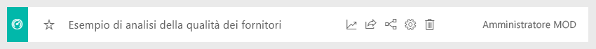
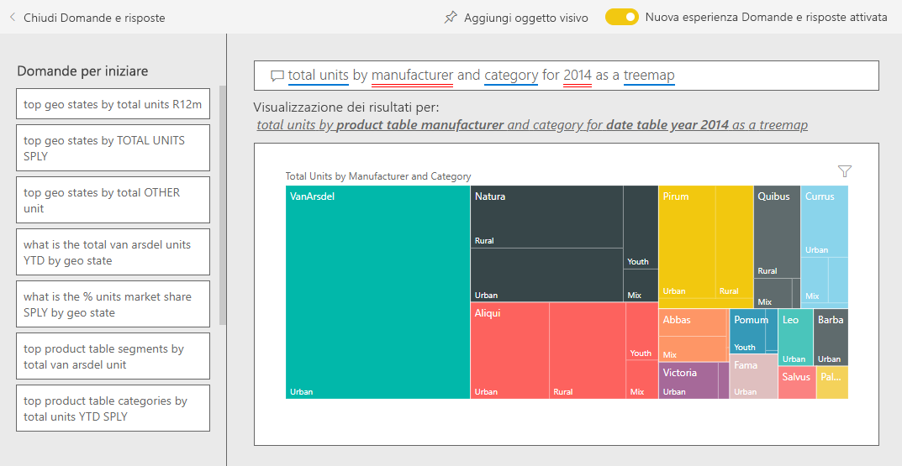

# Esempio di analisi di vendite e marketing per Power BI: Presentazione

L'esempio di analisi di vendite e marketing contiene un dashboard e un report per una società di produzione fittizia denominata VanArsdel Ltd. Questo dashboard è stato creato dal responsabile marketing (CMO) di VanArsdel per tenere sotto controllo il settore, la quota di mercato della società, i volumi di produzione, le vendite e il sentiment.

VanArsdel ha diversi concorrenti, ma è leader di mercato per il settore in cui opera. Il CMO vuole aumentare la quota di mercato e scoprire nuove opportunità di crescita. Tuttavia, per qualche motivo, la quota di mercato di VanArsdel ha iniziato a ridursi, con cali significativi nel mese di giugno.

Questo esempio fa parte di una serie che illustra come usare Power BI con dati, report e dashboard orientati al business. L'esempio è stato creato con dati reali di [obviEnce](http://www.obvience.com/), che sono stati resi anonimi. I dati sono disponibili in diversi formati: pacchetto di contenuto, file di Power BI Desktop con estensione pbix o cartella di lavoro di Excel. Vedere [Esempi per Power BI](sample-datasets.md). 

Questa esercitazione esplora il pacchetto di contenuto relativo all'esempio di analisi di vendite e marketing nel servizio Power BI. Dato che l'esperienza per i report è simile in Power BI Desktop e nel servizio, è anche possibile seguire le descrizioni usando il file con estensione pbix dell'esempio in Power BI Desktop. 

Non occorre una licenza di Power BI per esplorare gli esempi in Power BI Desktop. Se non si ha una licenza Power BI Pro, è possibile salvare l'esempio nell'area di lavoro personale nel servizio Power BI. 

## Ottenere l'esempio

Prima di poter usare l'esempio, è necessario scaricarlo come [pacchetto di contenuto](#get-the-content-pack-for-this-sample), [file con estensione pbix](#get-the-pbix-file-for-this-sample) o [cartella di lavoro di Excel](#get-the-excel-workbook-for-this-sample).

### Scaricare il pacchetto di contenuto per questo esempio

1. Aprire il servizio Power BI (app.powerbi.com), eseguire l'accesso e aprire l'area di lavoro in cui salvare l'esempio.

   Se non si ha una licenza Power BI Pro, è possibile salvare l'esempio nell'area di lavoro personale.

2. Nell'angolo in basso a sinistra selezionare **Recupera dati**.
   
   
3. Nella pagina **Recupera dati** che viene visualizzata selezionare **Esempi**.
   
4. Selezionare l'**Esempio di analisi di vendite e marketing** e quindi scegliere **Connetti**.   
  
   
   
5. Power BI importa il pacchetto di contenuto e quindi aggiunge un nuovo dashboard, report e set di dati all'area di lavoro corrente.
   
   
  
### Scaricare il file con estensione pbix per questo esempio

In alternativa, è possibile scaricare l'esempio di analisi di vendite e marketing come [file con estensione pbix](https://download.microsoft.com/download/9/7/6/9767913A-29DB-40CF-8944-9AC2BC940C53/Sales%20and%20Marketing%20Sample%20PBIX.pbix), progettato per l'uso con Power BI Desktop.

### Scaricare la cartella di lavoro di Excel per questo esempio

Se si vuole visualizzare l'origine dati per questo esempio, è disponibile anche come [cartella di lavoro di Excel](https://go.microsoft.com/fwlink/?LinkId=529785). La cartella di lavoro contiene fogli di Power View che è possibile visualizzare e modificare. Per vedere i dati non elaborati, abilitare i componenti aggiuntivi di Analisi dati, quindi selezionare **Power Pivot > Gestisci**. Per abilitare i componenti aggiuntivi Power View e Power Pivot, vedere [Esplorare gli esempi di Excel in Excel](sample-datasets.md#explore-excel-samples-inside-excel) per informazioni dettagliate.

## Informazioni fornite dal dashboard
Si osservi il dashboard e i riquadri che il CMO ha scelto di aggiungere. Sono visualizzate le informazioni sulla quota di mercato, le vendite e la valutazione, suddivise per area, tempo e concorrenza.

* I riquadri con i numeri nella colonna a sinistra mostrano il volume di vendita del settore per l'anno precedente (50.000), la quota di mercato (32,86%), il volume di vendite (16.000), il punteggio del sentiment (68), il gap del sentiment (4) e le unità totali vendute (1 milione).
* Il grafico a linee superiore ( **% Units Market Share vs. % Units Market Share Rolling 12 Months**) mostra come oscilla nel tempo la quota di mercato. Si noti il netto calo a giugno. Inoltre, la quota per il periodo mobile di 12 mesi (R12M, Rolling 12 Months) ha iniziato a rallentare dopo un periodo di crescita.
* Il concorrente principale è Aliqui, come appare evidente nel riquadro dell'istogramma centrale (**Total Units YTD Variance %** ).
* Gran parte delle attività si concentrano nelle aree orientali e centrali.
* Il grafico a linee inferiore (**Total Units for 2014**) mostra che il calo di giugno non è stagionale, visto che nessuno degli altri concorrenti presenta la stessa tendenza.
* I riquadri **Total Units Overall** e **Total Units YTD** a destra mostrano le unità vendute, per segmento e per area/produttore. I segmenti di mercato principali del settore sono **Productivity** e **Convenience**.

## Vedere Domande e risposte per approfondimenti

Tramite Domande e risposte è possibile individuare dettagli aggiuntivi nei dati.

### Quali segmenti trainano le vendite? Corrispondono alle tendenze del settore?
1. Selezionare il riquadro **Total Units Overall by Segment**, che apre Domande e risposte e popola l'interfaccia con la query *total units by segment*.
2. Alla fine della query esistente aggiungere: *for VanArsdel*. Domande e risposte interpreta la domanda e visualizza un grafico aggiornato con la risposta. Si noti che il volume dei prodotti appartiene principalmente ai segmenti **Convenience** e **Moderation**.

   
3. La quota nelle categorie **Moderation** e **Convenience** è alta e indica che questi sono i segmenti in cui la società è competitiva.
4. Per tornare al dashboard, selezionare **Esempio di analisi di vendite e marketing** nel riquadro di spostamento superiore.

### Come viene visualizzata la quota di mercato delle unità totali per categoria (invece che per area)?
1. Si noti il riquadro **Total Units YTD by Manufacturer, Region**. Qual è la quota di mercato delle unità totali per categoria?

   
2. Selezionare la casella della domanda nella parte superiore del dashboard e digitare la domanda *total units by manufacturer and category for 2014 as a treemap*. Notare gli aggiornamenti della visualizzazione mentre si digita la domanda.

   
3. Per confrontare i risultati, aggiungere il grafico al dashboard. Si noti questo dato interessante: nel 2014, VanArsdel ha venduto prodotti solo nella categoria **Urban**.
4. Tornare al dashboard.

## Report per l'esempio di analisi di vendite e marketing

I dashboard rappresentano un punto di ingresso per i report. Se un riquadro è stato creato da un report sottostante, selezionando il riquadro viene aperto il report.

Nel dashboard la riga **% Units Market Share R12M** nel grafico **% Units Market Share vs. % Units Market Share Rolling 12 Months** mostra che la quota di mercato della società non sta più aumentando nel tempo. È addirittura in leggero calo. E perché si è verificato un calo notevole della quota di mercato nel mese di giugno? 

Il report per l'esempio di analisi di vendite e marketing ha quattro pagine.
 
### Pagina VanArsdel - Market Share
La prima pagina del report è incentrata sulla quota di mercato di VanArsdel.

1. Nel dashboard selezionare il grafico **% Units Market Share vs. % Units Market Share Rolling 12 Months** per aprire la pagina **VanArsdel - Market Share** del report dell'esempio di analisi di vendite e marketing.

   

2. Osservare l'istogramma **Total Units by Month and isVanArsdel** nella parte inferiore del report. La colonna nera rappresenta i prodotti di VanArsdel, mentre quella verde rappresenta la concorrenza. Il calo subito da VanArsdel nel mese di giugno 2014 non ha interessato anche la concorrenza.

3. Il grafico a barre **Total Category Volume by Segment** a destra è filtrato per visualizzare i due segmenti principali di VanArsdel. Osservare come è stato creato questo filtro:  

   a. Selezionare il grafico **Total Category Volume by Segment**.

   b. Selezionare il riquadro **Filtri** a destra per espanderlo.  

   c. In **Filtri a livello di oggetto visivo** si noti che a **Segment** è applicato un filtro per includere solo i segmenti **Convenience** e **Moderation**.  

   d. Modificare il filtro selezionando **Segment** per espanderlo e quindi selezionare **Productivity** per aggiungere tale segmento.  

4. Nel grafico **Total Units by Month and isVanArsdel** selezionare **Yes** nella legenda per applicare il filtro incrociato nella pagina per VanArsdel. Nel grafico **Total Category Volume by Segment** osservare che la società non è competitiva nel segmento **Productivity**.

5. Selezionare di nuovo **Yes** nella legenda per rimuovere il filtro.

6. Esaminare il grafico a linee **% Units Market Share and % Units Market Share R12M by Month**. Visualizza la quota di mercato mensile e le quote di mercato per il periodo mobile di 12 mesi. I dati per il periodo mobile consentono di ridurre le fluttuazioni mensili e mostrano le tendenze a lungo termine. Nel grafico a barre **Total Category Volume by Segment** selezionare **Convenience** e quindi **Moderation** per vedere la fluttuazione della quota di mercato per ogni segmento. Si noti che il segmento **Moderation** mostra una fluttuazione della quota di mercato molto maggiore.

Le cause del significativo calo della quota di mercato nel mese di giugno non sono ancora state trovate. Passare quindi alla pagina **Sentiment Analysis** del report.

### Pagina Sentiment Analysis
La terza pagina del report è incentrata sul sentiment dei consumatori.

I tweet, Facebook, i blog e gli articoli contribuiscono al sentiment dei consumatori, indicato nei due grafici a linee sul lato sinistro della pagina. Il grafico **VanArsdel - Sentiment by Month** nell'angolo in alto a sinistra mostra che il sentiment per i prodotti è stato per lo più neutro fino al mese di febbraio. A febbraio è quindi iniziato un netto calo che ha raggiunto il livello minimo a giugno. Cosa ha scatenato questo calo nella valutazione? 

È necessario analizzare le fonti esterne. Nel mese di febbraio sono stati pubblicati diversi post di blog e articoli in cui il servizio clienti di VanArsdel veniva giudicato come il peggiore del settore. Queste recensioni negative hanno influito direttamente sulla valutazione dei clienti e sulle vendite. VanArsdel si è impegnata a fondo per migliorare il servizio clienti e questi sforzi sono stati riconosciuti dai clienti e dall'intero settore. Nel mese di luglio il sentiment positivo ha iniziato a crescere, raggiungendo il picco storico con un valore che si avvicina a 70. Questo rialzo del sentiment si riflette nei grafici **Total Units by Month** nella prima e nella seconda pagina del report. Il calo della quota di mercato di giugno può essere spiegato, almeno parzialmente, con queste motivazioni?

Il gap del sentiment può essere un'altra area da esplorare. Quali aree presentano il gap del sentiment maggiore, in che modo è possibile capitalizzarlo e come lo si può replicare in altre zone?

### Pagina YTD Category Trend Analysis
La seconda pagina del report è incentrata sulla tendenza delle categorie da inizio anno.

Tenere presente quanto segue:
* VanArsdel è la più grade società della categoria e i concorrenti principali sono Natura, Aliqui e Pirium, che andranno monitorati.
* Aliqui è in crescita, ma il volume di produzione è ancora inferiore a quello di VanArsdel.
* Nel grafico ad albero VanArsdel è contraddistinta con il colore verde. Nell'area orientale i clienti preferiscono la concorrenza, mentre nell'area centrale i risultati sono soddisfacenti. La quota nell'area orientale è la più bassa.
* La geografia influisce sulle unità vendute. L'area orientale è quella principale per molti produttori e VanArsdel ha una forte presenza anche nell'area centrale.
* Nel grafico **Total Units YTD Var % by Month and Manufacturer** nella parte inferiore destra è possibile notare una varianza positiva, che rappresenta un buon segno. Questo valore rappresenta un miglioramento rispetto all'anno precedente, tuttavia lo stesso vale per Aliqui.

### Pagina Growth Opportunities
La quarta pagina del report è incentrata sull'analisi competitiva dei prodotti.

Tenere presente quanto segue:
* Il grafico **Total Units by Segment** in basso a sinistra visualizza tutti i segmenti della categoria, ad eccezione dei due segmenti in cui VanArsdel ha le prestazioni migliori. Selezionare ognuno dei segmenti a turno per identificare le potenziali aree di espansione per VanArsdel. 
* Si noti che i segmenti **Extreme** e **Productivity** stanno crescendo più rapidamente degli altri. La società non è tuttavia competitiva in tali segmenti. Per espandersi in questi ambiti si possono usare i dati per trovare i segmenti più richiesti nelle singole aree. È possibile investigare più a fondo con domande come quale area sta crescendo più rapidamente e chi sarebbe il principale concorrente in uno specifico segmento.
* Per tornare al calo della quota di mercato di giugno, si noti che giugno è un mese particolarmente favorevole per il segmento **Productivity**, un segmento nel quale la società non è per niente competitiva. Questo potrebbe spiegare il calo della quota di mercato a giugno.

Filtrando le visualizzazioni per VanArsdel, per segmento, per mese e per area, si possono individuare opportunità di crescita per VanArsdel.

## Passaggi successivi: Connettersi ai dati
Questo ambiente è sicuro perché è possibile scegliere di non salvare le modifiche, ma, se le si salva, è sempre possibile scegliere **Recupera dati** per ottenere una nuova copia di questo esempio.

Ci auguriamo che questa presentazione abbia illustrato in che modo i dashboard di Power BI, le domande e risposte e i report forniscono informazioni dettagliate sui dati delle risorse umane. È ora possibile iniziare e connettersi ai propri dati. Con Power BI è possibile connettersi a una vasta gamma di origini dati. Per altre informazioni, vedere [Introduzione al servizio Power BI](service-get-started.md).
