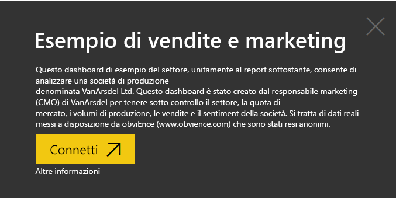
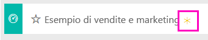
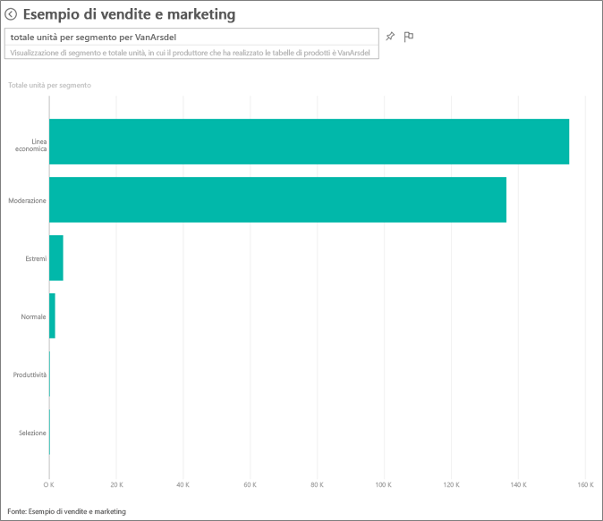
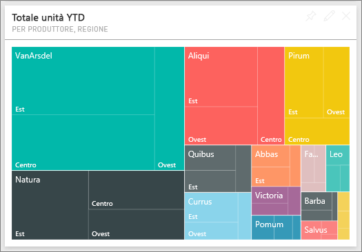
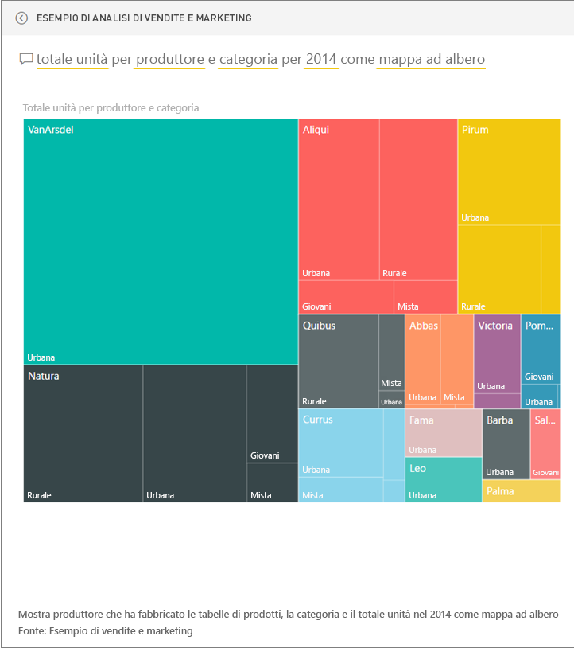
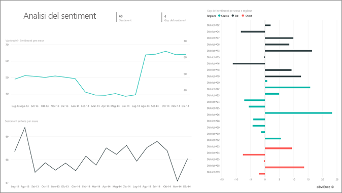
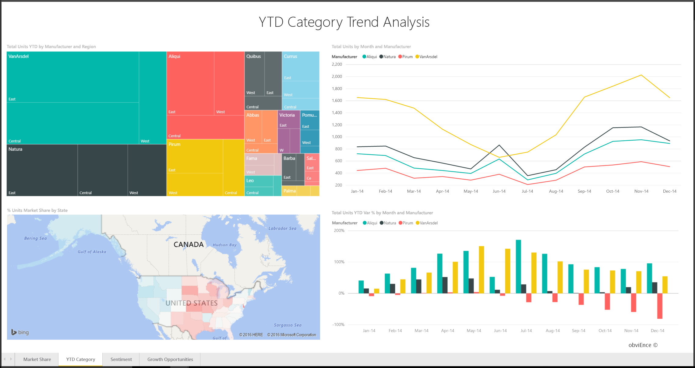
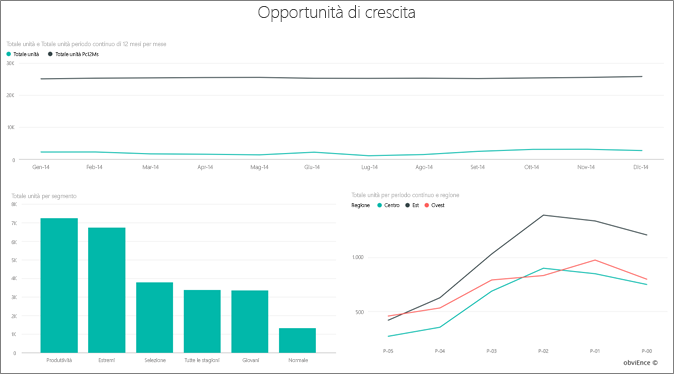

# Presentazione dell'esempio di Vendita e marketing per Power BI

## Panoramica dell'Esempio di analisi di vendite e marketing
L' **esempio di analisi di vendite e marketing** contiene un dashboard e un report per una società di produzione fittizia denominata VanArsdel Ltd. Questo dashboard è stato creato dal responsabile marketing (CMO) di VanArsdel per tenere sotto controllo il settore, la quota di mercato, i volumi di produzione, le vendite e la valutazione della società.

VanArsdel ha diversi concorrenti, ma è leader di mercato per il settore in cui opera. Il CMO vuole aumentare la quota di mercato e scoprire nuove opportunità di crescita. Tuttavia, per qualche motivo, la quota di mercato di VanArsdel ha iniziato a ridursi con cali significativi nel mese di giugno.

Questo esempio fa parte di una serie che illustra come usare Power BI con dati, report e dashboard orientati al business. Si tratta di dati reali messi a disposizione da obviEnce (www.obvience.com) che sono stati resi anonimi.

## Prerequisiti

 Prima di poter usare l'esempio, è necessario scaricarlo come [pacchetto di contenuto](https://docs.microsoft.com/power-bi/sample-sales-and-marketing#get-the-content-pack-for-this-sample), [file con estensione pbix](http://download.microsoft.com/download/9/7/6/9767913A-29DB-40CF-8944-9AC2BC940C53/Sales-and-Marketing-Sample-PBIX.pbix) o [cartella di lavoro di Excel](http://go.microsoft.com/fwlink/?LinkId=529785).

### Scaricare il pacchetto di contenuto per questo esempio

1. Aprire il servizio Power BI (app.powerbi.com) ed eseguire l'accesso.
2. Nell'angolo in basso a sinistra selezionare **Recupera dati**.
   
    
3. Nella pagina Recupera dati che viene visualizzata selezionare l'icona **Esempi**.
   
   
4. Selezionare l'**Esempio di analisi di vendite e marketing**, quindi scegliere **Connetti**.  
  
   
   
5. Power BI importa il pacchetto di contenuto e aggiunge un nuovo dashboard, report e set di dati all'area di lavoro corrente. I nuovi contenuti sono contrassegnati con un asterisco giallo. 
   
   
  
### Scaricare il file con estensione pbix per questo esempio

In alternativa, è possibile scaricare l'esempio come file con estensione pbix, progettato per l'uso con Power BI Desktop. 

 * [Esempio di analisi di vendite e marketing](http://download.microsoft.com/download/9/7/6/9767913A-29DB-40CF-8944-9AC2BC940C53/Sales%20and%20Marketing%20Sample%20PBIX.pbix)

### Scaricare la cartella di lavoro di Excel per questo esempio
È anche possibile [scaricare solo il set di dati (cartella di lavoro di Excel)](http://go.microsoft.com/fwlink/?LinkId=529785) per questo esempio. La cartella di lavoro contiene fogli di Power View che è possibile visualizzare e modificare. Per visualizzare i dati non elaborati, selezionare **Power Pivot > Gestisci**.

## Informazioni fornite dal dashboard
Si osservi il dashboard e i riquadri che il CMO ha scelto di aggiungere. Sono visualizzate le informazioni sulla quota di mercato, le vendite e la valutazione, suddivise per area, tempo e concorrenza.

* I riquadri per numeri nella colonna a sinistra mostrano il volume di vendita del settore per l'anno precedente (50.000), la quota di mercato (32,86%), il volume di vendite (16.000), il punteggio della valutazione (68), il gap di valutazione (4) e le unità totali vendute (1 milione).
* Il grafico a linee superiore mostra come oscilla nel tempo la quota di mercato. La quota di mercato cala significativamente nel mese di giugno. Inoltre, la quota R12M (Rolling 12 Months) ha iniziato a rallentare dopo un periodo di crescita.
* Il concorrente principale è Aliqui (evidente nel riquadro dell'istogramma centrale).
* Gran parte delle attività si concentrano nelle aree orientali e centrali.
* Il grafico a linee inferiore mostra che il calo di giugno non è stagionale, visto che nessuno degli altri concorrenti evidenzia la stessa tendenza.
* I due riquadri "Total Units" mostrano le unità vendute, per segmento e per area/produttore. I segmenti di mercato principali del settore sono **Productivity** e **Convenience**.

### Vedere Domande e risposte per approfondimenti
#### Quali segmenti trainano le vendite? Corrispondono alle tendenze del settore?
1. Selezionare il riquadro "Total Units Overall by Segment" per aprire Domande e risposte.
2. Digitare **for VanArsdel** alla fine della query esistente. Domande e risposte interpreta la domanda e visualizza un grafico aggiornato con la risposta. Il volume di produzione deriva da Convenience e Moderation.

   
3. La quota nelle categorie **Moderation** e **Convenience** è molto alta e indica che questi sono i segmenti in cui la società è competitiva.
4. Per tornare al dashboard, selezionarne il nome nella barra di spostamento superiore (barre di navigazione).

#### Come viene visualizzata la quota di mercato delle unità totali per categoria (invece che per area)?
1. Si noti il riquadro "Total Units YTD by Manufacturer, Region". Come viene visualizzata la quota di mercato delle unità totali per categoria?

   
2. Nella casella delle domande nella parte superiore del dashboard digitare la domanda **total units by manufacturer and category for 2014 as a treemap**. Notare gli aggiornamenti della visualizzazione mentre si digita la domanda.
   
3. Per confrontare i risultati, aggiungere il grafico al dashboard. Un dato interessante: nel 2014 VanArsdel ha venduto solo prodotti della categoria **Urban**.
4. Tornare al dashboard.

I dashboard rappresentano anche un punto di ingresso per i report.  Se è stato creato un riquadro da un report sottostante, fare clic sul riquadro per aprire il report.

La riga R12M (Rolling 12 Months) del dashboard mostra che la quota di mercato non sta più aumentando nel tempo, ma è addirittura in leggera flessione. E perché si è verificato un calo notevole della quota di mercato nel mese di giugno? Per ulteriori indagini, fare clic sulla visualizzazione per aprire il report sottostante.

### Il report è costituito da 4 pagine
#### La prima pagina del report si concentra sulla quota di mercato di VanArsdel.

1. Osservare l'istogramma "Total Units by Month and isVanArsdel" in basso. La colonna nera rappresenta i prodotti di VanArsdel, mentre quella verde rappresenta la concorrenza. Il calo subito da VanArsdel nel mese di giugno 2014 non ha interessato anche la concorrenza.
2. Il grafico a barre "Total Category Volume by Segment" nella posizione centrale destra è filtrato per mostrare i primi due segmenti di VanArsdel. Osservare come è stato creato questo filtro:  

   a.  Espandere il riquadro dei filtri sulla destra.  
   b.  Fare clic per selezionare la visualizzazione.  
   c.  In Filtri del livello visivo notare che **Segment** è filtrato per includere solo **Convenience** e **Moderation**.  
   d.  Modificare il filtro selezionando Segment per espandere la sezione e selezionare **Productivity** per aggiungere anche questo segmento.  
3. In "Total Units by Month and isVanArsdel" fare clic su "Yes" in nero nella legenda per applicare il filtro incrociato alla pagina per VanArsdel. La società non è competitiva nel segmento Productivity.
4. Fare di nuovo clic su "Yes" in nero per rimuovere il filtro.
5. Osservare il grafico a linee. Visualizza la quota di mercato mensile e le quote di mercato R12M. I dati R12M consentono di ridurre le fluttuazioni mensili e mostrano le tendenze a lungo termine. Selezionare Convenience e quindi Moderation nel grafico a barre per vedere l'entità della fluttuazione della quota di mercato per ogni segmento. Il segmento Moderation mostra una maggiore fluttuazione della quota di mercato rispetto al segmento Convenience.

Poiché le cause del significativo calo della quota di mercato nel mese di giugno non sono ancora state individuate, analizzare la sezione relativa alla valutazione.

#### La terza pagina del report si concentra sulla valutazione.

I tweet, Facebook, i blog, gli articoli e così via contribuiscono alla valutazione mostrata nei due grafici a linee. Il grafico di valutazione in alto a sinistra mostra che la valutazione dei prodotti è stata piuttosto neutra fino al mese di febbraio. A febbraio è iniziato il calo che ha raggiunto il livello minimo a giugno. Cosa ha scatenato questo calo nella valutazione? È necessario analizzare fonti esterne. Nel mese di febbraio sono stati pubblicati post di blog e articoli in cui il servizio clienti di VanArsdel veniva giudicato come il peggiore del settore. Queste recensioni negative hanno influito direttamente sulla valutazione dei clienti e sulle vendite. VanArsdel si è impegnata a migliorare il servizio clienti e questi sforzi sono stati riconosciuti dai clienti e dall'intero settore. Nel mese di giugno la valutazione positiva ha iniziato a crescere, raggiungendo il picco storico degli anni Sessanta. Questo miglioramento della valutazione si riflette in "Total Units by Month" nelle pagine 1 e 3. Il calo della quota di mercato di giugno può essere spiegato, almeno parzialmente, con queste motivazioni?

In realtà, andrebbe analizzato anche il gap di valutazione: quali aree hanno il gap di valutazione maggiore, in che modo è possibile capitalizzarlo e come lo si può replicare in altre zone.

#### La seconda pagina del report si concentra sulla tendenza della categoria dall'inizio dell'anno

* VanArsdel è la maggiore società della categoria e i concorrenti principali sono Natura, Aliqui e Pirium, che andranno monitorati.
* Aliqui è in crescita, ma il volume di produzione è ancora inferiore a quello di VanArsdel.
* Nel grafico ad albero VanArsdel è contraddistinta con il colore verde. Nell'area orientale i clienti preferiscono la concorrenza e la quota di mercato è ai livelli minimi, mentre nell'area centrale i risultati di VanArsdel sono soddisfacenti.
* La geografia influisce sulle unità vendute. L'area orientale è quella principale per molti produttori e VanArsdel ha una forte presenza anche nell'area centrale.
* Nel grafico "Total Units YTD Var % by Month and Manufacturer" nella parte inferiore destra si ha una varianza positiva, che rappresenta un buon segno perché indica un miglioramento rispetto all'anno precedente, ma questa varianza è presente anche per Aliqui.

#### La quarta pagina del report si concentra sull'analisi competitiva dei prodotti

* Il grafico in basso a sinistra mostra tutti i segmenti della categoria tranne i due segmenti di cui VanArsdel è leader. Se si filtra per categoria facendo clic sulle barre si possono identificare le potenziali aree di espansione per VanArsdel. I segmenti **Extreme** e **Productivity** stanno crescendo più rapidamente degli altri,
* Tuttavia, VanArsdel non è competitiva in questi segmenti. Per espandersi in queste aree si possono usare i dati per individuare i segmenti più richiesti nelle singole aree. Per informazioni più dettagliate, si possono usare le domande per sapere, ad esempio, quale regione sta crescendo più rapidamente e chi sarebbe il principale concorrente in uno specifico segmento.
* Per tornare al calo della quota di mercato di giugno, si noti che giugno è un mese particolarmente favorevole per il segmento Productivity, un segmento nel quale VanArsdel non è competitiva. Questo potrebbe spiegare il calo della quota di mercato.

Filtrando le visualizzazioni per VanArsdel, per segmento, per mese e per area, si possono individuare opportunità di crescita per VanArsdel.

Si tratta di un ambiente sicuro in cui operare: è sempre possibile scegliere di non salvare le modifiche, ma, se le si salva, è sempre possibile scegliere **Recupera dati** per ottenere una nuova copia di questo esempio.

## Passaggi successivi: Connettersi ai dati
Ci auguriamo che questa presentazione abbia illustrato in che modo i dashboard di Power BI, le domande e risposte e i report forniscono informazioni dettagliate sui dati di Vendita e marketing È ora possibile iniziare e connettersi ai propri dati. Con Power BI è possibile connettersi a una vasta gamma di origini dati. Per altre informazioni, vedere [Introduzione a Power BI](service-get-started.md).  
