# Presentazione dell'esempio di analisi della qualità dei fornitori per Power BI

## Breve panoramica dell'Esempio di analisi della qualità dei fornitori
Questo dashboard di esempio specifico del settore, unitamente al report sottostante, consente di analizzare una delle problematiche tipiche della supply chain: l'analisi della qualità dei fornitori.
Questa analisi si basa su due metriche principali: numero totale di difetti e tempo totale di inattività causato da tali difetti. Questo esempio ha due obiettivi principali:

* Individuare i fornitori migliori e peggiori in termini di qualità
* Identificare gli stabilimenti che presentano le prestazioni migliori e il minor tempo di inattività nelle operazioni di individuazione e scarto di prodotti difettosi

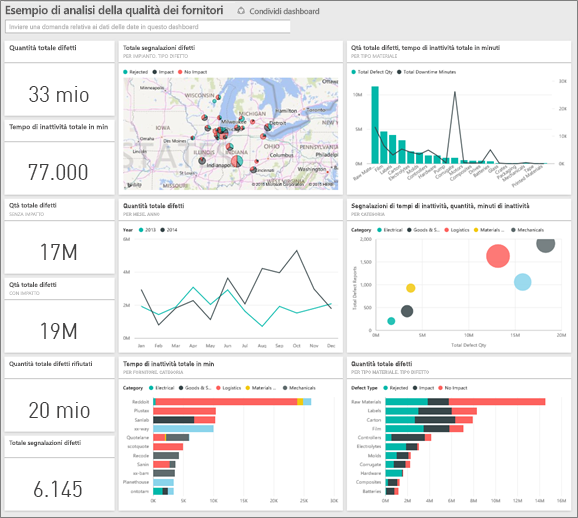

Questo esempio fa parte di una serie che illustra come usare Power BI con dati, report e dashboard orientati al business.
Si tratta di dati reali messi a disposizione da obviEnce ([www.obvience.com](http://www.obvience.com/)) che sono stati resi anonimi.

## Prerequisiti

 Prima di poter usare l'esempio, è necessario scaricarlo come [pacchetto di contenuto](https://docs.microsoft.com/en-us/power-bi/sample-supplier-quality#get-the-content-pack-for-this-sample), [file con estensione pbix](http://download.microsoft.com/download/8/C/6/8C661638-C102-4C04-992E-9EA56A5D319B/Supplier-Quality-Analysis-Sample-PBIX.pbix) o [cartella di lavoro di Excel](http://go.microsoft.com/fwlink/?LinkId=529779).

### Scaricare il pacchetto di contenuto per questo esempio

1. Aprire il servizio Power BI (app.powerbi.com) ed eseguire l'accesso.
2. Nell'angolo in basso a sinistra selezionare **Recupera dati**.
   
    
3. Nella pagina Recupera dati che viene visualizzata selezionare l'icona **Esempi**.
   
   
4. Selezionare l'**Esempio di analisi della qualità dei fornitori**, quindi scegliere **Connetti**.  
  
   
   
5. Power BI importa il pacchetto di contenuto e aggiunge un nuovo dashboard, report e set di dati all'area di lavoro corrente. I nuovi contenuti sono contrassegnati con un asterisco giallo. 
   
   
  
### Scaricare il file con estensione pbix per questo esempio

In alternativa, è possibile scaricare l'esempio come file con estensione pbix, progettato per l'uso con Power BI Desktop. 

 * [Esempio di analisi della qualità dei fornitori](http://download.microsoft.com/download/8/C/6/8C661638-C102-4C04-992E-9EA56A5D319B/Supplier-Quality-Analysis-Sample-PBIX.pbix)

### Scaricare la cartella di lavoro di Excel per questo esempio
È anche possibile [scaricare solo il set di dati (cartella di lavoro di Excel)](http://go.microsoft.com/fwlink/?LinkId=529779) per questo esempio. La cartella di lavoro contiene fogli di Power View che è possibile visualizzare e modificare. Per visualizzare i dati non elaborati, selezionare **Power Pivot > Gestisci**.

## Tempo di inattività causato da materiali difettosi
In questa sezione viene analizzato il tempo di inattività causato da materiali difettosi e vengono individuati i fornitori responsabili.  

1. Nel dashboard selezionare il riquadro per numeri **Total Defect Quantity** o **Total Downtime Minutes**.  

   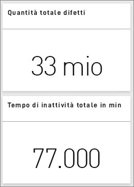  

   Il report sull'esempio di analisi della qualità dei fornitori si apre alla pagina "Downtime Analysis". I pezzi difettosi ammontano a 33 milioni e il tempo di inattività causato da tali pezzi è di 77.000 minuti. Alcuni materiali presentano un numero minore di pezzi difettosi, che però possono causare ritardi significativi e, di conseguenza, un maggior tempo di inattività. Nella pagina del report è possibile analizzarli in dettaglio.  
2. Se si osserva la riga **Total Downtime Minutes** nel grafico combinato **Defects and Downtime (min) by Material Type** si vede che gran parte del tempo di inattività dipende dai materiali corrugati.  
3. Selezionare la colonna **Corrugate** nel grafico combinato per vedere quali stabilimenti subiscono l'impatto maggiore a causa di questo difetto e qual è il fornitore responsabile.  

     
4. Selezionare i singoli stabilimenti nella mappa per vedere quale fornitore o materiale è responsabile per il tempo di inattività.

### Quali sono i fornitori peggiori?
 Per individuare gli otto fornitori peggiori e determinare la percentuale di tempo di inattività di cui sono responsabili, trasformare il grafico ad area **Downtime (min) by Vendor** in un grafico ad albero.  

1. Nella terza pagina del report, "Downtime Analysis" selezionare **Modifica report** nell'angolo in alto a sinistra.  
2. Selezionare il grafico ad area **Downtime (min) by Vendor** e, nel riquadro Visualizzazioni, selezionare il grafico ad albero.  

   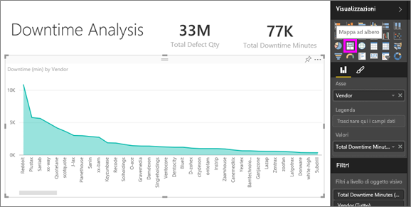  

    Il grafico ad albero visualizza automaticamente il campo **Vendor** come **Group**.  

    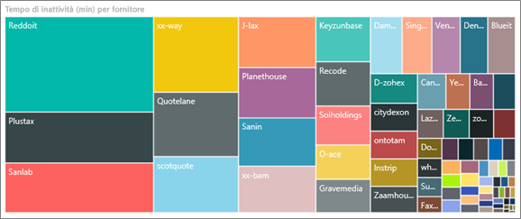  

   Da questo grafico ad albero si vede che gli otto fornitori principali corrispondono agli otto blocchi a sinistra del grafico ad albero. Si osserva anche che sono responsabili di circa il 50% del tempo di inattività complessivo.  
3. Selezionare **Esempio di analisi della qualità dei fornitori** nella barra di spostamento superiore per tornare al dashboard.

### Confronto tra stabilimenti
In questa sezione viene identificato lo stabilimento che offre le prestazioni migliori in termini di gestione dei materiali difettosi e che, di conseguenza, presenta un minor tempo di inattività.  

1. Selezionare la tessera mappa **Total Defect Reports by Plant, Defect Type**.  

    Il report si apre alla pagina "Supplier Quality".  

   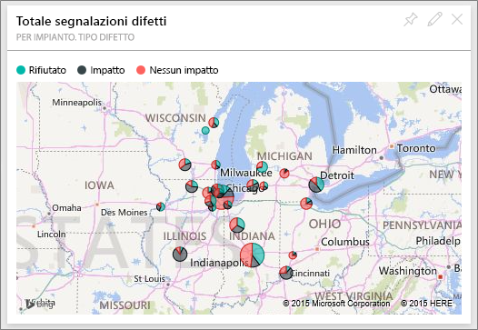  
2. Nella legenda della mappa selezionare il cerchio **Impact**.  

    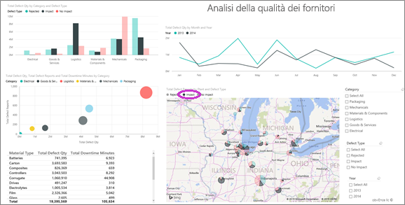  

    Nel grafico a bolle si nota che **Logistics** è la categoria più problematica poiché presenta i valori maggiori in termini di quantità di difetti totali, report di difetti totali e tempo di inattività totale in minuti. Di seguito vengono illustrati i dettagli della categoria.  
3. Selezionare la bolla Logistics nel grafico a bolle e osservare gli stabilimenti di Springfield e Naperville. Naperville sembra ottenere risultati migliori nella gestione dei materiali difettosi perché ha un alto numero di scarti, ma un impatto ridotto rispetto a Springfield.  

   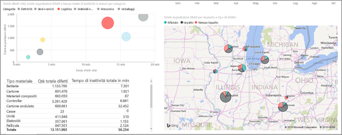  
4. Selezionare **Esempio di analisi della qualità dei fornitori** nella barra di spostamento superiore per tornare all'area di lavoro attiva.

## Quale tipo di materiale viene gestito meglio?
Il tipo di materiale che consente una gestione migliore è quello con il tempo di inattività minore o privo di impatti, indipendentemente dalla quantità di difetti.

* Osservare il riquadro **Total Defect Quantity by Material Type, Defect Type** nel dashboard.

  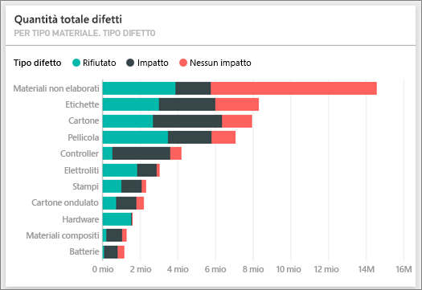

Si noti che **Raw Materials** presenta un elevato numero di difetti totali, ma la maggior parte di essi sono scartati o privi di impatto.

Più avanti si esamineranno le materie prime per confermare il ridotto tempo di inattività nonostante la presenza di notevoli quantità di difetti.

* Osservare il riquadro **Total Defect Qty, Total Downtime Minutes by Material Type** nel dashboard.

  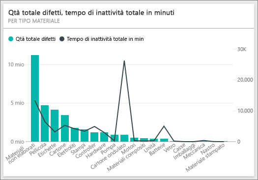

Le materie prime in apparenza sono gestite in modo efficace: hanno più difetti, ma un minor tempo di inattività in minuti.

### Confrontare i difetti e il tempo di inattività per anno
1. Selezionare il riquadro mappa **Total Defect Reports by Plant, Defect Type** per aprire il report alla prima pagina, Supplier Quality.
2. Si noti che **Defect Qty** nel 2014 è maggiore rispetto al 2013.  

    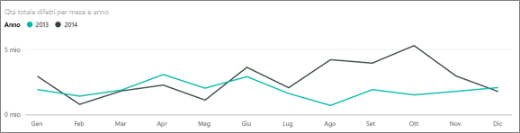  
3. La presenza di più difetti si traduce in un tempo di inattività maggiore? È possibile porre le domande nella casella Domande e risposte per scoprirlo.  
4. Selezionare **Esempio di analisi della qualità dei fornitori** nella barra di spostamento superiore per tornare al dashboard.  
5. Poiché si sa che le materie prime hanno il numero di difetti più alto, digitare "show material types, year and total defect qty" nella casella delle domande.  

    I difetti delle materie prime erano molto più numerosi nel 2014 rispetto al 2013.  

    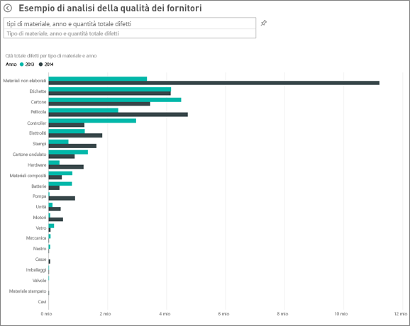  
6. Cambiare quindi la domanda in "show material types, year and total downtime minutes".  

   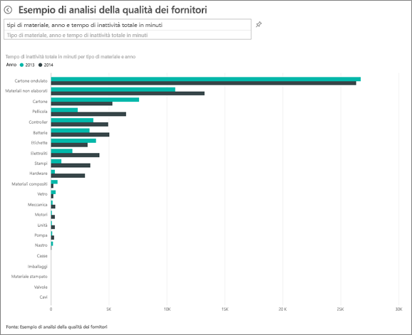

Il tempo di inattività per le materie prime era equivalente nel 2013 e nel 2014, anche se nel 2014 erano presenti molti più difetti.

Si evince quindi che, per l'anno 2014, il maggior numero di difetti della materie prime nel 2014 non ha comportato un aumento del tempo di inattività.

### Confrontare i difetti e il tempo di inattività mese per mese
Ora viene analizzato un altro riquadro del dashboard relativo alla quantità difettosa totale.  

1. Selezionare la freccia indietro  nell'angolo in alto a sinistra sopra la casella delle domande per tornare al dashboard.  

    Se si osservano i dettagli nel riquadro **Total Defect Quantity by Month, Year**, si vede il numero di difetti nella prima metà del 2014 era simile al 2013, mentre ha subito un notevole incremento nella seconda metà del 2014.  

    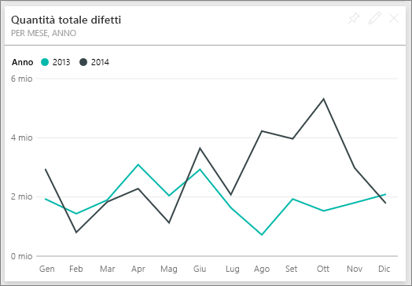  

    L'aumento della quantità di difetti porta a un incremento equivalente del tempo di inattività?  
2. Nella casella delle domande digitare "total downtime minutes by month and year as a line chart".  

   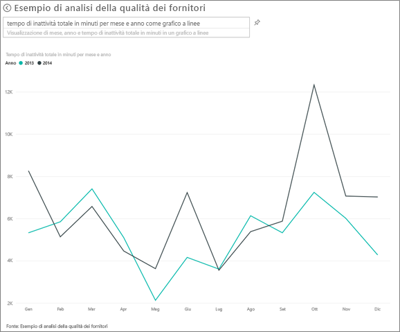

   Nei mesi di giugno e ottobre si nota un incremento del tempo di inattività in minuti, ma, a parte questo, l'aumento del numero di difetti non produce un ulteriore tempo di inattività. Ciò dimostra che i difetti sono gestiti in modo efficace.  
3. Per aggiungere questo grafico al dashboard, selezionare l'icona Aggiungi  a destra della casella delle domande.  
4. Per esaminare i mesi outlier, estrarre il tempo di inattività in minuti durante il mese di ottobre per tipo di materiale, località dello stabilimento, categoria e così via ponendo domande come "total downtime minutes in October by plant".    
5. Selezionare la freccia indietro  nell'angolo in alto a sinistra sopra la casella delle domande per tornare al dashboard.

Si tratta di un ambiente sicuro in cui operare: è sempre possibile scegliere di non salvare le modifiche, ma, se le si salva, è sempre possibile scegliere **Recupera dati** per ottenere una nuova copia di questo esempio.

## Passaggi successivi: Connettersi ai dati
Ci auguriamo che questa presentazione abbia illustrato in che modo i dashboard di Power BI, le domande e risposte e i report forniscono informazioni dettagliate sui dati relativi alla qualità dei fornitori. È ora possibile iniziare e connettersi ai propri dati. Con Power BI è possibile connettersi a una vasta gamma di origini dati. Per altre informazioni, vedere [Introduzione a Power BI](service-get-started.md).
