# Esercitazione sugli esempi di Power BI

È consigliabile iniziare dall'articolo [Set di dati di esempio per Power BI](sample-datasets.md). Quell'articolo illustra in dettaglio tutti gli esempi, come ottenerli, dove salvarli, come usarli e alcuni degli scenari che possono aiutare a chiarire. Una volta acquisite le nozioni di base, proseguire con questa esercitazione.   

### Prerequisiti
Gli esempi sono disponibili per il servizio Power BI e per Power BI Desktop. Per seguire la procedura, verrà usato l'esempio di analisi delle vendite al dettaglio.

Il pacchetto di contenuto di esempio di *analisi delle vendite al dettaglio* usato in questa esercitazione comprende un dashboard, un report e un set di dati.
Per acquisire familiarità con il pacchetto di contenuto e il relativo scenario, è possibile visualizzare una [presentazione dell'esempio di analisi delle vendite al dettaglio](sample-retail-analysis.md) prima di iniziare.

## Informazioni su questa esercitazione
Questa esercitazione illustra come: 
- Importare un pacchetto di contenuto di esempio, aggiungerlo al servizio Power BI e aprire il contenuto. Un *pacchetto di contenuto* è un tipo di esempio in cui il set di dati è abbinato a un dashboard e a un report. 
-  Aprire un file con estensione pbix di esempio in Power BI Desktop.

## Esempi e servizio Power BI

1. Aprire il servizio Power BI (app.powerbi.com) ed eseguire l'accesso.
2. Selezionare **Recupera dati** nella parte inferiore del riquadro di spostamento sinistro. Se **Recupera dati** non è visibile, selezionare  per espandere il riquadro di spostamento.
   
   
5. Selezionare **Esempi**.  
   
   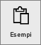
6. Selezionare *Esempio di analisi delle vendite al dettaglio* e scegliere **Connetti**.   
   
   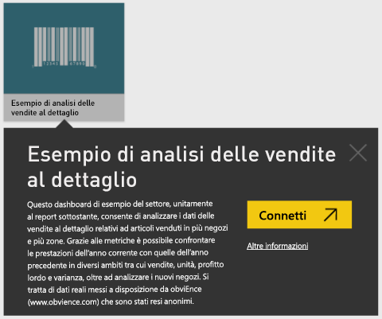

## Che cosa viene importato esattamente?
Con i pacchetti del contenuto di esempio, quando si seleziona **Connetti** Power BI in realtà carica una copia del pacchetto di contenuto e la archivia nel cloud. Quando si fa clic su **Connetti** si ottiene ciò che l'autore del pacchetto di contenuto ha incluso, ovvero un set di dati, un report e un dashboard. 

1. Power BI crea il nuovo dashboard e lo inserisce nell'elenco nella scheda **Dashboard**. L'asterisco giallo indica che si tratta di un nuovo dashboard.
   
   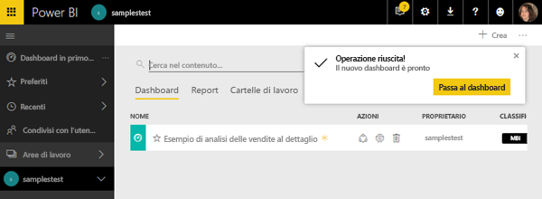
2. Aprire la scheda **Report**.  È presente un nuovo report denominato *Retail Analysis Sample*.
   
   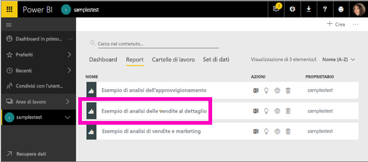
   
   Osservare anche la scheda **Set di dati**.  Anche lì è presente un nuovo set di dati.
   
   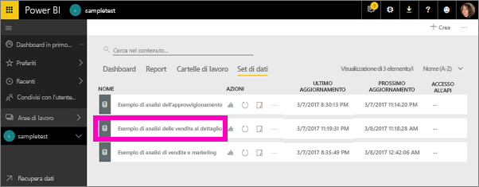

## Esplorare il nuovo contenuto
Ora è possibile esaminare il dashboard, il set di dati e il report autonomamente. Esistono molti modi diversi per passare al dashboard, ai report e i set di dati. Qui ne viene descritto solo uno.  

> [!TIP]
> Se si preferisce acquisire informazioni preliminari prima di iniziare,  vedere la [presentazione dell'esempio di analisi delle vendite al dettaglio](sample-retail-analysis.md) per una descrizione dettagliata di questo esempio.
> 
> 

1. Tornare alla scheda **Dashboard** e selezionare il dashboard *Retail Analysis Sample* per aprirlo.    
   
   
2. Il dashboard viene aperto.  Include una serie di riquadri di visualizzazione.
   
   
3. Selezionare uno dei riquadri per aprire il report sottostante.  In questo esempio viene selezionato il grafico ad area, evidenziato in rosa nell'immagine precedente. Nel report viene visualizzata la pagina che contiene il grafico ad area.
   
    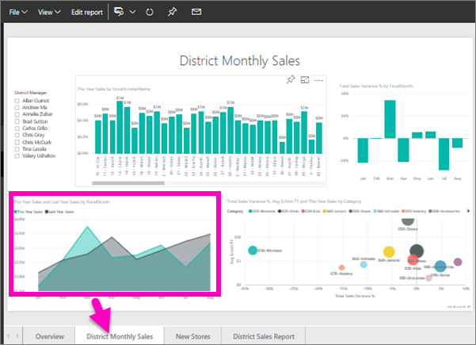
   
   > [!NOTE]
   > Se il riquadro fosse stato creato con [Domande e risposte di Power BI](power-bi-q-and-a.md) sarebbe comparsa la pagina Domande e risposte. Se il riquadro fosse stato [aggiunto da Excel](service-dashboard-pin-tile-from-excel.md), Excel Online sarebbe stato aperto all'interno di Power BI.
   > 
   > 
1. Nella scheda **Set di dati** sono presenti varie opzioni per esplorare il set di dati.  Non è possibile aprirlo e vedere tutte le righe e colonne, come invece si può fare in Power BI Desktop o in Excel.  Quando un utente condivide un pacchetto di contenuto con i colleghi, in genere vuole condividere le informazioni dettagliate e non consentire ai colleghi di accedere direttamente ai dati. Questo però non significa che non sia possibile esplorare il set di dati.  
   
   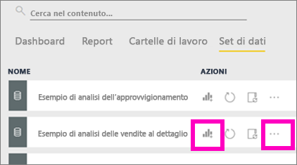
   
   * Un modo per esplorare il set di dati consiste nel creare visualizzazioni e report personalizzati da zero.  Selezionare l'icona del grafico  per aprire il set di dati in modalità di modifica report.
     
       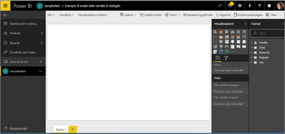
   * Un altro modo per esplorare il set di dati consiste nell'eseguire [Informazioni rapide](service-insights.md). Selezionare i puntini di sospensione (...) e scegliere **Ottieni informazioni dettagliate**. Quando le informazioni sono pronte, selezionare **Visualizza informazioni dettagliate**.
     
       

## Esempi e Power BI Desktop 
Quando si apre il file PBIX di esempio per la prima volta, viene visualizzato nella visualizzazione Report in cui è possibile esplorare, creare e modificare qualsiasi numero di pagine del report con visualizzazioni. La visualizzazione Report offre un'esperienza di progettazione analoga a quella della visualizzazione di modifica di un report nel servizio Power BI, consentendo di spostare le visualizzazioni, nonché di copiare e incollare, unire e così via.

La differenza tra le due visualizzazioni è che quando si usa Power BI Desktop è possibile lavorare con le query e modellare i dati, per ottenere, con i dati, informazioni dettagliate di migliore qualità nei report. Il file di Power BI Desktop può quindi essere salvato in qualsiasi posizione dell'unità locale o del cloud.

1. Aprire il [file Retail Analysis sample.pbix](http://download.microsoft.com/download/9/6/D/96DDC2FF-2568-491D-AAFA-AFDD6F763AE3/Retail%20Analysis%20Sample%20PBIX.pbix) in Power BI Desktop. 

    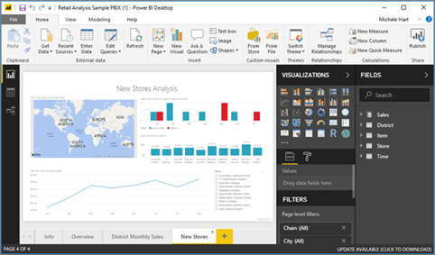

1. Il file verrà aperto nella visualizzazione Report. Si notino le 4 schede nella parte inferiore dell'editor di report. Ciò significa che sono presenti 4 pagine nel report e che è attualmente selezionata la pagina "New Stores". 

    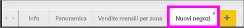.

3. Per un approfondimento sull'editor di report, vedere la [presentazione dell'editor di report](service-the-report-editor-take-a-tour.md).

## Che cosa viene importato esattamente?
Quando si apre il file PBIX di esempio in Power BI Desktop, Power BI in realtà carica una copia di tali dati e li archivia nel cloud. Da Power BI Desktop è possibile accedere al report e al ***set di dati sottostante***. Dopo il caricamento dei dati, Power BI Desktop proverà a trovare e creare automaticamente le relazioni.  

1. Passare alla [vista dati](desktop-data-view.md) selezionando l'icona di tabella .
 
    

    La Vista dati consente di esaminare, esplorare e comprendere i dati nel modello di Power BI Desktop. È diversa dalla visualizzazione di tabelle, colonne e dati nell'Editor di query. Nella vista dati si possono esaminare i dati dopo il caricamento nel modello.

    Durante la modellazione dei dati talvolta si vuole vedere il contenuto effettivo di una tabella o una colonna senza creare un elemento visivo nell'area di disegno del report, spesso proprio al livello di riga. Questo vale in particolare per la creazione di misure e colonne calcolate o quando è necessario identificare un tipo di dati o una categoria di dati.

1. Passare alla [visualizzazione Relazioni](desktop-relationship-view.md) selezionando l'icona .
 
    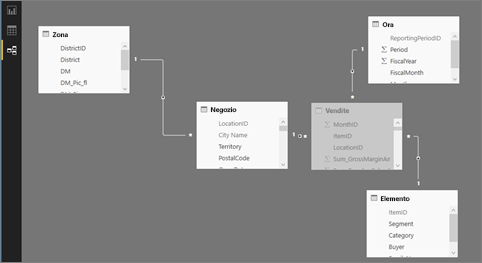

    La visualizzazione Relazioni mostra tutte le tabelle, le colonne e le relazioni presenti nel modello. Da qui è possibile visualizzare, modificare e creare relazioni.

## Esplorare il nuovo contenuto
Ora è possibile esaminare il set di dati, le relazioni e il report autonomamente. Per informazioni su come iniziare, vedere [Introduzione a Power BI Desktop](desktop-getting-started.md).    

## Passaggi successivi
[Concetti di base di Power BI](service-basic-concepts.md)

[Esempi per il servizio Power BI](sample-datasets.md)

[Origini dati per Power BI](service-get-data.md)

Altre domande? [Provare la community di Power BI](http://community.powerbi.com/)

