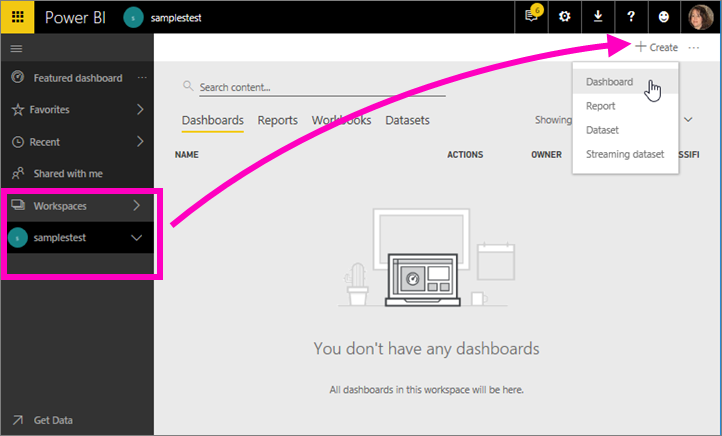
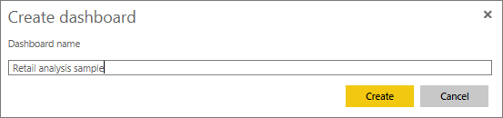

# Esercitazione sugli esempi di Power BI
<!-- Shared newnav Include -->
[!INCLUDE [newnavbydefault](./includes/newnavbydefault.md)]

È consigliabile iniziare dall'articolo [Set di dati di esempio per Power BI](sample-datasets.md). Quell'articolo illustra in dettaglio tutti gli esempi, come ottenerli, dove salvarli, come usarli e alcuni degli scenari che possono aiutare a chiarire. Una volta acquisite le nozioni di base, proseguire con questa esercitazione.   

## Informazioni su questa esercitazione
Questa esercitazione spiega come importare i pacchetti di contenuto di esempio, come aggiungerli al servizio Power BI e come aprire il contenuto. Un *pacchetto di contenuto* è un tipo di esempio in cui il set di dati è abbinato a un dashboard e a un report. I pacchetti di contenuto di esempio sono disponibili dall'interno di Power BI, mediante **Recupera dati**.

> [!NOTE]
> Questa esercitazione si applica al servizio Power BI e non a Power BI Desktop.
> 
> 

Il pacchetto di contenuto di esempio di *analisi delle vendite al dettaglio* usato in questa esercitazione comprende un dashboard, un report e un set di dati.
Per acquisire familiarità con il pacchetto di contenuto e il relativo scenario, è possibile visualizzare una [presentazione dell'esempio di analisi delle vendite al dettaglio](sample-retail-analysis.md) prima di iniziare.

## Recuperare i dati (in questo caso un pacchetto di contenuto di esempio)
1. Aprire il servizio Power BI (app.powerbi.com) ed eseguire l'accesso.
2. Selezionare un'area di lavoro e creare un nuovo dashboard.  
   
    
3. Assegnargli il nome **Esempio di analisi delle vendite al dettaglio**.
   
   
4. Selezionare **Recupera dati** nella parte inferiore del riquadro di spostamento sinistro. Se **Recupera dati** non è visibile, selezionare  per espandere il riquadro di spostamento.
   
   
5. Selezionare **Esempi**.  
   
   
6. Selezionare *Esempio di analisi delle vendite al dettaglio* e scegliere **Connetti**.   
   
   

## Che cosa viene importato esattamente?
Con i pacchetti del contenuto di esempio, quando si seleziona **Connetti** Power BI in realtà carica una copia del pacchetto di contenuto e la archivia nel cloud. Quando si fa clic su **Connetti** si ottiene ciò che l'autore del pacchetto di contenuto ha incluso, ovvero un set di dati, un report e un dashboard.

1. Power BI crea il nuovo dashboard e lo inserisce nell'elenco nella scheda **Dashboard**. L'asterisco giallo indica che si tratta di un nuovo dashboard.
   
   
2. Aprire la scheda **Report**.  È presente un nuovo report denominato *Retail Analysis Sample*.
   
   
   
   Osservare anche la scheda **Set di dati**.  Anche lì è presente un nuovo set di dati.
   
   

## Esplorare il nuovo contenuto
Ora è possibile esaminare il dashboard, il set di dati e il report autonomamente. Esistono molti modi diversi per passare al dashboard, ai report e i set di dati. Qui ne viene descritto solo uno.  

> [!TIP]
> Se si preferisce acquisire informazioni preliminari prima di iniziare,  vedere la [presentazione dell'esempio di analisi delle vendite al dettaglio](sample-retail-analysis.md) per una descrizione dettagliata di questo esempio.
> 
> 

1. Tornare alla scheda **Dashboard** e selezionare il dashboard *Retail Analysis Sample* per aprirlo.    
   
   
2. Il dashboard viene aperto.  Include una serie di riquadri di visualizzazione.
   
   
3. Selezionare uno dei riquadri per aprire il report sottostante.  In questo esempio viene selezionato il grafico ad area, evidenziato in rosa nell'immagine precedente. Nel report viene visualizzata la pagina che contiene il grafico ad area.
   
    
   
   > [!NOTE]
   > Se il riquadro fosse stato creato con [Domande e risposte di Power BI](service-q-and-a.md) sarebbe comparsa la pagina Domande e risposte.
   > 
   > 
4. Nella scheda **Set di dati** sono presenti varie opzioni per esplorare il set di dati.  Non è possibile aprirlo e vedere tutte le righe e colonne, come invece si può fare in Power BI Desktop o in Excel.  Quando un utente condivide un pacchetto di contenuto con i colleghi, in genere vuole condividere le informazioni dettagliate e non consentire ai colleghi di accedere direttamente ai dati. Questo però non significa che non sia possibile esplorare il set di dati.  
   
   
   
   * Un modo per esplorare il set di dati consiste nel creare visualizzazioni e report personalizzati da zero.  Selezionare l'icona del grafico  per aprire il set di dati in modalità di modifica report.
     
       
   * Un altro modo per esplorare il set di dati consiste nell'eseguire [Informazioni rapide](service-insights.md). Selezionare i puntini di sospensione (...) e scegliere **Ottieni informazioni dettagliate**. Quando le informazioni sono pronte, selezionare **Visualizza informazioni dettagliate**.
     
       

## Passaggi successivi
[Concetti di base di Power BI](service-basic-concepts.md)

[Esempi per il servizio Power BI](sample-datasets.md)

[Origini dati per Power BI](service-get-data.md)

Altre domande? [Provare la community di Power BI](http://community.powerbi.com/)

