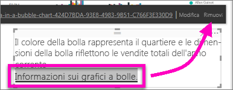

# Aggiungere un collegamento ipertestuale a una casella di testo in un report
Le caselle di testo possono essere aggiunte ai report, aggiunte ai dashboard dai report e aggiunte direttamente ai dashboard. I collegamenti ipertestuali possono essere aggiunti a una casella si testo indipendentemente dalla sua posizione.  

> **NOTA**: per informazioni sui collegamenti ipertestuali nelle tabelle e nelle matrici di Power BI, vedere [Collegamenti ipertestuali nelle tabelle](power-bi-hyperlinks-in-tables.md). Per informazioni sull'aggiunta di caselle di testo al **dashboard**, vedere [Widget del dashboard](service-dashboard-add-widget.md). 
> 
> 

<iframe width="560" height="315" src="https://www.youtube.com/embed/_3q6VEBhGew#t=0m55s" frameborder="0" allowfullscreen></iframe>

## Per aggiungere un collegamento ipertestuale a una casella di testo in un report
1. [Creare una casella di testo e aggiungere il testo](power-bi-reports-add-text-and-shapes.md). 
2. Evidenziare il testo esistente o aggiungere un nuovo testo da usare come collegamento ipertestuale.
   
   
3. Selezionare l'icona del collegamento ipertestuale .
4. Digitare o incollare l'URL nel campo Collegamento ipertestuale, quindi selezionare **Fine**.
   
   
5. Testare il collegamento.  
   
   
   
   * Posizionare il cursore in un punto qualsiasi del testo evidenziato per visualizzare l'URL.  
     
      
   * Selezionare l'URL per aprire la pagina in una nuova finestra del browser.

## Per rimuovere il collegamento ipertestuale ma lasciare il testo
1. Nella casella di testo selezionare il collegamento ipertestuale per evidenziarlo.
   
     
2. Scegliere **Rimuovi**. 

## Passaggi successivi
[Caselle di testo nei report di Power BI](power-bi-reports-add-text-and-shapes.md)

Altre domande? [Provare la community di Power BI](http://community.powerbi.com/)

