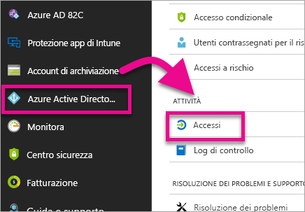
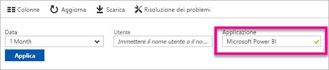

# Ricerca di utenti Power BI che hanno eseguito l'accesso
Se si è un amministratore tenant e si desidera vedere chi ha effettuato l'accesso a Power BI, è possibile usare i report d'uso e di accesso di Azure Active Directory per ottenere informazioni.

<iframe width="640" height="360" src="https://www.youtube.com/embed/1AVgh9w9VM8?showinfo=0" frameborder="0" allowfullscreen></iframe>

È possibile accedere al report di attività all'interno dei portali [nuovo](https://docs.microsoft.com/azure/active-directory/active-directory-reporting-activity-sign-ins) e [classico](https://docs.microsoft.com/azure/active-directory/active-directory-view-access-usage-reports) di Azure Active Directory (Azure AD). Mentre il video precedente usa il portale classico come esempio, in questo articolo verrà messo in evidenza il nuovo portale.

> [!NOTE]
> Questo report di attività include utenti sia Power BI (gratuito) che Pro, ma non li identifica in base al tipo di licenza.
> 
> 

## Requisiti
Di seguito sono indicati i requisiti per visualizzare il report delle attività di accesso.

* Possono accedere ai dati gli utenti con il ruolo Amministratore globale, Amministratore della sicurezza o Ruolo con autorizzazioni di lettura per la sicurezza.
* Ogni altro utente (non amministratore) può visualizzare i propri accessi.
* Il tenant deve disporre di una licenza Azure AD Premium a esso associata per visualizzare il report con le attività di accesso.

## Uso del portale di Azure per visualizzare gli accessi
Per visualizzare l'attività di accesso è possibile usare il portale di Azure AD.

1. Individuare il **portale di Azure** e selezionare **Azure Active Directory**.
2. In **Attività**, selezionare **Accessi**.
   
    
3. Filtrare l'applicazione tramite **Microsoft Power BI** o **Power BI Gateway** e selezionare **Applica**.
   
    **Microsoft Power BI** si riferisce alle attività di accesso relative al servizio, mentre **Power BI Gateway** indica gli accessi specifici per il gateway dati locale.
   
    

## Esportazione dei dati
Per esportare i dati di accesso sono disponibili due opzioni. Questa operazione può essere eseguita scaricando un file csv o tramite PowerShell.

### Download del file csv
All'interno della schermata Attività è possibile selezionare **Download** nella barra degli strumenti. Così facendo si scaricherà un file csv per i dati attualmente filtrati.

### PowerShell
È possibile usare PowerShell per esportare i dati di accesso. Un [esempio](https://docs.microsoft.com/azure/active-directory/active-directory-reporting-api-sign-in-activity-samples#powershell-script) è disponibile all'interno della documentazione di Azure AD.

> [!NOTE]
> Perché l'esempio di PowerShell funzioni, assicurarsi di rispettare i [prerequisiti per accedere all'API di creazione report di Azure AD](https://docs.microsoft.com/en-us/azure/active-directory/active-directory-reporting-api-prerequisites).
> 
> 

## Conservazione dei dati
I dati di accesso rimangono disponibili per un massimo di 30 giorni. Per altre informazioni, vedere [Azure Active Directory report retention policies](https://docs.microsoft.com/azure/active-directory/active-directory-reporting-retention) (Criteri di conservazione dei report di Azure Active Directory).

## Passaggi successivi
[Sign-in activity reports in the Azure Active Directory portal (New Portal)](https://docs.microsoft.com/azure/active-directory/active-directory-reporting-activity-sign-ins) (Report sulle attività di accesso al portale di Azure Active Directory (nuovo portale))  
[View your access and usage reports (Classic Portal)](https://docs.microsoft.com/azure/active-directory/active-directory-view-access-usage-reports#view-or-download-a-report) (Visualizzare i report di uso e di accesso (portale classico))  
[Sign-in sample PowerShell script](https://docs.microsoft.com/azure/active-directory/active-directory-reporting-api-sign-in-activity-samples#powershell-script) (esempio di accesso di uno script di PowerShell)  
[Azure Active Directory report retention policies](https://docs.microsoft.com/azure/active-directory/active-directory-reporting-retention) (Criteri di conservazione dei report di Azure Active Directory)  
[Uso del controllo nell'organizzazione](service-admin-auditing.md)  
[Extended Pro Trial activation](service-extended-pro-trial.md) (Attivazione della versione di valutazione Pro estesa)

Altre domande? [Provare a rivolgersi alla community di Power BI](https://community.powerbi.com/)

