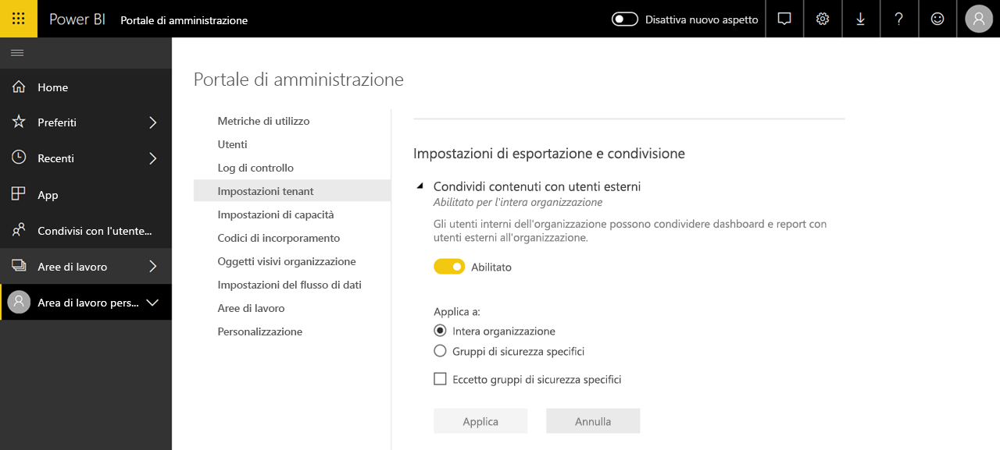

# Che cos'è l'amministrazione di Power BI?

L'amministrazione di Power BI è la gestione di un tenant di Power BI, che include la configurazione dei criteri di governance, il monitoraggio dell'utilizzo e il provisioning di licenze, capacità e risorse dell'organizzazione. Questo articolo offre una panoramica dei ruoli, delle attività e degli strumenti di amministrazione e include collegamenti ad articoli con informazioni più dettagliate.

Power BI è progettato per la business intelligence in modalità self-service e l'amministratore è il supervisore dei dati, dei processi e dei criteri nel tenant di Power BI. Un amministratore di Power BI è un membro chiave di un team che include sviluppatori di BI, analisti e altri ruoli. L'amministratore può supportare un'organizzazione nel raggiungimento degli obiettivi critici:

- Individuare gli indicatori KPI e le metriche di cui gli utenti hanno _realmente_ bisogno
- Ridurre i tempi di recapito dei report aziendali basati su IT
- Aumentare l'adozione e il ritorno sugli investimenti di una distribuzione di Power BI

Il suo compito è rendere produttivi gli utenti e garantire la sicurezza e la conformità a leggi e normative. Le responsabilità possono includere guida, supporto tecnico e, in molti casi, assistenza nelle scelte degli utenti aziendali.

## Ruoli di amministratore correlati a Power BI

Esistono diversi ruoli correlati all'amministrazione di Power BI, descritti nella tabella seguente.

| **Tipo di amministratore** | **Ambito amministrativo** | **Ambito Power BI** |
| --- | --- | --- |
| Amministratore globale di Office 365 | Office 365 | Può gestire tutti gli aspetti di un tenant di Power BI e altri servizi. |
| Amministratore fatturazione di Office 365 | Office 365 | Può acquisire licenze di Power BI tramite abbonamenti a Office 365. |
| Amministratore del servizio Power BI | Tenant di Power BI | Ha il controllo completo su un tenant di Power BI e sulle relative funzionalità di amministrazione (tranne che sulle licenze). |
| Amministratore di capacità di Power BI Premium | Una singola capacità Premium | Ha il controllo completo su una capacità Premium e sulle relative funzionalità di amministrazione. |
| Amministratore di capacità di Power BI Embedded | Una singola capacità Embedded | Ha il controllo completo su una capacità Embedded e sulle relative funzionalità di amministrazione. |

Gli amministratori globali in Office 365 o Azure Active Directory hanno diritti di amministratore in Power BI. Un amministratore globale di Office 365 può assegnare altri utenti al ruolo Amministratore del servizio Power BI, che concede diritti amministrativi solo sulle funzionalità di Power BI.

Gli amministratori del servizio Power BI hanno accesso al portale di amministrazione di Power BI, che include diverse impostazioni a livello di tenant relative a funzionalità, sicurezza e monitoraggio. Gli amministratori del servizio hanno accesso completo a tutte le risorse di un tenant di Power BI. Nella maggior parte dei casi, gli amministratori del servizio identificano i problemi e quindi collaborano con i proprietari delle risorse per intraprendere misure correttive.

Il ruolo di amministratore del servizio Power BI non concede la possibilità di assegnare licenze agli utenti o visualizzare i log di controllo in Office 365. Per questo motivo, attualmente gli utenti che sono membri esclusivamente del ruolo di amministratore del servizio Power BI non possono eseguire attività di amministrazione di Power BI.

## Attività amministrative

Gli amministratori eseguono numerose attività per supportare Power BI per la propria organizzazione, descritte nella tabella seguente.

| **Area attività** | **Attività tipiche** |
| --- | --- |
| Gestione del tenant di Power BI |<ul><li>Abilitare e disabilitare funzionalità chiave di Power BI <li>Creare report sull'utilizzo e sulle prestazioni <li>Esaminare e gestire il controllo degli eventi</ul>|
| Acquisizione e assegnazione di licenze di Power BI |<ul><li>Gestire le iscrizioni degli utenti <li>Acquistare e assegnare licenze Pro <li>Impedire agli utenti l'accesso a Power BI</ul>|
| Gestione della capacità Premium |<ul><li>Acquisire e usare capacità Premium <li>Assicurare la qualità del servizio|
| Gestione della capacità Embedded |<ul><li>Acquisire capacità Embedded per semplificare l'uso delle funzionalità di Power BI da parte di fornitori di software indipendenti e sviluppatori</ul>|
| Garanzia della conformità a criteri interni, leggi e normative | <ul><li>Gestire la classificazione dei dati aziendali <li>Contribuire all'applicazione di criteri di pubblicazione e condivisione del contenuto</ul>|
| Gestione delle risorse di Power BI |<ul><li>Gestire le aree di lavoro <li>Pubblicare oggetti visivi di Power BI <li>Verificare i codici usati per incorporare Power BI in altre applicazioni|
| Assistenza e supporto agli utenti del tenant |<ul><li>Risolvere i problemi di accesso ai dati e di altro tipo</ul>|
| Altre attività |<ul><li>Distribuire Power BI Desktop, ad esempio mediante Microsoft Endpoint Configuration Manager <li>Gestire la distribuzione dell'app Power BI per dispositivi mobili con Intune <li>Gestire la privacy e la sicurezza dei dati, ad esempio la sicurezza dei dati di origine</ul>|

## Strumenti di amministrazione

Esistono diversi strumenti correlati all'amministrazione di Power BI, descritti nella tabella seguente. In genere gli amministratori trascorrono la maggior parte del tempo nel portale di amministrazione di Power BI e usano gli altri strumenti disponibili in base alle esigenze.

| **Strumento** | **Attività tipiche** |
| --- | --- |
| Portale di amministrazione di Power BI |<ul><li>Acquisire e usare capacità Premium</li><li>Assicurare la qualità del servizio</li><li>Gestire la classificazione dei dati aziendali</li><li>Contribuire all'applicazione di criteri di pubblicazione e condivisione del contenuto</li><li>Gestire le aree di lavoro <li>Pubblicare oggetti visivi di Power BI</li><li>Verificare i codici usati per incorporare Power BI in altre applicazioni</li><li>Risolvere i problemi di accesso ai dati e di altro tipo</li></ul>|
| Interfaccia di amministrazione di Microsoft 365 |<ul><li>Gestire le iscrizioni degli utenti</li><li>Acquistare e assegnare licenze Pro</li><li>Impedire agli utenti l'accesso a Power BI</li></ul>|
| Centro sicurezza e conformità di Office 365 |<ul><li>Esaminare e gestire il controllo degli eventi</li></ul>|
| Azure Active Directory (AAD) nel portale di Azure |<ul><li>Configurare l'accesso condizionale alle risorse di Power BI tramite AAD</li><li>Eseguire il provisioning di capacità Power BI Embedded</li></ul>|
| Cmdlet di PowerShell |<ul><li>Gestire aree di lavoro e altri aspetti di Power BI tramite script</li></ul>|
| API amministrative e SDK |<ul><li>Compilare strumenti di amministrazione personalizzati per agevolare il lavoro di un amministratore di Power BI. Ad esempio, Power BI Desktop può usare queste API per compilare report basati su dati correlati all'amministrazione</li></ul>|

## Passaggi successivi

Ci auguriamo che questo articolo sia stato utile per iniziare a comprendere il lavoro di amministratore di Power BI e gli specifici ruoli, strumenti e attività che lo riguardano. Per altre informazioni, è consigliabile leggere gli articoli seguenti.

- [Usare il portale di amministrazione di Power BI](service-admin-portal.md)
- [Linee guida per le impostazioni di amministrazione del tenant](guidance/admin-tenant-settings.md)
- [Usare i cmdlet di PowerShell](/powershell/power-bi/overview)
- [Domande frequenti sull'amministrazione di Power BI](service-admin-faq.md)
- Domande? [Contattare la community di Power BI](https://community.powerbi.com/)
- Se si hanno suggerimenti, [Contribuire con idee per migliorare Power BI](https://ideas.powerbi.com/)
