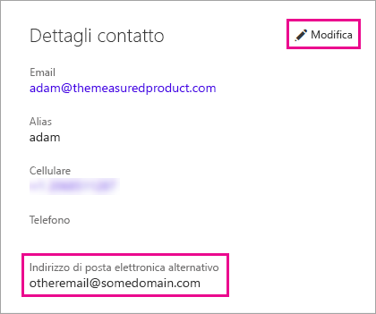

# <a name="using-an-alternate-email-address"></a>Uso di un indirizzo di posta elettronica alternativo
Per impostazione predefinita, l'indirizzo di posta elettronica con cui è stata effettuata l'iscrizione a Power BI viene usato per inviare aggiornamenti sulle attività in Power BI,  ad esempio per inviare gli inviti di condivisione.

In alcuni casi si preferisce che questi messaggi vengano inviati a un indirizzo di posta elettronica alternativo, diverso da quello usato per l'iscrizione a Power BI.

## <a name="updating-through-office-365-personal-info-page"></a>Aggiornamento tramite la pagina delle informazioni personali di Office 365
1. Passare alla [pagina delle informazioni personali di Office 365](https://portal.office.com/account/#personalinfo).  Se richiesto, accedere con l'indirizzo di posta elettronica e la password usati per Power BI.
2. Fare clic sul collegamento Modifica nella sezione Dettagli contatto.  
   
   > [!NOTE]
   > Se il collegamento Modifica non è presente, l'indirizzo di posta elettronica viene gestito dall'amministratore di Office 365 ed è necessario contattare questa figura per aggiornare l'indirizzo.
   > 
   > 
   
   
3. Nel campo Indirizzo di posta elettronica alternativo immettere l'indirizzo di posta cui verranno inviati gli aggiornamenti di Power BI.

> [!NOTE]
> La modifica di questa impostazione non influisce sull'indirizzo di posta elettronica usato per inviare aggiornamenti del servizio, newsletter e altre comunicazioni di carattere promozionale.  Questi messaggi verranno sempre inviati all'indirizzo usato in origine durante la registrazione a Power BI.
> 
> 

## <a name="updating-through-azure-active-directory"></a>Aggiornamento tramite Azure Active Directory
Quando si acquisisce un token di incorporamento di Azure Active Directory (AAD) per Power BI, è possibile usare tre diversi tipi di indirizzo di posta elettronica. I tre diversi tipi sono:

* l'indirizzo di posta elettronica principale associato all'account AAD di un utente
* l'indirizzo di posta elettronica UPN (UserPrincipalName)
* l'attributo della matrice dell'indirizzo di posta elettronica "altro"

Power BI seleziona l'indirizzo di posta elettronica da usare in base ai criteri seguenti:
1.  Se l'attributo relativo alla posta elettronica è presente nell'oggetto utente del tenant AAD, Power BI usa questo attributo per l'indirizzo di posta elettronica
2.  Se l'indirizzo di posta elettronica UPN *non* è un indirizzo di posta elettronica di un dominio **\*.onmicrosoft.com** (l'informazione dopo il simbolo "\@"), Power BI usa questo attributo per l'indirizzo di posta elettronica
3.  Se l'attributo della matrice dell'indirizzo di posta elettronica "altro" è presente nell'oggetto utente di AAD, verrà usato il primo indirizzo di posta elettronica in questo elenco, poiché in questo attributo può essere presente un elenco di indirizzi di posta elettronica
4. Se nessuna delle condizioni precedenti è presente, verrà usato l'indirizzo UPN

## <a name="updating-with-powershell"></a>Aggiornamento con PowerShell
È possibile aggiornare l'indirizzo di posta elettronica alternativo tramite PowerShell per Azure Active Directory. Per questa operazione, eseguire il comando [Set-AzureADUser](https://docs.microsoft.com/powershell/module/azuread/set-azureaduser).

```
Set-AzureADUser -ObjectId john@contoso.com -OtherMails "otheremail@somedomain.com"
```

Per altre informazioni, vedere [Azure Active Directory PowerShell Version 2](https://docs.microsoft.com/powershell/azure/active-directory/install-adv2) (Azure Active Directory PowerShell versione 2).

Altre domande? [Provare la community di Power BI](http://community.powerbi.com/)

