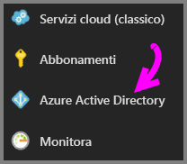
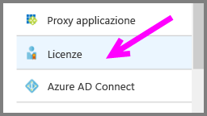
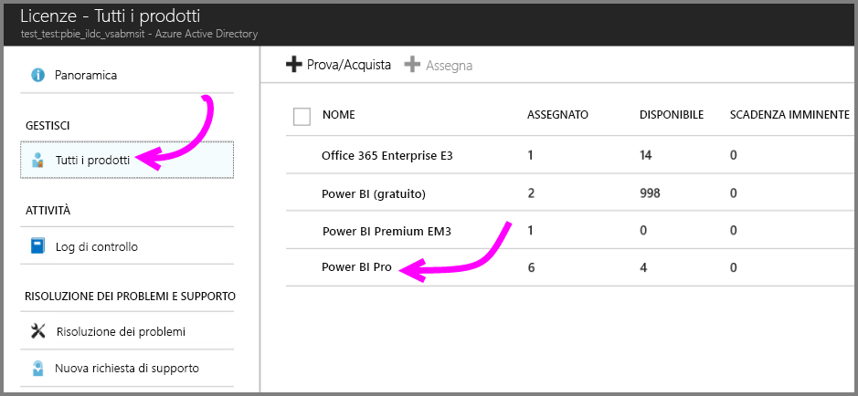
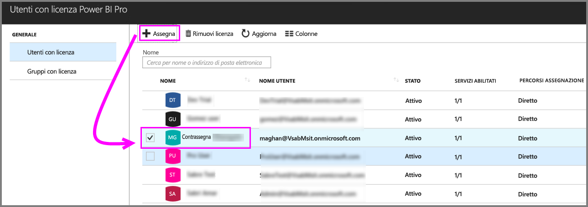

# Guida introduttiva: Assegnare licenze di Power BI Pro in Azure

Power BI Pro è una licenza singola che consente di accedere a tutto il contenuto e a tutte le funzionalità del servizio Power BI, inclusa la possibilità di condividere contenuto e collaborare con altri utenti Pro. Solo gli utenti della versione Pro possono pubblicare e usare contenuti nelle aree di lavoro delle app, condividere i dashboard e sottoscrivere dashboard e report. Questo articolo illustra come assegnare licenze di Power BI Pro in Azure. È anche possibile [assegnare licenze in Office 365](service-admin-assigning-power-bi-pro-licenses.md).

## Prerequisiti

È necessario essere proprietario della sottoscrizione di Azure usata da Power BI per le ricerche di Active Directory.

È necessario [acquistare almeno una licenza](service-admin-purchasing-power-bi-pro.md) prima di iniziare.

## Assegnare licenze a singoli account utente

Seguire questi passaggi per assegnare licenze di Power BI Pro a singoli account utente:

1. Aprire il [portale di Azure](https://ms.portal.azure.com/#@microsoft.onmicrosoft.com/dashboard/private/39bc3cf7-31a4-43f6-954c-f2d69ca2f0). 

2. Nella barra di spostamento a sinistra selezionare **Azure Active Directory**.

    

3. In **Azure Active Directory** selezionare **Licenze**.

    

4. In **Licenze** selezionare **Tutti i prodotti** e quindi selezionare **Power BI Pro** per visualizzare l'elenco degli utenti con licenza.

    

5. Selezionare **Assegna** per aggiungere una licenza di Power BI Pro a un altro account utente.

    

## Passaggi successivi

Ora che le licenze sono state assegnate, seguire i collegamenti per altre informazioni su Power BI Pro.

[Power BI Pro nell'organizzazione](service-admin-power-bi-pro-in-your-organization.md)

[Find Power BI users that have signed in](service-admin-access-usage.md) (Ricerca di utenti Power BI che hanno eseguito l'accesso)

Altre domande? [Provare a rivolgersi alla community di Power BI](https://community.powerbi.com/)