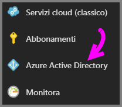
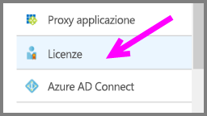
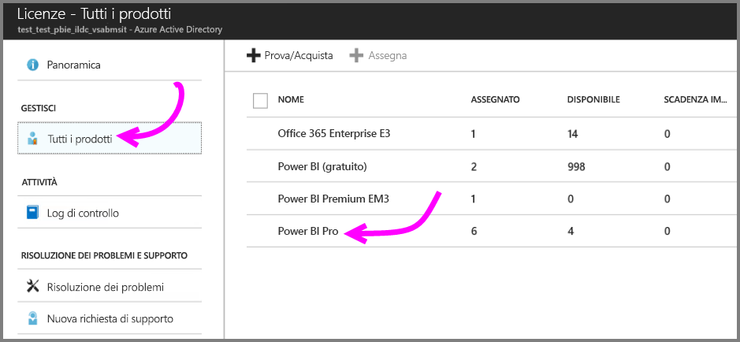
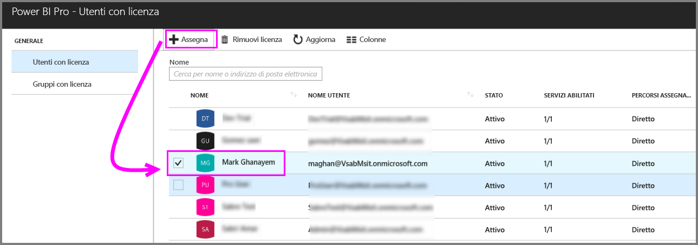
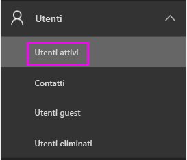
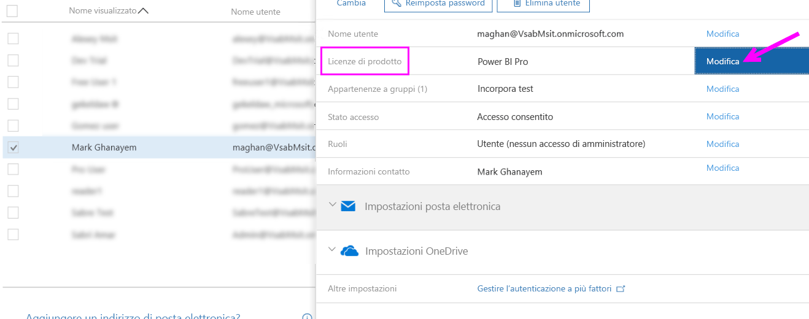
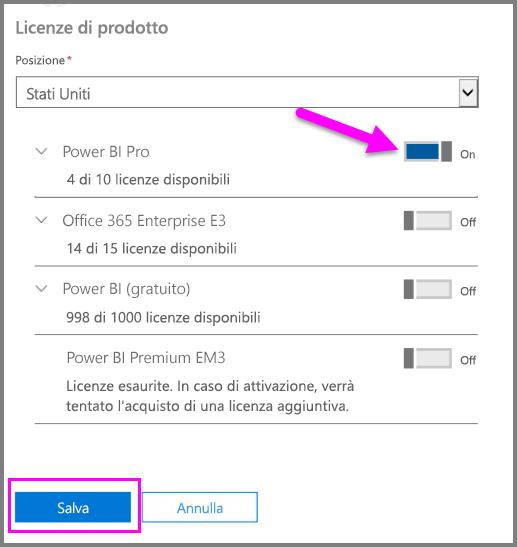
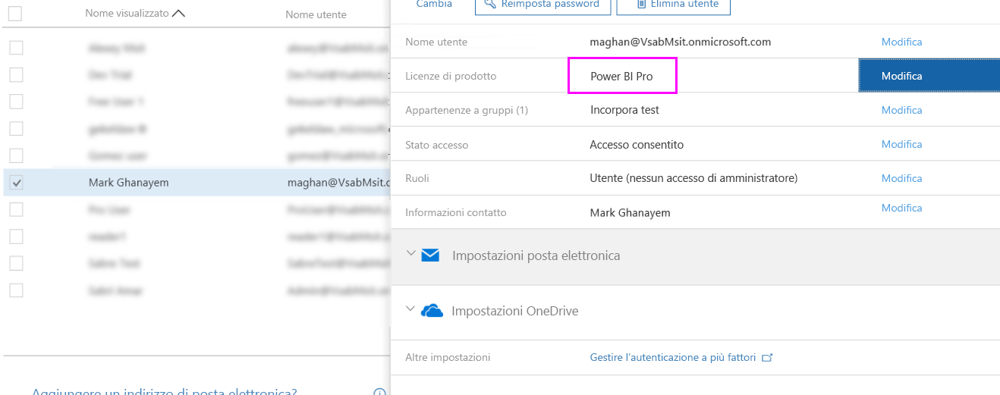

# Assegnazione delle licenze di Power BI Pro

Gli amministratori possono scegliere le licenze di Power BI Pro da assegnare agli utenti da una serie di portali di gestione e di cmdlet PowerShell. La gestione delle licenze di Power BI è supportato da Azure Active Directory (Azure AD).

* I proprietari delle sottoscrizioni di Azure possono utilizzare il pannello Azure Active Directory nel [portale di Azure](https://ms.portal.azure.com/#@microsoft.onmicrosoft.com/dashboard/private/39bc3cf7-31a4-43f6-954c-f2d69ca2f0). 

* Gli amministratori globali e gli amministratori account utente possono usare l'[interfaccia di amministrazione di Office 365](https://portal.office.com/AdminPortal/Home#/homepage).

## Gestione delle licenze di Power BI Pro nel portale di Azure

Power BI Usa Azure AD come servizio fondamentale. In Azure AD vengono memorizzati gli account utente e i gruppi e altre impostazioni, ad esempio le informazioni sui prodotti acquistati.

### Assegnazione delle licenze ad account utente individuali

Seguire questi passaggi per assegnare le licenze di Pro ad account utente individuali se si dispone di una sottoscrizione di Azure:

1. Passare al [portale di Azure](https://ms.portal.azure.com/#@microsoft.onmicrosoft.com/dashboard/private/39bc3cf7-31a4-43f6-954c-f2d69ca2f0). 

2. Nella barra di spostamento a sinistra, fare clic su Azure Active Directory.

    

3. Nel pannello Azure Active Directory fare clic su Licenze.

    

4. Nel pannello delle licenze, fare clic su Tutti i prodotti e quindi fare clic su Power BI Pro per visualizzare l'elenco degli utenti con licenza.

    

5. Fare clic su Assegna per aggiungere una licenza di Power BI Pro a un account utente aggiuntivo.

    

> [!NOTE]
> Nel portale di Azure è possibile gestire la maggior parte delle attività connesse alle licenze, ma non è possibile acquistare le licenze di Power BI Pro. Utilizzare l'interfaccia di amministrazione di Office 365 per acquistare una sottoscrizione a Power BI Pro. Per altre informazioni, vedere [Acquisto di Power BI Pro](https://docs.microsoft.com/en-us/power-bi/service-admin-purchasing-power-bi-pro).
>

## Gestione delle licenze di Power BI Pro nell'interfaccia di amministrazione di Office 365

Gli amministratori globali acquistano sottoscrizioni a Power BI Pro e gestiscono le licenze associate per l'organizzazione nell'interfaccia di amministrazione di Office 365.

Gli amministratori di Office 365 possono seguire questi passaggi per assegnare le licenze Pro ad account utente individuali:

1. Accedere all'interfaccia di amministrazione di Office 365.

2. Nel riquadro di spostamento a sinistra, espandere Utenti e quindi fare clic su Utenti attivi.

    

3. Selezionare uno o più utenti e fare clic su Modifica licenze di prodotto.

    

4. In Power BI Pro attivare l'impostazione e quindi fare clic su Salva.

    

5. In Stato verificare che la licenza di Power BI Pro degli account selezionati sia stata assegnata correttamente.

    

> [!NOTE]
> Se la sottoscrizione ha esaurito le licenze, aggiungerne altre espandendo Fatturazione nel riquadro di spostamento a sinistra e facendo clic su Sottoscrizioni. Nella pagina Sottoscrizioni selezionare la sottoscrizione di Power BI Pro e fare clic su Aggiungi/Rimuovi licenze.
>

## Passaggi successivi
[Power BI Pro nell'organizzazione](service-admin-power-bi-pro-in-your-organization.md)
 
[Extended Pro Trial activation](service-extended-pro-trial.md) (Attivazione della versione di valutazione Pro estesa)
 
[Contratto di assistenza di Power BI per utenti singoli](https://powerbi.microsoft.com/terms-of-service/)
 
[Annuncio di Power BI Premium](https://aka.ms/pbipremium-announcement)
 
[Find Power BI users that have signed in](service-admin-access-usage.md) (Ricerca di utenti Power BI che hanno eseguito l'accesso)

Altre domande? [Provare a rivolgersi alla community di Power BI](https://community.powerbi.com/)