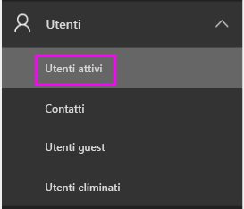
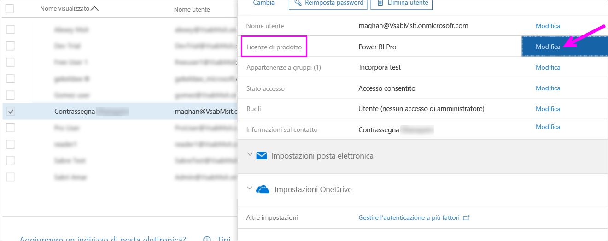
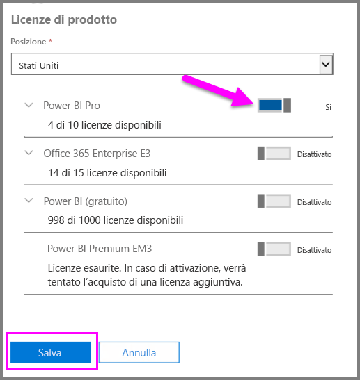
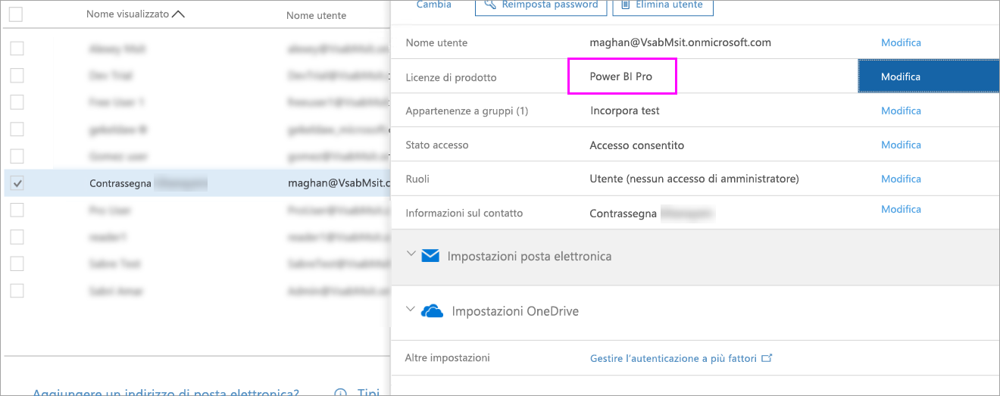

# Guida introduttiva: Assegnare licenze di Power BI Pro in Office 365

Power BI Pro è una licenza singola che consente di accedere a tutto il contenuto e a tutte le funzionalità del servizio Power BI, inclusa la possibilità di condividere contenuto e collaborare con altri utenti Pro. Solo gli utenti della versione Pro possono pubblicare e usare contenuti nelle aree di lavoro delle app, condividere i dashboard e sottoscrivere dashboard e report. Questo articolo illustra come assegnare licenze di Power BI Pro in Office 365. È anche possibile [assegnare licenze in Azure](service-admin-assigning-power-bi-pro-licenses-azure.md).

## Prerequisiti

È necessario essere membro del ruolo [**Amministratore globale** o **Amministratore account utente**](https://support.office.com/article/about-office-365-admin-roles-da585eea-f576-4f55-a1e0-87090b6aaa9d?ui=en-US&rs=en-US&ad=US) in Office 365.

È necessario [acquistare almeno una licenza](service-admin-purchasing-power-bi-pro.md) prima di iniziare.

## Assegnare licenze a singoli account utente

Seguire questi passaggi per assegnare licenze di Power BI Pro a singoli account utente:

1. Aprire l'[interfaccia di amministrazione di Office 365](https://portal.office.com/adminportal/home#/homepage).

2. Nel riquadro di spostamento a sinistra espandere **Utenti** e quindi selezionare **Utenti attivi**.

    

3. Selezionare un utente, quindi in **Licenze di prodotto** selezionare **Modifica**.

    

4. In **Power BI Pro** attivare l'impostazione **Sul** quindi fare clic su **Salva**.

    

5. Nello **Stato** dell'account selezionato verificare che la licenza di Power BI Pro sia stata assegnata correttamente.

    

## Passaggi successivi

Ora che le licenze sono state assegnate, seguire i collegamenti per altre informazioni su Power BI Pro.

[Power BI Pro nell'organizzazione](service-admin-power-bi-pro-in-your-organization.md)

[Find Power BI users that have signed in](service-admin-access-usage.md) (Ricerca di utenti Power BI che hanno eseguito l'accesso)

Altre domande? [Provare a rivolgersi alla community di Power BI](https://community.powerbi.com/)