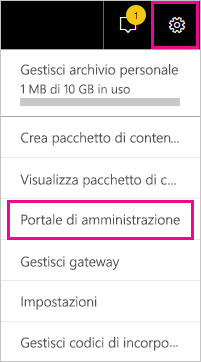
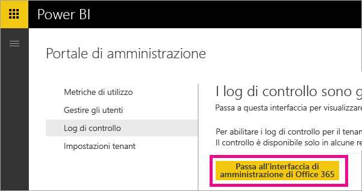
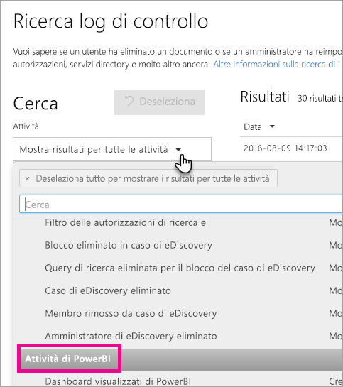
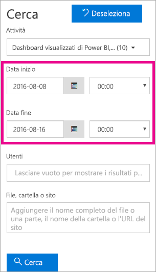
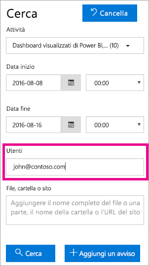
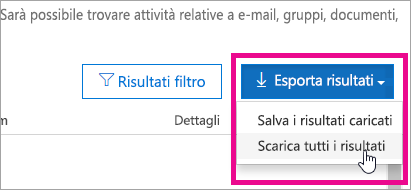

# <a name="using-auditing-within-your-organization"></a>Uso del controllo nell'organizzazione

Essere a conoscenza di chi sta eseguendo un'azione su un determinato elemento del tenant di Power BI è di fondamentale importanza per aiutare l'organizzazione a soddisfare i suoi requisiti, come ad esempio la conformità alle normative e la gestione dei record. Usare la funzione di controllo di Power BI per controllare le azioni eseguite dagli utenti, ad esempio "Visualizza report" e "Visualizza dashboard". Non è possibile usare la funzione di controllo per controllare le autorizzazioni.

Si utilizzano le funzionalità di controllo del Centro sicurezza e conformità di Office 365 o si usa PowerShell. Il controllo si basa su funzionalità in Exchange Online, di cui viene eseguito automaticamente il provisioning per il supporto di Power BI.

È possibile filtrare i dati del controllo per intervallo di date, utente, dashboard, report, set di dati e tipo di attività. È inoltre possibile scaricare le attività in un file csv (valori delimitati da virgola) per l'analisi offline.

## <a name="requirements"></a>Requisiti

Per accedere ai log di controllo, è necessario rispettare questi requisiti:

* È necessario essere un amministratore globale o avere il ruolo Audit Logs (Log di controllo) o View-Only Audit Logs (Log di controllo sola visualizzazione) in Exchange Online per accedere al log di controllo. Per impostazione predefinita, questi ruoli vengono assegnati ai gruppi di ruoli Gestione conformità e Gestione organizzazione nella pagina **Autorizzazioni** nell'interfaccia di amministrazione di Exchange.

    Per consentire l'accesso al log di controllo agli account senza privilegi di amministratore, è necessario aggiungere l'utente come membro di uno di questi gruppi di ruoli. In alternativa, è possibile creare un gruppo di ruoli personalizzato nell'interfaccia di amministrazione di Exchange, assegnare il ruolo Audit Logs (Log di controllo) o View-Only Audit Logs (Log di controllo sola visualizzazione) a questo gruppo e quindi aggiungere l'account senza privilegi di amministratore al nuovo gruppo di ruoli. Per altre informazioni, vedere [Gestire i gruppi di ruoli in Exchange Online](/Exchange/permissions-exo/role-groups).

    Se non è possibile accedere all'interfaccia di amministrazione di Exchange dall'interfaccia di amministrazione di Office 365, passare a https://outlook.office365.com/ecp ed eseguire l'accesso usando le credenziali personali.

* Se si può accedere al log di controllo ma non si è un amministratore globale o un amministratore del servizio Power BI, non sarà possibile accedere al portale di amministrazione di Power BI. In questo caso, è necessario usare un collegamento diretto al [Centro sicurezza e conformità di Office 365](https://sip.protection.office.com/#/unifiedauditlog).

## <a name="accessing-your-audit-logs"></a>Accesso ai log di controllo

Per accedere ai log, verificare innanzitutto che la registrazione sia abilitata in Power BI. Per altre informazioni, vedere [Log di controllo](service-admin-portal.md#audit-logs) nella documentazione del portale di amministrazione. È possibile che tra l'abilitazione della funzione di controllo e la visualizzazione dei dati di controllo si verifichi un ritardo di un massimo di 48 ore. Se i dati non vengono visualizzati immediatamente, controllare i log di controllo successivamente. Un ritardo simile può verificarsi tra l'assegnazione dell'autorizzazione per la visualizzazione dei log di controllo e l'accesso ai log.

I log di controllo di Power BI sono disponibili direttamente tramite il [Centro sicurezza e conformità di Office 365](https://sip.protection.office.com/#/unifiedauditlog). È disponibile un collegamento anche dal portale di amministrazione di Power BI:

1. In Power BI selezionare l'**icona a forma di ingranaggio** in alto a destra e quindi selezionare **Portale di amministrazione**.

   

1. Selezionare **Log di controllo**.

1. Selezionare **Passa all'interfaccia di amministrazione di O365**.

   

## <a name="search-only-power-bi-activities"></a>Eseguire solo la ricerca delle attività di Power BI

Limitare i risultati alle sole attività di Power BI seguendo questa procedura. Per un elenco delle attività, vedere l'elenco delle [attività controllate da Power BI](#activities-audited-by-power-bi) più avanti in questo articolo.

1. Nella pagina **Ricerca dei registri di controllo** selezionare l'elenco a discesa delle **Attività** in **Cerca**.

2. Selezionare **Attività di Power BI**.

   

3. Selezionare un punto qualsiasi all'esterno della casella di selezione per chiuderla.

Le ricerche verranno filtrate alle sole attività di Power BI.

## <a name="search-the-audit-logs-by-date"></a>Eseguire la ricerca dei log di controllo per data

È possibile cercare i log in base all'intervallo di date usando i campi **Data di inizio** e **Data di fine**. Gli ultimi sette giorni sono selezionati per impostazione predefinita. La data e l'ora vengono visualizzate nel formato Coordinated Universal Time (UTC). L'intervallo massimo che è possibile specificare è 90 giorni. 

Se l'intervallo di date selezionato è maggiore a 90 giorni, viene visualizzato un errore. Se si usa l'intervallo massimo di 90 giorni, selezionare l'ora corrente per **Data di inizio**. In caso contrario, un errore informerà che la data di inizio è precedente alla data di fine. Se il controllo è stato attivato negli ultimi 90 giorni, l'intervallo di date non può cominciare prima della data di attivazione del controllo.



## <a name="search-the-audit-logs-by-users"></a>Eseguire la ricerca dei log di controllo per utente

È possibile cercare le voci del log di controllo in base alle attività eseguite dagli utenti specifici. A tale scopo, immettere uno o più nomi utente nel campo **Utenti**. Il nome utente è simile a un indirizzo di posta elettronica ed è l'account usato dagli utenti per accedere a Power BI. Lasciare questa casella vuota per visualizzare le voci di tutti gli utenti (e account del servizio) dell'organizzazione.



## <a name="view-search-results"></a>Visualizzare i risultati della ricerca

Dopo aver selezionato **Cerca**, i risultati della ricerca vengono caricati e visualizzati in **Risultati** nel giro di pochi secondi. Al termine della ricerca, viene visualizzato il numero di risultati trovati. Viene visualizzato un massimo di 1000 eventi. Se più di 1000 eventi soddisfano i criteri di ricerca, vengono visualizzati i 1000 eventi più recenti.

### <a name="view-the-main-results"></a>Visualizzare i risultati principali

L'area **Risultati** contiene le informazioni seguenti per ogni evento restituito dalla ricerca. Per ordinare i risultati, selezionare un'intestazione di colonna in **Risultati**.

| **Colonna** | **Definizione** |
| --- | --- |
| Data |La data e l'ora (in formato UTC) in cui si è verificato l'evento. |
| Indirizzo IP |L'indirizzo IP del dispositivo usato durante la registrazione dell'attività. L'indirizzo IP viene visualizzato in formato IPv4 o IPv6. |
| Utente |L'utente (o l'account del servizio) che ha eseguito l'azione che ha generato l'evento. |
| Attività |L'attività eseguita dall'utente. Questo valore corrisponde alle attività selezionate nell'elenco a discesa **Attività**. Per un evento proveniente dal registro di controllo dell'amministrazione di Exchange, il valore di questa colonna è un cmdlet di Exchange. |
| Elemento |L'oggetto creato o modificato in seguito all'attività corrispondente. Ad esempio, il file che è stato visualizzato o modificato oppure l'account utente che è stato aggiornato. Non tutte le attività presentano un valore in questa colonna. |
| Dettagli |Dettagli aggiuntivi su un'attività. Ancora una volta, non tutte le attività presentano un valore corrispondente. |

### <a name="view-the-details-for-an-event"></a>Visualizzare i dettagli di un evento

È possibile visualizzare ulteriori dettagli su un evento facendo clic sul record dell'evento nell'elenco dei risultati della ricerca. Viene visualizzata una pagina **Dettagli** che contiene le proprietà dettagliate dal record dell'evento. Le proprietà visualizzate dipendono dal servizio Office 365 in cui si verifica l'evento. 

Per visualizzare questi dettagli, selezionare **Altre informazioni**. Tutte le voci di Power BI hanno un valore pari a 20 per la proprietà RecordType. Per informazioni su altre proprietà, vedere [Proprietà dettagliate nel log di controllo](/office365/securitycompliance/detailed-properties-in-the-office-365-audit-log/).

   

## <a name="export-search-results"></a>Esportare i risultati della ricerca

Per esportare il log di controllo di Power BI in un file CSV, seguire questa procedura.

1. Selezionare **Esporta risultati**.

1. Selezionare **Salva risultati caricati** o **Scarica tutti i risultati**.

    

## <a name="use-powershell-to-search-audit-logs"></a>Usare PowerShell per eseguire ricerche nei log di controllo

È anche possibile usare PowerShell per accedere ai log di controllo in base all'account di accesso. L'esempio seguente mostra come connettersi a Exchange Online PowerShell e quindi usare il comando [Search-UnifiedAuditLog](/powershell/module/exchange/policy-and-compliance-audit/search-unifiedauditlog?view=exchange-ps/) per il pull delle voci del log di controllo di Power BI. Per eseguire lo script, è necessario disporre delle autorizzazioni appropriate, come descritto nella sezione [Requisiti](#requirements).

```powershell
Set-ExecutionPolicy RemoteSigned

$UserCredential = Get-Credential

$Session = New-PSSession -ConfigurationName Microsoft.Exchange -ConnectionUri https://outlook.office365.com/powershell-liveid/ -Credential $UserCredential -Authentication Basic -AllowRedirection

Import-PSSession $Session
Search-UnifiedAuditLog -StartDate 9/11/2018 -EndDate 9/15/2018 -RecordType PowerBI -ResultSize 1000 | Format-Table | More
```

Per altre informazioni sulla connessione a Exchange Online, vedere [Connect to Exchange Online PowerShell](/powershell/exchange/exchange-online/connect-to-exchange-online-powershell/connect-to-exchange-online-powershell/) (Connettersi a Exchange Online tramite PowerShell). Per un altro esempio di uso di PowerShell con i log di controllo, vedere [Using Power BI audit log and PowerShell to assign Power BI Pro licenses](https://powerbi.microsoft.com/blog/using-power-bi-audit-log-and-powershell-to-assign-power-bi-pro-licenses/) (Uso del log di controlli di Power BI e di PoweShell per assegnare licenze di Power BI Pro).

## <a name="activities-audited-by-power-bi"></a>Attività controllate da Power BI

Le attività seguenti sono controllate da Power BI.

| Nome descrittivo                                     | Nome operazione                              | Note                                  |
|---------------------------------------------------|---------------------------------------------|------------------------------------------|
| Aggiunta origine dati a Power BI Gateway             | AddDatasourceToGateway                      |                                          |
| Accesso alla cartella di Power BI aggiunto                      | AddFolderAccess                             | Attualmente non in uso                       |
| Membri del gruppo di Power BI aggiunti                      | AddGroupMembers                             |                                          |
| Account di archiviazione del flusso di dati collegato al tenant dall'amministratore | AdminAttachedDataflowStorageAccountToTenant | Attualmente non in uso                       |
| Analizzato un set di dati di Power BI                         | AnalyzedByExternalApplication               |                                          |
| Report di Power BI analizzato                          | AnalyzeInExcel                              |                                          |
| Set di dati di Power BI associato al gateway                | BindToGateway                               |                                          |
| Stato capacità modificato                            | ChangeCapacityState                         |                                          |
| Assegnazione utente capacità modificata                  | UpdateCapacityUsersAssignment               |                                          |
| Connessioni del set di dati di Power BI modificate              | SetAllConnections                           |                                          |
| Modificati gli amministratori del gateway di Power BI                   | ChangeGatewayAdministrators                 |                                          |
| Modificati gli utenti dell'origine dati del gateway di Power BI        | ChangeGatewayDatasourceUsers                |                                          |
| Pacchetto di contenuto di Power BI per l'organizzazione creato      | CreateOrgApp                                |                                          |
| App Power BI creata                              | CreateApp                                   |                                          |
| Dashboard di Power BI creato                        | CreateDashboard                             |                                          |
| Flusso di dati di Power BI creato                         | CreateDataflow                              |                                          |
| Set di dati di Power BI creato                          | CreateDataset                               |                                          |
| Sottoscrizione ai messaggi di posta elettronica di Power BI creata               | CreateEmailSubscription                     |                                          |
| Cartella di Power BI creata                           | CreateFolder                                |                                          |
| Creato gateway di Power BI                          | CreateGateway                               |                                          |
| Gruppo di Power BI creato                            | CreateGroup                                 |                                          |
| Report di Power BI creato                           | CreateReport                                |                                          |
| Migrazione del flusso di dati all'account di archiviazione esterno eseguita     | DataflowMigratedToExternalStorageAccount    | Attualmente non in uso                       |
| Autorizzazioni del flusso di dati aggiunte                        | DataflowPermissionsAdded                    | Attualmente non in uso                       |
| Autorizzazioni del flusso di dati rimosse                      | DataflowPermissionsRemoved                  | Attualmente non in uso                       |
| Pacchetto di contenuto di Power BI per l'organizzazione eliminato      | DeleteOrgApp                                |                                          |
| Commento di Power BI eliminato                          | DeleteComment                               |                                          |
| Dashboard di Power BI eliminato                        | DeleteDashboard                             | Attualmente non in uso                       |
| Flusso di dati di Power BI eliminato                         | DeleteDataflow                              | Attualmente non in uso                       |
| Set di dati di Power BI eliminato                          | DeleteDataset                               |                                          |
| Sottoscrizione ai messaggi di posta elettronica di Power BI eliminata               | DeleteEmailSubscription                     |                                          |
| Cartella di Power BI eliminata                           | DeleteFolder                                |                                          |
| Accesso alla cartella di Power BI eliminato                    | DeleteFolderAccess                          | Attualmente non in uso                       |
| Eliminato gateway di Power BI                          | DeleteGateway                               |                                          |
| Gruppo di Power BI eliminato                            | DeleteGroup                                 |                                          |
| Report di Power BI eliminato                           | DeleteReport                                |                                          |
| Origini dati del set di dati di Power BI individuate          | GetDatasources                              |                                          |
| Report di Power BI scaricato                        | DownloadReport                              |                                          |
| Autorizzazione di certificazione di Power BI modificata          | EditCertificationPermission                 | Attualmente non in uso                       |
| Dashboard di Power BI modificato                         | EditDashboard                               | Attualmente non in uso                       |
| Set di dati di Power BI modificato                           | EditDataset                                 |                                          |
| Proprietà del set di dati di Power BI modificate                | EditDatasetProperties                       | Attualmente non in uso                       |
| Report di Power BI modificato                            | EditReport                                  |                                          |
| Flusso di dati di Power BI esportato                        | ExportDataflow                              |                                          |
| Dati degli oggetti visivi dei report di Power BI esportati              | ExportReport                                |                                          |
| Dati del riquadro di Power BI esportati                       | ExportTile                                  |                                          |
| Non è stato possibile aggiungere le autorizzazioni del flusso di dati                | FailedToAddDataflowPermissions              | Attualmente non in uso                       |
| Non è stato possibile rimuovere le autorizzazioni del flusso di dati             | FailedToRemoveDataflowPermissions           | Attualmente non in uso                       |
| Token di firma di accesso condiviso del flusso di dati di Power BI generato             | GenerateDataflowSasToken                    |                                          |
| Token di incorporamento di Power BI generato                    | GenerateEmbedToken                          |                                          |
| File importato in Power BI                         | Importa                                      |                                          |
| App Power BI installata                            | InstallApp                                  |                                          |
| Migrazione dell'area di lavoro a una capacità eseguita                  | MigrateWorkspaceIntoCapacity                |                                          |
| Commento di Power BI pubblicato                           | PostComment                                 |                                          |
| Dashboard di Power BI stampato                        | PrintDashboard                              |                                          |
| Pagina di report di Power BI stampata                      | PrintReport                                 |                                          |
| Report di Power BI pubblicato sul Web                  | PublishToWebReport                          |                                          |
| Segreto del flusso di dati di Power BI ricevuto da Key Vault  | ReceiveDataflowSecretFromKeyVault           | Attualmente non in uso                       |
| Rimossa origine dati dal gateway di Power BI         | RemoveDatasourceFromGateway                 |                                          |
| Membri del gruppo di Power BI rimossi                    | DeleteGroupMembers                          |                                          |
| Area di lavoro rimossa da una capacità                 | RemoveWorkspacesFromCapacity                |                                          |
| Dashboard di Power BI rinominato                        | RenameDashboard                             |                                          |
| Aggiornamento del flusso di dati Power BI richiesto               | RequestDataflowRefresh                      | Attualmente non in uso                       |
| Aggiornamento del set di dati di Power BI richiesto                | RefreshDataset                              |                                          |
| Aree di lavoro di Power BI recuperate                     | GetWorkspaces                               |                                          |
| Aggiornamento pianificato impostato sul flusso di dati di Power BI        | SetScheduledRefreshOnDataflow               |                                          |
| Aggiornamento pianificato impostato sul set di dati di Power BI         | SetScheduledRefresh                         |                                          |
| Dashboard di Power BI condiviso                         | ShareDashboard                              |                                          |
| Report di Power BI condiviso                            | ShareReport                                 |                                          |
| Avviata una versione di valutazione estesa di Power BI                   | OptInForExtendedProTrial                    | Attualmente non in uso                       |
| Versione di valutazione di Power BI avviata                            | OptInForProTrial                            |                                          |
| Origine dati di Power BI acquisita                   | TakeOverDatasource                          |                                          |
| Set di dati di Power BI acquisito                        | TakeOverDataset                             |                                          |
| Pubblicazione dell'app Power BI annullata                          | UnpublishApp                                |                                          |
| Aggiorna impostazioni di governance delle risorse di capacità      | UpdateCapacityResourceGovernanceSettings    | Attualmente non disponibile nel portale di amministrazione di Office 365 |
| Amministratore della capacità aggiornato                            | UpdateCapacityAdmins                        |                                          |
| Nome visualizzato della capacità aggiornato                     | UpdateCapacityDisplayName                   |                                          |
| Impostazioni Power BI dell'organizzazione aggiornate          | UpdatedAdminFeatureSwitch                   |                                          |
| App Power BI aggiornata                              | UpdateApp                                   |                                          |
| Flusso di dati di Power BI aggiornato                         | UpdateDataflow                              |                                          |
| Origini dati del set di dati di Power BI aggiornate             | UpdateDatasources                           |                                          |
| Parametri del set di dati di Power BI aggiornati               | UpdateDatasetParameters                     |                                          |
| Sottoscrizione ai messaggi di posta elettronica di Power BI aggiornata               | UpdateEmailSubscription                     |                                          |
| Cartella di Power BI aggiornata                           | UpdateFolder                                |                                          |
| Accesso alla cartella di Power BI aggiornato                    | UpdateFolderAccess                          |                                          |
| Credenziali dell'origine dati di Power BI Gateway aggiornate  | UpdateDatasourceCredentials                 |                                          |
| Dashboard di Power BI visualizzato                         | ViewDashboard                               |                                          |
| Flusso di dati di Power BI visualizzato                          | ViewDataflow                                |                                          |
| Report di Power BI visualizzato                            | ViewReport                                  |                                          |
| Riquadro di Power BI visualizzato                              | ViewTile                                    |                                          |
| Metriche di utilizzo di Power BI visualizzate                     | ViewUsageMetrics                            |                                          |
|                                                   |                                             |                                          |

## <a name="next-steps"></a>Passaggi successivi

[Che cos'è l'amministrazione di Power BI?](service-admin-administering-power-bi-in-your-organization.md)  

[Portale di amministrazione di Power BI](service-admin-portal.md)  

Altre domande? [Provare a rivolgersi alla community di Power BI](http://community.powerbi.com/)
