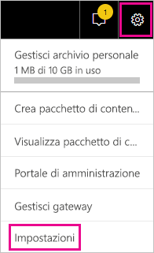
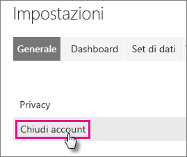
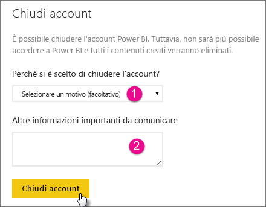
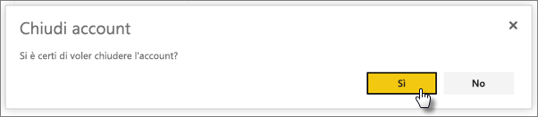

# Chiusura dell'account di Power BI
Se non si vuole più usare Power BI, è possibile chiedere di chiudere l'account.  Dopo la chiusura dell'account, non sarà più possibile accedere a Power BI.  Anche tutti i dati del cliente caricati o creati in Power BI saranno eliminati in base ai criteri di conservazione dei dati menzionati nelle condizioni per l'utilizzo del servizio Power BI.

## Singoli utenti di Power BI
È possibile chiudere l'account dalla schermata Impostazioni.

1. Selezionare l'icona dell'ingranaggio  in alto a destra.
2. Selezionare **Impostazioni**.
   
    
3. **Generale** > **Chiudi account**
   
    
4. Selezionare un motivo nell'elenco a discesa **Perché si è scelto di chiudere l'account?** (1).  È possibile fornire facoltativamente altre informazioni (2). Selezionare quindi **Chiudi account**.
   
    
5. Confermare che si vuole chiudere l'account.
   
    
6. Verrà visualizzato un messaggio di conferma di chiusura dell'account. Verrà anche fornito un collegamento per riaprire l'account.
   
    

## Utenti del tenant gestito
È necessario contattare l'amministratore del tenant e chiedere di annullare l'assegnazione della licenza al proprio account.

Altre domande? [Provare a rivolgersi alla community di Power BI](http://community.powerbi.com/)

