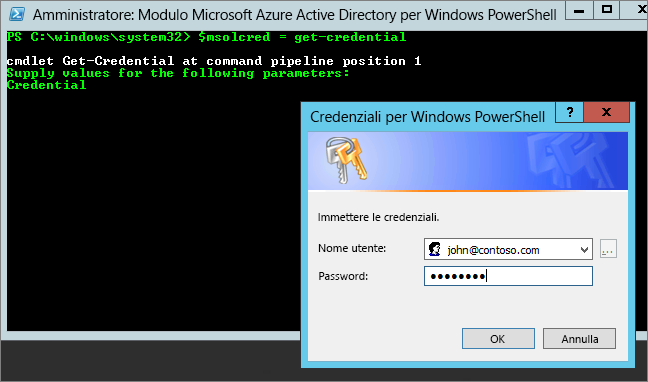

# <a name="administering-power-bi---frequently-asked-questions-faq"></a>Amministrazione di Power BI - Domande frequenti

Questo articolo contiene le risposte alle domande frequenti sull'amministrazione di Power BI. Per una panoramica dell'amministrazione di Power BI, vedere [Che cos'è l'amministrazione di Power BI?](service-admin-administering-power-bi-in-your-organization.md).

## <a name="whats-in-this-article"></a>Contenuto dell'articolo

### <a name="sign-up-for-power-bi-section"></a>Sezione relativa all'iscrizione a Power BI

* [Uso di PowerShell](#using-powershell)
* [In che modo gli utenti si iscrivono a Power BI?](#how-do-users-sign-up-for-power-bi)
* [In che modo si iscrivono i singoli utenti dell'organizzazione?](#how-do-individual-users-in-my-organization-sign-up)
* [Come si può impedire agli utenti di aggiungersi all'attuale tenant di Office 365?](#how-can-i-prevent-users-from-joining-my-existing-office-365-tenant)
* [Come si può consentire agli utenti di aggiungersi al tenant esistente di Office 365?](#how-can-i-allow-users-to-join-my-existing-office-365-tenant)
* [Come si verifica se è attivato il blocco nel tenant?](#how-do-i-verify-if-i-have-the-block-on-in-the-tenant)
* [Come è possibile impedire agli utenti di iniziare a usare Power BI?](#how-can-i-prevent-my-existing-users-from-starting-to-use-power-bi)
* [Come si può consentire agli utenti esistenti di iscriversi a Power BI?](#how-can-i-allow-my-existing-users-to-sign-up-for-power-bi)

### <a name="administration-of-power-bi-section"></a>Sezione relativa all'amministrazione di Power BI

* [Come cambierà la gestione delle identità per gli attuali utenti dell'organizzazione?](#how-will-this-change-the-way-i-manage-identities-for-users-in-my-organization-today)
* [Come si gestisce Power BI?](#how-do-we-manage-power-bi)
* [Qual è la procedura per gestire un tenant creato da Microsoft per gli utenti?](#what-is-the-process-to-manage-a-tenant-created-by-Microsoft-for-my-users)
* [Se si hanno più domini, è possibile controllare il tenant di Office 365 in cui vengono aggiunti gli utenti?](#if-i-have-multiple-domains-can-i-control-the-office-365-tenant-that-users-are-added-to)
* [Come si rimuove Power BI per gli utenti che hanno già effettuato l'iscrizione?](#how-do-i-remove-power-bi-for-users-that-already-signed-up)
* [Come si può sapere se nuovi utenti si aggiungono al tenant?](#how-do-i-know-when-new-users-have-joined-my-tenant)
* [È necessario prepararsi per altro?](#are-there-any-additional-things-i-should-be-prepared-for)
* [Dove si trova il tenant di Power BI?](#where-is-my-power-bi-tenant-located)
* [Che cos'è il Contratto di servizio di Power BI?](#what-is-the-power-bi-sla)

### <a name="security-in-power-bi-section"></a>Sezione relativa alla sicurezza in Power BI

* [Power BI soddisfa i requisiti di conformità nazionali, regionali e specifici del settore?](#does-power-bi-meet-national-regional-and-industry-specific-compliance-requirements)
* [Come funziona la sicurezza in Power BI?](#how-does-security-work-in-power-bi)

## <a name="sign-up-for-power-bi"></a>Iscriversi a Power BI

### <a name="using-powershell"></a>Uso di PowerShell

Alcune delle procedure di questa sezione richiedono gli script di Windows PowerShell. Se no si ha familiarità con PowerShell, vedere [Guida introduttiva a Windows PowerShell](http://go.microsoft.com/fwlink/p/?LinkID=286814). Per eseguire gli script, installare la versione a 64 bit più recente di [Azure Active Directory PowerShell per Graph](/powershell/azure/active-directory/).

### <a name="how-do-users-sign-up-for-power-bi"></a>In che modo gli utenti si iscrivono a Power BI?

Un amministratore può iscriversi a Power BI tramite il [sito Web di Power BI](https://powerbi.microsoft.com) o la pagina per l'[acquisto dei servizi](https://admin.microsoft.com/AdminPortal/Home#/catalog) nell'interfaccia di amministrazione di Office 365. Quando un amministratore si iscrive a Power BI, può poi assegnare le licenze utente agli utenti che devono avere accesso al servizio.

Anche i singoli utenti dell'organizzazione potrebbero essere in grado di iscriversi a Power BI tramite il [sito web di Power BI](https://powerbi.microsoft.com). Agli utenti dell'organizzazione che si iscrivono Power BI viene assegnata automaticamente una licenza di Power BI. Per altre informazioni, vedere [Iscrizione a Power BI come utente singolo](service-self-service-signup-for-power-bi.md) e [Gestione delle licenze di Power BI nell'organizzazione](service-admin-licensing-organization.md).

### <a name="how-do-individual-users-in-my-organization-sign-up"></a>In che modo si iscrivono i singoli utenti dell'organizzazione?

Esistono tre possibili scenari:

* **Scenario 1**: l'organizzazione ha già un ambiente di Office 365 e l'utente che effettua l'iscrizione a Power BI ha già un account di Office 365.
    In questo scenario, se un utente ha già un account aziendale o dell'istituto di istruzione nel tenant (ad esempio contoso.com) ma non ha ancora Power BI, Microsoft attiva semplicemente il piano per tale account e l'utente riceve automaticamente una notifica relativa alle modalità per usare il servizio Power BI.

* **Scenario 2**: l'organizzazione ha un ambiente di Office 365, ma l'utente che effettua l'iscrizione a Power BI non ha un account di Office 365.
    In questo scenario, l'utente ha un indirizzo di posta elettronica nel dominio dell'organizzazione (ad esempio, contoso.com) ma non ha ancora un account Office 365. In questo caso, l'utente può iscriversi a Power BI e gli viene assegnato automaticamente un account. Ciò consente all'utente di accedere al servizio Power BI. Ad esempio, se una dipendente di nome Nancy esegue l'iscrizione usando il suo indirizzo di posta elettronica aziendale, come nancy@contoso.com, Microsoft aggiunge automaticamente Nancy come utente nell'ambiente di Office 365 di Contoso e attiva Power BI per quell'account.

* **Scenario 3**: l'organizzazione non ha un ambiente di Office 365 connesso al proprio dominio di posta elettronica.
    L'organizzazione non deve intraprendere alcuna azione amministrativa per poter usufruire di Power BI. Gli utenti vengono aggiunti a una nuova directory di utenti solo cloud e si ha la possibilità di scegliere se assumere il ruolo di amministratore del tenant per gestirli.

> [!IMPORTANT]
> Se l'organizzazione ha più domini di posta elettronica e si preferisce che tutte le estensioni degli indirizzi di posta elettronica siano incluse nello stesso tenant, aggiungere tutti i domini di indirizzi di posta elettronica a un tenant di Azure Active Directory prima dell'iscrizione di qualsiasi utente. Non esiste alcun meccanismo automatizzato per trasferire gli utenti tra tenant dopo la creazione. Per altre informazioni su questo processo, vedere [Se si hanno più domini, è possibile controllare il tenant di Office 365 in cui vengono aggiunti gli utenti?](#if-i-have-multiple-domains-can-i-control-the-office-365-tenant-that-users-are-added-to) più avanti in questo articolo e [Aggiungere un dominio a Office 365](/office365/admin/setup/add-domain/).

### <a name="how-can-i-prevent-users-from-joining-my-existing-office-365-tenant"></a>Come si può impedire agli utenti di aggiungersi all'attuale tenant di Office 365?

Questa è la procedura che un amministratore può eseguire per impedire agli utenti di aggiungersi al tenant di Office 365 esistente. Se si blocca l'accesso, i tentativi di iscrizione degli utenti hanno esito negativo e gli utenti vengono invitati a contattare l'amministratore dell'organizzazione. Non è necessario ripetere questa procedura se è già stata disabilitata la distribuzione automatica delle licenze (ad esempio tramite Office 365 Education per studenti, docenti e istituti di istruzione).

Usare lo script di PowerShell seguente per impedire ai nuovi utenti di aggiungersi a un tenant gestito. [Altre informazioni su PowerShell](#basic-powershell-information)

```powershell
$msolcred = get-credential
connect-msolservice -credential $msolcred

Set-MsolCompanySettings -AllowEmailVerifiedUsers $false
```

> [!NOTE]
> Bloccando l'accesso si impedisce ai nuovi utenti dell'organizzazione di iscriversi a Power BI. Gli utenti che si iscrivono a Power BI prima della disabilitazione delle nuove iscrizioni per l'organizzazione mantengono le proprie licenze. Per rimuovere un utente, vedere [Come si rimuove Power BI per gli utenti che hanno già effettuato l'iscrizione?](#how-do-i-remove-power-bi-for-users-that-already-signed-up), più avanti in questo articolo.

### <a name="how-can-i-allow-users-to-join-my-existing-office-365-tenant"></a>Come si può consentire agli utenti di aggiungersi al tenant esistente di Office 365?

Usare lo script di PowerShell seguente per consentire ai nuovi utenti di aggiungersi a un tenant gestito. [Altre informazioni su PowerShell](#basic-powershell-information)

```powershell
$msolcred = get-credential
connect-msolservice -credential $msolcred

Set-MsolCompanySettings -AllowEmailVerifiedUsers $true
```

### <a name="how-do-i-verify-if-i-have-the-block-on-in-the-tenant"></a>Come si verifica se è attivato il blocco nel tenant?

Usare lo script di PowerShell seguente per verificare le impostazioni. *AllowEmailVerifiedUsers* deve essere false. [Altre informazioni su PowerShell](#basic-powershell-information)

```powershell
$msolcred = get-credential
connect-msolservice -credential $msolcred

Get-MsolCompanyInformation | fl allow*
```

### <a name="how-can-i-prevent-my-existing-users-from-starting-to-use-power-bi"></a>Come è possibile impedire agli utenti di iniziare a usare Power BI?

L'impostazione di Azure AD che controlla questa operazione è **AllowAdHocSubscriptions**. Per la maggior parte dei tenant questa opzione è true, ovvero abilitata. Se Power BI è stato acquistato tramite un partner, l'impostazione potrebbe essere false, ovvero disabilitata.

Usare lo script di PowerShell seguente per disabilitare le sottoscrizioni ad hoc. [Altre informazioni su PowerShell](#basic-powershell-information)

1. Accedere ad Azure Active Directory usando le credenziali di Office 365. La prima riga dello script PowerShell seguente richiede le credenziali. La seconda riga si connette ad Azure Active Directory.

    ```powershell
     $msolcred = get-credential
     connect-msolservice -credential $msolcred
    ```

   

1. Dopo aver eseguito l'accesso, eseguire il comando seguente per vedere come è configurato il tenant.

    ```powershell
     Get-MsolCompanyInformation | fl AllowAdHocSubscriptions
    ```
1. Eseguire il comando seguente per abilitare ($true) o disabilitare ($false) **AllowAdHocSubscriptions**.

    ```powershell
     Set-MsolCompanySettings -AllowAdHocSubscriptions $false
    ```

> [!NOTE]
> Il flag AllowAdHocSubscriptions viene usato per controllare diverse funzionalità utente nell'organizzazione, inclusa la possibilità per gli utenti di iscriversi al servizio Azure Rights Management. La modifica di questo flag ha effetto su tutte queste funzionalità.

### <a name="how-can-i-allow-my-existing-users-to-sign-up-for-power-bi"></a>Come si può consentire agli utenti esistenti di iscriversi a Power BI?

Per consentire agli utenti esistenti di iscriversi a Power BI, eseguire il comando indicato per la domanda precedente, ma passare true invece di false nell'ultimo passaggio.

## <a name="administration-of-power-bi"></a>Amministrazione di Power BI

### <a name="how-will-this-change-the-way-i-manage-identities-for-users-in-my-organization-today"></a>Come cambierà la gestione delle identità per gli attuali utenti dell'organizzazione?

Esistono tre possibili scenari:

* **Scenario 1**: se l'organizzazione ha già un ambiente di Office 365 e tutti gli utenti dell'organizzazione hanno account di Office 365, il processo di gestione delle identità rimane invariato.

* **Scenario 2**: se l'organizzazione ha già un ambiente di Office 365 ma non tutti gli utenti dell'organizzazione hanno account di Office 365, viene creato un utente nel tenant e le licenze vengono assegnate in base all'indirizzo di posta elettronica aziendale o dell'istituto di istruzione dell'utente.

    Questo significa che il numero di utenti da gestire in un determinato momento aumenta man mano che nuovi utenti nell'organizzazione si iscrivono al servizio.

* **Scenario 3**: se l'organizzazione non ha un ambiente di Office 365 connesso al dominio di posta elettronica, la gestione delle identità rimane invariata.

    Gli utenti vengono aggiunti a una nuova directory di utenti solo cloud e si ha la possibilità di scegliere se assumere il ruolo di amministratore del tenant per gestirli.

### <a name="how-do-we-manage-power-bi"></a>Come si gestisce Power BI?

Power BI offre un portale di amministrazione che consente di visualizzare le statistiche di utilizzo, fornisce un collegamento all'interfaccia di amministrazione di Office 365 per gestire utenti e gruppi e offre la possibilità di controllare le impostazioni a livello di tenant.

Per accedere al portale di amministrazione di Power BI, l'account deve essere contrassegnato come **Amministratore globale** in Office 365 o in Azure Active Directory o avere ricevuto il ruolo di amministratore del servizio Power BI. Per altre informazioni, vedere [Informazioni sul ruolo di amministratore di Power BI](service-admin-role.md) e [Portale di amministrazione di Power BI](service-admin-portal.md).

### <a name="what-is-the-process-to-manage-a-tenant-created-by-microsoft-for-my-users"></a>Qual è la procedura per gestire un tenant creato da Microsoft per gli utenti?

Se Microsoft ha creato un tenant, è possibile chiedere di gestirlo eseguendo la procedura seguente:

1. Aggiungersi al tenant iscrivendosi a Power BI usando un dominio di indirizzi di posta elettronica corrispondente al dominio del tenant che si vuole gestire. Se, ad esempio, Microsoft ha creato il tenant contoso.com, è necessario aggiungersi al tenant con un indirizzo di posta elettronica che termina con @contoso.com.

1. Richiedere il controllo di amministratore verificando di essere proprietari del dominio. Dopo l'aggiunta al tenant, è possibile alzarsi di livello al ruolo di *amministratore globale* verificando di essere proprietari del dominio. A tale scopo, seguire la procedura descritta nella [documentazione di Office 365](/office365/admin/misc/become-the-admin).

### <a name="if-i-have-multiple-domains-can-i-control-the-office-365-tenant-that-users-are-added-to"></a>Se si hanno più domini, è possibile controllare il tenant di Office 365 in cui vengono aggiunti gli utenti?

Se non si esegue alcuna operazione, viene creato un tenant per ogni dominio e sottodominio di posta elettronica dell'utente. Se si vuole che tutti gli utenti si trovino nello stesso tenant indipendentemente dalle estensioni dei relativi indirizzi di posta elettronica, creare in anticipo un tenant di destinazione oppure usare un tenant esistente e aggiungere tutti i domini e i sottodomini esistenti da consolidare al suo interno. Tutti gli utenti con indirizzi di posta elettronica che terminano con tali domini e sottodomini vengono automaticamente aggiunti al tenant di destinazione quando effettuano l'iscrizione.

> [!IMPORTANT]
> Non esiste alcun meccanismo automatizzato per spostare gli utenti tra i tenant dopo che sono stati creati. Per informazioni sull'aggiunta di domini a un singolo tenant di Office 365, vedere [Aggiungere utenti e dominio in Office 365](/office365/admin/setup/add-domain/).

### <a name="how-do-i-remove-power-bi-for-users-that-already-signed-up"></a>Come si rimuove Power BI per gli utenti che hanno già effettuato l'iscrizione?

Se un utente ha effettuato l'iscrizione a Power BI ma non si vuole più consentirgli di accedere al servizio, è possibile rimuovere la licenza di Power BI di tale utente.

1. Accedere all'[interfaccia di amministrazione di Office 365](https://admin.microsoft.com/AdminPortal/Home#/homepage).

1. Nella barra di spostamento a sinistra selezionare **Utenti** > **Utenti attivi**.

1. Trovare l'utente di cui si vuole rimuovere la licenza e selezionare il relativo nome.

    È anche possibile eseguire in blocco la gestione delle licenze per gli utenti. A tale scopo, selezionare più utenti e quindi **Modifica licenze di prodotto**.

1. Nella pagina dei dettagli dell'utente, vicino a **Licenze di prodotto** selezionare **Modifica**.

1. Impostare **Power BI (gratuito)** o **Power BI Pro** su **Disattivato**, a seconda della licenza applicata all'account.

1. Selezionare **Salva**.

### <a name="how-do-i-know-when-new-users-have-joined-my-tenant"></a>Come si può sapere se nuovi utenti si aggiungono al tenant?

Ai nuovi utenti che si aggiungono al tenant nell'ambito di questo programma viene assegnata una licenza univoca che è possibile filtrare nel riquadro degli utenti attivi del dashboard di amministrazione. Per creare questa nuova visualizzazione, seguire questi passaggi.

1. Accedere all'[interfaccia di amministrazione di Office 365](https://admin.microsoft.com/AdminPortal/Home#/homepage).

1. Nella barra di spostamento a sinistra selezionare **Utenti** > **Utenti attivi**.

1. Dal menu **Visualizzazioni** scegliere **Aggiungi visualizzazione personalizzata**.

1. Assegnare un nome alla nuova visualizzazione e in **Licenza di prodotto assegnata** selezionare **Power BI (gratuito)** o **Power BI Pro**.

    È possibile selezionare una sola licenza per ogni visualizzazione. Se nell'organizzazione sono disponibili sia licenze di **Power BI (gratuito)** che di **Power BI Pro**, è possibile creare due visualizzazioni.

1. Immettere eventuali altre condizioni desiderate e quindi selezionare **Aggiungi**.

1. Dopo essere stata creata, la nuova visualizzazione è disponibile nel menu **Visualizzazioni**.

### <a name="are-there-any-additional-things-i-should-be-prepared-for"></a>È necessario prepararsi per altro?

Si potrebbe riscontrare un aumento di richieste di reimpostazione delle password. Per informazioni su questo processo, vedere [Reimpostare la password di un utente](/office365/admin/add-users/reset-passwords).

È possibile rimuovere un utente dal tenant tramite il processo standard nell'interfaccia di amministrazione di Office 365. Se tuttavia l'utente ha ancora un indirizzo di posta elettronica attivo dell'organizzazione, può aggiungersi di nuovo, a meno che non si impedisca a tutti gli utenti di aggiungersi.

### <a name="where-is-my-power-bi-tenant-located"></a>Dove si trova il tenant di Power BI?

Per informazioni sull'area dati in cui si trova il tenant di Power BI, vedere [Dove si trova il tenant di Power BI?](service-admin-where-is-my-tenant-located.md).

### <a name="what-is-the-power-bi-sla"></a>Che cos'è il Contratto di servizio di Power BI?

Per informazioni sul contratto di servizio di Power BI, vedere l'articolo [Licensing Terms and Documentation](http://www.microsoftvolumelicensing.com/DocumentSearch.aspx?Mode=3&DocumentTypeId=37) (Condizioni e documentazione per le licenze) nella sezione **Licensing** (Licenze) del sito Web Microsoft Licensing.

## <a name="security-in-power-bi"></a>Sicurezza in Power BI

### <a name="does-power-bi-meet-national-regional-and-industry-specific-compliance-requirements"></a>Power BI soddisfa i requisiti di conformità nazionali, regionali e specifici del settore?

Per altre informazioni sulla conformità di Power BI, vedere [Microsoft Trust Center](http://go.microsoft.com/fwlink/?LinkId=785324).

### <a name="how-does-security-work-in-power-bi"></a>Come funziona la sicurezza in Power BI?

Power BI è basato su Office 365, che a sua volta è basato su servizi di Azure quali Azure Active Directory. Per una panoramica dell'architettura di Power BI, vedere [Sicurezza di Power BI](service-admin-power-bi-security.md).

## <a name="next-steps"></a>Passaggi successivi

[Portale di amministrazione di Power BI](service-admin-portal.md)  
[Informazioni sul ruolo di amministratore di Power BI](service-admin-role.md)  
[Iscrizione a Power BI in modalità self-service](service-self-service-signup-for-power-bi.md)  
[Acquisto di Power BI Pro](service-admin-purchasing-power-bi-pro.md)  
[Che cos'è Power BI Premium?](service-premium.md)  
[How to purchase Power BI Premium](service-admin-premium-purchase.md) (Come acquistare Power BI Premium)  
[White paper su Power BI Premium](https://aka.ms/pbipremiumwhitepaper)  
[Gestire il gruppo in Power BI e Office 365](service-manage-app-workspace-in-power-bi-and-office-365.md)  
[Gestione degli account utente in Office 365](/office365/servicedescriptions/office-365-platform-service-description/user-account-management/)  
[Gestione dei gruppi in Office 365](/office365/admin/email/create-edit-or-delete-a-security-group/)  

Altre domande? [Provare a rivolgersi alla community di Power BI](http://community.powerbi.com/)
