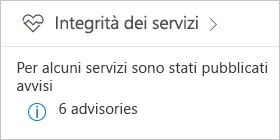
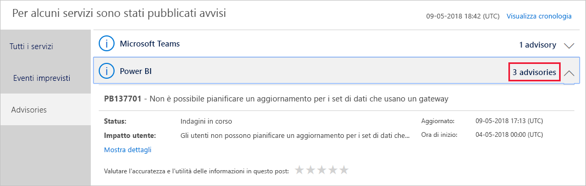
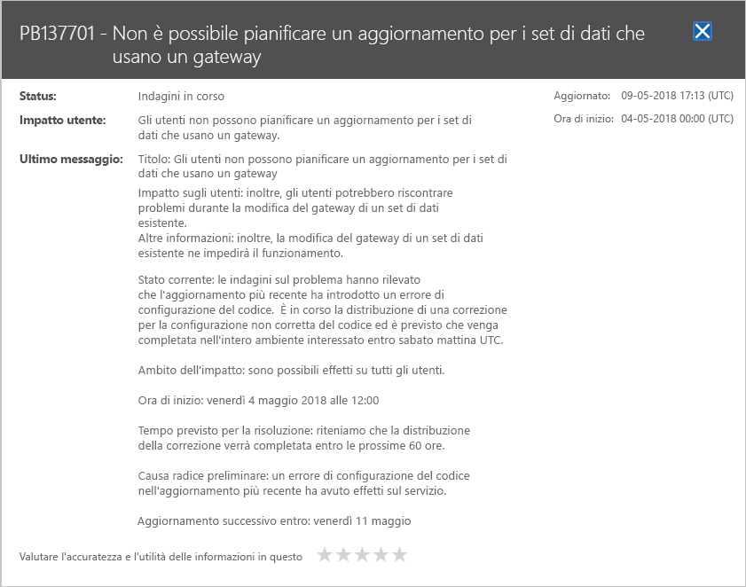

# Tenere traccia dell'integrità del servizio Power BI in Office 365

L'interfaccia di amministrazione di Microsoft 365 offre strumenti importanti per gli amministratori di Power BI. Gli strumenti includono informazioni correnti e cronologiche sull'integrità dei servizi. Per accedere alle informazioni sull'integrità dei servizi è necessario appartenere a uno dei ruoli seguenti:

* Amministratore del servizio Power BI

* Amministratore globale di Office 365

Per altre informazioni sui ruoli, vedere [Ruoli di amministratore correlati a Power BI](service-admin-administering-power-bi-in-your-organization.md#administrator-roles-related-to-power-bi).

1. Accedere all'[interfaccia di amministrazione di Microsoft 365](https://portal.office.com/adminportal).

1. Nel riquadro di spostamento selezionare **Mostra tutto** > **Integrità** > **Integrità del servizio**. Viene visualizzata la pagina Integrità del servizio:

    

1. Nell'elenco **Tutti i servizi** selezionare **Avvisi** o **Eventi imprevisti** ed esaminare i risultati. Nello screenshot seguente è visibile uno dei tre avvisi attivi.

    

1. Per altre informazioni, selezionare **Mostra dettagli** per un elemento. Nello screenshot seguente sono visibili dettagli aggiuntivi, tra cui gli aggiornamenti di stato recenti.

    

    Scorrere verso il basso per visualizzare altre informazioni, chiudere il riquadro al termine.

1. Per visualizzare informazioni cronologiche per tutti i servizi, nell'angolo superiore destro della pagina **Integrità del servizio** selezionare **Visualizza cronologia**. Quindi selezionare **Ultimi 7 giorni** oppure **Ultimi 30 giorni**. 

1. Per tornare all'integrità del servizio corrente, selezionare **Visualizza lo stato corrente**.