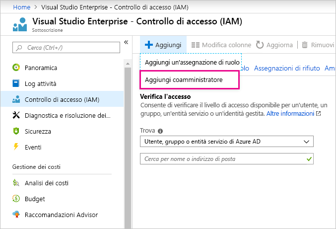

# Uso dello stesso account per Power BI e Azure

Se si usa sia Power BI che Azure, è preferibile usare lo stesso account di accesso per entrambi i servizi in modo da non dover digitare la password due volte.

Per accedere a Power BI viene usato l'account aziendale, associato all'indirizzo di posta elettronica aziendale o dell'istituto di istruzione.  Per accedere ad Azure viene invece usato un account Microsoft o l'account aziendale.

Se si vuole usare lo stesso account di accesso sia per Azure che per Power BI, assicurarsi di accedere ad Azure con l'account aziendale.

**Che succede se per l'accesso ad Azure si usa già l'account Microsoft?**

È possibile aggiungere l'account aziendale come coamministratore in Azure seguendo questa procedura:

1. Accedere al [portale di Azure](https://portal.azure.com/). Se si è utente di più directory di Azure, selezionare **Sottoscrizioni** e quindi filtrare in modo da visualizzare solo la directory e le sottoscrizioni da modificare.

1. Nel riquadro di spostamento selezionare **Controllo di accesso (IAM)** e quindi selezionare **Aggiungi** \> **Aggiungi coamministratore**.

    

1. Immettere l'indirizzo di posta elettronica associato all'account aziendale e selezionare **Aggiungi**.

1. Al successivo accesso al portale di Azure usare l'indirizzo di posta elettronica aziendale.

Altre domande? [Provare la community di Power BI](https://community.powerbi.com/)
