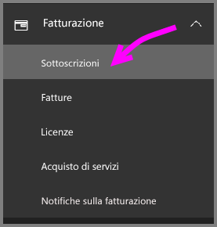
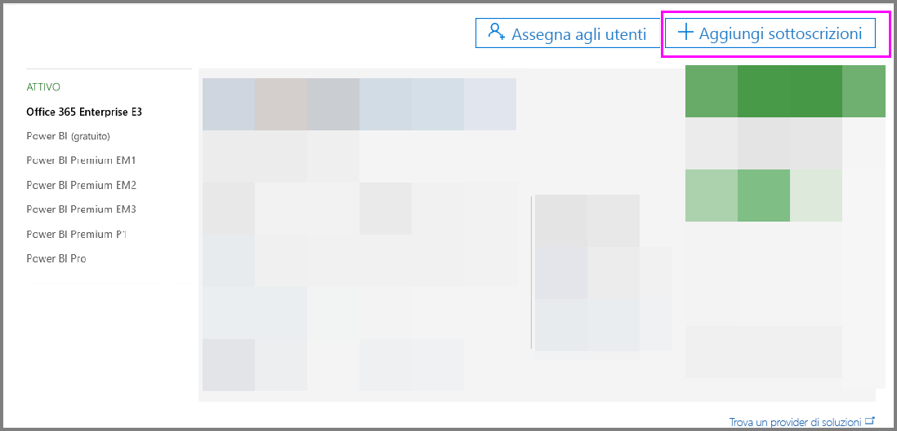
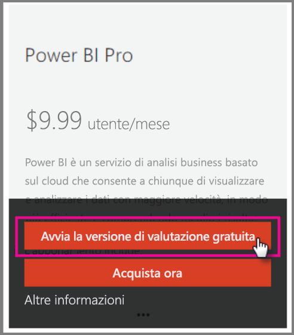
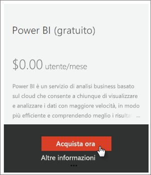
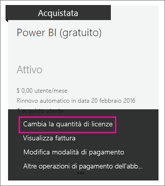

# <a name="power-bi-licensing-in-your-organization"></a>Gestione delle licenze di Power BI nell'organizzazione

[!INCLUDE [license-capabilities](includes/license-capabilities.md)]

Questo articolo è incentrato sulle licenze per utente descritte dalla prospettiva dell'amministratore.

## <a name="manage-power-bi-pro-licenses"></a>Gestire le licenze Power BI Pro

L'amministratore può acquistare e assegnare le licenze Power BI Pro e iscriversi a una versione di valutazione di Power BI Pro per la propria organizzazione. Anche i singoli utenti possono iscriversi a una versione di valutazione di Power BI Pro.

### <a name="purchase-power-bi-pro-licenses"></a>Acquistare licenze di Power BI Pro

Come amministratore, è possibile acquistare le licenze di Power BI Pro tramite Microsoft 365 o rivolgendosi a un partner Microsoft certificato. Dopo aver acquistato le licenze, assegnarle ai singoli utenti. Per altre informazioni, vedere [Acquistare e assegnare licenze Power BI Pro](service-admin-purchasing-power-bi-pro.md).

### <a name="power-bi-pro-license-expiration"></a>Scadenza della licenza di Power BI Pro

È previsto un periodo di tolleranza dopo la scadenza di una licenza di Power BI Pro. Per le licenze che fanno parte dell'acquisto di un contratto multilicenza, il periodo di tolleranza è 90 giorni. Se la licenza è stata acquistata direttamente, il periodo di tolleranza è di 30 giorni.

Power BI Pro ha lo stesso ciclo di vita della sottoscrizione di Office 365. Per altre informazioni, vedere [Che cosa succede ai dati e all'accesso al termine della sottoscrizione di Office 365 per le aziende](https://support.office.com/article/What-happens-to-my-data-and-access-when-my-Office-365-for-business-subscription-ends-4436582f-211a-45ec-b72e-33647f97d8a3).

### <a name="power-bi-pro-trial-for-individuals"></a>Versione di valutazione di Power BI Pro per utenti singoli

I singoli utenti dell'organizzazione possono iscriversi a una versione di valutazione di Power BI Pro. Per altre informazioni, vedere [Iscrizione a Power BI come utente singolo](service-self-service-signup-for-power-bi.md).

Gli utenti che usano la versione di valutazione di Power BI Pro inclusa nel prodotto per utenti singoli non vengono visualizzati nell'interfaccia di amministrazione di Microsoft 365 come utenti della versione di valutazione Power BI Pro, ma come utenti del piano gratuito di Power BI. Verranno tuttavia visualizzati come utenti della versione di valutazione di Power BI Pro nella pagina Gestisci archiviazione di Power BI.

### <a name="power-bi-pro-trial-for-organizations"></a>Versione di valutazione di Power BI Pro per le organizzazioni

Se si vogliono acquisire e distribuire le licenze della versione di valutazione di Power BI a più utenti dell'organizzazione senza che i singoli utenti accettino individualmente le condizioni della versione di valutazione, iscriversi a una versione di valutazione di Power BI Pro per l'organizzazione.

Prima di seguire i passaggi per l'iscrizione, tenere presente quanto segue:

* Per iscriversi, è necessario essere membri del ruolo [**Amministratore globale** o **Amministratore fatturazione**](https://support.office.com/article/about-office-365-admin-roles-da585eea-f576-4f55-a1e0-87090b6aaa9d) in Microsoft 365.

* È previsto un limite di una versione di valutazione aziendale per ogni tenant. Ciò significa che se un utente ha già applicato Power BI Pro - Versione di valutazione al tenant, non è possibile ripetere l'operazione. Se è necessaria assistenza a tal riguardo, contattare il [supporto per la fatturazione di Office 365](https://support.office.microsoft.com/article/contact-support-for-business-products-admin-help-32a17ca7-6fa0-4870-8a8d-e25ba4ccfd4b?CorrelationId=552bbf37-214f-4202-80cb-b94240dcd671).

1. Passare all'[interfaccia di amministrazione di Microsoft 365](https://portal.office.com/adminportal/home#/homepage).

1. Nel riquadro di spostamento a sinistra, selezionare **Fatturazione** e quindi **Sottoscrizioni**.

   

1. Selezionare **Aggiungi abbonamento** a destra.

   

1. In **Altri piani** passare il cursore sui puntini di sospensione ( **...** ) per Power BI Pro e selezionare **Avvia versione di valutazione gratuita**.

    

1. Nella schermata di conferma dell'ordine selezionare **Prova adesso**.

1. Selezionare **Continua** alla ricezione dell'ordine.

È ora possibile [assegnare licenze in Office 365](https://support.office.com/article/assign-licenses-to-users-in-office-365-for-business-997596b5-4173-4627-b915-36abac6786dc).

## <a name="manage-power-bi-free-licenses"></a>Gestire le licenze gratuite di Power BI

Gli utenti all'interno dell'organizzazione possono accedere alle licenze gratuite di Power BI in due modi diversi:

* È possibile assegnare una licenza di Power BI agli utenti all'interno dell'interfaccia di amministrazione di Microsoft 365.

* Se un utente [effettua l'iscrizione per un account di Power BI](service-self-service-signup-for-power-bi.md) gli viene assegnata una licenza gratuita.

### <a name="requesting-and-assigning-free-licenses"></a>Richiesta e assegnazione di licenze gratuite

Se si prevede di gestire centralmente le richieste e le assegnazioni delle licenze, verificare prima di avere già il blocco delle licenze Power BI (gratuito) senza limiti nel tenant.

Il blocco delle licenze è disponibile la prima volta in cui qualcuno tenta di iscriversi a Power BI come utente singolo. Durante questo processo, il blocco delle licenze viene associato all'organizzazione e viene assegnata una licenza all'utente che sta eseguendo l'iscrizione.

1. Nell'interfaccia di amministrazione di Microsoft 365, in **Fatturazione** > **Licenze**, verificare che sia presente **illimitato**.

    

1. Se il blocco è disponibile, è ora possibile [assegnare le licenze in Office 365](https://support.office.com/article/assign-licenses-to-users-in-office-365-for-business-997596b5-4173-4627-b915-36abac6786dc). Se il blocco non è disponibile, sono disponibili due opzioni:

    * Fare in modo che un membro dell'organizzazione si iscriva singolarmente, attivando così la creazione del blocco illimitato.

    * Passare alla procedura successiva, in cui è possibile iscriversi per un numero fisso di licenze.

Se il blocco delle licenze di Power BI (gratuito) illimitato non è disponibile e non si vuole che un singolo utente esegua l'iscrizione, seguire la procedura descritta di seguito.

1. Passare all'[interfaccia di amministrazione di Microsoft 365](https://portal.office.com/admin/default.aspx).

1. Nel riquadro di spostamento a sinistra selezionare **Fatturazione** > **Abbonamenti**.

1. Selezionare **Aggiungi abbonamenti** a destra.

1. In **Altri piani** passare il puntatore del mouse sui puntini di sospensione ( **...** ) per Power BI (gratuito) e selezionare **Acquista ora**.

    

1. Immettere il numero di licenze da aggiungere e selezionare **Procedi al pagamento** oppure **Aggiungi al carrello**.

1. Immettere le informazioni necessarie nel flusso di pagamento.

    Non si esegue alcun acquisto quando si utilizza questo approccio, anche se è necessario immettere i dati della carta di credito per la fatturazione o scegliere di ricevere una fattura.

1. È ora possibile [assegnare licenze in Office 365](https://support.office.com/article/assign-licenses-to-users-in-office-365-for-business-997596b5-4173-4627-b915-36abac6786dc).

1. Se in seguito si decide di aggiungere altre licenze, è possibile tornare ad **Aggiungi abbonamenti** e selezionare **Cambia la quantità di licenze** per Power BI (gratuito).

    

### <a name="enable-or-disable-individual-user-sign-up-in-azure-active-directory"></a>Abilitare o disabilitare l'iscrizione di utenti singoli in Azure Active Directory

L'amministratore può abilitare o disabilitare le iscrizioni come utente singolo in Azure Active Directory (AAD). Questa sezione dell'articolo illustra come gestire le iscrizioni con i comandi di PowerShell. Per altre informazioni su Azure PowerShell, vedere [Panoramica di Azure PowerShell](/powershell/azure/overview).

L'impostazione di Azure Active Directory che controlla l'iscrizione è **AllowAdHocSubscriptions**. Nella maggior parte dei tenant questa opzione è impostata su *true*, il che significa che è abilitata. Se Power BI è stato acquistato tramite un partner, è possibile che questa opzione sia impostata su *false*, il che significa che è disabilitata. Se si modifica l'impostazione da *true* a *false*, ai nuovi utenti dell'organizzazione viene impedito di eseguire l'iscrizione singolarmente. Gli utenti iscritti a Power BI prima della modifica dell'impostazione mantengono le proprie licenze. Si noti che con l'impostazione *false* gli utenti con una licenza di Power BI (gratuito) possono comunque iscriversi per una singola versione di valutazione di Power BI Pro.

1. Accedere ad Azure Active Directory usando le credenziali di Microsoft 365. La prima riga dello script PowerShell seguente richiede le credenziali. La seconda riga si connette ad Azure Active Directory.

    ```powershell
     $msolcred = get-credential
     connect-msolservice -credential $msolcred
    ```

   

1. Dopo aver eseguito l'accesso, eseguire il comando seguente per vedere come è configurato il tenant. Si noti che 'fl' di seguito usa la lettera "l", non il numero 1.

    ```powershell
     Get-MsolCompanyInformation | fl AllowAdHocSubscriptions 
    ```
1. Eseguire il comando seguente per abilitare ($true) o disabilitare ($false) **AllowAdHocSubscriptions**.

    ```powershell
     Set-MsolCompanySettings -AllowAdHocSubscriptions $true
    ```

> [!NOTE]
> Il flag AllowAdHocSubscriptions viene usato per controllare diverse funzionalità utente nell'organizzazione, inclusa la possibilità per gli utenti di iscriversi al servizio Azure Rights Management. La modifica di questo flag ha effetto su tutte queste funzionalità.

## <a name="next-steps"></a>Passaggi successivi

[Iscrizione a Power BI in modalità self-service](service-self-service-signup-for-power-bi.md)  

[Acquistare e assegnare licenze Power BI Pro](service-admin-purchasing-power-bi-pro.md)

Altre domande? [Provare a rivolgersi alla community di Power BI](http://community.powerbi.com/)
