# Configurare app per dispositivi mobili con Microsoft Intune
Microsoft Intune consente alle organizzazioni di gestire dispositivi e applicazioni. Le applicazioni Power BI per dispositivi mobili, per iOS e Android, si integrano con Intune per consentire la gestione dell'applicazione nei dispositivi e il controllo della sicurezza. Attraverso i criteri di configurazione, è possibile controllare aspetti come la richiesta di un PIN di accesso, la modalità di gestione dei dati nell'applicazione e anche la crittografia dei dati dell'applicazione quando l'app non è in uso.

<iframe width="560" height="315" src="https://www.youtube.com/embed/9HF-qsdQvHw?list=PLv2BtOtLblH1nPVPU2etFzTNmpz49dwXm" frameborder="0" allowfullscreen></iframe>

## Configurazione generale della gestione di dispositivi mobili
Questo articolo non è inteso come guida completa alla configurazione di Microsoft Intune. Se si sta implementando l'integrazione con Intune, ci sono alcuni aspetti da verificare per quanto riguarda la configurazione. [Altre informazioni](https://technet.microsoft.com/library/jj676587.aspx)

Microsoft Intune può coesistere con MDM (Mobile Device Management, Gestione dei dispositivi mobili) in Office 365. [Altre informazioni](https://blogs.technet.microsoft.com/configmgrdogs/2016/01/04/microsoft-intune-co-existence-with-mdm-for-office-365/)

Questo articolo presuppone che Intune sia configurato correttamente e che ci siano dispositivi registrati con Intune. In caso di coesistenza con MDM, il dispositivo apparirà come registrato in MDM, ma è disponibile per la gestione in Intune.

> [!NOTE]
> Dopo che l'organizzazione ha configurato Microsoft Intune MAM, se si usa l'app Power BI per dispositivi mobili in un dispositivo iOS o Android l'aggiornamento dati in background è disattivato. La volta successiva che si accede all'app, Power BI aggiorna i dati dal servizio Power BI sul Web.
> 
> 

## Passaggio 1: Ottenere l'URL per l'applicazione
Prima di creare l'applicazione in Intune, è necessario ottenere gli URL per le app. Per iOS, è possibile ottenere l'URL da iTunes. Per Android, è possibile ottenere l'URL dalla pagina di Power BI per dispositivi mobili.

Salvare l'URL, che sarà necessario quando si crea l'applicazione.

### iOS
Per ottenere l'URL dell'app per iOS, è necessario usare iTunes.

1. Aprire iTunes.
2. Cercare *Power BI*.
3. Nelle sezioni **Applicazioni per iPhone** e **Applicazioni per iPad** dovrebbe essere visualizzata l'app **Microsoft Power BI**. È possibile usare una delle due app a scelta, in quanto l'URL ottenuto sarà lo stesso.
4. Nell'elenco a discesa **Ottieni** selezionare **Copia il link**.
   
    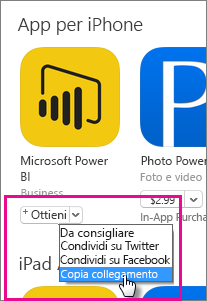

L'URL dovrebbe essere simile a quello indicato di seguito.

    https://itunes.apple.com/us/app/microsoft-power-bi/id929738808?mt=8

### Android
È possibile ottenere l'URL per Google Play dalla [pagina di Power BI per dispositivi mobili](https://powerbi.microsoft.com/mobile/). Facendo clic sull'icona **Scarica da Google Play** , verrà visualizzata la pagina dell'app. È possibile copiare l'URL dalla barra degli indirizzi del browser. L'URL dovrebbe essere simile a quello indicato di seguito.

    https://play.google.com/store/apps/details?id=com.microsoft.powerbim

## Passaggio 2: Creare criteri di gestione delle applicazioni per dispositivi mobili
I criteri di gestione delle applicazioni per dispositivi mobili consentono di imporre elementi come un PIN di accesso. È possibile creare i criteri nel portale di Intune. 

È possibile creare prima i criteri oppure l'applicazione. L'ordine di aggiunta non è importante. È sufficiente che sia i criteri sia l'applicazione siano disponibili per il passaggio di distribuzione.

1. Selezionare **Criteri** > **Criteri di configurazione**.
   
    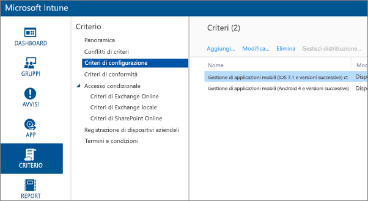
2. Selezionare **Aggiungi**.
3. In **Software** è possibile selezionare Gestione di applicazioni mobili per Android o iOS. Per iniziare rapidamente, è possibile selezionare **Crea criteri con le impostazioni consigliate**oppure è possibile creare criteri personalizzati.
4. Modificare i criteri per configurare le restrizioni da implementare nell'applicazione.

## Passaggio 3: Creare l'applicazione
L'applicazione è un riferimento, o un pacchetto, salvato in Intune per la distribuzione. Sarà necessario creare un'applicazione e fare riferimento all'URL dell'app ottenuto da Google Play o da iTunes.

È possibile creare prima i criteri oppure l'applicazione. L'ordine di aggiunta non è importante. È sufficiente che sia i criteri sia l'applicazione siano disponibili per il passaggio di distribuzione.

1. Passare al portale di Intune e scegliere **App** dal menu a sinistra.
2. Selezionare **Aggiungi app**. Verrà avviata l'applicazione **Aggiungi software** .

### iOS
1. Selezionare **App iOS gestita dall'App Store** nell'elenco a discesa.
2. Immettere l'URL dell'app ottenuto nel [passaggio 1](#step-1-get-the-url-for-the-application) e fare clic su **Avanti**.
   
    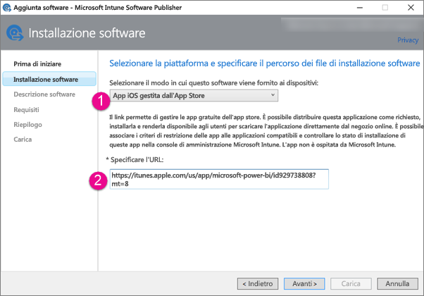
3. Specificare **Autore**, **Nome** e **Descrizione**. Facoltativamente, è possibile specificare un valore per **Icona**. **Categoria** è per l'app del portale aziendale. Al termine, fare clic su **Avanti**.
4. Come piattaforma per la pubblicazione dell'app è possibile scegliere tra **Qualsiasi** (impostazione predefinita), **iPad** o **iPhone**. L'impostazione predefinita è **Qualsiasi** , adatta per entrambi i tipi di dispositivi. L'URL dell'app Power BI per iPhone e per iPad è lo stesso. Fare clic su **Avanti**.
5. Selezionare **Carica**.

> [!NOTE]
> Per visualizzare l'app nell'elenco, potrebbe essere necessario aggiornare la pagina. Per ricaricare la pagina, è possibile fare clic su **Panoramica** e quindi di nuovo su **App** .
> 
> 

### Android
1. Selezionare **Collegamento esterno** nell'elenco a discesa.
2. Immettere l'URL dell'app ottenuto nel [passaggio 1](#step-1-get-the-url-for-the-application) e fare clic su **Avanti**.
   
    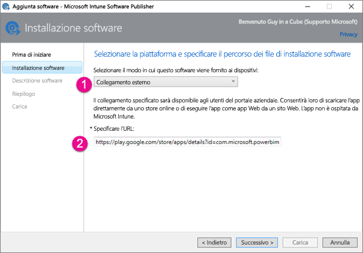
3. Specificare **Autore**, **Nome** e **Descrizione**. Facoltativamente, è possibile specificare un valore per **Icona**. **Categoria** è per l'app del portale aziendale. Al termine, fare clic su **Avanti**.
4. Selezionare **Carica**.

> [!NOTE]
> Per visualizzare l'app nell'elenco, potrebbe essere necessario aggiornare la pagina. Per ricaricare la pagina, è possibile fare clic su **Panoramica** e quindi di nuovo su **App** .
> 
> 

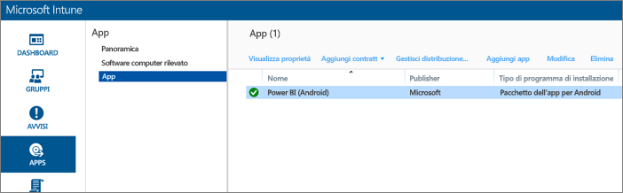

## Passaggio 4: Distribuire l'applicazione
Dopo aver aggiunto l'applicazione, è necessario distribuirla in modo da renderla disponibile per gli utenti finali. In questo passaggio si assoceranno i criteri creati con l'app.

### iOS
1. Nella schermata delle app selezionare l'app creata. Selezionare quindi il collegamento **Gestisci distribuzione** .
   
    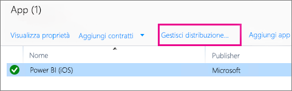
2. Nella schermata **Seleziona gruppi** è possibile scegliere i gruppi a cui distribuire l'app. Fare clic su **Avanti**.
3. Nella schermata **Azione di distribuzione** è possibile scegliere come distribuire l'app. Selezionando **Installazione disponibile**o **Installazione richiesta**è possibile rendere disponibile l'app nel portale aziendale, per consentire agli utenti di installarla su richiesta. Dopo aver scelto l'opzione desiderata, fare clic su **Avanti**.
   
    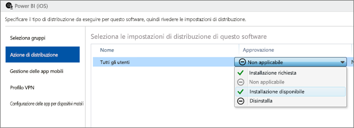
4. Nella schermata **Gestione delle app mobili** è possibile selezionare i criteri di gestione delle app per dispositivi mobili creati nel [passaggio 2](#step-2-create-a-mobile-application-management-policy). I criteri creati verranno visualizzati per impostazione predefinita, se sono gli unici disponibili per iOS. Fare clic su **Avanti**.
   
    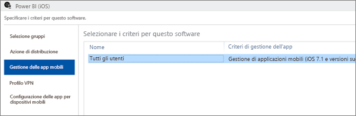
5. Nella schermata **Profilo VPN** è possibile selezionare i criteri per l'organizzazione, se disponibili. L'opzione predefinita è **Nessuno**. Fare clic su **Avanti**.
6. Nella schermata **Configurazione delle app per dispositivi mobili** è possibile selezionare **Criteri di configurazione dell'app** , se sono stati creati criteri. L'opzione predefinita è **Nessuno**. Questa operazione non è obbligatoria. Fare clic su **Fine**.

Dopo che l'app è stata distribuita, nella pagina delle app dovrebbe venire visualizzata l'indicazione **Sì** per confermarne la distribuzione.

### Android
1. Nella schermata delle app selezionare l'app creata. Selezionare quindi il collegamento **Gestisci distribuzione** .
   
    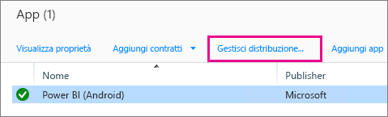
2. Nella schermata **Seleziona gruppi** è possibile scegliere i gruppi a cui distribuire l'app. Fare clic su **Avanti**.
3. Nella schermata **Azione di distribuzione** è possibile scegliere come distribuire l'app. Selezionando **Installazione disponibile**o **Installazione richiesta**è possibile rendere disponibile l'app nel portale aziendale, per consentire agli utenti di installarla su richiesta. Dopo aver scelto l'opzione desiderata, fare clic su **Avanti**.
   
    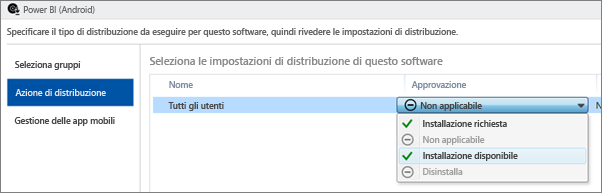
4. Nella schermata **Gestione delle app mobili** è possibile selezionare i criteri di gestione delle app per dispositivi mobili creati nel [passaggio 2](#step-2-create-a-mobile-application-management-policy). I criteri creati verranno visualizzati per impostazione predefinita, se sono gli unici disponibili per Android. Fare clic su **Fine**.
   
    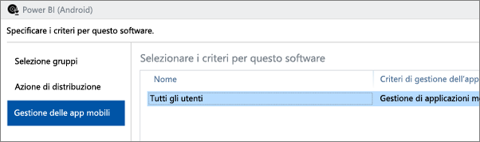

Dopo che l'app è stata distribuita, nella pagina delle app dovrebbe venire visualizzata l'indicazione **Sì** per confermarne la distribuzione.

## Passaggio 5: Installare l'applicazione in un dispositivo
L'applicazione verrà installata usando l'app del portale aziendale. Se il portale aziendale non è stato installato, è possibile ottenere l'app dallo store per la piattaforma iOS o Android. Accedere al portale aziendale con l'account di accesso aziendale.

1. Aprire l'app del portale aziendale.
2. Se l'app Power BI non è elencata nella sezione App in evidenza, selezionare **App aziendali**.
   
    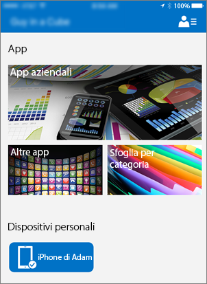
3. Selezionare l'app Power BI distribuita.
   
    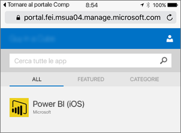
4. Selezionare **Installa**.
   
    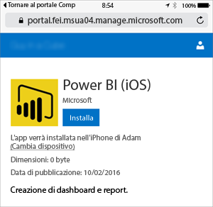
5. Se si usa iOS, verrà effettuato il push dell'app. Selezionare **Installa** nella finestra di dialogo relativa al push.
   
    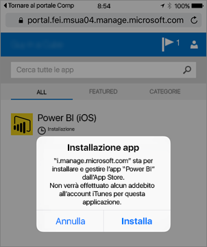

Dopo l'installazione, verrà visualizzata l'indicazione **Gestito dall'azienda**. Se nei criteri è stato abilitato l'accesso con un PIN, verrà visualizzata una schermata come quella illustrata di seguito.

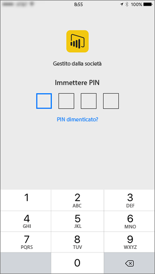

## Passaggi successivi
[Configurare e distribuire criteri di gestione delle applicazioni per dispositivi mobili nella console di Microsoft Intune](https://technet.microsoft.com/library/dn878026.aspx)  
[App Power BI per dispositivi mobili](mobile-apps-for-mobile-devices.md)  

Altre domande? [Provare a rivolgersi alla community di Power BI](http://community.powerbi.com/)

