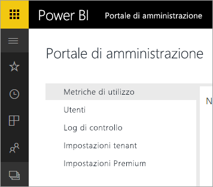

# Power BI per Office 365 è stato ritirato
È stata eseguita la transizione di Power BI per Office 365, una versione precedente di Power BI, alla versione corrente di [Power BI](https://powerbi.microsoft.com). Gli utenti che usavano **Power BI per Office 365** possono usare la versione corrente di Power BI. [Informazioni su Power BI](service-get-started.md).

## Portale di amministrazione
L'accesso al portale di amministrazione di **Power BI per Office 365** non è più disponibile. Gli amministratori possono usare il nuovo [portale di amministrazione](https://app.powerbi.com/admin-portal) per gestire la sottoscrizione di Power BI della propria organizzazione.

Per altre informazioni, vedere [Portale di amministrazione di Power BI](service-admin-portal.md).

## Passaggi successivi
[Introduzione a Power BI](service-get-started.md)

[Introduzione a Power BI Desktop](desktop-getting-started.md)

[Amministrazione di Power BI nell'organizzazione](service-admin-administering-power-bi-in-your-organization.md)
