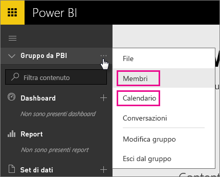
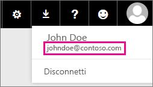

# Clienti dedicati di Office 365 - problemi noti
Power BI è ora supportato per i clienti dedicati di Office 365.  Questi clienti possono infatti accedere con un account di questo tenant e usare Power BI. Attualmente sono stati segnalati due problemi noti.

## Gruppi
Quando si seleziona **Membri** o **Calendario** nel menu di scelta rapida Gruppo, si viene reindirizzati all'app Posta.  **File** e **Conversazioni** funzionano come previsto.

## App iPhone: errore quando si accede con il dominio personale
Quando si accede nell'app iPhone usando un account di accesso con un dominio personale, è possibile che si verifichi un errore.

*Errore di accesso*  
*Si è verificato un errore interno imprevisto. Riprovare.*

Per ovviare a questo problema, invece di usare il dominio personale, accedere con l'indirizzo di posta elettronica elencato quando si fa clic sull'icona utente nel servizio Power BI.

Altre domande? [Provare la community di Power BI](https://community.powerbi.com/)

