# Amministrazione di Power BI nel portale di amministrazione

Il portale di amministrazione consente di gestire un *tenant* Power BI per l'organizzazione. Il portale include elementi come le metriche di utilizzo, l'accesso all'interfaccia di amministrazione di Office 365 e le impostazioni.

Il portale di amministrazione completo è accessibile a tutti gli utenti amministratori globali in Office 365 o a cui è stato assegnato il ruolo di amministratore del servizio Power BI. Se non si ha uno di questi ruoli, nel portale saranno visualizzate solo le **impostazioni di capacità**. Per altre informazioni sul ruolo di amministratore del servizio Power BI, vedere [Informazioni sul ruolo di amministratore di Power BI](service-admin-role.md).

## Come accedere al portale di amministrazione

Per ottenere l'accesso al portale di amministrazione di Power BI, l'account deve essere contrassegnato come **Amministratore globale** in Office 365 o in Azure Active Directory o avere ricevuto il ruolo di amministratore del servizio Power BI. Per altre informazioni sul ruolo di amministratore del servizio Power BI, vedere [Informazioni sul ruolo di amministratore di Power BI](service-admin-role.md). Per accedere al portale di amministrazione di Power BI, eseguire le operazioni seguenti.

1. Selezionare l'icona a forma di ingranaggio delle impostazioni in alto a destra nella pagina del servizio Power BI.

1. Selezionare **Portale di amministrazione**.

    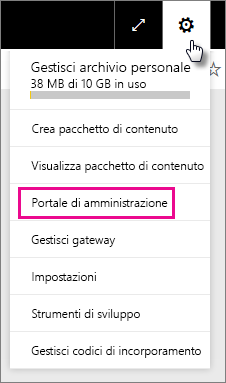

Nel portale sono disponibili sette schede. Il resto di questo articolo fornisce informazioni su ognuna di queste schede.

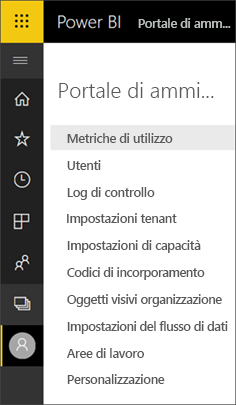

* [Metriche di utilizzo](#usage-metrics)
* [Utenti](#users)
* [Log di controllo](#audit-logs)
* [Impostazioni tenant](#tenant-settings)
* [Impostazioni Premium](#premium-settings)
* [Codici di incorporamento](#embed-codes)
* [Oggetti visivi organizzazione](#organization-visuals)

## Metriche di utilizzo

La scheda **Metriche di utilizzo** consente di monitorare l'utilizzo di Power BI per l'organizzazione. Consente inoltre di vedere quali sono gli utenti e i gruppi più attivi all'interno di Power BI per l'organizzazione.

> [!NOTE]
> Al primo accesso al dashboard o quando si accede di nuovo al dashboard dopo un lungo periodo di inutilizzo, è probabile che venga visualizzata una schermata di caricamento mentre viene caricato il dashboard.

Al termine del caricamento del dashboard vengono visualizzate due sezioni di riquadri. La prima sezione include i dati di utilizzo per i singoli utenti e la seconda sezione ha informazioni simili per i gruppi all'interno dell'organizzazione.

Di seguito è riportata la suddivisione dei dati visualizzati in ogni riquadro:

* Conteggio distinto di tutti i dashboard, i report e i set di dati nell'area di lavoro dell'utente
  
    

* Dashboard più utilizzato in base al numero di utenti che possono accedervi. Ad esempio, se è disponibile un dashboard condiviso con 3 utenti e tale dashboard è stato aggiunto anche a un pacchetto di contenuto a cui sono connessi due utenti diversi, il conteggio sarebbe 6 (1 + 3 + 2)
  
    

* Il contenuto più popolare a cui si sono connessi gli utenti. Si tratta di qualsiasi contenuto accessibile per gli utenti tramite il processo Recupera dati, quindi pacchetti di contenuto SaaS, pacchetti di contenuto aziendali, file o database.
  
    

* Una visualizzazione dei principali utenti in base al numero di dashboard che hanno: sia i dashboard creati da loro che quelli condivisi con loro.
  
    

* Una visualizzazione dei principali utenti in base al numero di report che hanno.
  
    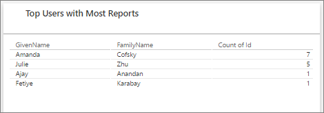

La seconda sezione mostra lo stesso tipo di informazioni, ma in base ai gruppi. In questo modo è possibile stabilire quali sono i gruppi più attivi all'interno dell'organizzazione e quale tipo di contenuto usano.

Con queste informazioni è possibile ottenere informazioni dettagliate reali in merito alla modalità d'uso di Power BI all'interno dell'organizzazione ed è possibile individuare gli utenti e i gruppi particolarmente attivi nell'organizzazione.

## Utenti

Gli utenti, i gruppi e gli amministratori di Power BI vengono gestiti nell'interfaccia di amministrazione di Office 365. La scheda **Utenti** offre un collegamento all'interfaccia di amministrazione per il tenant.

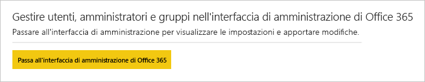

## Log di controllo

I log di controllo di Power BI vengono gestiti nel Centro sicurezza e conformità di Office 365. La scheda **Log di controllo** offre un collegamento al Centro sicurezza e conformità per il tenant. [Altre informazioni](service-admin-auditing.md)

Per usare i log di controllo, assicurarsi che l'impostazione [**Creare log di controllo per la verifica interna delle attività e ai fini della conformità**](#create-audit-logs-for-internal-activity-auditing-and-compliance) sia abilitata.

## Impostazioni tenant

La scheda **Impostazioni tenant** consente di controllare in modo dettagliato le funzionalità rese disponibili per l'organizzazione. Se i dati sensibili rappresentano una criticità, è possibile che alcune delle funzionalità non siano adatte all'organizzazione o che per un determinato gruppo sia preferibile rendere disponibile solo una specifica funzionalità.

L'immagine seguente mostra le prime due sezioni della scheda **Impostazioni tenant**.

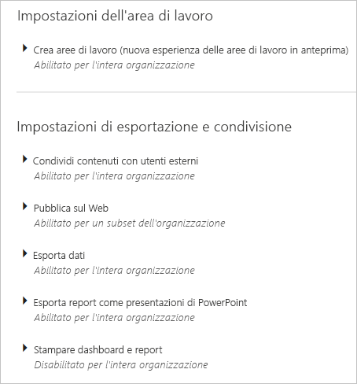

> [!NOTE]
> Possono essere necessari fino a 10 minuti affinché la modifica di un'impostazione diventi effettiva per tutti gli utenti del tenant.

Le impostazioni possono avere tre stati:

* **Disabilitato per l'intera organizzazione**: nessuno all'interno dell'organizzazione può usare questa funzionalità.

    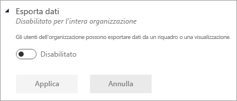

* **Abilitato per l'intera organizzazione**: tutti all'interno dell'organizzazione possono usare questa funzionalità.

    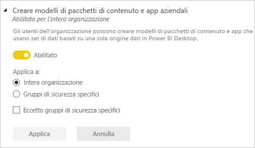

* **Abilitato per un subset dell'organizzazione**: uno specifico subset di utenti o gruppi all'interno dell'organizzazione può usare questa funzionalità.

    È possibile abilitare la funzionalità per l'intera organizzazione, ad eccezione di un gruppo specifico di utenti.

    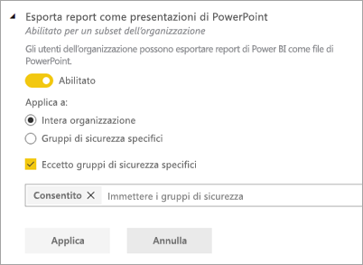

    È anche possibile abilitare la funzionalità solo per un gruppo specifico di utenti e disabilitarla per un altro gruppo di utenti. Con questo approccio si è certi che alcuni utenti non abbiano accesso alla funzionalità anche se fanno parte del gruppo autorizzato.

    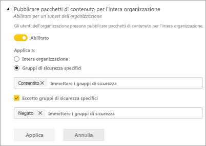

Le sezioni successive forniscono una panoramica dei diversi tipi di impostazioni del tenant.

## Impostazioni dell'area di lavoro

### Creare le aree di lavoro (anteprima)

Gli utenti dell'organizzazione possono creare aree di lavoro per le app per collaborare a dashboard, report e altro contenuto. [Altre informazioni](service-create-the-new-workspaces.md)

## Impostazioni di esportazione e condivisione

### Condividere contenuto con utenti esterni

Gli utenti dell'organizzazione possono condividere i dashboard con utenti esterni all'organizzazione. [Altre informazioni](service-share-dashboards.md#share-a-dashboard-or-report-with-people-outside-your-organization)

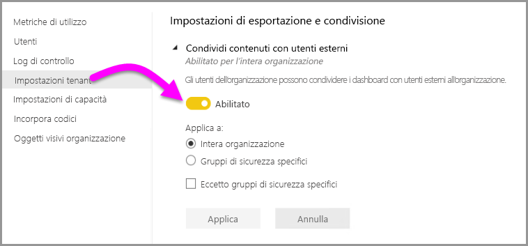

La figura seguente mostra il messaggio che viene visualizzato al momento della condivisione con un utente esterno.

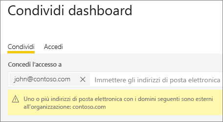

### Pubblica sul Web

Gli utenti dell'organizzazione possono pubblicare report sul Web. [Altre informazioni](service-publish-to-web.md)

La figura seguente mostra il menu **File** per un report quando l'impostazione **Pubblica sul Web** è abilitata.

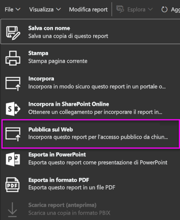

Gli utenti possono vedere opzioni diverse nell'interfaccia utente in base all'impostazione di **Pubblica sul Web**.

|Funzionalità |Abilitata per l'intera organizzazione |Disabilitata per l'intera organizzazione |Gruppi di sicurezza specifici   |
|---------|---------|---------|---------|
|**Pubblica sul Web** nel menu **File** del report.|Abilitata per tutti|Non visibile per tutti|Visibile solo per utenti o gruppi autorizzati.|
|**Gestisci codici di incorporamento** in **Impostazioni**|Abilitata per tutti|Abilitata per tutti|Abilitata per tutti  Opzione * **Elimina** solo per utenti o gruppi autorizzati. Opzione * **Ottieni i codici** abilitata per tutti.|
|**Incorpora codici** nel portale di amministrazione|Stato indica una delle opzioni seguenti: * Attivo * Non supportato * Bloccato|Stato indica **Disabilitato**|Stato indica una delle opzioni seguenti: * Attivo * Non supportato * Bloccato  Se un utente non è autorizzato in base alla configurazione del tenant, lo stato indica **Violazione**.|
|Report pubblicati esistenti|Tutti abilitati|Tutti disabilitati|Il rendering di tutti i report viene continuato per tutti.|

### Esporta dati

Gli utenti dell'organizzazione possono esportare dati da un riquadro o una visualizzazione. [Altre informazioni](visuals/power-bi-visualization-export-data.md)

La figura seguente mostra l'opzione per esportare i dati da un riquadro.

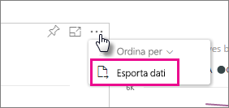

> [!NOTE]
> Se si disabilita **Esporta dati**, si impedisce anche agli utenti di usare la funzionalità **Analizza in Excel** oltre alla connessione dinamica al servizio Power BI.

### Esporta report come presentazioni di PowerPoint

Gli utenti dell'organizzazione possono esportare report di Power BI come file di PowerPoint. [Altre informazioni](consumer/end-user-powerpoint.md)

La figura seguente mostra il menu **File** per un report quando l'impostazione **Esporta report come presentazioni di PowerPoint** è abilitata.

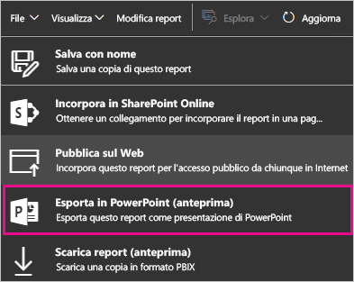

### Stampare dashboard e report

Gli utenti dell'organizzazione possono stampare dashboard e report. [Altre informazioni](consumer/end-user-print.md)

La figura seguente mostra l'opzione per stampare un dashboard.

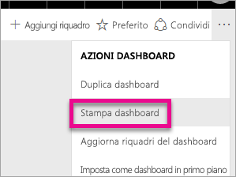

La figura seguente mostra il menu **File** per un report quando l'impostazione **Stampare dashboard e report** è abilitata.

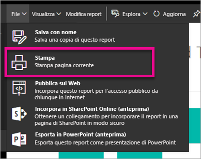

## Impostazioni dell'app e del pacchetto di contenuto

### Pubblicare pacchetti di contenuto e app per l'intera organizzazione

Gli utenti dell'organizzazione possono pubblicare pacchetti di contenuto e app per l'intera organizzazione, invece che solo per gruppi specifici. [Altre informazioni](service-organizational-content-pack-manage-update-delete.md)

La figura seguente mostra l'opzione **Intera organizzazione** quando si crea un pacchetto di contenuto.

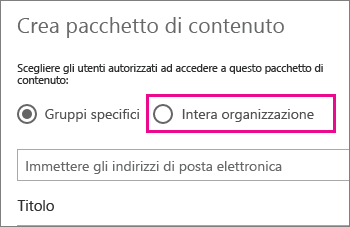

### Creare modelli di pacchetti di contenuto e app aziendali

Gli utenti dell'organizzazione possono creare modelli di pacchetti di contenuto che usano set di dati compilati in Power BI Desktop. [Altre informazioni](template-content-pack-authoring.md)

### Push delle app agli utenti finali

Gli utenti possono condividere le app direttamente con gli utenti finali, senza eseguire installazioni da AppSource. [Altre informazioni](service-create-distribute-apps.md)

## Impostazioni di integrazione

### Porre domande sui dati tramite Cortana

Gli utenti dell'organizzazione possono porre domande sui dati tramite Cortana. [Altre informazioni](service-cortana-enable.md)

> [!NOTE]
> Questa impostazione si applica all'intera organizzazione e non può essere limitata a gruppi specifici.

### Usare Analizza in Excel con set di dati locali

Gli utenti dell'organizzazione possono usare Excel per visualizzare set di dati di Power BI locali e interagire con essi. [Altre informazioni](service-analyze-in-excel.md)

> [!NOTE]
> Se si disabilita l'impostazione **Esporta dati**, gli utenti non possono usare neanche la funzionalità **Analizza in Excel**.

### Usa Mappe ArcGIS per Power BI

Gli utenti dell'organizzazione possono usare la visualizzazione ArcGIS Maps for Power BI offerta da Esri. [Altre informazioni](visuals/power-bi-visualization-arcgis.md)

### Usa la ricerca globale per Power BI (anteprima)

Gli utenti dell'organizzazione possono usare funzionalità di ricerca esterne basate su Ricerca di Azure. Gli utenti possono ad esempio usare Cortana per recuperare informazioni chiave direttamente dai dashboard e dai report di Power BI. [Altre informazioni](service-cortana-intro.md)

## Impostazioni degli oggetti visivi personalizzati

### Abilitare oggetti visivi personalizzati per l'intera organizzazione

Gli utenti dell'organizzazione possono interagire con gli oggetti visivi personalizzati e condividerli. [Altre informazioni](power-bi-custom-visuals.md)

> [!NOTE]
> Questa impostazione si applica all'intera organizzazione e non può essere limitata a gruppi specifici.

## Impostazioni degli oggetti visivi R

### Interagire con gli oggetti visivi R e condividerli

Gli utenti dell'organizzazione possono interagire con gli oggetti visivi creati con script R e condividerli. [Altre informazioni](visuals/service-r-visuals.md)

> [!NOTE]
> Questa impostazione si applica all'intera organizzazione e non può essere limitata a gruppi specifici.

## Impostazioni di controllo e utilizzo

### Creare log di controllo per la verifica interna delle attività e la conformità

Gli utenti dell'organizzazione possono usare il controllo per monitorare le azioni eseguite da altri utenti dell'organizzazione in Power BI. [Altre informazioni](service-admin-auditing.md)

Questa impostazione deve essere abilitata per la registrazione delle voci del log di controllo. È possibile che tra l'abilitazione della funzione di controllo e la visualizzazione dei dati di controllo si verifichi un ritardo di un massimo di 48 ore. Se i dati non vengono visualizzati immediatamente, controllare i log di controllo successivamente. Un ritardo simile può verificarsi tra l'assegnazione dell'autorizzazione per la visualizzazione dei log di controllo e l'accesso ai log.

> [!NOTE]
> Questa impostazione si applica all'intera organizzazione e non può essere limitata a gruppi specifici.

### Metriche di utilizzo per i creatori di contenuti

Gli utenti dell'organizzazione possono visualizzare le metriche di utilizzo dei dashboard e dei report creati. [Altre informazioni](service-usage-metrics.md)

### Dati per utente nelle metriche di utilizzo per i creatori di contenuti

Le metriche di utilizzo per i creatori di contenuti esporranno i nomi visualizzati e gli indirizzi di posta elettronica degli utenti che accedono ai contenuti. [Altre informazioni](service-usage-metrics.md)

Per impostazione predefinita, i dati per utente sono abilitati nelle metriche di utilizzo e le informazioni sull'account del creatore di contenuto sono incluse nel report delle metriche. Se non si desidera includere queste informazioni per alcuni o tutti gli utenti, disabilitare la funzionalità per specifici gruppi di sicurezza o per un'intera organizzazione. Le informazioni sull'account verranno quindi visualizzate nel report come *Senza nome*.

## Impostazioni del dashboard

### Classificazione dati per dashboard

Gli utenti dell'organizzazione possono contrassegnare i dashboard con classificazioni che ne indicano il livello di sicurezza. [Altre informazioni](service-data-classification.md)

> [!NOTE]
> Questa impostazione si applica all'intera organizzazione e non può essere limitata a gruppi specifici.

## Impostazioni modalità sviluppatore

### Incorporare il contenuto nelle app

Gli utenti dell'organizzazione possono incorporare i dashboard e i report di Power BI nelle applicazioni SaaS (Software as a Service). Se si disabilita questa impostazione, si impedisce agli utenti di usare le API REST per incorporare contenuto Power BI nelle loro applicazioni. [Altre informazioni](developer/embedding.md)

## Impostazioni del flusso di dati (anteprima)

### Creare e usare flussi di dati (anteprima)

Gli utenti dell'organizzazione possono creare e usare flussi di dati. Per una panoramica dei flussi di dati, vedere [Preparazione dei dati self-service in Power BI (anteprima)](service-dataflows-overview.md). Per abilitare i flussi di dati in una capacità Premium, vedere [Configurare i carichi di lavoro](service-admin-premium-manage.md#configure-workloads).

> [!NOTE]
> Questa impostazione si applica all'intera organizzazione e non può essere limitata a gruppi specifici.

## Impostazioni di capacità

### Power BI Premium

La scheda **Power BI Premium** consente di gestire qualsiasi capacità di Power BI Premium (SKU EM o P) acquistata dall'organizzazione. La scheda **Power BI Premium** è visibile per tutti gli utenti dell'organizzazione, ma il suo contenuto è visibile solo per gli utenti ai quali è stato assegnato il ruolo di *Amministratore delle capacità* o a un utente che abbia autorizzazioni di assegnazione. Per gli utenti che non hanno autorizzazioni viene visualizzato il messaggio seguente.

Per altre informazioni su come gestire le impostazioni Premium, vedere [Gestione di Power BI Premium](service-admin-premium-manage.md).

### Power BI Embedded

La scheda **Power BI Embedded** consente di visualizzare le capacità di Power BI Embedded (SKU A) acquistate per il cliente. Poiché è possibile acquistare solo SKU A da Azure, [le capacità incorporate in Azure vengono gestite](developer/azure-pbie-create-capacity.md) dal **portale di Azure**.

Per altre informazioni su come gestire le impostazioni di Power BI Embedded (SKU) A, vedere [Che cos'è Azure Power BI Embedded](developer/azure-pbie-what-is-power-bi-embedded.md).

## Codici di incorporamento

Un amministratore può visualizzare i codici di incorporamento generati per il tenant. È anche possibile revocare o eliminare i codici. [Altre informazioni](service-publish-to-web.md)

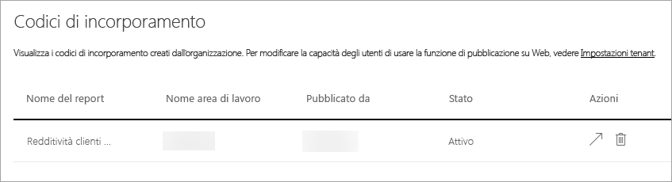

## Oggetti visivi organizzazione

La scheda **Oggetti visivi organizzazione** consente di distribuire e gestire gli oggetti visivi personalizzati all'interno dell'organizzazione. Con gli oggetti visivi dell'organizzazione, è possibile distribuire facilmente gli oggetti visivi proprietari nell'organizzazione, che gli autori dei report possono quindi individuare e importare nei report da Power BI Desktop. [Altre informazioni](power-bi-custom-visuals-organization.md)

> [!WARNING]
> Un oggetto visivo personalizzato può contenere codice rischioso a livello di sicurezza o privacy. Verificare che l'autore e l'origine dell'oggetto visivo personalizzato siano attendibili prima di distribuirlo nel repository dell'organizzazione.

La figura mostra tutti gli oggetti visivi personalizzati attualmente distribuiti nel repository di un'organizzazione.

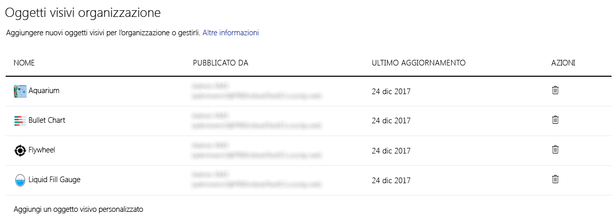

### Aggiungere un nuovo oggetto visivo personalizzato

Per aggiungere un nuovo oggetto visivo personalizzato all'elenco, seguire questa procedura. 

1. Nel riquadro di destra selezionare **Aggiungi un oggetto visivo personalizzato**.

    

1. Compilare il modulo **Aggiungi oggetto visivo personalizzato**:

    * **Scegli un file con estensione pbiviz** (obbligatorio): selezionare un file di oggetto visivo personalizzato da caricare. Sono supportati solo oggetti visivi personalizzati basati su API con controllo della versione (vedere qui cosa significa).

    Prima di caricare un oggetto visivo personalizzato è necessario controllarne sicurezza e privacy per assicurarsi che sia conforme agli standard della propria organizzazione.

    * **Assegna un nome all'oggetto visivo personalizzato** (obbligatorio): assegnare un titolo breve all'oggetto visivo in modo gli utenti di Power BI Desktop ne possano comprendere facilmente gli scopi

    * **Icona**: file dell'icona che viene visualizzata nell'interfaccia utente di Power BI Desktop.

    * **Descrizione**: breve descrizione dell'oggetto visivo per fornire più contesto e informazioni utili all'utente

1. Selezionare **Aggiungi** per avviare la richiesta di caricamento. Se ha esito positivo, il nuovo elemento viene visualizzato nell'elenco. In caso di esito negativo, viene visualizzato un messaggio di errore appropriato

### Eliminare un oggetto visivo personalizzato dall'elenco

Per eliminare definitivamente un oggetto visivo, selezionare l'icona del Cestino per l'oggetto visivo nel repository.

> [!IMPORTANT]
> L'eliminazione è irreversibile. Una volta eliminato, viene interrotto immediatamente il rendering dell'oggetto visivo nei report esistenti. Anche se lo stesso oggetto visivo viene caricato nuovamente, non sostituirà quello precedente eliminato. Gli utenti possono tuttavia importare nuovamente il nuovo oggetto visivo e sostituire l'istanza presente nei report.

### Disabilitare un oggetto visivo personalizzato nell'elenco

Per disabilitare l'oggetto visivo dall'archivio dell'organizzazione, selezionare l'icona a forma di ingranaggio. Nella sezione **Accesso** disabilitare l'oggetto visivo personalizzato.

Dopo avere disabilitato l'oggetto visivo, non ne verrà eseguito il rendering nei report esistenti e viene visualizzato il messaggio di errore riportato di seguito.

*Questo oggetto visivo personalizzato non è più disponibile. Per informazioni dettagliate, contattare l'amministratore.*

Tuttavia, gli oggetti visivi con segnalibro continuano a funzionare.

Dopo qualsiasi aggiornamento o modifica dell'amministratore, agli utenti di Power BI Desktop devono riavviare l'applicazione o aggiornare il browser nel servizio Power BI per vedere gli aggiornamenti.

### Aggiornare un oggetto visivo

Per aggiornare l'oggetto visivo dall'archivio dell'organizzazione, selezionare l'icona a forma di ingranaggio. Cercare e caricare una nuova versione dell'oggetto visivo.

Assicurarsi che l'ID dell'oggetto visivo rimanga invariato. Il nuovo file sostituisce il file precedente per tutti i report in tutta l'organizzazione. Tuttavia, se esiste la possibilità che la nuova versione dell'oggetto visivo comprometta l'utilizzo o la struttura di dati della versione precedente dell'oggetto visivo, evitare di sostituire la versione precedente. In questo caso, è invece necessario creare una nuova voce per la nuova versione dell'oggetto visivo. Ad esempio, aggiungere un nuovo numero di versione (versione x.x) al titolo del nuovo oggetto visivo presentato. In questo modo risulta chiaro che si tratta dello stesso oggetto visivo solo con un numero di versione aggiornato e che la funzionalità dei report esistenti non verrà compromessa. Assicurarsi anche in questo caso che l'ID dell'oggetto visivo rimanga invariato. Al successivo accesso al repository dell'organizzazione da Power BI Desktop, gli utenti possono importare la nuova versione e viene loro richiesto di sostituire la versione corrente disponibile nei report.

Per altre informazioni, vedere le [Domande frequenti sugli oggetti visivi personalizzati di Power BI](https://docs.microsoft.com/power-bi/power-bi-custom-visuals-faq#organizational-custom-visuals).

## Archiviazione del flusso di dati (anteprima)

Per impostazione predefinita, i dati usati con Power BI vengono archiviati nello spazio di archiviazione interno fornito da Power BI. Con l'integrazione di flussi di dati e Azure Data Lake Storage Gen2 (ADLS Gen2), è possibile archiviare i flussi di dati nell'account di Azure Data Lake Storage Gen2 della propria organizzazione. Per altre informazioni, vedere [Integrazione di flussi di dati e Azure Data Lake (anteprima)](service-dataflows-azure-data-lake-integration.md).

## Aree di lavoro (anteprima)

Come amministratore, è possibile visualizzare le aree di lavoro esistenti nel tenant. È possibile ordinare e filtrare l'elenco delle aree di lavoro e visualizzare i dettagli per ognuna di esse. Si noti che le colonne della tabella corrispondono alle proprietà restituite dalle [API REST Admin di Power BI](/rest/api/power-bi/admin) per le aree di lavoro. Le aree di lavoro personali sono di tipo **PersonalGroup**, le aree di lavoro legacy sono di tipo **Group** e le aree di lavoro moderne sono di tipo **Workspace**. Per altre informazioni, vedere [Creare le nuove aree di lavoro (anteprima) in Power BI](service-create-the-new-workspaces.md).

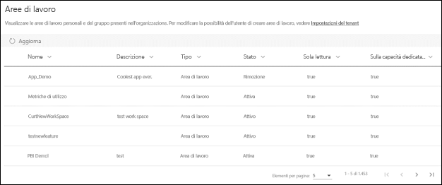

## Passaggi successivi

[Amministrazione di Power BI nell'organizzazione](service-admin-administering-power-bi-in-your-organization.md) [Informazioni sul ruolo di amministratore di Power BI](service-admin-role.md)  
[Controllo di Power BI nell'organizzazione](service-admin-auditing.md)  
[Manage Power BI Premium](service-admin-premium-manage.md) (Gestire Power BI Premium)  

Altre domande? [Provare a rivolgersi alla community di Power BI](http://community.powerbi.com/)
