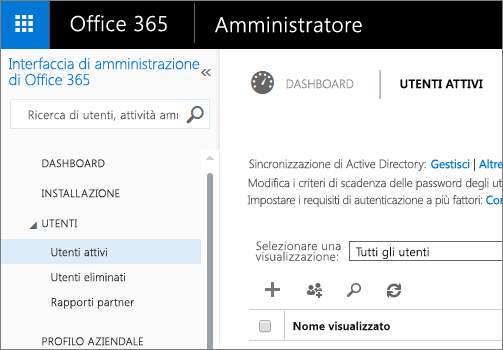
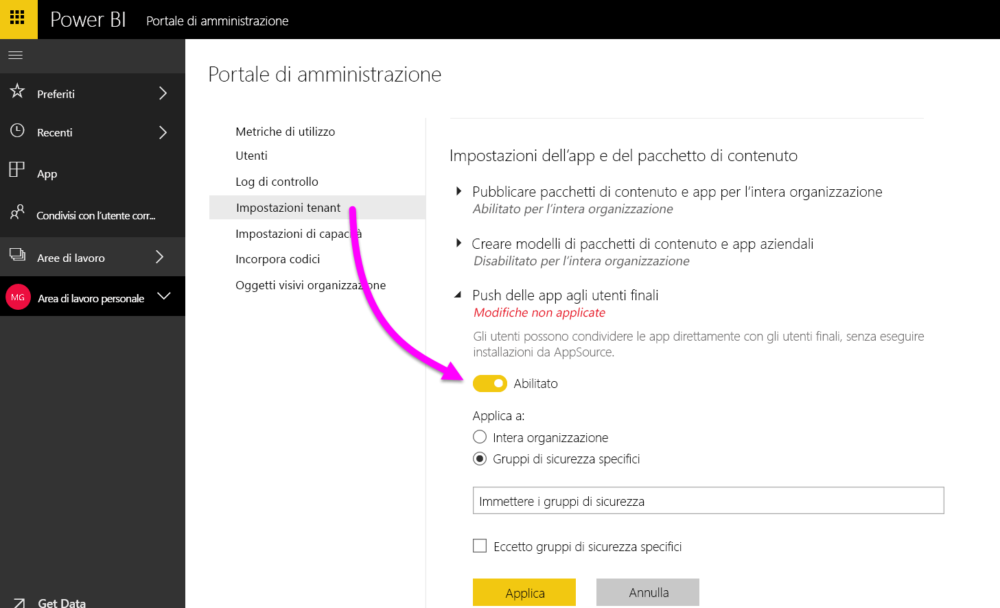
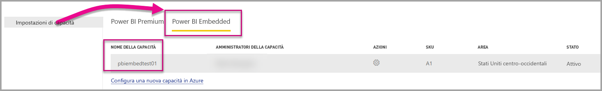

# Portale di amministrazione di Power BI

Il portale di amministrazione consente la gestione del tenant di Power BI nell'organizzazione. Include elementi come le metriche di utilizzo, l'accesso all'interfaccia di amministrazione di Office 365 e le impostazioni.

La gestione del tenant di Power BI per l'azienda viene eseguita tramite il portale di amministrazione di Power BI. Il portale di amministrazione è accessibile a tutti gli utenti amministratori globali in Office 365 o a cui è stato assegnato il ruolo di amministratore del servizio Power BI. Per altre informazioni sul ruolo di amministratore del servizio Power BI, vedere [Informazioni sul ruolo di amministratore di Power BI](service-admin-role.md).

Tutti gli utenti possono vedere **Portale di amministrazione** sotto all'icona a forma d'ingranaggio. Se gli utenti non sono amministratori, possono vedere solo la sezione **Impostazioni Premium** e le capacità per le quali dispongono dei diritti di gestione.

## Come accedere al portale di amministrazione

Per ottenere l'accesso al portale di amministrazione di Power BI, l'account deve essere contrassegnato come **Amministratore globale** in Office 365 o in Azure Active Directory o avere ricevuto il ruolo di amministratore del servizio Power BI. Per altre informazioni sul ruolo di amministratore del servizio Power BI, vedere [Informazioni sul ruolo di amministratore di Power BI](service-admin-role.md). Per accedere al portale di amministrazione di Power BI, eseguire le operazioni seguenti.

1. Selezionare l'icona a forma di ingranaggio delle impostazioni in alto a destra nella pagina del servizio Power BI.
2. Selezionare **Portale di amministrazione**.

All'interno del portale sono disponibili sei schede, descritte di seguito.

* [Metriche di utilizzo](#usage-metrics)
* [Utenti](#users)
* [Log di controllo](#audit-logs)
* [Impostazioni tenant](#tenant-settings)
* [Impostazioni Premium](#premium-settings)
* [Codici di incorporamento](#embed-codes)
* [Oggetti visivi dell'organizzazione](#Organization-visuals)

## Metriche di utilizzo
La prima scheda nel portale di amministrazione è **Metriche di utilizzo**. Il report delle metriche di utilizzo offre la possibilità di monitorare l'utilizzo all'interno di Power BI per l'organizzazione. Consente inoltre di vedere quali sono gli utenti e i gruppi più attivi all'interno di Power BI per l'organizzazione.

> [!NOTE]
> Al primo accesso al dashboard o quando si accede di nuovo al dashboard dopo un lungo periodo di inutilizzo, è probabile che venga visualizzata una schermata di caricamento mentre viene caricato il dashboard.

Al termine del caricamento del dashboard è possibile visualizzare due sezioni di riquadri. La prima sezione include i dati di utilizzo per i singoli utenti e la seconda sezione ha informazioni simili per i gruppi all'interno dell'organizzazione.

Di seguito è riportata la suddivisione dei dati visualizzati in ogni riquadro:

* Conteggio distinto di tutti i dashboard, i report e i set di dati nell'area di lavoro dell'utente
  
    

* Dashboard più utilizzato in base al numero di utenti che possono accedervi. Ad esempio, se si dispone di un dashboard condiviso con 3 utenti e tale dashboard è stato aggiunto anche a un pacchetto di contenuto a cui sono connessi due utenti diversi, il conteggio sarebbe 6 (1 + 3 + 2)
  
    

* Il contenuto più popolare a cui si sono connessi gli utenti. Si tratta di qualsiasi contenuto accessibile per gli utenti tramite il processo Recupera dati, quindi pacchetti di contenuto SaaS, pacchetti di contenuto aziendali, file o database.
  
    

* Una visualizzazione dei principali utenti in base al numero di dashboard che hanno: sia i dashboard creati da loro che quelli condivisi con loro.
  
    

* Una visualizzazione dei principali utenti in base al numero di report che hanno.
  
    

La seconda sezione mostra lo stesso tipo di informazioni, ma in base ai gruppi. In questo modo è possibile stabilire quali sono i gruppi più attivi all'interno dell'organizzazione e quale tipo di informazioni usano.

Con queste informazioni si ottengono dati analitici reali in merito alla modalità di utilizzo di Power BI all'interno dell'organizzazione ed è possibile individuare gli utenti e i gruppi particolarmente attivi nell'organizzazione.

## Users

La seconda scheda nel portale di amministrazione è **Gestisci utenti**. La gestione degli utenti, per Power BI, viene eseguita nell'interfaccia di amministrazione di Office 365, pertanto questa sezione consente di raggiungere rapidamente l'area per gestire utenti, amministratori e gruppi all'interno di Office 365.

Facendo clic su **Passa all'interfaccia di amministrazione di O365** si passa direttamente alla pagina di destinazione dell'interfaccia di amministrazione di Office 365 per gestire gli utenti del tenant.

## Log di controllo

La terza scheda nel portale di amministrazione è **Log di controllo**. I log si trovano all'interno del Centro sicurezza e conformità di Office 365. Questa sezione consente di accedere rapidamente a tale area all'interno di Office 365.

Per altre informazioni sui log di controllo, vedere [Controllo di Power BI nell'organizzazione](service-admin-auditing.md)

## Impostazioni tenant

La terza scheda nel portale di amministrazione è **Impostazioni tenant**. Le impostazioni del tenant consentono di esercitare un maggiore controllo sulle funzionalità da rendere disponibili per l'organizzazione. Se i dati sensibili rappresentano una criticità, è possibile che alcune delle nostre funzionalità non siano adatte all'organizzazione o che per un determinato gruppo sia preferibile rendere disponibile solo una specifica funzionalità. In questi casi, è possibile disattivare specifiche funzionalità nel tenant.

> [!NOTE]
> Possono essere necessari fino a 10 minuti affinché l'impostazione diventi effettiva per tutti gli utenti del tenant.

Le impostazioni possono avere tre stati:

* **Disabilitato per l'intera organizzazione**: è possibile disabilitare una funzionalità e fare in modo che gli utenti non possano usarla.

    

* **Abilitato per l'intera organizzazione**: è possibile abilitare una funzionalità per l'intera organizzazione in modo da renderla accessibile a tutti gli utenti.

    

* **Abilitato per un subset dell'organizzazione**: è anche possibile abilitare una funzionalità per una parte dell'organizzazione. Questo obiettivo può essere raggiunto in diversi modi. È possibile abilitarla per l'intera organizzazione, ad eccezione di un gruppo specifico di utenti.

    

    È anche possibile abilitare la funzionalità solo per un gruppo di utenti e disattivarla per un altro gruppo di utenti. In questo modo, alcuni utenti non avrebbero accesso alla funzionalità anche se fanno parte del gruppo autorizzato.

    

Le sezioni successive forniscono una panoramica dei diversi tipi di impostazioni del tenant.

## Impostazioni dell'area di lavoro

### Creare le aree di lavoro (anteprima)
Gli utenti dell'organizzazione possono creare aree di lavoro per le app per collaborare a dashboard, report e altro contenuto.

Per altre informazioni, vedere [Creare le nuove aree di lavoro](service-create-the-new-workspaces.md).

## Impostazioni di esportazione e condivisione

### Condividere contenuto con utenti esterni

Gli utenti dell'organizzazione possono condividere i dashboard con utenti esterni all'organizzazione.

Di seguito è riportato il messaggio che viene visualizzato al momento della condivisione con un utente esterno.

### Pubblica sul Web

Gli utenti dell'organizzazione possono pubblicare report sul Web. [Altre informazioni](service-publish-to-web.md)

Gli utenti possono vedere opzioni diverse nell'interfaccia utente in base all'impostazione per la pubblicazione sul Web.

|Funzionalità |Abilitata per l'intera organizzazione |Disabilitata per l'intera organizzazione |Gruppi di sicurezza specifici   |
|---------|---------|---------|---------|
|**Pubblica sul Web** nel menu **File** del report.|Abilitata per tutti|Non visibile per tutti|Visibile solo per utenti o gruppi autorizzati.|
|**Gestisci codici di incorporamento** in **Impostazioni**|Abilitata per tutti|Abilitata per tutti|Abilitata per tutti  Opzione * **Elimina** solo per utenti o gruppi autorizzati. Opzione * **Ottieni i codici** abilitata per tutti.|
|**Incorpora codici** nel portale di amministrazione|Stato indica una delle opzioni seguenti: * Attivo * Non supportato * Bloccato|Stato indica **Disabilitato**|Stato indica una delle opzioni seguenti: * Attivo * Non supportato * Bloccato  Se un utente non è autorizzato in base alla configurazione del tenant, lo stato indica **Violazione**.|
|Report pubblicati esistenti|Tutti abilitati|Tutti disabilitati|Il rendering di tutti i report viene continuato per tutti.|

### Esporta dati

Gli utenti dell'organizzazione possono esportare dati da un riquadro o una visualizzazione. [Altre informazioni](consumer/end-user-export-data.md)

> [!NOTE]
> Se si disabilita **Esporta dati**, si impedisce anche agli utenti di usare la funzionalità **Analizza in Excel** oltre alla connessione dinamica al servizio Power BI.

### Esporta report come presentazioni di PowerPoint

Gli utenti dell'organizzazione possono esportare report di Power BI come file di PowerPoint. [Altre informazioni](consumer/end-user-powerpoint.md)

### Stampare dashboard e report

Gli utenti dell'organizzazione possono stampare dashboard e report. [Altre informazioni](consumer/end-user-print.md)

## Impostazioni del pacchetto di contenuto

### Pubblicare pacchetti di contenuto per l'intera organizzazione

Gli utenti dell'organizzazione possono pubblicare pacchetti di contenuto per l'intera organizzazione.

### Creare pacchetti di contenuto modello aziendali

Gli utenti dell'organizzazione possono creare modelli di pacchetti di contenuto che usano set di dati basati su una sola origine dati in Power BI Desktop.

### Push delle app agli utenti finali

L'amministratore del tenant abilita il push delle app in **Impostazioni tenant**.

   

È possibile configurare l'impostazione **Abilitato** e quindi specificare chi ottiene questa funzionalità, se l'intera organizzazione o gruppi di sicurezza specifici.

> [!NOTE]
> Tenere presente che le modifiche alle impostazioni del tenant possono richiedere tempo per diventare effettive.

Sono disponibili altre informazioni sul [push delle app](consumer/end-user-create-apps.md#how-to-install-an-app-automatically-for-end-users).

## Impostazioni di integrazione

### Porre domande sui dati tramite Cortana

Gli utenti dell'organizzazione possono porre domande sui dati tramite Cortana.

> [!NOTE]
> Questa impostazione si applica all'intera organizzazione e non può essere limitata a gruppi specifici.

### Usare Analizza in Excel con set di dati locali

Gli utenti dell'organizzazione possono usare Excel per visualizzare set di dati di Power BI locali e interagire con essi. [Altre informazioni](service-analyze-in-excel.md)

> [!NOTE]
> Se si disabilita l'impostazione **Esporta dati**, gli utenti non possono usare neanche la funzionalità **Analizza in Excel**.

### Usa ArcGIS Maps for Power BI

Gli utenti dell'organizzazione possono usare la visualizzazione ArcGIS Maps for Power BI offerta da Esri. [Altre informazioni](power-bi-visualization-arcgis.md)

### Usa la ricerca globale per Power BI (anteprima)

Gli utenti dell'organizzazione possono usare funzionalità di ricerca esterne basate su Ricerca di Azure. Gli utenti possono ad esempio usare Cortana per recuperare informazioni chiave direttamente dai dashboard e dai report di Power BI. [Altre informazioni](service-cortana-intro.md)

## Impostazioni degli oggetti visivi personalizzati

### Abilitare oggetti visivi personalizzati per l'intera organizzazione

Gli utenti dell'organizzazione possono interagire con gli oggetti visivi personalizzati e condividerli. [Altre informazioni](power-bi-custom-visuals.md)

> [!NOTE]
> Questa impostazione si applica all'intera organizzazione e non può essere limitata a gruppi specifici.

## Impostazioni degli oggetti visivi R

### Interagire con gli oggetti visivi R e condividerli

Gli utenti dell'organizzazione possono interagire con gli oggetti visivi creati con script R e condividerli. [Altre informazioni](visuals/service-r-visuals.md)

> [!NOTE]
> Questa impostazione si applica all'intera organizzazione e non può essere limitata a gruppi specifici.

## Impostazioni di controllo e utilizzo

### Creare log di controllo per la verifica interna delle attività e la conformità

Gli utenti dell'organizzazione possono usare il controllo per monitorare le azioni eseguite da altri utenti dell'organizzazione in Power BI. [Altre informazioni](service-admin-auditing.md)

Questa impostazione deve essere abilitata per la registrazione delle voci del log di controllo. È possibile che tra l'abilitazione della funzione di controllo e la visualizzazione dei dati di controllo si verifichi un ritardo di un massimo di 48 ore. Se i dati non vengono visualizzati immediatamente, controllare i log di controllo successivamente. Un ritardo simile può verificarsi tra l'assegnazione dell'autorizzazione per la visualizzazione dei log di controllo e l'accesso ai log.

> [!NOTE]
> Questa impostazione si applica all'intera organizzazione e non può essere limitata a gruppi specifici.

### Metriche di utilizzo per i creatori di contenuti
Gli utenti dell'organizzazione possono visualizzare le metriche di utilizzo dei dashboard e dei report creati. [Altre informazioni](service-usage-metrics.md)

È possibile configurare l'impostazione **Abilitato** e quindi specificare chi può visualizzare le metriche di utilizzo, ovvero l'intera organizzazione o gruppi di sicurezza specifici.

> [!NOTE]
> Tenere presente che le modifiche alle impostazioni del tenant possono richiedere tempo per diventare effettive.

### Dati per utente nelle metriche di utilizzo per i creatori di contenuti
Le metriche di utilizzo per i creatori di contenuti esporranno i nomi visualizzati e gli indirizzi di posta elettronica degli utenti che accedono ai contenuti. [Altre informazioni](service-usage-metrics.md)

È possibile configurare l'impostazione **abilitato** e quindi specificare chi può visualizzare i nomi visualizzati e gli indirizzi di posta elettronica nelle metriche di utilizzo (l'intera organizzazione o gruppi di sicurezza specifici).

Per impostazione predefinita, i dati per utente sono abilitati nelle metriche di utilizzo e le informazioni sull'account del creatore di contenuto sono incluse nel report delle metriche. Se non si desidera includere queste informazioni per alcuni o tutti gli utenti, disabilitare la funzionalità per specifici gruppi di sicurezza o per un'intera organizzazione. Le informazioni sull'account verranno quindi visualizzate nel report come *Senza nome*.

> [!NOTE]
> Tenere presente che le modifiche alle impostazioni del tenant possono richiedere tempo per diventare effettive.

## Impostazioni del dashboard

### Classificazione dati per dashboard

Gli utenti dell'organizzazione possono contrassegnare i dashboard con classificazioni che ne indicano il livello di sicurezza. [Altre informazioni](service-data-classification.md)

> [!NOTE]
> Questa impostazione si applica all'intera organizzazione e non può essere limitata a gruppi specifici.

## Impostazioni modalità sviluppatore

### Incorporare il contenuto nelle app

Gli utenti dell'organizzazione possono incorporare i dashboard e i report di Power BI nelle applicazioni SaaS (Software as a Service). Se si disabilita questa impostazione, si impedisce agli utenti di usare le API REST per incorporare contenuto Power BI nelle loro applicazioni.

## Impostazioni di capacità

### Impostazioni Premium

La scheda Impostazioni Premium consente di gestire qualsiasi capacità di Power BI Premium (SKU Em o P) acquistata dall'organizzazione. La scheda Impostazioni Premium è visibile per tutti gli utenti dell'organizzazione, ma il suo contenuto è visibile solo per gli utenti ai quali è stato assegnato il ruolo di **Amministratore delle capacità** o a un utente che abbia autorizzazioni di assegnazione. Per gli utenti che non hanno autorizzazioni viene visualizzato il messaggio seguente.

Per altre informazioni su come gestire le impostazioni Premium, vedere [Gestione di Power BI Premium](service-admin-premium-manage.md).

### Impostazioni di Power BI Embedded

La scheda Impostazioni di Power BI Embedded consente di visualizzare le capacità di Power BI Embedded (SKU A) acquistate per il cliente. Poiché è possibile acquistare solo SKU A da Azure, è possibile [gestire le capacità incorporate in Azure](developer/azure-pbie-create-capacity.md) dal **portale di Azure**.

Per altre informazioni su come gestire le impostazioni di Power BI Embedded (SKU) A, vedere [Che cos'è Azure Power BI Embedded](developer/azure-pbie-what-is-power-bi-embedded.md).

## Codici di incorporamento

Un amministratore può visualizzare i codici di incorporamento generati per il tenant. Sono disponibili le azioni per la visualizzazione del report e l'eliminazione del codice di incorporamento per rimuoverlo.

## Oggetti visivi dell'organizzazione

La scheda Oggetti visivi organizzazione consente di distribuire e gestire gli oggetti visivi personalizzati all'interno dell'organizzazione, in modo da poter distribuire facilmente oggetti visivi personalizzati proprietari all'interno dell'organizzazione e consentire agli autori di report di individuare e importare facilmente tali oggetti visivi direttamente da Power BI Desktop nei loro report.

La pagina mostra tutti gli oggetti visivi personalizzati attualmente distribuiti nel repository dell'organizzazione.

### Aggiungere un nuovo oggetto visivo personalizzato

Per aggiungere un nuovo oggetto visivo personalizzato all'elenco, selezionare **Aggiungi un oggetto visivo personalizzato**

> [!WARNING]
> Un oggetto visivo personalizzato può contenere codice rischioso a livello di sicurezza o privacy. Verificare che l'autore e l'origine dell'oggetto visivo personalizzato siano attendibili prima di distribuirlo nel repository di origine.

Compilare i campi:

* Scegli un file con estensione pbiviz (obbligatorio): selezionare un file di oggetto visivo personalizzato da caricare. Sono supportati solo oggetti visivi personalizzati basati su API con controllo della versione (vedere qui cosa significa).

Prima di caricare un oggetto visivo personalizzato è necessario controllarne sicurezza e privacy per assicurarsi che sia conforme agli standard della propria organizzazione. Altre informazioni sulla sicurezza degli oggetti visivi personalizzati.

* Nome degli oggetti visivi personalizzati (obbligatorio): assegnare un titolo breve all'oggetto visivo in modo gli utenti di Power BI Desktop ne possano comprendere facilmente gli scopi

* Icona (obbligatorio): file dell'icona che viene visualizzata nell'interfaccia utente di Power BI Desktop.

* Descrizione: breve descrizione dell'oggetto visivo per fornire più contesto e informazioni utili all'utente

Selezionare "Applica" per avviare la richiesta di caricamento. Se ha esito positivo, il nuovo elemento viene visualizzato nell'elenco. In caso di esito negativo, viene visualizzato un messaggio di errore appropriato

### Eliminare un oggetto visivo personalizzato dall'elenco

Selezionare l'icona del Cestino per eliminare definitivamente l'oggetto visivo dal repository.
Importante: l'eliminazione è irreversibile. Una volta eliminato, viene interrotto immediatamente il rendering dell'oggetto visivo nei report esistenti. Anche se si carica lo stesso oggetto visivo nuovamente, questo non sostituirà quello precedente eliminato. Gli utenti possono importare nuovamente il nuovo oggetto visivo e sostituire l'istanza presente nei report.

### Disabilitare un oggetto visivo personalizzato nell'elenco

Per disabilitare l'oggetto visivo dall'archivio dell'organizzazione, selezionare l'icona a forma di ingranaggio. Nella sezione **Accesso** disabilitare l'oggetto visivo personalizzato.

Dopo avere disabilitato l'oggetto visivo, non ne verrà eseguito il rendering nei report esistenti e viene visualizzato il messaggio di errore riportato di seguito.

*Questo oggetto visivo personalizzato non è più disponibile. Per informazioni dettagliate, contattare l'amministratore.*

Tuttavia, gli oggetti visivi con segnalibro continuano a funzionare.

Dopo qualsiasi aggiornamento o modifica dell'amministratore, agli utenti di Power BI Desktop devono riavviare l'applicazione o aggiornare il browser nel servizio Power BI per vedere gli aggiornamenti.

### Come aggiornare un oggetto visivo

Se si desidera aggiornare un oggetto visivo nel repository perché è disponibile una nuova versione dell'oggetto visivo (ad esempio, correzioni di bug, nuove funzionalità e così via), selezionare l'icona **Aggiorna** e caricare il nuovo file. Assicurarsi che l'ID dell'oggetto visivo rimanga invariato. Il nuovo file sostituisce il file precedente per tutti i report in tutta l'organizzazione. Tuttavia, se esiste la possibilità che la nuova versione dell'oggetto visivo comprometta l'utilizzo o la struttura di dati della versione precedente dell'oggetto visivo, evitare di sostituire la versione precedente. In questo caso, è invece necessario creare una nuova voce per la nuova versione dell'oggetto visivo. Ad esempio, aggiungere un nuovo numero di versione (versione x.x) al titolo del nuovo oggetto visivo presentato. In questo modo risulta chiaro che si tratta dello stesso oggetto visivo solo con un numero di versione aggiornato e che la funzionalità dei report esistenti non verrà compromessa. Assicurarsi anche in questo caso che l'ID dell'oggetto visivo rimanga invariato. Al successivo accesso al repository dell'organizzazione da Power BI Desktop, gli utenti possono importare la nuova versione e viene loro richiesto di sostituire la versione corrente disponibile nei report.

## Passaggi successivi

[Informazioni sul ruolo di amministratore di Power BI](service-admin-role.md)  
[Controllo di Power BI nell'organizzazione](service-admin-auditing.md)  
[Gestione di Power BI Premium](service-admin-premium-manage.md)  
[Amministrazione di Power BI nell'organizzazione](service-admin-administering-power-bi-in-your-organization.md)  

Altre domande? [Provare a rivolgersi alla community di Power BI](http://community.powerbi.com/)
