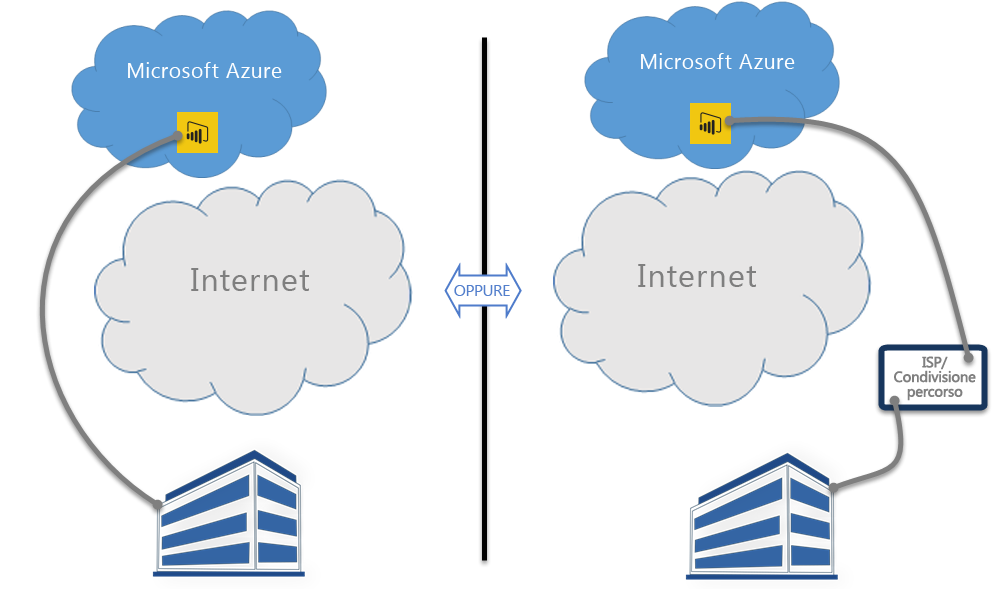

# Power BI ed ExpressRoute
Per creare una connessione di rete privata dell'organizzazione a Power BI è possibile usare **Power BI** ed **ExpressRoute** (oppure la funzionalità di condivisione del percorso di un ISP), escludendo Internet per meglio proteggere i dati riservati e le connessioni di Power BI.

**ExpressRoute** è un servizio di Azure che consente di creare connessioni private tra i data center di Azure (in cui risiede Power BI) e l'infrastruttura locale oppure creare connessioni private tra i data center di Azure e l'ambiente di condivisione del percorso.

È possibile ottenere [altre informazioni su ExpressRoute](https://azure.microsoft.com/services/expressroute/) o scoprire [come iscriversi](https://azure.microsoft.com/pricing/details/expressroute/).

> [!NOTE]
> Power BI è supportato in modalità di peer pubblico, come descritto in [queste domande frequenti](https://docs.microsoft.com/azure/expressroute/expressroute-faqs).
> 
> 

## Eccezioni di Power BI ed ExpressRoute
Power BI è compatibile con ExpressRoute, con alcune eccezioni, in cui Power BI ottiene o invia dati attraverso la rete Internet pubblica. Queste eccezioni specifiche spesso includono dati statici, ad esempio i file di configurazione del browser che vengono scaricati dal più vicino nodo della **rete per la distribuzione di contenuti (CDN)**. Esistono alcune eccezioni generali che si applicano a tutto Power BI e ci sono alcune eccezioni specifiche del servizio o della funzionalità, ciascuna delle quali è documentata nelle sezioni seguenti.

### Eccezioni generali di Power BI ed ExpressRoute
Un'eccezione di **Power BI** ed **ExpressRoute** significa che i dati trasmessi a o da Power BI vengono inviati sulla rete Internet pubblica, anziché attraverso il collegamento ExpressRoute privato.

Le due eccezioni generali di Power BI con ExpressRoute sono:

* File statici scaricati dalla **rete per la distribuzione di contenuti (CDN)** e dai siti Web
* Dati di **telemetria** inviati attraverso la rete Internet pubblica

Power BI usa più **reti per la distribuzione di contenuti (CDN)** o siti Web per distribuire in modo efficiente i necessari file e contenuti statici agli utenti in base alle impostazioni locali geografiche attraverso la rete Internet pubblica. I file statici includono download di prodotti (ad esempio **Power BI Desktop**, **gateway dati locale** o **Pacchetti di contenuto di Power BI** da diversi provider di servizi indipendenti), file di configurazione del browser usati per avviare e stabilire le connessioni successive con Power BI, nonché la pagina iniziale di accesso protetto a Power BI: le effettive credenziali vengono inviate solo via ExpressRoute.   

Anche alcuni **dati di telemetria** vengono inviati attraverso la rete Internet pubblica ed ExpressRoute. I dati di telemetria includono le statistiche di utilizzo e dati simili, che vengono trasmessi ai servizi usati per monitorare l'utilizzo e l'attività.

### Applicazione SaaS di Power BI ed ExpressRoute
Quando un utente avvia una connessione al servizio Power BI (powerbi.com o attraverso Cortana), la pagina di destinazione, la pagina di accesso e i file statici di Power BI che preparano il browser a connettersi e ad interagire con Power BI vengono recuperati da una rete CDN o dai siti Web, che si connettono attraverso la rete Internet pubblica.

Una volta stabilito l'accesso, si verificano le interazioni successive dei dati di Power BI attraverso ExpressRoute, fatta eccezione per alcune funzionalità e servizi che dipendono dai dati Internet pubblici:

* Gli **oggetti visivi della mappa** richiedono la trasmissione di dati e la connessione al servizio Bing Virtual Earth o al servizio di geocodifica di Bing, ciascuna delle quali viene stabilita attraverso la rete Internet pubblica.
* L'integrazione di Power BI con **Cortana** richiede l'accesso a Bing sulla rete Internet pubblica.
* Quando un utente aggiunge dei **collegamenti personalizzati**, ad esempio un widget di immagine o un video, Power BI richiede dati basati sul collegamento fornito dall'utente, che può usare ExpressRoute oppure no.
* Gli utenti possono inviare **commenti e suggerimenti a Power BI** in forma testuale (e, facoltativamente, con immagini) usando il meccanismo di feedback UserVoice, che usa la rete Internet pubblica per la trasmissione.
* Il **provider di contenuti Bing Notizie** scarica il contenuto da Bing usando la rete Internet pubblica.
* Quando ci si connette alle **app** (ad esempio, i pacchetti di contenuto), gli utenti spesso devono immettere le credenziali e le impostazioni usando le pagine fornite dal provider SaaS. Tali pagine possono usare ExpressRoute oppure no.

| Attività dell'utente | Destinazione |
| --- | --- |
| Pagina di destinazione (prima dell'accesso) |`maxcdn.bootstrapcdn.com ; ajax.aspnetcdn.com ; netdna.bootstrapcdn.com ; cdn.optimizely.com; google-analytics.com ` |
| Accesso |`*.mktoresp.com ; *.aadcdn.microsoftonline-p.com ; *.msecnd.com ; *.localytics.com ; ajax.aspnetcdn.com` |
| Gestione di dashboard, report, set di dati (include mappe e geocodifica) |`*.localytics.com ; *.virtualearth.net ; platform.bing.com; powerbi.microsoft.com; c.microsoft.com; app.powerbi.com; *.powerbi.com; dc.services.visualstudio.com ` |
| Supporto |`support.powerbi.com ; powerbi.uservoice.com ; go.microsoft.com ` |

### Power BI Desktop ed ExpressRoute
Power BI Desktop è compatibile anche con ExpressRoute, con alcune eccezioni che sono descritte nell'elenco seguente:

* Le **notifiche di aggiornamento**, usate per rilevare se gli utenti hanno la versione più recente di Power BI Desktop, vengono inviate attraverso la rete Internet pubblica.
* Alcuni **dati di telemetria** vengono inviati attraverso la rete Internet pubblica.
* Gli **oggetti visivi della mappa** richiedono la trasmissione di dati e la connessione al servizio **Bing Virtual Earth** o al servizio di **geocodifica di Bing**, ciascuna delle quali viene stabilita attraverso la rete Internet pubblica.
* Il **recupero dei dati** da diverse origini dati, ad esempio **Web** o i provider SaaS di terze parti avviene attraverso la rete Internet pubblica.

### Power BI PaaS ed ExpressRoute
Power BI offre API e altre funzionalità basate sulla piattaforma che consentono agli sviluppatori di creare app e soluzioni di Power BI personalizzate. Durante la trasmissione dei dati PaaS di Power BI sulla rete Internet pubblica vengono usati i servizi seguenti, oltre ai dati di telemetria e ai dati della rete CDN illustrati in precedenza in questo argomento:

| Attività PaaS | Destinazioni aggiuntive usate |
| --- | --- |
| Incorporamento pubblico (telemetria) |`c1.microsoft.com` |
| Oggetti visivi personalizzati (CDN) |`*.azureedge.net` |

Alcuni **oggetti visivi personalizzati** vengono creati da terze parti, altri vengono creati da Microsoft. Tali oggetti possono usare ExpressRoute oppure no.

### Power BI per dispositivi mobili ed ExpressRoute
Questo documento non tratta l'uso delle app per dispositivi mobili per Power BI.  

### Gateway dati locale ed ExpressRoute
Quando si usa un **gateway dati locale** con Power BI, le trasmissioni sono compatibili con ExpressRoute, fatta eccezione per le attività utente documentate nella precedente sezione **Applicazione SaaS Power BI ed ExpressRoute** di questo argomento.  

