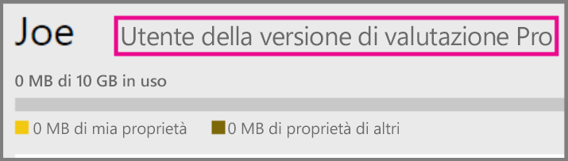
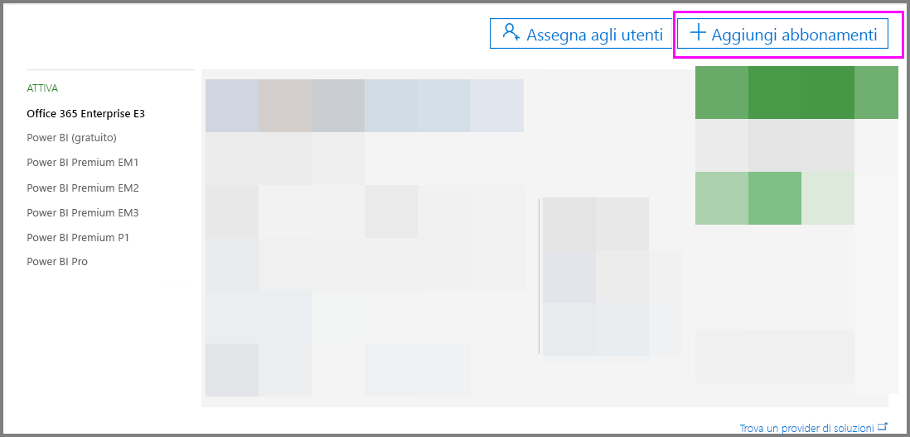

# Power BI Pro nell'organizzazione

Power BI Pro è una licenza a pagamento che abilita più funzionalità. Le licenze di Power BI Pro sono pensate per i team che desiderano condividere e collaborare con altri utenti per prendere decisioni basate sui dati.  Per creare o visualizzare il contenuto condiviso di Power BI ogni membro del team necessita di una licenza Pro, a meno che il contenuto non sia associato a una capacità dedicata tramite Power BI Premium.

Le funzionalità seguenti richiedono una licenza Power BI Pro:

* **Analizzare dati in Excel o Power BI Desktop**: usare Excel o Power BI Desktop per visualizzare e interagire con un set di dati pubblicati in Power BI. Per altre informazioni, vedere [Analizza in Excel](service-analyze-in-excel.md).

* **Condividere dashboard e collaborare con aree di lavoro**: le aree di lavoro di Power BI facilitano la collaborazione con i colleghi su dashboard, report e set di dati. Per altre informazioni, vedere [Collaborare nell'area di lavoro per le app di Power BI](service-collaborate-power-bi-workspace.md).

* **Visualizzare contenuto condiviso**: gli utenti Pro possono visualizzare i dashboard e i report che sono stati condivisi con loro, interagire con i dashbaord e i report che sono stati condivisi con loro e ricondividere i dashboard e i report che sono stati condivisi con loro (se consentito). Tuttavia, un utente Pro non è autorizzato a modificare questi dashboard e report. Per altre informazioni, vedere [Condividere i dashboard e i report di Power BI con i colleghi e con altri utenti](service-share-dashboards.md).

* **Integrare contenuti con Microsoft Teams**: è possibile aggiungere una scheda di Power BI in un canale Microsoft Teams. MS Teams rileva automaticamente tutti i report presenti nell'area di lavoro. Per altre informazioni, vedere l'articolo relativo all'[integrazione tra Power BI e Microsoft Teams](https://powerbi.microsoft.com/en-us/blog/power-bi-teams-up-with-microsoft-teams/). 

## Versione di valutazione gratuita di Power BI Pro di 60 giorni per utenti singoli

Dopo aver effettuato l'iscrizione all'account gratuito, è possibile provare la versione Pro gratuitamente per 60 giorni. Sarà possibile accedere a tutte le funzionalità Pro per la durata del periodo di valutazione. Power BI Pro dispone di tutte le funzionalità della versione gratuita di Power BI, oltre a funzionalità di condivisione e collaborazione aggiuntive. Per altre informazioni, vedere la [pagina dei prezzi di Power BI](https://powerbi.microsoft.com/en-us/pricing/). Per provare una versione di valutazione gratuita di 60 giorni di Power BI Pro, iscriversi a Power BI e provare una di queste funzionalità Power BI Pro.

* [Creare un'area di lavoro](service-create-distribute-apps.md)
* [Share a dashboard (Condividi un dashboard)](service-share-dashboards.md)

Quando si prova una qualsiasi di queste funzionalità, viene richiesto l'avvio della versione di valutazione gratuita. È anche possibile decidere di usarla selezionando l'icona dell'ingranaggio e poi Gestisci archivio personale. Selezionare quindi Prova gratuitamente la versione Pro sulla destra.

   
    
   

È quindi possibile selezionare Avvia versione di valutazione.

   

> [!NOTE]
> Gli utenti che usano questa versione di valutazione di Power BI Pro del prodotto non vengono visualizzati nel portale di amministrazione di Office 365 come utenti della versione di valutazione Power BI Pro (vengono visualizzati come utenti gratuiti di Power BI). Tuttavia, verranno visualizzati come utenti della versione di valutazione di Power BI Pro nella pagina Gestisci archiviazione di Power BI.
>

> [!NOTE]
> Se un amministratore IT vuole acquisire e distribuire le licenze della versione di valutazione di Power BI a più utenti dell'organizzazione senza che i singoli utenti accettino individualmente le condizioni della versione di valutazione, può iscriversi a una versione di valutazione Power BI Pro. È necessario essere un amministratore fatturazione o amministratore globale di Office 365 oppure creare un nuovo tenant per iscriversi a una versione di valutazione per l'amministratore. Per altre informazioni, vedere [Acquisto di Power BI Pro](service-admin-purchasing-power-bi-pro.md).
>

Una volta all'interno del servizio, è possibile verificare di avere un account per la versione di valutazione Pro selezionando l'icona a forma di ingranaggio e scegliendo Gestisci archivio personale.

   

## Sottoscrizione di valutazione di Office 365

È possibile ottenere una versione di valutazione di Power BI Pro per l'organizzazione. Dopo aver creato la sottoscrizione, è possibile assegnare licenze Power BI Pro ai propri utenti. Per altre informazioni su come assegnare le licenze, vedere [Assegnare licenze agli utenti in Office 365](https://support.office.com/en-us/article/assign-licenses-to-users-in-office-365-for-business-997596b5-4173-4627-b915-36abac6786dc?ui=en-US&rs=en-US&ad=US).

> [!NOTE]
> È previsto un limite di una versione di valutazione aziendale per ogni tenant. Ciò significa che se un utente ha già applicato Power BI Pro - Versione di valutazione al tenant, non è possibile ripetere l'operazione. Se è necessaria assistenza a tal riguardo, è possibile contattare il [supporto per la fatturazione di Office 365](https://support.office.microsoft.com/en-us/article/contact-support-for-business-products-admin-help-32a17ca7-6fa0-4870-8a8d-e25ba4ccfd4b?CorrelationId=552bbf37-214f-4202-80cb-b94240dcd671&ui=en-US&rs=en-US&ad=US).
>

Seguire questi passaggi per ottenere una sottoscrizione di valutazione in Office 365:

1. Accedere all'[interfaccia di amministrazione di Office 365](https://portal.office.com/adminportal/home#/homepage).
2. Nel riquadro di spostamento a sinistra, selezionare Fatturazione, quindi selezionare Sottoscrizioni.

   

3. Selezionare l'aggiunta di sottoscrizioni sul lato destro.

   

4. In Altri piani passare il cursore sui puntini di sospensione (...) per Power BI Pro e selezionare Avvia versione di valutazione gratuita.

    

5. Selezionare Prova ora nella schermata di conferma dell'ordine.
6. Selezionare Continua alla ricezione dell'ordine.

## Acquisto di Power BI Pro

È possibile acquistare Power BI Pro tramite Microsoft Office 365 o tramite un partner Microsoft certificato. Per ulteriori informazioni sull'acquisto di Power BI Pro, vedere [Acquisto di Power BI Pro](service-admin-purchasing-power-bi-pro.md).

## Passaggi successivi
[Iscrizione a Power BI in modalità self-service](service-admin-signing-up-for-power-bi-with-a-new-office-365-trial.md)
 
[Power BI (gratuito) nell'organizzazione](service-admin-service-free-in-your-organization.md)
 
[Acquisto di Power BI Pro](service-admin-purchasing-power-bi-pro.md)
 
[Extended Pro Trial activation](service-extended-pro-trial.md) (Attivazione della versione di valutazione Pro estesa)
 
[Assegnazione delle licenze di Power BI Pro](service-admin-assigning-power-bi-pro-licenses.md)
 
[Power BI Premium - what is it?](service-admin-premium-manage.md) (Power BI Premium: definizione)
 
[Come acquistare Power BI Premium](service-admin-premium-purchase.md)
 
[White paper su Power BI Premium](https://aka.ms/pbipremiumwhitepaper)

Altre domande? [Provare a rivolgersi alla community di Power BI](https://community.powerbi.com/)