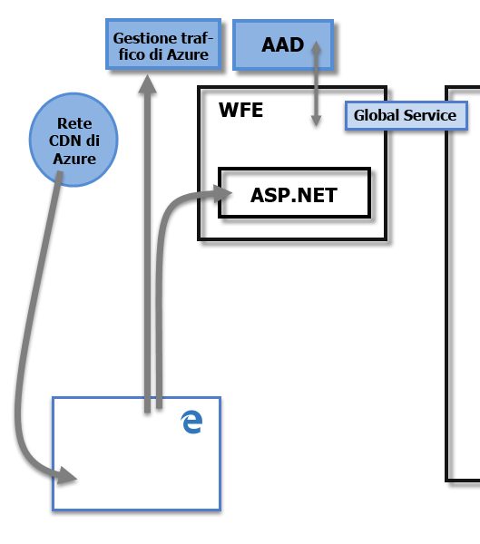
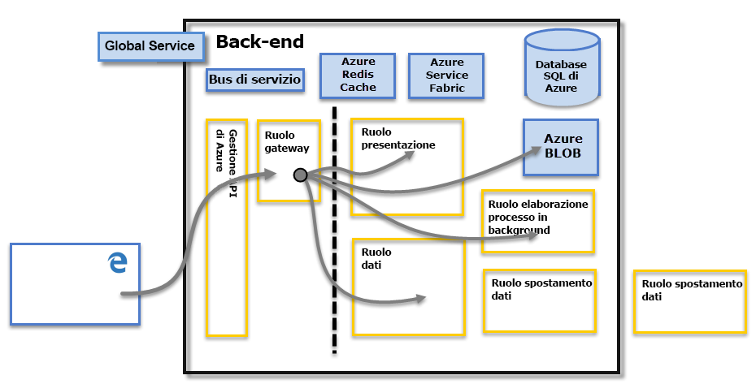

# Sicurezza di Power BI
Per una spiegazione dettagliata sulla sicurezza di Power BI, [scaricare il white paper sulla sicurezza di Power BI](http://go.microsoft.com/fwlink/?LinkId=829185):

Il servizio Power BI si basa su **Azure**, cioè l'infrastruttura e piattaforma di cloud computing di Microsoft. L'architettura del servizio Power BI è basata su due cluster: il cluster Web Front End (**WFE**) e il cluster **Back End** . Il cluster WFE è responsabile della connessione e dell'autenticazione iniziale al servizio Power BI e, dopo l'autenticazione, il cluster Back End gestisce tutte le successive interazioni con l'utente. Power BI usa Azure Active Directory (AAD) per archiviare e gestire le identità degli utenti e gestisce l'archiviazione di dati e metadati usando rispettivamente l'archivio BLOB di Azure e il Database SQL di Azure.

## Architettura di Power BI
Ogni distribuzione di Power BI è costituita da due cluster: un cluster Web Front End (**WFE**) e un cluster **Back End** .

Il cluster **WFE** gestisce il processo di autenticazione e connessione iniziale per Power BI, usando AAD per autenticare i client e fornire i token per le successive connessioni del client al servizio Power BI. Power BI usa anche **Gestione traffico di Azure** per indirizzare il traffico utente al data center più vicino, determinato dal record DNS del client che sta provando a connettersi, per il processo di autenticazione e per scaricare il contenuto e i file statici. Power BI usa la **Rete di distribuzione dei contenuti di Azure** per distribuire in modo efficiente i necessari file e contenuti statici agli utenti in base alle impostazioni locali geografiche.

Il cluster **Back End** permette ai client autenticati di interagire con il servizio Power BI. Il cluster **Back End** gestisce le visualizzazioni, i dashboard utente, i set di dati, i report, l'archiviazione dei dati, le connessioni dati, l'aggiornamento dei dati e altri aspetti dell'interazione con il servizio Power BI. Il **ruolo Gateway** funge da gateway tra le richieste degli utenti e il servizio Power BI. Gli utenti interagiscono direttamente solo con il **ruolo Gateway**. **Gestione API di Azure** gestirà infine il **ruolo Gateway**.

> [!IMPORTANT]
> È fondamentale notare che solo i ruoli **Gestione API di Azure** e **Gateway** sono accessibili attraverso la rete Internet pubblica. Forniscono l'autenticazione, l'autorizzazione, la protezione DDoS, la limitazione delle richieste, il bilanciamento del carico, il routing e altre funzionalità.
> 
> 

## Sicurezza dell'archiviazione dati
Power BI usa due repository principali per l'archiviazione e la gestione dei dati: i dati caricati dagli utenti in genere vengono inviati all'archiviazione **BLOB di Azure** e tutti i metadati, nonché gli elementi per il sistema stesso, vengono archiviati nel **Database SQL di Azure**.

La linea tratteggiata nell'immagine del cluster **Back End** sopra illustrata indica il limite tra gli unici due componenti che sono accessibili dagli utenti (a sinistra della linea tratteggiata) e i ruoli che sono accessibili solo dal sistema. Quando un utente autenticato si connette al servizio Power BI, la connessione e qualsiasi richiesta del client vengono accettate e gestite dal **ruolo Gateway** (e alla fine gestite da **Gestione API di Azure**), che a sua volta interagisce per conto dell'utente con il resto del servizio Power BI. Ad esempio, quando un client prova a visualizzare un dashboard, il **ruolo Gateway** accetta la richiesta e quindi invia separatamente una richiesta al **ruolo Presentation** per recuperare i dati necessari a eseguire il rendering del dashboard nel browser.

## Autenticazione dell'utente
Power BI usa Azure Active Directory ([AAD](http://azure.microsoft.com/services/active-directory/)) per autenticare gli utenti che eseguono l'accesso al servizio Power BI e, a sua volta, usa le credenziali di accesso di Power BI ogni volta che un utente prova ad accedere a risorse che richiedono l'autenticazione. Gli utenti eseguono l'accesso al servizio Power BI usando l'indirizzo di posta elettronica impiegato per stabilire il proprio account di Power BI; Power BI usa il messaggio di posta elettronica di accesso come *nome utente effettivo*, che viene quindi passato alle risorse ogni volta che un utente prova a connettersi ai dati. Il *nome utente effettivo* viene quindi mappato a un *nome dell'entità utente* ([UPN](https://msdn.microsoft.com/library/windows/desktop/aa380525\(v=vs.85\).aspx)) e risolto con l'account di dominio di Windows associato, a cui viene applicata l'autenticazione.

Per le organizzazioni che usavano account di posta elettronica aziendali per eseguire l'accesso a Power BI (ad esempio *david@contoso.com*, il *nome utente effettivo*) il mapping UPN è diretto. Per le organizzazioni che non usavano account di posta elettronica aziendali per eseguire l'accesso a Power BI, ad esempio *david@contoso.onmicrosoft.com*, il mapping tra AAD e le credenziali locali richiede la [sincronizzazione delle directory](https://technet.microsoft.com/library/jj573653.aspx) per il corretto funzionamento.

La sicurezza della piattaforma per Power BI include anche la sicurezza dell'ambiente multi-tenant, la sicurezza delle reti e la possibilità di aggiungere misure di sicurezza aggiuntive basate su AAD.

## Sicurezza di dati e servizi
Per altre informazioni, visitare il [Centro protezione Microsoft](https://www.microsoft.com/trustcenter).

Come descritto in precedenza in questo articolo, l'accesso di un utente a Power BI viene usato dai server di Active Directory locali per eseguire il mapping a un UPN per le credenziali. Tuttavia, è **importante** notare che gli utenti sono responsabili per i dati che condividono: se un utente si connette alle origini dati usando le proprie credenziali e quindi condivide un report (o un dashboard o un set di dati) in base a tali dati, gli utenti con cui condivide il dashboard non vengono autenticati rispetto all'origine dati originale e avranno l'accesso al report.

Un'eccezione riguarda le connessioni a **SQL Server Analysis Services** con **Gateway dati locale**. I dashboard vengono memorizzati nella cache in Power BI, ma l'accesso ai report o ai set di dati sottostanti avvia l'autenticazione per l'utente che prova ad accedere al report o al set di dati e viene concesso solo se l'utente ha credenziali sufficienti per accedere ai dati. Per altre informazioni, vedere [On-premises Data Gateway deep dive (Approfondimento sul gateway dati locale)](service-gateway-onprem-indepth.md).

