# Gestire capacità all'interno di Power BI Premium e Power BI Embedded

Informazioni su come gestire le capacità Power BI Premium e Power BI Embedded che offrono risorse dedicate per il contenuto.

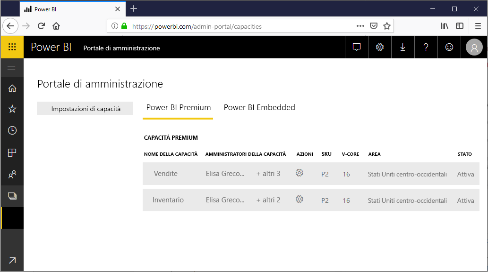

## Che cos'è la capacità?

Il concetto di *capacità* è al cuore delle offerte di Power BI Premium e Power BI Embedded. Si tratta di un set di risorse riservate per l'uso esclusivo da parte dell'organizzazione. La capacità dedicata consente di pubblicare dashboard, report e set di dati per gli utenti dell'organizzazione senza dover acquistare licenze individuali, nonché di offrire prestazioni affidabili e coerenti per il contenuto ospitato nella capacità. Per altre informazioni, vedere [What is Power BI Pro?](service-premium.md) (Che cos'è Power BI Pro?).

### Amministratori della capacità

Quando l'utente viene assegnato come *amministratore della capacità*, ha il controllo completo su tale capacità e sulle relative funzionalità amministrative. Dall'interfaccia di amministrazione di Power BI è possibile aggiungere altri amministratori di capacità o concedere agli utenti autorizzazioni di assegnazione della capacità. È possibile assegnare in blocco le aree di lavoro a una capacità e visualizzare le metriche di utilizzo per una capacità.

> [!NOTE]
> Per Power BI Embedded, gli amministratori della capacità vengono definiti nel portale di Microsoft Azure.

Ogni capacità ha i propri amministratori. Quando un amministratore della capacità viene assegnato a una capacità, non ha l'accesso a tutte le capacità all'interno dell'organizzazione. Per impostazione predefinita gli amministratori della capacità non hanno accesso a tutte le aree degli amministratori di Power BI come ad esempio le metriche di utilizzo, i log di controllo o le impostazioni del tenant. Gli amministratori della capacità non hanno neanche le autorizzazioni per configurare nuove capacità o modificare lo SKU delle capacità esistenti. Solo gli amministratori globali di Office 365 o gli amministratori del servizio Power BI hanno accesso a tali elementi.

Tutti gli amministratori globali di Office 365 e gli amministratori del servizio Power BI sono automaticamente amministratori della capacità sia di Power BI Premium che di Power BI Embedded.

## Acquistare capacità

Per sfruttare i vantaggi della capacità dedicata, è necessario acquistare Power BI Premium dall'interfaccia di amministrazione di Office 365 o creare una risorsa di Power BI Embedded nel portale di Microsoft Azure. Per altre informazioni, vedere gli articoli seguenti:

* **Power BI Premium:** [How to purchase Power BI Premium](service-admin-premium-purchase.md) (Come acquistare Power BI Premium)

* **Power BI Embedded:** [Creare capacità di Power BI Embedded nel portale di Azure](https://docs.microsoft.com/azure/power-bi-embedded/create-capacity)

Quando si acquistano gli SKU di Power BI Premium o Power BI Embedded, il tenant riceve il numero corrispondente di memorie centrali virtuali da usare nelle capacità in esecuzione. Ad esempio, l'acquisto di uno SKU P3 di Power BI Premium fornisce al tenant 32 memorie centrali virtuali. Per altre informazioni, vedere [Nodi della capacità Premium](service-premium.md#premium-capacity-nodes).

## Aspetto di Premium per gli utenti

Per la maggior parte, gli utenti non dovranno neanche sapere di essere in una capacità Premium, perché i dashboard e i report continueranno a funzionare normalmente. Come suggerimento visivo, viene visualizzata un'icona di diamante accanto alle aree di lavoro che sono in una capacità Premium.

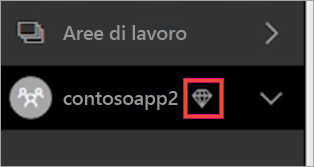

## Configurare i carichi di lavoro

Per impostazione predefinita, le capacità per Power BI Premium e Power BI Embedded supportano solo il carico di lavoro associato all'esecuzione di query di Power BI nel cloud. È ora disponibile il supporto di anteprima per due carichi di lavoro aggiuntivi: **Report impaginati** e **Flussi di dati**. Per altre informazioni, vedere [Carichi di lavoro nella capacità Premium](service-premium.md#workloads-in-premium-capacity).

Per abilitare i carichi di lavoro nel portale di amministrazione di Power BI, seguire questa procedura.

1. In **Impostazioni di capacità** selezionare una capacità.

1. In **ALTRE OPZIONI** espandere **Carichi di lavoro**.

1. Abilitare uno o più carichi di lavoro e impostare un valore per **Memoria massima**.

    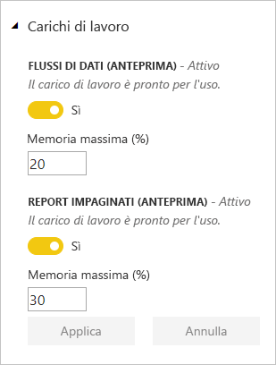

1. Selezionare **Applica**.

## Monitorare l'utilizzo della capacità

Power BI offre un'app per il monitoraggio dell'utilizzo della capacità. Per altre informazioni, vedere [Monitorare le capacità di Power BI Premium nell'organizzazione](service-admin-premium-monitor-capacity.md).

## Gestire la capacità

Dopo aver acquistato i nodi della capacità di Office 365, è necessario configurare la capacità nell'interfaccia di amministrazione di Power BI. Le capacità di Power BI Premium vengono gestite nella sezione **Impostazioni di capacità** del portale.

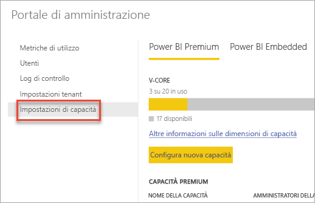

È possibile gestire una capacità selezionandone il nome per passare alla schermata di gestione relativa.

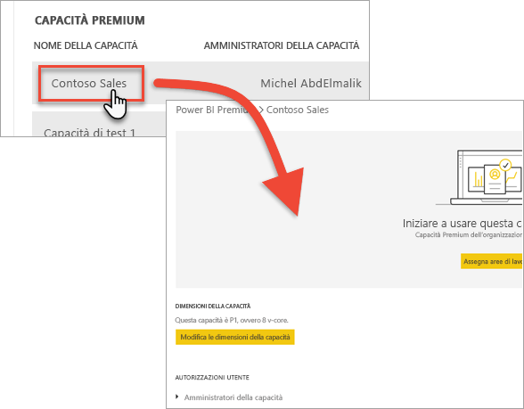

Se nessuna area di lavoro è stata assegnata alla capacità, verrà visualizzato un messaggio relativo all'[assegnazione di aree di lavoro alla capacità](#assign-a-workspace-to-a-capacity).

### Configurazione di una nuova capacità (Power BI Premium)

L'interfaccia di amministrazione indica il numero di *memorie centrali virtuali* (vCore) che sono state usate e sono ancora disponibili. Il numero totale di memorie centrali virtuali si basa sugli SKU Premium che sono stati acquistati. Ad esempio, se si acquista uno SKU P3 e uno SKU P2 si hanno 48 memorie centrali disponibili: 32 dallo SKU P3 e 16 dallo SKU P2.

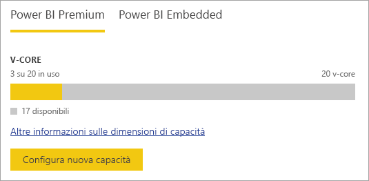

Se si hanno memorie centrali virtuali disponibili, configurare la nuova capacità eseguendo la procedura seguente.

1. Selezionare **Configura nuova capacità**.

1. Assegnare un nome alla capacità.

1. Definire chi è l'amministratore per la capacità.

1. Selezionare le dimensioni della capacità. Le opzioni disponibili dipendono dal numero di memorie centrali virtuali disponibili. Non è possibile selezionare un'opzione che è maggiore del numero disponibile.

    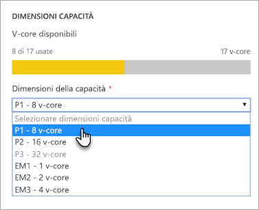

1. Selezionare **Configura**.

    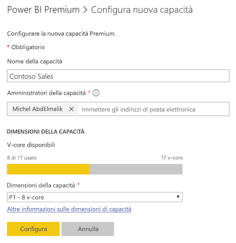

Gli amministratori della capacità, nonché gli amministratori di Power BI e gli amministratori globali di Office 365, vedono quindi la capacità elencata nell'interfaccia di amministrazione.

### Impostazioni di capacità

1. All'interno della schermata di gestione della capacità Premium in **Azioni** selezionare l'**icona a forma di ingranaggio** per rivedere e aggiornare le impostazioni. 

    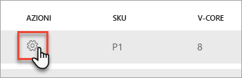

1. È possibile vedere chi sono gli amministratori del servizio, lo SKU/le dimensioni della capacità e in quale regione si trova la capacità.

    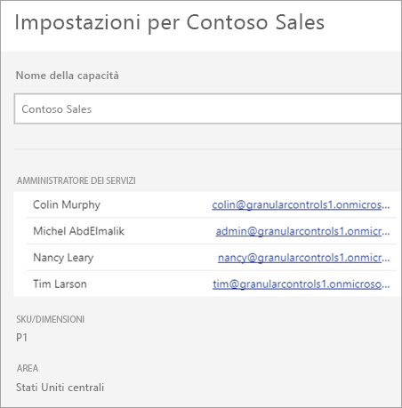

1. È anche possibile rinominare o eliminare una capacità.

    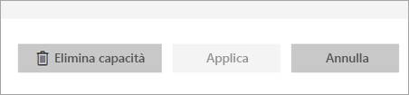

> [!NOTE]
> Le impostazioni di capacità di Power BI Embedded vengono gestite nel portale di Microsoft Azure.

### Modifica le dimensioni della capacità

Gli amministratori di Power BI e gli amministratori globali di Office 365 possono modificare la capacità di Power BI Premium. Gli amministratori della capacità che non sono amministratori di Power BI o amministratori globali di Office 365 non hanno questa possibilità.

1. Selezionare **Modifica le dimensioni della capacità**.

    

1. Nella schermata **Modifica le dimensioni della capacità** aggiornare o effettuare il downgrade della capacità in modo appropriato.

    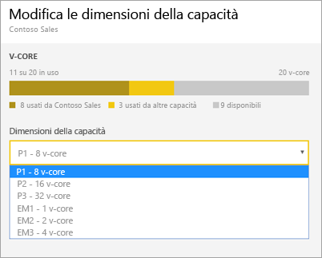

    Gli amministratori possono creare, ridimensionare ed eliminare i nodi purché abbiano il numero necessario di memorie centrali virtuali.

    Non è possibile effettuare il downgrade degli SKU P agli SKU EM. È possibile passare il mouse sulle opzioni disabilitate per visualizzare una spiegazione.

### Gestire le autorizzazioni utente

È possibile assegnare altri amministratori della capacità, nonché assegnare gli utenti che hanno le autorizzazioni di *assegnazione della capacità*, che potranno assegnare un'area di lavoro per le app alla capacità se sono anche amministratori di tale area di lavoro, oltre ad assegnare l'*Area di lavoro personale* alla capacità. Gli utenti con autorizzazioni di assegnazione non avranno accesso all'interfaccia di amministrazione.

> [!NOTE]
> Per Power BI Embedded, gli amministratori della capacità vengono definiti nel portale di Microsoft Azure.

Sotto **Autorizzazioni utente** espandere **Utenti con autorizzazioni di assegnazione** e aggiungere gli utenti e i gruppi appropriati.

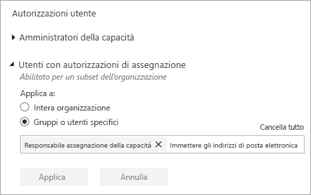

## Assegnare un'area di lavoro a una capacità

Esistono due modi per assegnare un'area di lavoro a una capacità: nell'interfaccia di amministrazione e da un'area di lavoro per le app.

### Assegnazione dall'interfaccia di amministrazione

Gli amministratori della capacità, insieme con gli amministratori di Power BI e gli amministratori globali di Office 365, possono assegnare in blocco le aree di lavoro nella sezione di gestione della capacità Premium dell'interfaccia di amministrazione. Quando si gestisce una capacità, si può visualizzare una sezione **Aree di lavoro** che consente di assegnare le aree di lavoro.

1. Selezionare **Assegna aree di lavoro**. Questa opzione è disponibile in più posizioni.

1. Selezionare un'opzione per **Apply to** (Applica a).

    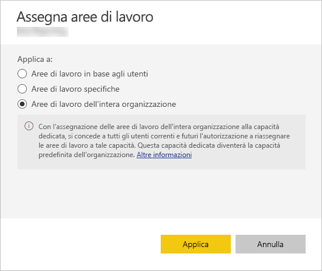

   | Selezione | Descrizione |
   | --- | --- |
   | **Aree di lavoro in base agli utenti** | Quando si assegnano le aree di lavoro per utente o gruppo, tutte le aree di lavoro appartenenti a tali utenti vengono assegnate alla capacità Premium, tra cui l'area di lavoro personale dell'utente. Tali utenti ottengono automaticamente le autorizzazioni di assegnazione dell'area di lavoro. Ciò include le aree di lavoro già assegnata a una capacità diversa. |
   | **Aree di lavoro specifiche** | Immettere il nome di un'area di lavoro specifica da assegnare alla capacità selezionata. |
   | **Aree di lavoro dell'intera organizzazione** | L'assegnazione di aree di lavoro dell'intera organizzazione alla capacità Premium comporta l'assegnazione di tutte le aree di lavoro per le app e delle aree di lavoro personali, all'interno dell'organizzazione, a questa capacità Premium. In più, tutti gli utenti attuali e futuri saranno autorizzati a riassegnare singole aree di lavoro a questa capacità. |
   | | |

1. Selezionare **Applica**.

### Assegnazione dalle impostazioni dell'area di lavoro per le app

È anche possibile assegnare capacità Premium a un'area di lavoro per le app dalle relative impostazioni. Per spostare un'area di lavoro nella capacità, è necessario avere le autorizzazioni di amministratore per tale area di lavoro, nonché le autorizzazioni di assegnazione di capacità per tale capacità. Gli amministratori dell'area di lavoro possono sempre rimuovere un'area di lavoro dalla capacità Premium.

1. Modificare un'area di lavoro per le app selezionando i puntini di sospensione **(. . .)** e selezionando **Modifica area di lavoro**.

    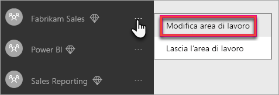

1. In **Modifica area di lavoro** espandere **Avanzate**.

1. Selezionare la capacità che si vuole assegnare a questa area di lavoro per le app.

    

1. Selezionare **Salva**.

Dopo il salvataggio, l'area di lavoro e il relativo contenuto vengono spostati nella capacità Premium senza alcuna interruzione dell'esperienza di utilizzo per gli utenti finali.

## Codice Product Key del Server di report Power BI

Nella scheda **Impostazioni di capacità** dell'interfaccia di amministratore di Power BI si avrà accesso al codice Product Key del Server di Report di Power BI. Questo sarà disponibile solo per gli amministratori globali o per gli utenti a cui è stato assegnato il ruolo di amministratore del servizio Power BI e se è stato acquistato uno SKU di Power BI Premium.

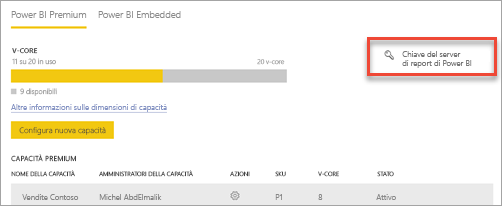

Se si seleziona **Chiave del server di report di Power BI** viene visualizzata una finestra di dialogo contenente il codice Product Key. È possibile copiarlo e usarlo durante l'installazione.

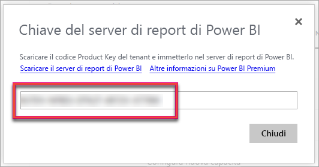

Per altre informazioni, vedere [Install Power BI Report Server](report-server/install-report-server.md) (Installare il Server di report di Power BI).

## Passaggi successivi

Condividere app pubblicate con altri utenti. Per altre informazioni, vedere [Creare e distribuire un'app in Power BI](service-create-distribute-apps.md).

Altre domande? [Provare a rivolgersi alla community di Power BI](http://community.powerbi.com/)
