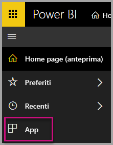
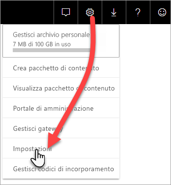
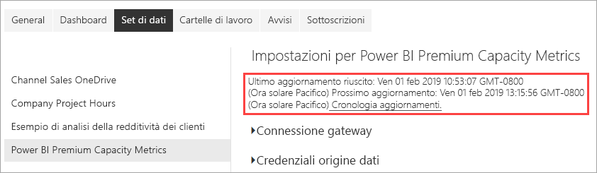
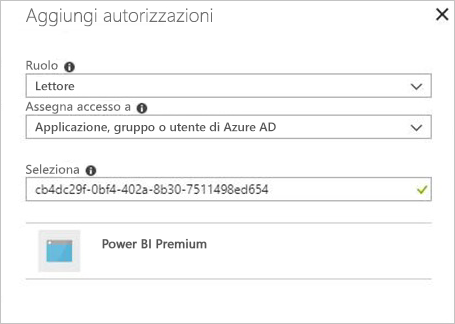

# Monitorare le capacità Premium con l'app

Il monitoraggio delle capacità è essenziale per prendere decisioni informate sull'uso ottimale delle risorse della capacità Premium. È possibile monitorare le capacità nel portale di amministrazione o tramite l'app **Power BI Premium Capacity Metrics**. Questo articolo descrive l'uso dell'app Premium Capacity Metrics. L'app fornisce le informazioni più dettagliate sulle prestazioni delle capacità. Per informazioni più generiche sulle metriche d'uso medie negli ultimi sette giorni, è possibile usare il portale di amministrazione. Per altre informazioni sul monitoraggio nel portale, vedere [Monitorare le capacità Premium nel portale di amministrazione](service-admin-premium-monitor-portal.md).

L'app viene aggiornata periodicamente con nuove caratteristiche e funzionalità. Verificare di eseguire la versione più recente. Se è già installata una versione precedente dell'app, è consigliabile eliminarla dalle app e premere CTRL+F5 per aggiornare.

## Installare l'app

È possibile passare direttamente all'[app Premium Capacity Metrics](https://app.powerbi.com/groups/me/getapps/services/capacitymetrics) oppure installarla come le altre app in Power BI.

1. In Power BI fare clic su **App**.

    

2. Sul lato destro fare clic su **Get apps** (Ottieni app).
3. Nella categoria **Apps** (App) cercare **app Power BI Premium Capacity Metrics**.
4. Eseguire la sottoscrizione per installare l'app.

È necessario attendere. L'installazione e l'aggiornamento delle metriche richiedono qualche minuto. Se l'app visualizza metriche vuote, premere F5 per aggiornare il browser.

## Ottenere la cronologia aggiornamenti dell'app

Per verificare quando è stato effettuato l'ultimo aggiornamento dell'app Premium Capacity Metrics, fare clic su **Impostazioni** > **Set di dati** > **Power BI Premium Capacity Metrics** > **Cronologia aggiornamenti**. 

Viene visualizzato l'ultimo aggiornamento; in alternativa fare clic su **Cronologia aggiornamenti** per visualizzare gli aggiornamenti pianificati e su richiesta.

## Monitorare le capacità con l'app

Dopo aver installato l'app è possibile visualizzare le metriche relative alle capacità all'interno dell'organizzazione. L'app offre un dashboard con riepiloghi delle metriche e report delle metriche dettagliati.

### Dashboard

Per visualizzare un dashboard che riepiloga le metriche principali per le capacità di cui si è amministratore, in **Dashboard** fare clic su **Power BI Premium Capacity Metrics**. Viene visualizzato un dashboard.

Il dashboard include le metriche seguenti:

#### All'inizio

| Metrica | Descrizione |
| --- | --- |
| Versione | Versione dell'app. | 
| Capacities | Numero di capacità per cui si è amministratori. | 
| Aree di lavoro | Numero di aree di lavoro nelle capacità che segnalano metriche.|
|||

#### System Summary

| Metrica | Descrizione |
| --- | --- |
| CPU Highest Utilization Capacity | Capacità con il numero massimo di volte per il quale la CPU ha superato l'80% delle soglie negli ultimi sette giorni. |
| CPU Highest Utilization Count | Numero di volte in cui la capacità denominata ha superato l'80% delle soglie negli ultimi sette giorni. | 
| Memory Max Utilization Capacity | Capacità con il numero massimo di volte in cui è stato raggiunto il limite massimo di memoria negli ultimi sette giorni, suddiviso in bucket da tre minuti.  |
| Memory Max Utilization Count| Numero di volte in cui la capacità denominata ha raggiunto il limite massimo di memoria negli ultimi sette giorni, suddiviso in bucket di tre minuti. |
|||

#### Dataset Summary

| Metrica | Descrizione |
| --- | --- |
| Set di dati | Numero totale di set di dati in tutte le aree di lavoro nelle capacità.|
| Datasets Average Size (MB) | Dimensioni medie dei set di dati in tutte le aree di lavoro nelle capacità.|  
| Datasets Average Loaded Count | Conteggio medio dei set di dati caricati in memoria. |  
| Datasets - Average Active Dataset (%)| Media dei set di dati attivi negli ultimi sette giorni. Un set di dati è definito attivo se l'utente ha interagito con gli oggetti visivi negli ultimi tre minuti. |
| CPU - Datasets Max (%)| Utilizzo massimo della CPU del carico di lavoro del set di dati negli ultimi sette giorni. |
| CPU - Datasets Average (%)| Utilizzo medio della CPU del carico di lavoro del set di dati negli ultimi sette giorni. |
| Memory - Datasets Average (GB) | Utilizzo medio della memoria del carico di lavoro del set di dati negli ultimi sette giorni. |
| Memory - Datasets Max (GB) | Utilizzo massimo della memoria del carico di lavoro del set di dati negli ultimi sette giorni.|
| Datasets Evictions | Numero totale di set di dati rimossi a causa di un utilizzo elevato della memoria. |
| DirectQuery/Live High Utilization Count| Numero di volte per il quale le connessioni DirectQuery/dinamiche hanno superato l'80% delle soglie negli ultimi sette giorni, suddiviso in bucket di tre minuti. |
| DirectQuery/Live Max Utilization Count| Numero massimo di volte per il quale le connessioni DirectQuery/dinamiche hanno superato l'80% negli ultimi sette giorni, suddiviso in bucket di un'ora. |
| DirectQuery/Live Max High Utilization | Numero massimo di volte in cui le connessioni DirectQuery/dinamiche hanno superato l'80% delle soglie negli ultimi sette giorni, suddiviso in bucket di tre minuti.|
| DirectQuery/Live Max Occurred Time | Ora in UTC in cui le connessioni DirectQuery/dinamiche hanno superato l'80% la maggior parte delle volte in un'ora. |
| Refreshes Total | Numero totale di aggiornamenti negli ultimi sette giorni. |
| Refresh Reliability (%) | Numero di aggiornamenti con esito positivo, diviso per il numero totale di aggiornamenti negli ultimi sette giorni. |
| Refreshes Average Duration (Minutes) | Quantità media di tempo per completare l'aggiornamento. |
| Refreshes Average Wait Time (Minutes)| Quantità media di tempo prima di avviare l'aggiornamento. |
| Queries Total |  Numero totale di query eseguite negli ultimi sette giorni. |
| Queries Total Wait Count | Numero totale di query che devono attendere l'esecuzione. |
| Queries Average Duration (MS) | Tempo medio necessario per completare le query. |
| Queries Average Wait Time (MS) | Tempo medio di attesa delle risorse di sistema prima dell'esecuzione delle query. |
|||

#### Dataflow Summary

| Metrica | Descrizione |
| --- | --- |
| Flussi di dati |  Numero totale di flussi di dati in tutte le aree di lavoro delle capacità.|
| Refreshes Total | Numero totale di aggiornamenti negli ultimi sette giorni.|  
| Refreshes Average Duration (Minutes) | Tempo impiegato per completare l'aggiornamento. |
| Refreshes Average Wait Times (Minutes) | Intervallo tra l'ora pianificata e l'inizio effettivo dell'aggiornamento.|
| CPU - Dataflows Max (%) | Utilizzo massimo della CPU del carico di lavoro dei flussi di dati negli ultimi sette giorni. |
| CPU - Dataflows Average (%) | Utilizzo medio della CPU del carico di lavoro dei flussi di dati negli ultimi sette giorni. |
| Memory - Dataflows Max (GB) | Utilizzo massimo della memoria del carico di lavoro dei flussi di dati negli ultimi sette giorni. |
| Memory - Dataflows Average (GB) | Utilizzo medio della memoria del carico di lavoro dei flussi di dati negli ultimi sette giorni. |
|||

#### Paginated Report Summary

| Metrica | Descrizione |
| --- | --- |
| Paginated Reports |  Numero totale di report impaginati in tutte le aree di lavoro delle capacità. |
| Views Total | Numero totale di volte per il quale tutti i report sono stati visualizzati dagli utenti. | 
| Rows Total | Numero totale di righe di dati in tutti i report.|
| Total Time | Tempo totale impiegato per tutte le fasi (recupero, elaborazione e rendering dei dati) di tutti i report, in millisecondi. |
| CPU - Paginated Reports Max (%) | Utilizzo massimo della CPU del carico di lavoro dei report impaginati negli ultimi sette giorni. |
| CPU - Paginated Reports Average (%) | Utilizzo medio della CPU del carico di lavoro dei report impaginati negli ultimi sette giorni. |
| Memory - Paginated Reports Max (GB) | Utilizzo massimo della memoria del carico di lavoro dei report impaginati negli ultimi sette giorni. |
| Memory - Paginated Reports Average (GB) | Utilizzo medio della memoria del carico di lavoro dei report impaginati negli ultimi sette giorni. |
|||

#### AI Summary

| Metrica | Descrizione |
| --- | --- |
| AI Function Execution | Numero totale di esecuzioni negli ultimi sette giorni. |
| AI Function Execution Reliability (%) | Numero di esecuzioni completate, diviso per il numero totale di esecuzioni negli ultimi sette giorni. |
| CPU Max (%)| Utilizzo massimo della CPU da parte del carico di lavoro di intelligenza artificiale negli ultimi sette giorni. |
| Memory Max (GB) | Utilizzo massimo della memoria da parte del carico di lavoro di intelligenza artificiale negli ultimi sette giorni.|
| AI Function Execution Max Wait Time (MS) | Quantità massima di tempo prima dell'avvio dell'esecuzione. |
| AI Function Execution Average Wait Time (MS)| Quantità media di tempo prima dell'avvio dell'esecuzione. |
| AI Function Execution Max Duration (MS) | Quantità massima di tempo per il completamento l'esecuzione. |
| AI Function Execution Average Duration (MS)| Quantità media di tempo per il completamento l'esecuzione. |
| | |

### Report

I report forniscono metriche più dettagliate. Per visualizzare i report per cui si è amministratore, nella capacità **Report** fare clic su **Power BI Premium Capacity Metrics**. In alternativa, dal dashboard fare clic su una cella di metrica per passare al report sottostante. 

Nella parte inferiore del report sono presenti *cinque schede*:

[**Datasets**](#datasets) (Set di dati): metriche dettagliate sull'integrità dei set di dati di Power BI nelle capacità.
[**Paginated Reports**](#paginated-reports) (Report impaginati): metriche dettagliate sull'integrità dei report impaginati nelle capacità.
[**Dataflows**](#dataflows) (Flussi di dati): metriche di aggiornamento dettagliate per i flussi di dati nelle capacità.
[**AI**](#ai) (Intelligenza artificiale): metriche dettagliate sull'integrità delle funzioni di intelligenza artificiale usate nelle capacità.
[**Resource Consumption**](#resource-consumption) (Consumo risorsa): metriche sulle risorse dettagliate, ad esempio metriche di utilizzo elevato della CPU e della memoria.
[**IDs and Info**](#ids-and-info) (ID e informazioni): nomi, ID e proprietari di capacità, aree di lavoro e carichi di lavoro.

Ogni scheda apre una pagina in cui è possibile filtrare le metriche per capacità e intervallo di date. Se non viene selezionato alcun filtro, per impostazione predefinita il report visualizza le metriche della settimana precedente per ogni capacità che include metriche di report. 

### Set di dati

La pagina Datasets (Set di dati) è suddivisa in varie *aree* che includono **Refreshes** (Aggiornamenti), **Query Durations** (Durata query), **Query Waits** (Attesa query) e **Datasets** (Set di dati). Usare i pulsanti nella parte superiore della pagina per passare ad altre aree.

#### Area Refreshes (Aggiornamenti)

| Sezione del report | Metrica |
| --- | --- |
| Refreshes |  Total Count (Conteggio totale): aggiornamenti totali per ogni set di dati.   Reliability (Affidabilità): percentuale di aggiornamenti completati per ogni set di dati.   Avg Wait Time (Tempo medio di attesa): ritardo medio tra l'ora pianificata e l'inizio di un aggiornamento per il set di dati, espresso in minuti.   Max Wait Time (Tempo massimo di attesa): tempo di attesa massimo per il set di dati, espresso in minuti.   Avg Duration (Durata media): durata media dell'aggiornamento per il set di dati, espressa in minuti.   Max Duration (Durata massima): durata dell'aggiornamento con esecuzione più prolungata per il set di dati, espressa in minuti. |
| Top 5 Datasets by Average Duration (minutes) |  I cinque set di dati con la durata media dell'aggiornamento più lunga, espressa in minuti. |
| Top 5 Datasets by Average Wait Time (minutes) |  I cinque set di dati con il tempo di attesa medio dell'aggiornamento più lungo, espresso in minuti. |
| Hourly Refresh Count and Memory Consumption (GB) |  Operazioni riuscite, errori e utilizzo della memoria, suddivisi in bucket di un'ora, indicati nell'ora UTC. |
| Hourly Average Refresh Wait Times (minutes) |  Tempo di attesa medio degli aggiornamenti, suddiviso in bucket di un'ora, indicato nell'ora UTC. La presenza di più picchi con tempi di attesa degli aggiornamenti elevati è indicativa di un livello di utilizzo molto alto della capacità. |
|  |  |

#### Area Query Durations (Durate query)

| Sezione del report | Metrica |
| --- | --- |
| Query Durations |  I dati di questa sezione sono sezionati in base a set di dati, area di lavoro e bucket orari negli ultimi sette giorni.   Totale: numero totale di query eseguite per il set di dati.   Media: durata media della query per il set di dati, espressa in millisecondi   Max (Massima): durata della query con esecuzione più prolungata nel set di dati, espressa in millisecondi.|
| Query Duration Distribution |  L'istogramma delle durate delle query è suddiviso in bucket in base alle durate delle query (in millisecondi) nelle categorie seguenti: <= 30 ms, 30-100 ms, 100-300 ms, 300 ms-1 sec, 1 sec-3 sec, 3 sec-10 sec, 10 sec-30 sec e intervalli maggiori di 30 secondi. Una durata notevole delle query e tempi di attesa lunghi sono indicativi di un livello di utilizzo molto alto della capacità. Questi sintomi possono indicare anche che il problema è causato da un unico set di dati e che è necessario indagarne le cause. |
| Top 5 Datasets by Average Duration |  I cinque set di dati con la durata media della query più lunga, espressa in millisecondi. |
| Hourly Query Duration Distributions |  Numero delle query e durata media (in millisecondi) rispetto al consumo di memoria in GB, suddivisi in bucket di un'ora, indicati nell'ora UTC. |
| DirectQuery / Live Connections (> 80% Utilization) |  Numero di volte in cui una connessione DirectQuery o dinamica ha superato l'80% di utilizzo della CPU, suddiviso in bucket di un'ora, indicato nell'ora UTC. |
|  |  |

#### Area Query Waits (Attese query)

| Sezione del report | Metrica |
| --- | --- |
| Query Wait Times |  I dati di questa sezione sono sezionati in base a set di dati, area di lavoro e bucket orari negli ultimi sette giorni.   Totale: numero totale di query eseguite per il set di dati.   Wait Count (Conteggio di attesa): numero di query nel set di dati in attesa nelle risorse di sistema prima di avviare l'esecuzione.   Media: tempo di attesa medio della query per il set di dati, espresso in millisecondi.   Max (Massima): durata della query con attesa più prolungata nel set di dati, espressa in millisecondi.|
| Top 5 Datasets by Average Wait Time |  I cinque set di dati con il tempo di attesa medio più lungo prima dell'avvio dell'esecuzione di una query, espresso in millisecondi. |
| Wait Time Distributions |  L'istogramma di durata delle query è suddiviso in bucket in base alle durate delle query (in millisecondi) nelle categorie seguenti: <= 50 ms, 50-100 ms, 100-200 ms, 200-400 ms, 400 ms-1 sec, 1 sec-5 sec e intervalli di più di 5 secondi. |
| Hourly Query Wait Time Distributions |  Numero di query in attesa e tempo medio di attesa (in millisecondi) rispetto al consumo di memoria in GB, suddivisi in bucket di un'ora, indicati nell'ora UTC. |
|  |  |

#### Area Datasets (Set di dati)

| **Sezione del report** | **Metriche** |
| --- | --- |
| Dimensioni dei set di dati  |  Max size (Dimensioni massime): dimensioni massime del set di dati in MB per il periodo visualizzato. |
| Dataset Eviction Counts |  Totale: numero totale di *rimozioni* di set di dati per ogni capacità. Quando la capacità rileva un utilizzo elevato della memoria, il nodo rimuove uno o più set di dati dalla memoria. I set di dati inattivi (senza operazioni di query/aggiornamento in esecuzione) vengono rimossi per primi. Poi l'ordine di rimozione si basa sul principio LRU ("utilizzati meno di recente").|
| Hourly Loaded Dataset Counts |  Numero dei set di dati caricati in memoria rispetto all'utilizzo della memoria in GB, suddiviso in bucket di un'ora, indicato nell'ora UTC. |
| Hourly Dataset Evictions and Memory Consumption |  Rimozioni di set di dati rispetto all'utilizzo della memoria in GB, suddivise in bucket di un'ora, indicate nell'ora UTC. |
| Consumed Memory Percentages |  Set di dati attivi totali in memoria come percentuale della memoria totale. Il valore differenziale tra Active (Attivi) e All (Tutti) definisce i set di dati che possono essere eliminati. Visualizzazione su base oraria per i sette giorni precedenti. |
|  |  |

### Paginated Reports

| **Sezione del report** | **Metriche** |
| --- | --- |
| Overall usage |  Total Views (Visualizzazioni totali): numero di volte in cui il report è stato visualizzato dagli utenti.   Row Count (Conteggio righe): numero di righe di dati nel report.   Retrieval (avg) (Recupero - Media): tempo medio necessario per recuperare i dati per il report, espresso in millisecondi. Durate prolungate possono indicare query lente o altri problemi relativi all'origine dati.    Processing (avg) (Elaborazione - Media): tempo medio necessario per elaborare i dati per un report, espresso in millisecondi.  Rendering (avg) (Rendering - Media): tempo medio necessario per eseguire il rendering di un report nel browser, espresso in millisecondi.   Total time (Tempo totale): tempo necessario per tutte le fasi del report, espresso in millisecondi. |
| Top 5 Reports by Average Data Retrieval Time |  I cinque report con il tempo medio di recupero dati più elevato, espresso in millisecondi. |
| Top 5 Reports by Average Report Processing Time |  I cinque report con il tempo medio di elaborazione report più elevato, espresso in millisecondi. |
| Hourly Results |  Operazioni riuscite, errori e utilizzo della memoria, suddivisi in bucket di un'ora, indicati nell'ora UTC. |
| Hourly Durations |  Tempo di recupero dati rispetto al tempo di elaborazione e di rendering, suddiviso in bucket di un'ora, indicato nell'ora UTC. |
|  |  |

### Flussi di dati

| **Sezione del report** | **Metriche** |
| --- | --- |
| Refreshes |  Totale: aggiornamenti totali per ogni flusso di dati.   Reliability (Affidabilità): percentuale di aggiornamenti completati per ogni flusso di dati.   Avg Wait Time (Tempo medio di attesa): ritardo medio tra l'ora pianificata e l'inizio di un aggiornamento per il flusso di dati, espresso in minuti.   Max Wait Time (Tempo massimo di attesa): tempo di attesa massimo per il flusso di dati, espresso in minuti.   Avg Duration (Durata media): durata media dell'aggiornamento per il flusso di dati, espressa in minuti.   Max Duration (Durata massima): durata dell'aggiornamento con esecuzione più prolungata per il flusso di dati, espressa in minuti. |
| Top 5 dataflows by Average Refresh Duration |  I cinque flussi di dati con la durata media dell'aggiornamento più lunga, espressa in minuti. |
| Top 5 dataflows by Average Wait Time |  I cinque flussi di dati con il tempo di attesa medio dell'aggiornamento più lungo, espresso in minuti. |
| Hourly Average Refresh Wait Times |  Tempo di attesa medio degli aggiornamenti, suddiviso in bucket di un'ora, indicato nell'ora UTC. La presenza di più picchi con tempi di attesa degli aggiornamenti elevati è indicativa di un livello di utilizzo molto alto della capacità. |
| Hourly Refresh Count and Memory Consumption |  Operazioni riuscite, errori e utilizzo della memoria, suddivisi in bucket di un'ora, indicati nell'ora UTC. |
|  |  |

### AI

| **Sezione del report** | **Metriche** |
| --- | --- |
| AI Memory Consumption | Utilizzo della memoria in GB, suddiviso in bucket di un'ora, indicati nell'ora UTC. |
| Hourly AI Function Execution and Average Wait Time | Esecuzioni di intelligenza artificiale e tempo medio di attesa, in millisecondi, suddivisi in bucket di un'ora, indicati nell'ora UTC. |
| Overall Usage | Total count (Conteggio totale): numero di funzioni di intelligenza artificiale in un'area di lavoro o flusso di dati.   System Reliability (Affidabilità del sistema): percentuale di esecuzioni completate.  Media Wait Time (Tempo medio di attesa): ritardo medio tra l'ora pianificata e l'inizio di un'esecuzione, espresso in millisecondi.  Max Wait Time (Tempo massimo di attesa): tempo di attesa massimo, espresso in millisecondi.  Media Duration (Durata media): durata media di un'esecuzione, espressa in millisecondi.  Max Duration (Durata massima): durata dell'esecuzione più prolungata, espressa in millisecondi.  Avg Total Size (Dimensioni totali medie): dimensioni medie, in byte, dei dati di input e output per la funzione di intelligenza artificiale. |
| | |

### Resource Consumption

| **Sezione del report** | **Metriche** |
| --- | --- |
| CPU consumption |  Utilizzo massimo della CPU nell'ora, in base al carico di lavoro come percentuale della capacità totale della CPU. Visualizzazione su base oraria per i sette giorni precedenti. |
| Memory consumption |  Utilizzo massimo della memoria nell'ora, in GB per carico di lavoro (linee a tinta unita) e limiti del carico di lavoro sovrapposti (linea tratteggiata). Visualizzazione su base oraria per i sette giorni precedenti. |
|  |  |

### IDs and Info

La scheda **IDs and Info** (ID e informazioni) contiene aree per **Capacities** (Capacità), **Workspaces** (Aree di lavoro), **Datasets** (Set di dati), **Paginated Reports** (Report impaginati) e **Dataflows** (Flussi di dati).

#### Area Capacities

| Sezione del report | Metrica |
| --- | --- |
| SKU and Workload Information | Impostazioni dello SKU e del carico di lavoro per la capacità. |
| Amministratori | Nomi degli amministratori per la capacità. |
|||

#### Area Workspaces

| Sezione del report | Metrica |
| --- | --- |
| Aree di lavoro | Nomi e ID per tutte le aree di lavoro. |
|||

#### Area Datasets (Set di dati)

| Sezione del report | Metrica |
| --- | --- |
| Set di dati | Nomi e ID di aree di lavoro per tutti i set di dati. |
|||

#### Area Paginated Reports

| Sezione del report | Metrica |
| --- | --- |
| Paginated Reports | Nomi, nomi di area di lavoro e ID per tutti i report impaginati. |
|||

#### Area Dataflows

| Sezione del report | Metrica |
| --- | --- |
| Flussi di dati | Nomi dei flussi di dati, nomi di area di lavoro e ID per tutti i flussi di dati. |
|||

## Monitorare la capacità di Power BI Embedded

È possibile usare l'app Power BI Premium Capacity Metrics per monitorare le capacità dello *SKU A* in Power BI Embedded. Tali capacità verranno visualizzate nel report per gli amministratori della capacità. Tuttavia, l'aggiornamento del report ha esito negativo a meno che non si concedano autorizzazioni specifiche a Power BI per gli SKU A:

1. Aprire la capacità nel portale di Azure.

1. Fare clic su **Controllo di accesso (IAM)** e quindi aggiungere l'app **Power BI Premium** al ruolo lettore. Se non si riesce a trovare l'app in base al nome, è possibile aggiungerla anche in base all'ID client: `cb4dc29f-0bf4-402a-8b30-7511498ed654`.

    

> [!NOTE]
> È possibile monitorare l'utilizzo della capacità di Power BI Embedded nell'app o nel portale di Azure, ma non nel portale di amministrazione di Power BI.

## Passaggi successivi

> [!div class="nextstepaction"]
> [Ottimizzazione delle capacità di Power BI Premium](service-premium-capacity-optimize.md)
