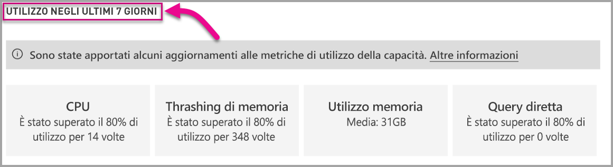

# Monitorare le capacità di Power BI Premium nell'organizzazione

Questo articolo offre una panoramica del monitoraggio delle metriche per le capacità di Power BI Premium. L'utilizzo del monitoraggio delle capacità consente di adottare un approccio informato per gestire le capacità. 

È possibile monitorare la capacità con l'app Power BI Premium Capacity Metrics o nel portale di amministrazione. È consigliata l'app perché offre molti più dettagli, ma questo articolo descrive entrambe le opzioni.

## Installare l'app Premium Capacity Metrics

È possibile passare direttamente all'[app Premium Capacity Metrics](https://app.powerbi.com/groups/me/getapps/services/capacitymetrics) o installarla come per le altre app in Power BI.

> [!IMPORTANT]
> Per installare e usare questa app, è necessario essere un amministratore della capacità per almeno una capacità. Non è sufficiente essere un amministratore di Power BI. 

1. In Power BI fare clic su **App**.

    

2. Sul lato destro fare clic su **Get apps** (Ottieni app).

3. Nella categoria **Apps** (App) cercare **app Power BI Premium Capacity Metrics**.

4. Eseguire la sottoscrizione per installare l'app.

Dopo aver installato l'app, è possibile visualizzare le metriche sulle capacità all'interno dell'organizzazione. Di seguito vengono descritte alcune delle principali metriche disponibili.

## Usare l'app per le metriche 
Quando si apre l'app, viene prima di tutto visualizzato un dashboard con un riepilogo di tutte le capacità per cui si hanno diritti di amministratore.

### Applicazione di filtri

La scheda **Filters applied to all pages** (Filtri applicati a tutte le pagine) consente di selezionare una capacità, un set di dati e/o un intervallo di date negli ultimi sette giorni. Questi filtri applicano la selezione a tutte le pagine e i riquadri rilevanti in questo report. In assenza di una selezione, il report mostra per impostazione predefinita le metriche della settimana precedente per ogni capacità di cui si è proprietari.

### Scheda Summary (Riepilogo)

La scheda **Summary** (Riepilogo) mostra una visualizzazione della capacità basata su entità, sistema e set di dati.

| **Area** | **Metriche** |
| --- | --- |
| **Entities** (Entità) | * Numero di capacità di cui si è proprietari  * Numero di set di dati nella capacità  * Numero di aree di lavoro nella capacità |
| **System** (Sistema) | * Utilizzo medio della memoria in GB negli ultimi sette giorni  * Utilizzo massimo della memoria in GB nel corso degli ultimi sette giorni e l'ora locale in cui si è verificato  * Numero di volte in cui la CPU ha superato l'80% delle soglie negli ultimi sette giorni, suddiviso in bucket di tre minuti  * La maggior parte delle volte in cui la CPU ha superato l'80% negli ultimi sette giorni, suddivise in bucket di un'ora e l'ora locale in cui si è verificato l'evento  * Numero di volte in cui le connessioni DirectQuery/dinamiche hanno superato l'80% delle soglie negli ultimi sette giorni, suddiviso in bucket di tre minuti  * La maggior parte delle volte in cui le connessioni DirectQuery/dinamiche hanno superato l'80% negli ultimi sette giorni, suddivise in bucket di un'ora e l'ora locale in cui si è verificato l'evento |
| **Dataset Workloads** (Carichi di lavoro dei set di dati) | * Numero totale di aggiornamenti negli ultimi sette giorni  * Numero totale di aggiornamenti riusciti negli ultimi sette giorni  * Numero totale di aggiornamenti non riusciti negli ultimi sette giorni  * Numero totale di aggiornamenti non riusciti a causa di memoria insufficiente  * La durata media degli aggiornamenti viene misurata in minuti, il tempo impiegato per completare l'operazione  * Il tempo di attesa medio degli aggiornamenti viene misurato in minuti, il ritardo medio tra l'ora pianificata e l'inizio dell'operazione  * Numero totale di query eseguite negli ultimi sette giorni  * Numero totale di query completate negli ultimi sette giorni  * Numero totale di query non riuscite negli ultimi sette giorni  * La durata media delle query viene misurata in minuti, il tempo impiegato per completare l'operazione  * Numero totale di modelli rimossi a causa di un utilizzo elevato della memoria |
|  |  |

### Scheda Refreshes (Aggiornamenti)

La scheda **Refreshes** (Aggiornamenti) elenca gli aggiornamenti completi, le misure di esito positivo, il tempo di attesa medio/massimo degli aggiornamenti e la durata media/massima degli aggiornamenti suddivisi in base ai set di dati negli ultimi sette giorni. I due grafici in basso mostrano gli aggiornamenti in rapporto all'utilizzo della memoria in GB e i tempi di attesa medi suddivisi in bucket di un'ora, indicati nell'ora locale. I grafici a barre superiori elencano i primi cinque set di dati in base al tempo massimo impiegato per completare l'aggiornamento del set di dati (durata dell'aggiornamento) e il tempo di attesa massimo per l'aggiornamento. La presenza di più picchi elevati per i tempi di attesa degli aggiornamenti è indicativa di un livello di utilizzo molto alto della capacità.

### Scheda Set di dati

La scheda **Datasets** (Set di dati) mostra i set di dati completi rimossi a causa di un utilizzo elevato della memoria su base oraria.

### Scheda System (Sistema)

La scheda **System** (Sistema) mostra l'utilizzo elevato della CPU (numero di volte in cui l'utilizzo ha superato l'80%), l'utilizzo elevato di connessioni DirectQuery/dinamiche e l'utilizzo della memoria.

## Monitorare la capacità di Power BI Embedded

È anche possibile usare l'app Power BI Premium Capacity Metrics per monitorare le capacità dello *SKU A* in Power BI Embedded. Tali capacità verranno visualizzate nel report per gli amministratori della capacità. Tuttavia, l'aggiornamento del report ha esito negativo a meno che non si concedano autorizzazioni specifiche a Power BI per gli SKU A:

1. Aprire la capacità nel portale di Azure.
1. Fare clic su **Controllo di accesso (IAM)** e aggiungere l'app "Power BI Premium" al ruolo lettore. Se non si riesce a trovare l'app in base al nome, è possibile aggiungerla anche in base al relativo ID client: cb4dc29f-0bf4-402a-8b30-7511498ed654.

    

> [!NOTE]
> È possibile monitorare l'utilizzo della capacità di Power BI Embedded nell'app o nel portale di Azure, ma non nel portale di amministrazione di Power BI.

## Monitoraggio di base nel portale di amministrazione

L'area **Impostazioni di capacità** del portale di amministrazione fornisce quattro misuratori che indicano i carichi e le risorse utilizzate dalla capacità per gli ultimi sette giorni. Questi quattro riquadri mostrano le informazioni su base oraria e indicano il numero di ore negli ultimi sette giorni in cui la metrica corrispondente è stata superiore all'80%. Questa metrica indica una potenziale riduzione delle prestazioni per l'esperienza utente finale.

| **Metrica** | **Descrizione** |
| --- | --- |
| CPU |Numero di volte per cui la CPU supera l'80% di uso. |
| Thrashing di memoria |Rappresenta l'uso elevato di memoria nei core di back-end. In particolare registra la frequenza con cui i set di dati vengono rimossi dalla memoria a causa dell'uso elevato di memoria, dovuto alla gestione di più set di dati. |
| Utilizzo memoria |Uso medio della memoria, specificato in gigabyte (GB). |
| DQ/s | Numero di volte per il quale il conteggio di DirectQuery e connessioni dinamiche ha superato l'80% del limite.   * Il numero totale di DirectQuery e di query di connessione dinamica al secondo è limitato. * I limiti sono 30/s per P1, 60/s per P2 e 120/s per P3. * Il numero di DirectQuery e il numero di query di connessione dinamica contribuiscono a questa limitazione. Ad esempio, se si hanno 15 DirectQuery e 15 connessioni dinamiche in un secondo, si raggiunge il limite * Questo vale per le connessioni sia in che nel cloud. |
|  |  |

Le metriche riflettono l'uso nell'ultima settimana.  Per aprire una visualizzazione più dettagliata delle metriche, fare clic su uno dei riquadri di riepilogo.  Vengono visualizzati grafici dettagliati per ogni metrica della capacità Premium. Il grafico seguente mostra i dettagli per la metrica della CPU.

Questi grafici sono un riepilogo su base oraria dell'ultima settimana e facilitano il rilevamento di eventi specifici associati alle prestazioni nella capacità Premium.

È anche possibile esportare i dati corrispondenti a qualsiasi metrica in un file con estensione csv.  Questa esportazione fornisce informazioni dettagliate con intervalli di tre minuti per ogni giorno della settimana precedente.

## Passaggi successivi

Dopo avere appreso come monitorare le capacità di Power BI Premium, è possibile consultare informazioni su come ottimizzare le capacità.

> [!div class="nextstepaction"]
> [Ottimizzazione e gestione delle risorse della capacità Power BI Premium](service-premium-understand-how-it-works.md)
