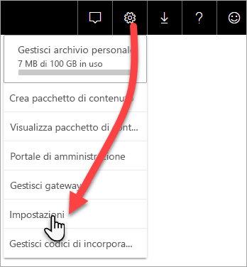

# Monitorare le capacità Premium con l'app

Il monitoraggio delle capacità è essenziale per prendere decisioni informate sull'uso ottimale delle risorse della capacità Premium. È possibile monitorare le capacità nel portale di amministrazione o tramite l'app **Power BI Premium Capacity Metrics**. Questo articolo descrive l'uso dell'app Premium Capacity Metrics. L'app fornisce le informazioni più dettagliate sulle prestazioni delle capacità. Per informazioni più generiche sulle metriche d'uso medie negli ultimi sette giorni, è possibile usare il portale di amministrazione. Per altre informazioni sul monitoraggio nel portale, vedere [Monitorare le capacità Premium nel portale di amministrazione](service-admin-premium-monitor-portal.md).

L'app viene aggiornata periodicamente con nuove caratteristiche e funzionalità. Verificare di eseguire la versione più recente.
**La versione più recente dell'app è la 1.10.1.1 (5 febbraio 2019)**.   
Se è già installata una versione precedente dell'app, è consigliabile eliminarla dalle app e premere CTRL+F5 per aggiornare. 

## Installare l'app

È possibile passare direttamente all'[app Premium Capacity Metrics](https://app.powerbi.com/groups/me/getapps/services/capacitymetrics) oppure installarla come le altre app in Power BI.

1. In Power BI fare clic su **App**.   
    

2. Sul lato destro fare clic su **Get apps** (Ottieni app).
3. Nella categoria **Apps** (App) cercare **app Power BI Premium Capacity Metrics**.
4. Eseguire la sottoscrizione per installare l'app.

È necessario attendere. L'installazione e l'aggiornamento delle metriche richiedono qualche minuto. Se l'app visualizza metriche vuote, premere F5 per aggiornare il browser.

## Ottenere la cronologia aggiornamenti dell'app

Per verificare quando è stato effettuato l'ultimo aggiornamento dell'app Premium Capacity Metrics, fare clic su **Impostazioni** > **Set di dati** > **Power BI Premium Capacity Metrics** > **Cronologia aggiornamenti**. 

Viene visualizzato l'ultimo aggiornamento; in alternativa fare clic su **Cronologia aggiornamenti** per visualizzare gli aggiornamenti pianificati e su richiesta.

## Monitorare una capacità con l'app

Dopo aver installato l'app è possibile visualizzare le metriche relative alle capacità all'interno dell'organizzazione. Di seguito vengono descritte alcune delle principali metriche disponibili.

### Dashboard delle metriche

Quando si apre l'app, viene prima di tutto visualizzato un dashboard con un riepilogo di tutte le capacità per cui si hanno diritti di amministratore.

Il dashboard include le metriche seguenti:

| **Sezione del report** | **Metriche** |
| --- | --- |
| **System Summary** (Dati riepilogativi del sistema) |  Versione dell'applicazione   Numero di capacità per cui si è amministratori   Numero di aree di lavoro delle capacità che includono metriche di report   Utilizzo medio della memoria in GB negli ultimi sette giorni   Utilizzo massimo della memoria in GB negli ultimi sette giorni   Ora locale in cui si è verificato l'utilizzo massimo della memoria   Numero di volte per il quale la CPU ha superato l'80% delle soglie negli ultimi sette giorni, suddiviso in bucket di tre minuti   Numero massimo di volte per il quale la CPU ha superato l'80% negli ultimi sette giorni, suddivise in bucket di un'ora   Ora locale in cui la CPU ha superato l'80% per il numero massimo di volte in un'ora |
| **Dataset Summary** (Riepilogo del set di dati) |  Numero totale di set di dati in tutte le aree di lavoro delle capacità   Numero di volte per il quale le connessioni DirectQuery/dinamiche hanno superato l'80% delle soglie negli ultimi sette giorni, suddiviso in bucket di tre minuti   Numero massimo di volte per il quale le connessioni DirectQuery/dinamiche hanno superato l'80% negli ultimi sette giorni, suddiviso in bucket di un'ora   Ora locale in cui le connessioni Direct query/dinamiche hanno superato l'80% per il numero massimo di volte in un'ora   Numero totale di aggiornamenti negli ultimi sette giorni   Tempo di attesa medio degli aggiornamenti, ovvero ritardo medio tra l'ora pianificata e inizio dell'aggiornamento, in minuti   Durata media degli aggiornamenti, ovvero il tempo impiegato per completare l'aggiornamento, in minuti   Numero totale di query eseguite negli ultimi sette giorni   Tempo medio di attesa delle query, ovvero tempo di attesa delle risorse di sistema prima dell'avvio dell'esecuzione della query, in millisecondi   Durata media della query, ovvero il tempo impiegato per completare una query, espresso in millisecondi   Numero totale di modelli rimossi a causa di un utilizzo elevato della memoria   Dimensioni medie dei set di dati    Conteggio medio dei set di dati caricati in memoria |
| **Dataflow Summary** (Riepilogo del flusso di dati) |  Numero totale di flussi di dati in tutte le aree di lavoro delle capacità   Numero totale di aggiornamenti negli ultimi sette giorni   Tempo di attesa medio degli aggiornamenti, ovvero ritardo medio tra l'ora pianificata e inizio dell'aggiornamento, in minuti   Durata media degli aggiornamenti, ovvero il tempo impiegato per completare l'aggiornamento, in minuti |
| **Paginated Report Summary** (Riepilogo dei report impaginati) |  Numero totale di report impaginati in tutte le aree di lavoro delle capacità   Numero totale di volte per il quale tutti i report sono stati visualizzati dagli utenti   Numero totale di righe di dati in tutti i report   Tempo totale impiegato per tutte le fasi (recupero, elaborazione e rendering dei dati) di tutti i report, in millisecondi |
|  |  |

### Report delle metriche

Fare clic sul dashboard per passare al report sottostante. Nella parte inferiore del report sono presenti cinque schede:

* [**Datasets**](#datasets) (Set di dati): metriche dettagliate sull'integrità dei set di dati di Power BI nelle capacità.

* [**Paginated Reports**](#paginated-reports) (Report impaginati): metriche dettagliate sull'integrità dei report impaginati nelle capacità.

* [**Dataflows**](#dataflows) (Flussi di dati): metriche di aggiornamento dettagliate per i flussi di dati nelle capacità.

* [**Resource Consumption**](#resource-consumption) (Consumo risorsa): metriche di capacità complessive, ad esempio metriche di utilizzo elevato della CPU e della memoria.

* [**IDs and Info**](#ids-and-info) (ID e informazioni): nomi, ID e proprietari di capacità, aree di lavoro e carichi di lavoro.

In ogni scheda è possibile filtrare le metriche per capacità e intervallo di date. Se non viene selezionato alcun filtro, per impostazione predefinita il report visualizza le metriche della settimana precedente per ogni capacità che include metriche di report. 

#### Datasets

Usare i pulsanti nella parte superiore della scheda **Datasets** (Set di dati) per passare ad altre aree: **Refreshes** (Aggiornamenti), **Query Durations** (Durata query), **Query Waits** (Attesa query) e **Datasets** (Set di dati).

##### Area Refreshes (Aggiornamenti)

L'area **Refreshes** (Aggiornamenti) contiene le metriche seguenti.

| **Sezione del report** | **Metriche** |
| --- | --- |
| **Refresh reliability** (Affidabilità degli aggiornamenti) |  Total Count (Conteggio totale): aggiornamenti totali per ogni set di dati   Reliability (Affidabilità): percentuale di aggiornamenti completati per ogni set di dati   Avg Wait Time (Tempo medio di attesa): ritardo medio tra l'ora pianificata e l'inizio di un aggiornamento per il set di dati, espresso in minuti   Max Wait Time (Tempo massimo di attesa): tempo di attesa massimo per il set di dati, espresso in minuti    Avg Duration (Durata media): durata media dell'aggiornamento per il set di dati, espressa in minuti   Max Duration (Durata massima): durata dell'aggiornamento con esecuzione più prolungata per il set di dati, espressa in minuti |
| **Top 5 Datasets by Average Refresh Duration** (Primi 5 set di dati per durata media dell'aggiornamento) |  I cinque set di dati con la durata media dell'aggiornamento più lunga, espressa in minuti |
| **Top 5 Datasets by Average Wait Time** (Primi 5 set di dati per tempo medio di attesa) |  I cinque set di dati con il tempo di attesa medio dell'aggiornamento più lungo, espresso in minuti |
| **Hourly Average Refresh Wait Times** (Tempi di attesa medi degli aggiornamenti su base oraria) |  Tempo di attesa medio degli aggiornamenti, diviso in bucket di un'ora, indicato nell'ora locale. La presenza di più picchi con tempi di attesa degli aggiornamenti elevati è indicativa di un livello di utilizzo molto alto della capacità. |
| **Hourly Refresh Count and Memory Consumption** (Utilizzo della memoria e conteggio degli aggiornamenti su base oraria) |  Operazioni riuscite, errori e utilizzo della memoria, divisi in bucket di un'ora, indicati nell'ora locale |
|  |  |

##### Area Query Durations (Durate query)

L'area **Query Durations** (Durate query) contiene le metriche seguenti.

| **Sezione del report** | **Metriche** |
| --- | --- |
| **Query Durations** (Durate query) |  I dati di questa sezione sono sezionati in base a set di dati, area di lavoro e bucket orari negli ultimi sette giorni   Totale: numero totale di query eseguite per il set di dati   Average (Media): durata media della query per il set di dati, espressa in millisecondi   Max (Massima): durata della query con esecuzione più prolungata nel set di dati, espressa in millisecondi|
| **Query Duration Distribution** (Distribuzione delle durate delle query) |  L'istogramma delle durate delle query è suddiviso in bucket in base alle durate delle query (in millisecondi) nelle categorie seguenti: <= 30 ms, 30-100 ms, 100-300 ms, 300 ms-1 sec, 1 sec-3 sec, 3 sec-10 sec, 10 sec-30 sec e intervalli maggiori di 30 secondi. Una durata notevole delle query e tempi di attesa lunghi sono indicativi di un livello di utilizzo molto alto della capacità. Questi sintomi possono indicare anche che il problema è causato da un unico set di dati e che è necessario indagarne le cause. |
| **Top 5 Datasets by Average Duration** (Primi 5 set di dati per durata media) |  I cinque set di dati con la durata media della query più lunga, espressa in millisecondi |
| **Direct Query / Live Connections (> 80% Utilization)** (Query diretta/Connessioni in tempo reale - > 80% di utilizzo) |  Numero di volte per il quale una query diretta o una connessione in tempo reale ha superato l'80% di utilizzo della CPU, suddivisi in bucket di un'ora, indicati nell'ora locale |
| **Hourly Query Duration Distributions** (Distribuzioni delle durate delle query su base oraria) |  Numero delle query e durata media (in millisecondi) rispetto al consumo di memoria in GB, suddivisi in bucket di un'ora nell'ora locale |
|  |  |

##### Area Query Waits (Attese query)

L'area **Query Waits** (Attese query) contiene le metriche seguenti.

| **Sezione del report** | **Metriche** |
| --- | --- |
| **Query Wait Times** (Tempi di attesa query) |  I dati di questa sezione sono sezionati in base a set di dati, area di lavoro e bucket orari negli ultimi sette giorni   Totale: numero totale di query eseguite per il set di dati   Wait Count (Conteggio di attesa): numero di query nel set di dati in attesa nelle risorse di sistema prima di avviare l'esecuzione    Average (Media): tempo di attesa medio della query per il set di dati, espresso in millisecondi   Max (Massima): durata della query con attesa più prolungata nel set di dati, espressa in millisecondi|
| **Wait Time Distribution** (Distribuzione dei tempi di attesa) |  L'istogramma di durata delle query è suddiviso in bucket in base alle durate delle query (in millisecondi) nelle categorie seguenti: <= 50 ms, 50-100 ms, 100-200 ms, 200-400 ms, 400 ms-1 sec, 1 sec-5 sec e intervalli di più di 5 secondi |
| **Top 5 Datasets by Average Wait Time** (Primi 5 set di dati per tempo medio di attesa) |  I cinque set di dati con il tempo di attesa medio più lungo prima dell'avvio dell'esecuzione di una query, espresso in millisecondi |
| **Hourly Query Wait Counts and Times** (Numero di query in attesa e tempi di attesa su base oraria) |  Numero di query in attesa e tempo medio di attesa (in millisecondi) rispetto al consumo di memoria in GB. Questi dati sono suddivisi in bucket di un'ora nell'ora locale |
|  |  |

##### Area Datasets (Set di dati)

L'area **Datasets** (Set di dati) contiene le metriche seguenti.

| **Sezione del report** | **Metriche** |
| --- | --- |
| **Dataset Eviction Counts** (Numero di rimozioni di set di dati) |  Totale: numero totale di *rimozioni* di set di dati per ogni capacità. Quando la capacità rileva un utilizzo elevato della memoria, il nodo rimuove uno o più set di dati dalla memoria. I set di dati inattivi (senza operazioni di query/aggiornamento in esecuzione) vengono rimossi per primi. Poi l'ordine di rimozione si basa sul principio LRU ("utilizzati meno di recente").|
| **Hourly Dataset Evictions and Memory Consumption** (Rimozioni di set di dati e utilizzo della memoria su base oraria) |  Rimozioni di set di dati rispetto all'utilizzo della memoria in GB, divisi in bucket di un'ora, indicati nell'ora locale |
| **Hourly Loaded Dataset Counts** (Numero di set di dati caricati su base oraria) |  Numero dei set di dati caricati in memoria rispetto all'utilizzo della memoria in GB, suddiviso in bucket di un'ora, indicato nell'ora locale |
| **Consumed Memory Percentages** (Percentuali di memoria utilizzata) |  Set di dati attivi totali in memoria come percentuale della memoria totale. Il valore differenziale tra Active (Attivi) e All (Tutti) definisce i set di dati che possono essere eliminati. Visualizzazione su base oraria per i sette giorni precedenti. |
| **Data Sizes** (Dimensioni dei dati)  |  Max size (Dimensioni massime): dimensioni massime del set di dati in MB per il periodo visualizzato |
|  |  |

#### Report impaginati

La scheda **Paginated reports** (Report impaginati) mostra le metriche dettagliate sull'integrità dei report impaginati nelle capacità.

| **Sezione del report** | **Metriche** |
| --- | --- |
| **Overall usage** (Utilizzo complessivo) |  Total Views (Visualizzazioni totali): numero di volte in cui il report è stato visualizzato dagli utenti   Row Count (Conteggio righe): numero di righe di dati nel report   Retrieval (avg) (Recupero - Media): tempo medio necessario per recuperare i dati per il report, espresso in millisecondi. Durate prolungate possono indicare query lente o altri problemi relativi all'origine dati.    Processing (avg) (Elaborazione - Media): tempo medio necessario per elaborare i dati per un report, espresso in millisecondi  Rendering (avg) (Rendering - Media): tempo medio necessario per eseguire il rendering di un report nel browser, espresso in millisecondi   Total time (Tempo totale): tempo necessario per tutte le fasi del report, espresso in millisecondi|
| **Top 5 Reports by Average Data Retrieval Time** (Primi 5 report per tempo medio di recupero dati) |  I cinque report con il tempo medio di recupero dati più elevato, espresso in millisecondi |
| **Top 5 Reports by Average Report Processing Time** (Primi 5 report per tempo medio di elaborazione report) |  I cinque report con il tempo medio di elaborazione report più elevato, espresso in millisecondi |
| **Hourly Durations** (Durate su base oraria) |  Tempo di recupero dati rispetto al tempo di elaborazione e di rendering, suddiviso in bucket di un'ora, indicato nell'ora locale |
| **Hourly Results** (Risultati su base oraria) |  Operazioni riuscite, errori e utilizzo della memoria, divisi in bucket di un'ora, indicati nell'ora locale |
|  |  |

#### Dataflows

La scheda **Dataflows** (Flussi di dati) mostra le metriche di aggiornamento dettagliate per i flussi di dati nelle capacità.

| **Sezione del report** | **Metriche** |
| --- | --- |
| **Refresh** (Aggiornamento) |  Totale: aggiornamenti totali per ogni flusso di dati   Reliability (Affidabilità): percentuale di aggiornamenti completati per ogni flusso di dati   Avg Wait Time (Tempo medio di attesa): ritardo medio tra l'ora pianificata e l'inizio di un aggiornamento per il flusso di dati, espresso in minuti   Max Wait Time (Tempo massimo di attesa): tempo di attesa massimo per il flusso di dati, espresso in minuti    Avg Duration (Durata media): durata media dell'aggiornamento per il flusso di dati, espressa in minuti   Max Duration (Durata massima): durata dell'aggiornamento con esecuzione più prolungata per il flusso di dati, espressa in minuti |
| **Top 5 dataflows by Average Refresh Duration** (Primi 5 flussi di dati per durata media dell'aggiornamento) |  I cinque flussi di dati con la durata media dell'aggiornamento più lunga, espressa in minuti |
| **Top 5 dataflows by Average Wait Time** (Primi 5 flussi di dati per tempo medio di attesa) |  I cinque flussi di dati con il tempo di attesa medio dell'aggiornamento più lungo, espresso in minuti |
| **Hourly Average Refresh Wait Times** (Tempi di attesa medi degli aggiornamenti su base oraria) |  Tempo di attesa medio degli aggiornamenti, diviso in bucket di un'ora, indicato nell'ora locale. La presenza di più picchi con tempi di attesa degli aggiornamenti elevati è indicativa di un livello di utilizzo molto alto della capacità. |
| **Hourly Refresh Count and Memory Consumption** (Utilizzo della memoria e conteggio degli aggiornamenti su base oraria) |  Operazioni riuscite, errori e utilizzo della memoria, divisi in bucket di un'ora, indicati nell'ora locale |
|  |  |

#### Resource Consumption

La scheda **Resource Consumption** (Utilizzo delle risorse) illustra l'utilizzo di CPU e memoria in tutte le capacità e i carichi di lavoro.

| **Sezione del report** | **Metriche** |
| --- | --- |
| **CPU consumption** (Utilizzo CPU) |  Utilizzo per carico di lavoro come percentuale della capacità totale della CPU. Visualizzazione su base oraria per i sette giorni precedenti. |
| **Memory consumption** (Utilizzo memoria) |  Utilizzo di memoria in GB per carico di lavoro (linee a tinta unita) e limiti del carico di lavoro sovrapposti (linea tratteggiata). Visualizzazione su base oraria per i sette giorni precedenti. |
|  |  |

#### IDs and Info

La scheda **IDs and Info** (ID e informazioni) contiene i nomi, gli ID e i proprietari di capacità, aree di lavoro e carichi di lavoro.

## Monitorare la capacità di Power BI Embedded

È possibile usare l'app Power BI Premium Capacity Metrics per monitorare le capacità dello *SKU A* in Power BI Embedded. Tali capacità verranno visualizzate nel report per gli amministratori della capacità. Tuttavia, l'aggiornamento del report ha esito negativo a meno che non si concedano autorizzazioni specifiche a Power BI per gli SKU A:

1. Aprire la capacità nel portale di Azure.

1. Fare clic su **Controllo di accesso (IAM)** e aggiungere l'app "Power BI Premium" al ruolo lettore. Se non si riesce a trovare l'app in base al nome, è possibile aggiungerla anche in base al relativo ID client: cb4dc29f-0bf4-402a-8b30-7511498ed654.

    

> [!NOTE]
> È possibile monitorare l'utilizzo della capacità di Power BI Embedded nell'app o nel portale di Azure, ma non nel portale di amministrazione di Power BI.

## Passaggi successivi

> [!div class="nextstepaction"]
> [Ottimizzazione e gestione delle risorse della capacità Power BI Premium](service-premium-understand-how-it-works.md)
