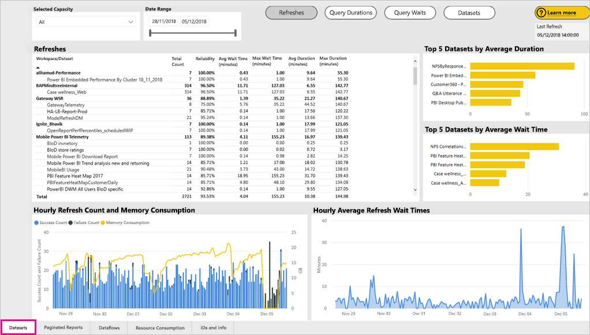
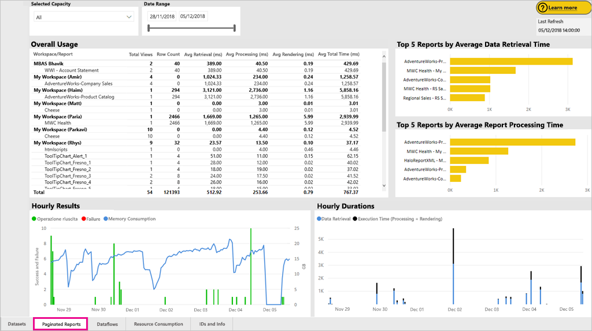
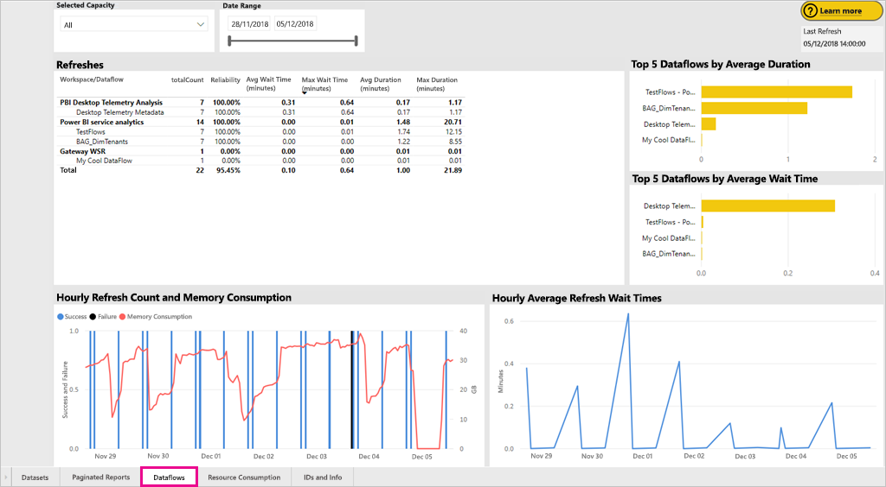

# Monitorare le capacità di Power BI Premium e Power BI Embedded

Questo articolo offre una panoramica del monitoraggio delle metriche per le capacità di Power BI Premium. L'utilizzo del monitoraggio delle capacità consente di adottare un approccio informato per gestire le capacità.

È possibile monitorare la capacità con l'app Power BI Premium Capacity Metrics o nel portale di amministrazione. È consigliata l'app perché offre molti più dettagli, ma questo articolo descrive entrambe le opzioni. **La versione corrente dell'app è 1.8 (rilasciata il 7 novembre 2018).**

<iframe width="560" height="315" src="https://www.youtube.com/embed/UgsjMbhi_Bk?rel=0&amp;showinfo=0" frameborder="0" allowfullscreen></iframe>

## Installare l'app Premium Capacity Metrics

È possibile passare direttamente all'[app Premium Capacity Metrics](https://app.powerbi.com/groups/me/getapps/services/capacitymetrics) o installarla come per le altre app in Power BI.

1. In Power BI fare clic su **App**.

    

1. Sul lato destro fare clic su **Get apps** (Ottieni app).

1. Nella categoria **Apps** (App) cercare **app Power BI Premium Capacity Metrics**.

1. Eseguire la sottoscrizione per installare l'app.

Dopo aver installato l'app, è possibile visualizzare le metriche sulle capacità all'interno dell'organizzazione. Di seguito vengono descritte alcune delle principali metriche disponibili.

## Usare l'app per le metriche

Quando si apre l'app, viene prima di tutto visualizzato un dashboard con un riepilogo di tutte le capacità per cui si hanno diritti di amministratore.

Fare clic sul dashboard per passare al report sottostante. Il report ha sei schede, che verranno descritte più dettagliatamente nelle sezioni seguenti.

* **Filters** (Filtri): consente di filtrare le altre pagine del report in base a una capacità specifica.

* **Datasets** (Set di dati): metriche dettagliate sull'integrità dei set di dati di Power BI nelle capacità.

* **Paginated reports** (Report impaginati): metriche dettagliate sull'integrità dei report impaginati nelle capacità.

* **Dataflows** (Flussi di dati): metriche di aggiornamento dettagliate per i flussi di dati nelle capacità.

* **System** (Sistema): metriche di capacità complessive, ad esempio metriche di utilizzo elevato della CPU e della memoria.

* **Display Names and IDs** (Nomi visualizzati e ID): nomi, ID e proprietari di capacità, aree di lavoro e carichi di lavoro.

### Scheda Filters (Filtri)

La scheda **Filters** (Filtri) consente di selezionare una capacità, un intervallo di date e altre opzioni. I filtri vengono quindi applicati a tutte le pagine e a tutti i riquadri del report. Se non viene selezionato alcun filtro, per impostazione predefinita il report visualizza le metriche della settimana precedente per ogni capacità di cui si ha la proprietà.

* **(A)** Selezionare **Datasets** (Set di dati), **Paginated Reports** (Report impaginati) o **Dataflows** (Flussi di dati) per impostare i filtri per ogni carico di lavoro.

* **(B)** Il nome e **(C)** le informazioni vengono aggiornati in base a quanto selezionato in **(A)**, consentendo di filtrare in base a un carico di lavoro per nome. Nell'immagine precedente, ad esempio, è selezionata l'opzione **Dataflows** (Flussi di dati), che visualizza **Dataflows Name** (Nome del flusso di dati) e **Dataflows Information** (Informazioni sul flusso di dati).

* **(D)** Informazioni sulla capacità, che indicano se per una capacità sono abilitati set di dati, report impaginati o flussi di dati.

### Scheda Set di dati

Usare i pulsanti nella parte superiore della scheda **Datasets** (Set di dati) per passare ad aree diverse: **Summary** (Riepilogo), **Refreshes** (Aggiornamenti), **Query Durations** (Durate query), **Query Waits** (Attese query) e **Datasets** (Set di dati).

#### Area Summary (Riepilogo)

L'area **Summary** (Riepilogo) presenta una visualizzazione delle capacità per entità, risorse di sistema e carichi di lavoro dei set di dati. Mostra le metriche seguenti.

| **Sezione del report** | **Metriche** |
| --- | --- |
| **Entities** (Entità) | * Numero di capacità di cui si è proprietari  * Numero di set di dati nella capacità  * Numero di aree di lavoro nella capacità |
| **System** (Sistema) | * Utilizzo medio della memoria in GB negli ultimi sette giorni  * Utilizzo massimo della memoria in GB nel corso degli ultimi sette giorni e l'ora locale in cui si è verificato  * Numero di volte in cui la CPU ha superato l'80% delle soglie negli ultimi sette giorni, suddiviso in bucket di tre minuti  * La maggior parte delle volte in cui la CPU ha superato l'80% negli ultimi sette giorni, suddivise in bucket di un'ora e l'ora locale in cui si è verificato l'evento  * Numero di volte in cui le connessioni DirectQuery/dinamiche hanno superato l'80% delle soglie negli ultimi sette giorni, suddiviso in bucket di tre minuti  * La maggior parte delle volte in cui le connessioni DirectQuery/dinamiche hanno superato l'80% negli ultimi sette giorni, suddivise in bucket di un'ora e l'ora locale in cui si è verificato l'evento |
| **Dataset Workloads** (Carichi di lavoro dei set di dati) | * Numero totale di aggiornamenti negli ultimi sette giorni  * Numero totale di aggiornamenti riusciti negli ultimi sette giorni  * Numero totale di aggiornamenti non riusciti negli ultimi sette giorni  * Numero totale di aggiornamenti non riusciti a causa di memoria insufficiente  * La durata media degli aggiornamenti è il tempo impiegato per completare l'operazione, espresso in minuti  * Il tempo di attesa medio degli aggiornamenti è il ritardo medio tra l'ora pianificata e l'inizio dell'operazione, espresso in minuti  * Numero totale di query eseguite negli ultimi sette giorni  * Numero totale di query completate negli ultimi sette giorni  * Numero totale di query non riuscite negli ultimi sette giorni  * La durata media delle query è il tempo impiegato per completare l'operazione, espresso in minuti  * Numero totale di modelli rimossi a causa di un utilizzo elevato della memoria |
|  |  |

#### Area Refreshes (Aggiornamenti)

L'area **Refreshes** (Aggiornamenti) contiene le metriche seguenti.

| **Sezione del report** | **Metriche** |
| --- | --- |
| **Refresh reliability** (Affidabilità degli aggiornamenti) | * Total Count (Conteggio totale): aggiornamenti totali per ogni set di dati  * Reliability (Affidabilità): percentuale di aggiornamenti completati per ogni set di dati  * Avg Wait Time (Tempo di attesa medio): ritardo medio tra l'ora pianificata e l'inizio di un aggiornamento per il set di dati, espresso in minuti  * Max Wait Time (Tempo di attesa massimo): tempo di attesa massimo per il set di dati, espresso in minuti   * Avg Duration (Durata media): durata media dell'aggiornamento per il set di dati, espressa in minuti  * Max Duration (Durata massima): durata dell'aggiornamento con esecuzione più prolungata per il set di dati, espressa in minuti |
| **Top 5 Datasets by Average Refresh Duration** (Primi 5 set di dati per durata media dell'aggiornamento) | * I cinque set di dati con la durata media dell'aggiornamento più lunga, espressa in minuti |
| **Top 5 Datasets by Average Wait Time** (Primi 5 set di dati per tempo medio di attesa) | * I cinque set di dati con il tempo di attesa medio dell'aggiornamento più lungo, espresso in minuti |
| **Hourly Average Refresh Wait Times** (Tempi di attesa medi degli aggiornamenti su base oraria) | * Tempo di attesa medio degli aggiornamenti, diviso in bucket di un'ora, indicato nell'ora locale. La presenza di più picchi con tempi di attesa degli aggiornamenti elevati è indicativa di un livello di utilizzo molto alto della capacità. |
| **Hourly Refresh Count and Memory Consumption** (Utilizzo della memoria e conteggio degli aggiornamenti su base oraria) | * Operazioni riuscite, errori e utilizzo della memoria, divisi in bucket di un'ora, indicati nell'ora locale |
|  |  |

#### Area Query Durations (Durate query)

L'area **Query Durations** (Durate query) contiene le metriche seguenti.

| **Sezione del report** | **Metriche** |
| --- | --- |
| **Query Durations** (Durate query) | * I dati di questa sezione sono sezionati in base a set di dati, area di lavoro e bucket orari negli ultimi sette giorni  * Total (Totale): numero totale di query eseguite per il set di dati  * Average (Media): durata media della query per il set di dati, espressa in millisecondi  * Max: durata della query con esecuzione più prolungata nel set di dati, espressa in millisecondi|
| **Query Duration Distribution** (Distribuzione delle durate delle query) | * L'istogramma delle durate delle query è suddiviso in bucket in base alle durate delle query (in millisecondi) nelle categorie seguenti: : <= 30 ms, 30-100 ms, 100-300 ms, 300 ms-1 sec, 1 sec-3 sec, 3 sec-10 sec, 10 sec-30 sec e intervalli maggiori di 30 secondi. Una durata notevole delle query e tempi di attesa lunghi sono indicativi di un livello di utilizzo molto alto della capacità. Questi sintomi possono indicare anche che il problema è causato da un unico set di dati e che è necessario indagarne le cause. |
| **Top 5 Datasets by Average Duration** (Primi 5 set di dati per durata media) | * I cinque set di dati con la durata media della query più lunga, espressa in millisecondi |
| **Direct Query / Live Connections (> 80% Utilization)** (Query diretta/Connessioni in tempo reale - > 80% di utilizzo) | * Numero di volte in cui una query diretta o una connessione in tempo reale ha superato l'80% di utilizzo della CPU, suddivisi in bucket di un'ora, indicati nell'ora locale |
| **Hourly Query Duration Distributions** (Distribuzioni delle durate delle query su base oraria) | * Numero delle query e durata media (in millisecondi) rispetto al consumo di memoria in GB, suddivisi in bucket di un'ora nell'ora locale |
|  |  |

#### Area Query Waits (Attese query)

L'area **Query Waits** (Attese query) contiene le metriche seguenti.

| **Sezione del report** | **Metriche** |
| --- | --- |
| **Query Wait Times** (Tempi di attesa query) | * I dati di questa sezione sono sezionati in base a set di dati, area di lavoro e bucket orari negli ultimi sette giorni  * Total (Totale): numero totale di query eseguite per il set di dati  * Wait count (Conteggio di attesa): numero di query nel set di dati in attesa nelle risorse di sistema prima di avviare l'esecuzione   * Average (Media): tempo di attesa medio della query per il set di dati, espresso in millisecondi  * Max: durata della query con attesa più prolungata nel set di dati, espressa in millisecondi|
| **Wait Time Distribution** (Distribuzione dei tempi di attesa) | * L'istogramma di durata delle query è suddiviso in bucket in base alle durate delle query (in millisecondi) nelle categorie seguenti: <= 50 ms, 50-100 ms, 100-200 ms, 200-400 ms, 400 ms-1 sec, 1 sec-5 sec e intervalli di più di 5 secondi |
| **Top 5 Datasets by Average Wait Time** (Primi 5 set di dati per tempo medio di attesa) | * I cinque set di dati con il tempo di attesa medio più lungo prima dell'avvio dell'esecuzione di una query, espresso in millisecondi |
| **Hourly Query Wait Counts and Times** (Numero di query in attesa e tempi di attesa su base oraria) | * Numero di query in attesa e tempo di attesa medio (in millisecondi) rispetto al consumo di memoria in GB. Questi dati sono suddivisi in bucket di un'ora nell'ora locale |
|  |  |

#### Area Datasets (Set di dati)

L'area **Datasets** (Set di dati) contiene le metriche seguenti.

| **Sezione del report** | **Metriche** |
| --- | --- |
| **Dataset Eviction Counts** (Numero di rimozioni di set di dati) | * Total (Totale): numero totale di *rimozioni* di set di dati per ogni capacità. Quando la capacità rileva un utilizzo elevato della memoria, il nodo rimuove uno o più set di dati dalla memoria. I set di dati inattivi (senza operazioni di query/aggiornamento in esecuzione) vengono rimossi per primi. Poi l'ordine di rimozione si basa sul principio LRU ("utilizzati meno di recente").|
| **Hourly Dataset Evictions and Memory Consumption** (Rimozioni di set di dati e utilizzo della memoria su base oraria) | * Rimozioni di set di dati rispetto all'utilizzo della memoria in GB, divisi in bucket di un'ora, indicati nell'ora locale |
|  |  |

### Scheda Paginated reports (Report impaginati)

La scheda **Paginated reports** (Report impaginati) mostra le metriche dettagliate sull'integrità dei report impaginati nelle capacità.

La scheda **Paginated reports** (Report impaginati) contiene le metriche seguenti.

| **Sezione del report** | **Metriche** |
| --- | --- |
| **Overall usage** (Utilizzo complessivo) | * Total Views (Visualizzazioni totali): numero di volte in cui il report è stato visualizzato da un utente  * Row Count (Conteggio righe): numero di righe di dati nel report  * Retrieval (avg) (Recupero - Media): quantità media di tempo necessario per recuperare i dati per il report, espressa in millisecondi. Durate prolungate possono indicare query lente o altri problemi relativi all'origine dati.   * Processing (avg) (Elaborazione - Media): quantità media di tempo necessario per elaborare i dati per un report, espressa in millisecondi * Rendering (avg) (Rendering - Media): quantità media di tempo necessario per eseguire il rendering di un report nel browser, espressa in millisecondi  * Total time (Tempo totale): tempo necessario per tutte le fasi del report, espresso in millisecondi|
| **Top 5 Reports by Average Data Retrieval Time** (Primi 5 report per tempo medio di recupero dati) | * I cinque report con il tempo medio di recupero dati più elevato, espresso in millisecondi |
| **Top 5 Reports by Average Report Processing Time** (Primi 5 report per tempo medio di elaborazione report) | * I cinque report con il tempo medio di elaborazione report più elevato, espresso in millisecondi |
| **Hourly Durations** (Durate su base oraria) | * Tempo di recupero dati rispetto al tempo di elaborazione e di rendering, suddiviso in bucket di un'ora, indicato nell'ora locale |
| **Hourly Results** (Risultati su base oraria) | * Operazioni riuscite, errori e utilizzo della memoria, divisi in bucket di un'ora, indicati nell'ora locale |
|  |  |

### Scheda Dataflows (Flussi di dati)

La scheda **Dataflows** (Flussi di dati) mostra le metriche di aggiornamento dettagliate per i flussi di dati nelle capacità.

La scheda **Dataflows** (Flussi di dati) contiene le metriche seguenti.

| **Sezione del report** | **Metriche** |
| --- | --- |
| **Refresh** (Aggiornamento) | * Total (Totale): aggiornamenti totali per ogni flusso di dati  * Reliability (Affidabilità): percentuale di aggiornamenti completati per ogni flusso di dati  * Avg Wait Time (Tempo di attesa medio): ritardo medio tra l'ora pianificata e l'inizio di un aggiornamento per il flusso di dati, espresso in minuti  * Max Wait Time (Tempo di attesa massimo): tempo di attesa massimo per il flusso di dati, espresso in minuti   * Avg Duration (Durata media): durata media dell'aggiornamento per il flusso di dati, espressa in minuti  * Max Duration (Durata massima): durata dell'aggiornamento con esecuzione più prolungata per il flusso di dati, espressa in minuti |
| **Top 5 dataflows by Average Refresh Duration** (Primi 5 flussi di dati per durata media dell'aggiornamento) | * I cinque flussi di dati con la durata media dell'aggiornamento più lunga, espressa in minuti |
| **Top 5 dataflows by Average Wait Time** (Primi 5 flussi di dati per tempo medio di attesa) | * I cinque flussi di dati con il tempo di attesa medio dell'aggiornamento più lungo, espresso in minuti |
| **Hourly Average Refresh Wait Times** (Tempi di attesa medi degli aggiornamenti su base oraria) | * Tempo di attesa medio degli aggiornamenti, diviso in bucket di un'ora, indicato nell'ora locale. La presenza di più picchi con tempi di attesa degli aggiornamenti elevati è indicativa di un livello di utilizzo molto alto della capacità. |
| **Hourly Refresh Count and Memory Consumption** (Utilizzo della memoria e conteggio degli aggiornamenti su base oraria) | * Operazioni riuscite, errori e utilizzo della memoria, divisi in bucket di un'ora, indicati nell'ora locale |
|  |  |

### Scheda System (Sistema)

La scheda **System** (Sistema) mostra l'utilizzo di CPU e memoria in tutte le capacità e i carichi di lavoro.

La scheda **System** (Sistema) contiene le metriche seguenti.

| **Sezione del report** | **Metriche** |
| --- | --- |
| **CPU Metrics (> 80% Utilization)** (Metriche CPU - > 80% di utilizzo) | * Numero di volte in cui la CPU ha superato l'80% delle soglie negli ultimi sette giorni, suddiviso in bucket di tre minuti |
| **Memory consumption** (Utilizzo memoria) | * Utilizzo della memoria negli ultimi sette giorni, suddiviso in bucket da tre minuti |
|  |  |

### Scheda Display Names and IDs (Nomi visualizzati e ID)

La scheda **Display Names and IDs** (Nomi visualizzati e ID) contiene i nomi, gli ID e i proprietari di capacità, aree di lavoro e carichi di lavoro.

## Monitorare la capacità di Power BI Embedded

È anche possibile usare l'app Power BI Premium Capacity Metrics per monitorare le capacità dello *SKU A* in Power BI Embedded. Tali capacità verranno visualizzate nel report per gli amministratori della capacità. Tuttavia, l'aggiornamento del report ha esito negativo a meno che non si concedano autorizzazioni specifiche a Power BI per gli SKU A:

1. Aprire la capacità nel portale di Azure.

1. Fare clic su **Controllo di accesso (IAM)** e aggiungere l'app "Power BI Premium" al ruolo lettore. Se non si riesce a trovare l'app in base al nome, è possibile aggiungerla anche in base al relativo ID client: cb4dc29f-0bf4-402a-8b30-7511498ed654.

    

> [!NOTE]
> È possibile monitorare l'utilizzo della capacità di Power BI Embedded nell'app o nel portale di Azure, ma non nel portale di amministrazione di Power BI.

## Monitoraggio di base nel portale di amministrazione

L'area **Impostazioni di capacità** del portale di amministrazione fornisce quattro misuratori che indicano i carichi e le risorse utilizzate dalla capacità per gli ultimi sette giorni. Questi quattro riquadri mostrano le informazioni su base oraria e indicano il numero di ore negli ultimi sette giorni in cui la metrica corrispondente è stata superiore all'80%. Questa metrica indica una potenziale riduzione delle prestazioni per l'esperienza utente finale.

| **Metrica** | **Descrizione** |
| --- | --- |
| CPU |Numero di volte per cui la CPU supera l'80% di uso. |
| Thrashing di memoria |Rappresenta l'uso elevato di memoria nei core di back-end. In particolare registra la frequenza con cui i set di dati vengono rimossi dalla memoria a causa dell'uso elevato di memoria, dovuto alla gestione di più set di dati. |
| Utilizzo memoria |Uso medio della memoria, specificato in gigabyte (GB). |
| DQ/s | Numero di volte per il quale il conteggio di DirectQuery e connessioni dinamiche ha superato l'80% del limite.   * Il numero totale di DirectQuery e di query di connessione dinamica al secondo è limitato. * I limiti sono 30/s per P1, 60/s per P2 e 120/s per P3. * Il numero di DirectQuery e il numero di query di connessione dinamica contribuiscono a questa limitazione. Ad esempio, se si hanno 15 DirectQuery e 15 connessioni dinamiche in un secondo, si raggiunge il limite * Questo vale per le connessioni sia in che nel cloud. |
|  |  |

Le metriche riflettono l'uso nell'ultima settimana.  Per aprire una visualizzazione più dettagliata delle metriche, fare clic su uno dei riquadri di riepilogo.  Vengono visualizzati grafici dettagliati per ogni metrica della capacità Premium. Il grafico seguente mostra i dettagli per la metrica della CPU.

Questi grafici sono un riepilogo su base oraria dell'ultima settimana e facilitano il rilevamento di eventi specifici associati alle prestazioni nella capacità Premium.

È anche possibile esportare i dati corrispondenti a qualsiasi metrica in un file con estensione csv.  Questa esportazione fornisce informazioni dettagliate con intervalli di tre minuti per ogni giorno della settimana precedente.

## Passaggi successivi

Dopo avere appreso come monitorare le capacità di Power BI Premium, è possibile consultare informazioni su come ottimizzare le capacità.

> [!div class="nextstepaction"]
> [Ottimizzazione e gestione delle risorse della capacità Power BI Premium](service-premium-understand-how-it-works.md)
