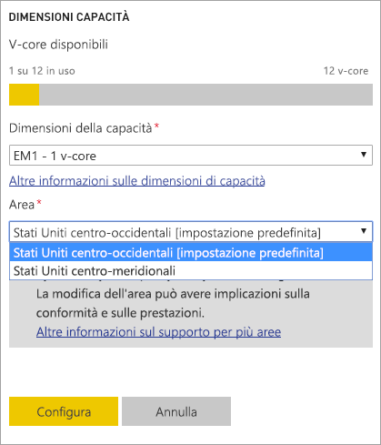
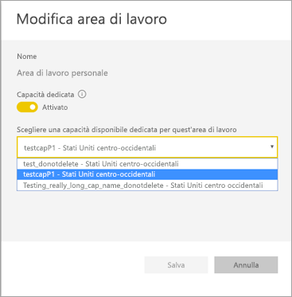
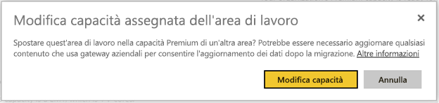
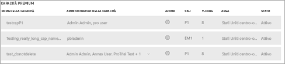

# Configurare il supporto di più aree geografiche per Power BI Premium

Il supporto di più aree geografiche è una funzionalità di Power BI Premium che consente ai clienti multinazionali di soddisfare requisiti regionali, specifici del settore o di residenza dei dati dell'organizzazione. I clienti di Power BI Premium possono distribuire contenuto ai data center in aree diverse dall'area iniziale del tenant di Power BI. Un'area geografica può contenere più di un'area. Ad esempio, Stati Uniti è un'area geografica e Stati Uniti centro-occidentali e Stati Uniti centro-meridionali sono aree negli Stati Uniti. È possibile scegliere di distribuire il contenuto in qualsiasi area geografica tra le seguenti:

- United States
- Canada
- Regno Unito
- Brasile
- Europa
- Giappone
- India
- Asia Pacifico
- Australia
- Africa

Le aree geografiche multiple non sono disponibili per Power BI Germania, Power BI gestito da 21Vianet in Cina o Power BI per Governo degli Stati Uniti.

Il supporto di più aree geografiche è ora disponibile anche in Power BI Embedded. Per altre informazioni, vedere [Supporto di più aree geografiche per Power BI Embedded](developer/embedded/embedded-multi-geo.md).

## Abilitare e configurare

Per le nuove capacità, abilitare il supporto di più aree geografiche selezionando un'area diversa da quella predefinita nell'elenco a discesa.  Ogni capacità disponibile mostra l'area in cui è attualmente disponibile, ad esempio **Stati Uniti centro-occidentali**.

Dopo averla creata, la capacità resta in tale area e il contenuto delle eventuali aree di lavoro create verrà archiviato in tale area. È possibile eseguire la migrazione delle aree di lavoro da un'area a un'altra tramite l'elenco a discesa nella schermata delle impostazioni dell'area di lavoro.

Viene visualizzato questo messaggio per confermare la modifica.

Non è necessario reimpostare le credenziali del gateway durante una migrazione in questo momento.  Dopo la loro archiviazione nell'area di capacità Premium, sarà necessario reimpostarle al momento della migrazione.

Durante la migrazione, determinate operazioni potrebbero non riuscire, ad esempio la pubblicazione di nuovi set di dati o l'aggiornamento dei dati pianificato.  

Gli elementi seguenti vengono archiviati nell'area Premium quando sono abilitate più aree geografiche:

- Modelli (file con estensione abf) per l'importazione e set di dati DirectQuery
- Cache delle query
- Immagini R

Questi elementi rimangono nell'area iniziale per il tenant:

- Set di dati di push
- Cartelle di lavoro di Excel
- Metadati di report/dashboard: ad esempio nomi dei riquadri, query dei riquadri
- Bus di servizio per le query di gateway o i processi di aggiornamento pianificati
- Autorizzazioni
- Credenziali del set di dati

## Visualizzare le aree delle capacità

Nel portale di amministrazione è possibile visualizzare tutte le capacità per il tenant di Power BI e le aree in cui si trovano attualmente.

 

## Modificare l'area per il contenuto esistente

Se è necessario modificare l'area per il contenuto esistente, sono disponibili due opzioni.

- Creare una seconda capacità e spostare le aree di lavoro. Gli utenti del piano gratuito non riscontreranno tempi di inattività, purché il tenant abbia vCore di riserva.
- Se la creazione di una seconda capacità non è un'opzione, è possibile spostare temporaneamente il contenuto alla capacità condivisa da Premium. Non sono necessari vCore aggiuntivi, ma gli utenti del piano gratuito riscontreranno tempi di inattività.

## Spostare il contenuto all'esterno della capacità di più aree geografiche  

È possibile spostare aree di lavoro al di fuori della capacità Multi-Geo in due modi:

- Eliminare la capacità corrente in cui si trova l'area di lavoro.  L'area di lavoro viene così rispostata nella capacità condivisa nell'area iniziale.
- Eseguire la migrazione di singole aree di lavoro alla capacità Premium disponibile nel tenant principale.

## Limitazioni e considerazioni

- Verificare che qualsiasi spostamento avviato tra aree rispetti tutti i requisiti di conformità aziendali e di enti pubblici prima di avviare il trasferimento dei dati.
- Una query memorizzata nella cache archiviata in un'area remota resta in tale area quando è inattiva. Tuttavia, gli altri dati in transito potrebbero spostarsi tra più aree geografiche.
- Quando si spostano dati da un'area a un'altra in un ambiente con più aree geografiche, i dati di origine possono rimanere nell'area da cui vengono spostati fino a 30 giorni. Durante tale periodo, gli utenti finali non potranno accedervi. I dati verranno rimossi da quest'area ed eliminati definitivamente durante il periodo di 30 giorni.

- La funzionalità [Flussi di dati](service-dataflows-overview.md) non è attualmente supportata in Multi-Geo.

## Passaggi successivi

- [Che cos'è Power BI Premium?](service-premium-what-is.md)
- [Supporto di più aree geografiche per Power BI Embedded](developer/embedded/embedded-multi-geo.md)

Altre domande? [Provare a rivolgersi alla community di Power BI](https://community.powerbi.com/)
