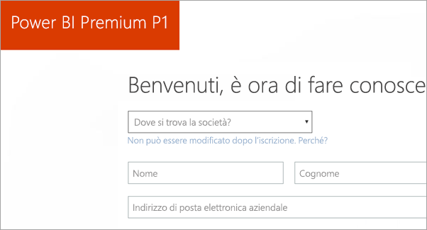
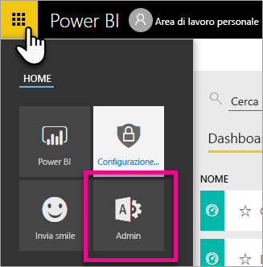
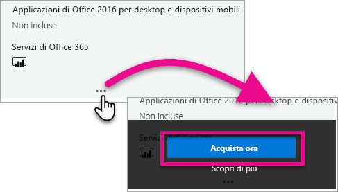
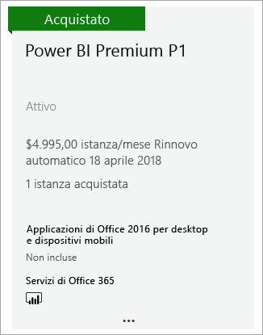
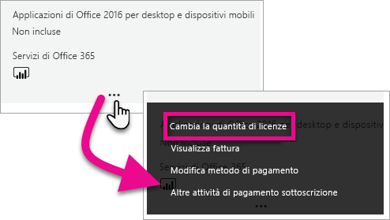
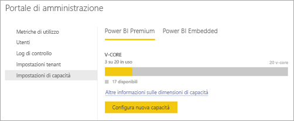
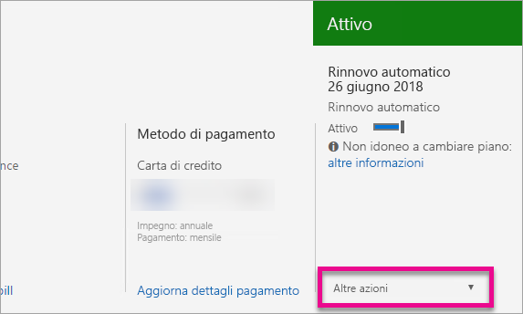

# Come acquistare Power BI Premium
Informazioni sull'acquisto della capacità Premium di Power BI per l'organizzazione.

<iframe width="640" height="360" src="https://www.youtube.com/embed/NkvYs5Qp4iA?rel=0&amp;showinfo=0" frameborder="0" allowfullscreen></iframe>

È possibile acquistare un nodo di capacità Premium di Power BI tramite l'interfaccia di amministrazione di Office 365. È anche possibile avere qualsiasi combinazione di SKU per la capacità Premium (P1 tramite P3) all'interno dell'organizzazione. Le capacità delle risorse sono diverse.

Per altre informazioni sulla definizione di Power BI Premium, vedere [Power BI Premium - what is it?](service-premium.md) (Power BI Premium: descrizione). Per visualizzare il prezzo corrente di Power BI, vedere la [pagina dei prezzi di Power BI](https://powerbi.microsoft.com/pricing/). È anche possibile pianificare i costi per Power BI Premium usando il [calcolatore di Power BI Premium](https://powerbi.microsoft.com/calculator/).

> [!IMPORTANT]
> Per gli autori del contenuto sarà ancora necessaria una licenza di Power BI Pro, anche se si acquista Power BI Premium.
> 
> 

## Creare un nuovo tenant con Power BI Premium P1
Se non si ha un tenant esistente e si vuole crearne uno, è possibile acquistare contemporaneamente Power BI Premium. Il collegamento seguente guiderà al processo di creazione di un nuovo tenant per l'uso con Office 365 e consentirà di acquistare Power BI Premium. È necessario acquistare una licenza di Power BI Pro per un utente dopo aver creato il tenant. Quando si crea il tenant, si sarà automaticamente l'amministratore globale per tale tenant.

Per effettuare l'acquisto, vedere l'[offerta di Power BI Premium P1](https://signup.microsoft.com/Signup?OfferId=b3ec5615-cc11-48de-967d-8d79f7cb0af1).

## Acquistare capacità di Power BI Premium per l'organizzazione
Se si ha già un'organizzazione, è necessario essere amministratore globale o un amministratore di fatturazione per poter acquistare le sottoscrizioni e le licenze. Per altre informazioni, vedere [Informazioni sui ruoli di amministratore di Office 365](https://support.office.com/article/About-Office-365-admin-roles-da585eea-f576-4f55-a1e0-87090b6aaa9d).

Per acquistare una capacità Premium, è necessario eseguire le operazioni seguenti.

1. All'interno del servizio Power BI, selezionare **Office 365 app picker** (Selezione app di Office 365) > **Amministratore**. In alternativa, è possibile passare al centro di amministrazione di Office 365, passando a https://portal.office.com e selezionando **Amministratore**.
   
    
2. Selezionare **Fatturazione** > **Acquisto di servizi**.
3. In **Other plans** (Altri piani) cercare le offerte di Power BI Premium. Verranno elencate le offerte da P1 a P3, EM3 e P1 (mensile).
4. Passare il mouse sui **puntini di sospensione (...)**  e quindi selezionare **Acquista ora**.
   
    
5. Per completare l'acquisto, seguire la procedura.

È anche possibile selezionare i collegamenti seguenti per passare direttamente alle pagine di acquisto per questi elementi. Per altre informazioni su questi SKU, vedere [Power BI Premium: di cosa si tratta?](service-premium.md#premiumskus).

Per acquistare Power BI Premium SKU, ***è necessario essere un amministratore globale o di fatturazione*** nel tenant. Se non si è un amministratore, la selezione dei collegamenti seguenti produrrà un errore.

| Collegamenti diretti agli acquisti |
| --- |
| [SKU EM3 (mensile)](https://portal.office.com/commerce/completeorder.aspx?OfferId=4004702D-749C-4F74-BF47-3048F1833780&adminportal=1) |
| [P1 SKU](https://portal.office.com/commerce/completeorder.aspx?OfferId=b3ec5615-cc11-48de-967d-8d79f7cb0af1&adminportal=1) |
| [SKU P1 (mensile)](https://portal.office.com/commerce/completeorder.aspx?OfferId=E4C8EDD3-74A1-4D42-A738-C647972FBE81&adminportal=1) |
| [P2 SKU](https://portal.office.com/commerce/completeorder.aspx?OfferId=062F2AA7-B4BC-4B0E-980F-2072102D8605&adminportal=1) |
| [P3 SKU](https://portal.office.com/commerce/completeorder.aspx?OfferId=40c7d673-375c-42a1-84ca-f993a524fed0&adminportal=1) |

Dopo aver completato l'acquisto, la schermata Acquisto di servizi mostra che l'elemento è stato acquistato ed è attivo.

È ora possibile gestire questa capacità nell'interfaccia di amministrazione di Power BI. Per altre informazioni, vedere [Manage Power BI Premium](service-admin-premium-manage.md) (Gestire Power BI Premium).

## Acquistare un maggior numero di capacità
Nella sezione **Impostazioni Premium** del portale di amministrazione di Power BI, se si è amministratore, verrà visualizzato un pulsante **Purchase more** (Acquista altri). Questo pulsante consente di aprire il portale di Office 365. All'interno del centro di amministrazione di Office 365, è possibile eseguire le operazioni seguenti.

1. Selezionare **Fatturazione** > **Acquisto di servizi**.
2. Trovare l'elemento di Power BI Premium che si desidera acquistare in **Other plans** (Altri piani).
3. Passare il mouse sui **puntini di sospensione (...)**  e quindi selezionare **Change license quantity** (Modifica la quantità di licenze).
   
    
4. Modificare il numero di istanze che si desidera avere per questo elemento. Selezionare quindi **Invia** al termine.
   
   > [!IMPORTANT]
   > In questo modo **verranno** accreditati i costi sulla carta di credito inserita.
   > 
   > 

La pagina **Acquisto di servizi** indica il numero di istanze disponibili. All'interno del portale di amministrazione di Power BI, in **Impostazioni di capacità**, le memorie centrali virtuali disponibili riflettono la nuova capacità acquistata.

È ora possibile gestire questa capacità nell'interfaccia di amministrazione di Power BI. Per altre informazioni, vedere [Manage Power BI Premium](service-admin-premium-manage.md) (Gestire Power BI Premium).

## Annullare la sottoscrizione
È possibile annullare la sottoscrizione dall'interfaccia di amministrazione di Office 365. Per annullare la sottoscrizione Premium, eseguire le operazioni seguenti.

1. Passare all'interfaccia di amministrazione di Office 365.
2. Selezionare **Fatturazione** > **Sottoscrizioni**.
3. Selezionare la sottoscrizione di Power BI Premium dall'elenco.
4. Nell'elenco a discesa **Altre azioni** selezionare **Annulla sottoscrizione**.
   
    
5. La pagina **Annulla sottoscrizione** indicherà se si è responsabili o no di una [penale per risoluzione anticipata](https://support.office.com/article/early-termination-fees-6487d4de-401a-466f-8bc3-c0beb5cc40d3). Questa pagina indica anche quando verranno eliminati i dati per la sottoscrizione.
6. Leggere attentamente le informazioni e, se si vuole continuare, selezionare **Annulla sottoscrizione**.

## Passaggi successivi
[Prezzi di Power BI](https://powerbi.microsoft.com/pricing/)  
[Calcolatore Power BI Premium](https://powerbi.microsoft.com/calculator/)  
[Power BI Premium - what is it?](service-premium.md) (Power BI Premium: definizione)  
[Manage Power BI Premium](service-admin-premium-manage.md) (Gestire Power BI Premium)  
[Power BI Premium FAQ](service-premium-faq.md) (Domande frequenti su Power BI Premium)  
[Power BI Premium release notes](service-premium-release-notes.md) (Note sulla versione di Power BI Premium)  
[Microsoft Power BI Premium whitepaper](https://aka.ms/pbipremiumwhitepaper) (White paper su Microsoft Power BI Premium)  
[Planning a Power BI Enterprise Deployment whitepaper](https://aka.ms/pbienterprisedeploy) (White paper sulla pianificazione della distribuzione aziendale di Power BI)  
[Portale di amministrazione di Power BI](service-admin-portal.md)  
[Amministrazione di Power BI nell'organizzazione](service-admin-administering-power-bi-in-your-organization.md)  

Altre domande? [Provare a rivolgersi alla community di Power BI](http://community.powerbi.com/)

