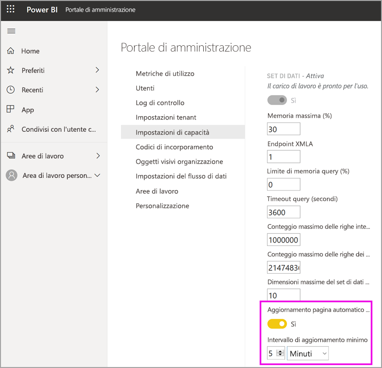

# Configurare i carichi di lavoro in una capacità Premium

Questo articolo descrive l'abilitazione e la configurazione di carichi di lavoro per le capacità Power BI Premium. Per impostazione predefinita le capacità supportano solo il carico di lavoro associato all'esecuzione delle query di Power BI. È anche possibile abilitare e configurare carichi di lavoro aggiuntivi per **[intelligenza artificiale (Servizi cognitivi)](service-cognitive-services.md)** , **[flussi di dati](service-dataflows-overview.md#dataflow-capabilities-on-power-bi-premium)** e **[report impaginati](paginated-reports-save-to-power-bi-service.md)** .

## Impostazioni predefinite della memoria

I carichi di lavoro delle query sono ottimizzati e limitati alle risorse determinate dallo SKU di capacità Premium. Le capacità Premium supportano anche carichi di lavoro aggiuntivi che possono usare le risorse della capacità. I valori di memoria predefiniti per questi carichi di lavoro si basano sui nodi di capacità disponibili per lo SKU. Le impostazioni della memoria massima non sono cumulative. La memoria massima specificata viene allocata in modo dinamico per l'intelligenza artificiale e i flussi di dati, ma staticamente viene allocata per i report impaginati.

### SKU di Microsoft Office per scenari SaaS (Software as a Service)

|                     | EM2                      | EM3                       | P1                      | P2                       | P3                       |
|---------------------|--------------------------|--------------------------|-------------------------|--------------------------|--------------------------|
| AI | N/D | N/D | 20% predefinita; 20% minima | 20% predefinita; 10% minima | 20% predefinita; 5% minima |
| Flussi di dati | N/D |20% predefinita; 12% minima  | 20% predefinita; 5% minima  | 20% predefinita; 3% minima | 20% predefinita; 2% minima  |
| Report impaginati | N/D |N/D | 20% predefinita; 10% minima | 20% predefinita; 5% minima | 20% predefinita; 2,5% minima |
| | | | | | |

### SKU di Microsoft Azure per scenari PaaS (Platform as a Service)

|                  | A1                       | A2                       | A3                      | A4                       | A5                      | A6                        |
|-------------------|--------------------------|--------------------------|-------------------------|--------------------------|-------------------------|---------------------------|
| AI | N/D                      | 20% predefinita; 100% minima                     | 20% predefinita; 50% minima                     | 20% predefinita; 20% minima | 20% predefinita; 10% minima | 20% predefinita; 5% minima |
| Flussi di dati         | 40% predefinita; 40% minima | 24% predefinita; 24% minima | 20% predefinita; 12% minima | 20% predefinita; 5% minima  | 20% predefinita; 3% minima | 20% predefinita; 2% minima   |
| Report impaginati | N/D                      | N/D                      | N/D                     | 20% predefinita; 10% minima | 20% predefinita; 5% minima | 20% predefinita; 2,5% minima |
| | | | | | |

## Impostazioni del carico di lavoro

### Intelligenza artificiale (anteprima)

Il carico di lavoro Intelligenza artificiale consente di usare servizi cognitivi e Machine Learning automatizzato in Power BI. Usare le impostazioni seguenti per controllare il comportamento del carico di lavoro.

| Nome dell'impostazione | Descrizione |
|---------------------------------|----------------------------------------|
| **Memoria massima (%)** | Percentuale massima di memoria disponibile che i processi di intelligenza artificiale possono usare in una capacità. |
| **Consente l'utilizzo da Power BI Desktop** | Questa impostazione è riservata per un uso futuro e non è presente in tutti i tenant. |
| **Consente la creazione di modelli di Machine Learning** | Specifica se gli analisti aziendali possono eseguire il training, nonché convalidare e richiamare i modelli di Machine Learning direttamente in Power BI. Per altre informazioni, vedere [Machine Learning automatizzato in Power BI (anteprima](service-machine-learning-automated.md)). |
| **Abilita parallelismo per le richieste di intelligenza artificiale** | Specifica se le richieste di intelligenza artificiale possono essere eseguite in parallelo. |
|  |  |

### Set di dati

Il carico di lavoro Set di dati è abilitato per impostazione predefinita e non può essere disabilitato. Usare le impostazioni seguenti per controllare il comportamento del carico di lavoro. Sotto la tabella sono disponibili altre informazioni sull'utilizzo per alcune impostazioni.

| Nome dell'impostazione | Descrizione |
|---------------------------------|----------------------------------------|
| **Memoria massima (%)** | Percentuale massima di memoria disponibile che i set di dati possono usare in una capacità. |
| **Endpoint XMLA** | Specifica che le connessioni dalle applicazioni client rispettano l'appartenenza al gruppo di sicurezza impostata a livello di area di lavoro e di app. Per altre informazioni, vedere [Connettersi ai set di dati con applicazioni client e strumenti](service-premium-connect-tools.md). |
| **Max Intermediate Row Set Count** (Numero massimo di set di righe intermedie) | Numero massimo di righe intermedie restituite da DirectQuery. Il valore predefinito è 1 milione e l'intervallo consentito è compreso tra 100000 e 2147483647. |
| **Dimensioni massime del set di dati offline (GB)** | Dimensioni massime del set di dati offline in memoria. Si tratta delle dimensioni compresse su disco. Il valore predefinito è impostato dallo SKU e l'intervallo consentito è compreso tra 0,1 e 10 GB. |
| **Max Result Row Set Count** (Numero massimo di set di righe di risultati) | Numero massimo di righe restituite in una query DAX. Il valore predefinito è -1 (nessun limite) e l'intervallo consentito è compreso tra 100000 e 2147483647. |
| **Limite di memoria query (%)** | Percentuale massima di memoria disponibile che può essere usata per i risultati temporanei in una query o in una misura DAX. |
| **Timeout query (secondi)** | Quantità massima di tempo prima del timeout di una query. Il valore predefinito è 3600 secondi (1 ora). Il valore 0 specifica che non è previsto un timeout per le query. |
| **Aggiornamento pagina automatico (anteprima)** | Abilitare/disabilitare l'opzione per consentire alle aree di lavoro Premium di avere report con aggiornamento automatico delle pagine. |
| **Intervallo di aggiornamento minimo** | Se l'aggiornamento automatico delle pagine è abilitato, è l'intervallo minimo consentito per l'intervallo di aggiornamento della pagina. Il valore predefinito è 5 minuti, il minimo consentito è 1 secondo. |
|  |  |  |

#### Max Intermediate Row Set Count (Numero massimo di set di righe intermedie)

Usare questa impostazione per controllare l'effetto dei report a elevato utilizzo di risorse o progettati in modo non corretto. Quando una query a un set di dati DirectQuery genera un risultato di dimensioni molto grandi dal database di origine, può causare un picco nell'utilizzo della memoria e nell'overhead di elaborazione. Questa situazione può causare un esaurimento quasi completo delle risorse di altri utenti e report. Questa impostazione consente all'amministratore della capacità di regolare il numero di righe che una singola query può recuperare dall'origine dati.

In alternativa, se la capacità può supportare più di un milione di righe per impostazione predefinita e si ha un set di dati di grandi dimensioni, aumentare questa impostazione per recuperare più righe.

Si noti che questa impostazione ha effetto solo sulle query DirectQuery, mentre [Max Result Row Set Count](#max-result-row-set-count) (Numero massimo di set di righe di risultati) ha effetto sulle query DAX.

#### Dimensioni massime del set di dati offline

Usare questa impostazione per impedire agli autori di report di pubblicare un set di dati di grandi dimensioni che potrebbe influire negativamente sulla capacità. Si noti che Power BI non riesce a determinare le dimensioni effettive in memoria finché il set di dati non viene caricato in memoria. È possibile che un set di dati con una dimensione offline inferiore abbia un footprint della memoria maggiore rispetto a un set di dati con una dimensione offline maggiore.

Se un set di dati esistente ha dimensioni superiori a quelle specificate per questa impostazione, il set di dati non viene caricato quando un utente prova ad accedervi.

#### Max Result Row Set Count (Numero massimo di set di righe di risultati)

Usare questa impostazione per controllare l'effetto dei report a elevato utilizzo di risorse o progettati in modo non corretto. Se questo limite viene raggiunto in una query DAX, un utente del report visualizza l'errore seguente. Dovrà copiare i dettagli dell'errore e contattare un amministratore.

Si noti che questa impostazione ha effetto solo sulle query DAX, mentre [Max Intermediate Row Set Count](#max-intermediate-row-set-count) (Numero massimo di set di righe intermedie) ha effetto sulle query DirectQuery.

#### Limite di memoria query

Usare questa impostazione per controllare l'effetto dei report a elevato utilizzo di risorse o progettati in modo non corretto. Alcune query e calcoli possono produrre risultati intermedi che usano una grande quantità di memoria nella capacità. Questa situazione può rallentare molto l'esecuzione di altre query, causare l'eliminazione di altri set di dati dalla capacità e generare errori di memoria insufficiente per altri utenti della capacità.

Questa impostazione si applica all'aggiornamento dei dati e al rendering del report. L'aggiornamento dei dati esegue sia l'aggiornamento dei dati dall'origine dati che l'aggiornamento delle query, a meno che l'aggiornamento delle query non sia disabilitato. Se l'aggiornamento delle query non è disabilitato, questo limite di memoria si applica anche a tali query. Tutte le query con esito negativo causano la segnalazione dello stato di aggiornamento pianificato come errore, anche se l'aggiornamento dei dati ha avuto esito positivo.

#### Timeout query

Usare questa impostazione per mantenere un controllo migliore sulle query con esecuzione prolungata, che possono rallentare il caricamento dei report per gli utenti. Questa impostazione si applica all'aggiornamento dei dati e al rendering del report. L'aggiornamento dei dati esegue sia l'aggiornamento dei dati dall'origine dati che l'aggiornamento delle query, a meno che l'aggiornamento delle query non sia disabilitato. Se l'aggiornamento delle query non è disabilitato, questo limite di timeout si applica anche a tali query.

Questa impostazione si applica a una singola query e non al tempo necessario per l'esecuzione di tutte le query associate all'aggiornamento di un set di dati o di un report. Si consideri l'esempio seguente:

- L'impostazione **Timeout query** è pari a 1200 (20 minuti).
- Devono essere eseguite cinque query, ognuna delle quali richiede 15 minuti.

Il tempo totale per tutte le query è di 75 minuti, ma il limite dell'impostazione non viene raggiunto perché ogni singola query viene eseguita per meno di 20 minuti.

Si noti che i report di Power BI eseguono l'override di questa impostazione predefinita con un timeout molto più ridotto per ogni query alla capacità. Il timeout per ogni query è in genere di circa tre minuti.

#### Aggiornamento pagina automatico (anteprima)

Se l'opzione è abilitata, l'aggiornamento automatico delle pagine consente agli utenti con capacità Premium di aggiornare le pagine del report in base a un intervallo definito per le origini DirectQuery. L'amministratore della capacità può eseguire le operazioni seguenti:

1.  Abilitare e disabilitare l'aggiornamento automatico delle pagine
2.  Definire un intervallo di aggiornamento minimo

La figura seguente illustra il punto in cui viene impostato l'intervallo di aggiornamento automatico:

Le query create dall'aggiornamento automatico delle pagine vengono indirizzate direttamente all'origine dati. È quindi importante considerare l'affidabilità e il carico in tali origini quando si consente l'aggiornamento automatico delle pagine all'interno dell'organizzazione. 

### Flussi di dati

Il carico di lavoro Flussi di dati consente di usare la preparazione dei dati self-service con flussi di dati per inserire, trasformare, integrare e arricchire i dati. Usare le impostazioni seguenti per controllare il comportamento del carico di lavoro.

| Nome dell'impostazione | Descrizione |
|---------------------------------|----------------------------------------|
| **Memoria massima (%)** | Percentuale massima di memoria disponibile che i flussi di dati possono usare in una capacità. |
| **Motore di calcolo dei flussi di dati avanzato (anteprima)** | Abilitare questa opzione per ottenere calcoli fino a 20 volte più veloci per le entità calcolate quando si utilizzano volumi di dati su larga scala. **Per attivare il nuovo motore, è necessario riavviare la capacità.** Per altre informazioni, vedere [Motore di calcolo dei flussi di dati avanzato](#enhanced-dataflows-compute-engine). |
| **Dimensioni del contenitore** | Dimensioni massime del contenitore usate dai flussi di dati per ogni entità nel flusso di dati. Il valore predefinito è 700 MB. Per altre informazioni, vedere [Dimensioni del contenitore](#container-size). |
|  |  |

#### Motore di calcolo dei flussi di dati avanzato

Per trarre vantaggio dal nuovo motore di calcolo, suddividere l'inserimento di dati in flussi di dati distinti e inserire la logica di trasformazione in entità calcolate in flussi di dati diversi. Questo approccio è consigliato perché il motore di calcolo opera sui flussi di dati che fanno riferimento a un flusso di dati esistente. Non funziona sui flussi di dati di inserimento. Seguendo queste linee guida si garantisce che il nuovo motore di calcolo gestisca le fasi di trasformazione, ad esempio join e unioni, per ottenere prestazioni ottimali.

#### Dimensioni del contenitore

Quando si aggiorna un flusso di dati, il carico di lavoro Flussi di dati genera un contenitore per ogni entità nel flusso di dati. Ogni contenitore può arrivare a usare una quantità di memoria pari al volume specificato nell'impostazione **Dimensioni contenitore. L'impostazione predefinita per tutti gli SKU è 700 MB. Potrebbe essere necessario modificare questa impostazione se:

- L'aggiornamento dei flussi di dati richiede troppo tempo oppure l'aggiornamento dei flussi di dati non riesce a causa di un timeout.
- Le entità dei flussi di flussi includono passaggi di calcolo, ad esempio un join.  

È consigliabile usare l'app [Power BI Premium Capacity Metrics](service-admin-premium-monitor-capacity.md) per analizzare le prestazioni del carico di lavoro Flussi di dati.

In alcuni casi, l'aumento delle dimensioni del contenitore potrebbe non migliorare le prestazioni. Se ad esempio il flusso di dati recupera i dati solo da un'origine senza eseguire calcoli significativi, la modifica delle dimensioni del contenitore potrebbe non essere utile. L'aumento delle dimensioni del contenitore può essere utile se consente al carico di lavoro Flussi di dati di allocare ulteriore memoria per le operazioni di aggiornamento delle entità. Con più memoria allocata, è possibile ridurre il tempo necessario per aggiornare le entità a elevato utilizzo di calcoli.

Il valore di Dimensioni contenitore non può superare la quantità massima di memoria per il carico di lavoro Flussi di dati. Una capacità P1, ad esempio, ha 25 GB di memoria. Se la quantità massima di memoria (%) del carico di lavoro Flussi di dati è impostata sul 20%, il valore di Dimensioni del contenitore (MB) non può essere superiore a 5000. In tutti i casi, le dimensioni del contenitore non possono superare la quantità di memoria massima, anche se si imposta un valore superiore.

### Report impaginati

Il carico di lavoro Report impaginati consente di eseguire report impaginati, in base al formato di SQL Server Reporting Services standard, nel servizio Power BI. Usare l'impostazione seguente per controllare il comportamento del carico di lavoro.

| Nome dell'impostazione | Descrizione |
|---------------------------------|----------------------------------------|
| **Memoria massima (%)** | Percentuale massima di memoria disponibile che i report impaginati possono usare in una capacità. |
|  |  |

I report impaginati consentono l'esecuzione di codice personalizzato durante il rendering di un report, ad esempio quando si modifica in modo dinamico il colore del testo in base al contenuto, il che può richiedere memoria aggiuntiva. Power BI Premium esegue i report impaginati in uno spazio contenuto all'interno della capacità. 

In alcuni casi, il carico di lavoro Report impaginati può diventare non disponibile. In questo caso, per il carico di lavoro viene visualizzato uno stato di errore nel portale di amministrazione e gli utenti vedono il timeout per il rendering del report. Per attenuare questo problema, disabilitare il carico di lavoro e quindi riabilitarlo.

## Configurare i carichi di lavoro

È possibile ottimizzare le risorse disponibili della capacità abilitando i carichi di lavoro solo se verranno effettivamente usati. Cambiare le impostazioni della memoria e le altre impostazioni solo dopo aver stabilito che le impostazioni predefinite non soddisfano i requisiti relativi alle risorse della capacità.

### Per configurare i carichi di lavoro nel portale di amministrazione di Power BI

1. In **Impostazioni di capacità** > **Capacità Premium** selezionare una capacità.

1. In **ALTRE OPZIONI** espandere **Carichi di lavoro**.

1. Abilitare uno o più carichi di lavoro e impostare un valore per **Memoria massima** e le altre impostazioni.

1. Selezionare **Applica**.

### API REST

I carichi di lavoro possono essere abilitati e assegnati a una capacità usando le API REST [Capacità](https://docs.microsoft.com/rest/api/power-bi/capacities).

## Monitoraggio dei carichi di lavoro

L'[app Metrica per la capacità Power BI Premium](service-admin-premium-monitor-capacity.md) fornisce metriche per set di dati, flussi di dati e report impaginati per monitorare i carichi di lavoro abilitati per le capacità. 

## Passaggi successivi

[Ottimizzazione delle capacità di Power BI Premium](service-premium-capacity-optimize.md)     
[Preparazione dei dati self-service in Power BI con flusso di dati](service-dataflows-overview.md)   
[Che cosa sono i report impaginati in Power BI Premium?](paginated-reports-report-builder-power-bi.md)   
[Aggiornamento automatico della pagina in Power BI Desktop (anteprima)](desktop-automatic-page-refresh.md)

Altre domande? [Inviare una domanda alla community di Power BI](https://community.powerbi.com/)
