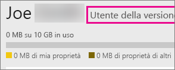
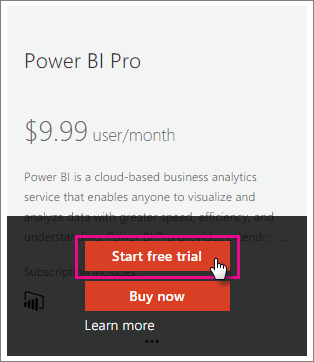
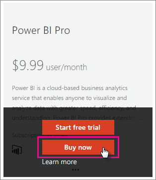

# Acquisto di Power BI Pro
Power BI Pro è destinato agli utenti che pubblicano report, condividono dashboard, collaborano con i colleghi nelle aree di lavoro e partecipano ad altre attività correlate, quali:

* Analizzare dati in Excel o Power BI Desktop
* Condividere con il supporto dell'applicazione Excel Web
* Condividere dashboard e collaborare con aree di lavoro per le app
* Visualizzare il contenuto condiviso
* Integrare contenuti con Microsoft Teams

Gli amministratori IT possono scegliere tra diverse opzioni per usare Power BI Pro all'interno dell'organizzazione. È possibile acquistare Power BI Pro tramite l'interfaccia di amministrazione di Office 365 o il proprio rappresentante o partner Microsoft. In questo articolo verranno illustrate due opzioni di valutazione disponibili per Power BI Pro e le modalità di acquisto di Power BI Pro come organizzazione.

Per altre informazioni su Power BI Premium e su come Power BI Pro si inserisce nell'offerta Premium, vedere [Power BI Premium: di cosa si tratta?](service-premium.md).

## Prezzi
Per le informazioni più recenti sui prezzi di Power BI Pro e un elenco delle funzionalità incluse, vedere la [pagina dei prezzi di Power BI](https://powerbi.microsoft.com/pricing/).

## Versione di prova gratuita completa di Power BI Pro di 60 giorni per utenti singoli
Dopo aver effettuato l'iscrizione all'account gratuito, è possibile provare la versione Pro gratuitamente per 60 giorni. Sarà possibile accedere a tutte le funzionalità Pro per la durata del periodo di valutazione. Power BI Pro dispone di tutte le funzionalità della versione gratuita di Power BI, oltre a funzionalità di condivisione e collaborazione aggiuntive. Per altre informazioni, vedere la [pagina dei prezzi di Power BI](https://powerbi.microsoft.com/pricing). Per provare una versione di valutazione gratuita di 60 giorni di Power BI Pro, iscriversi a Power BI e provare una di queste funzionalità Power BI Pro:

* [Crea area di lavoro per le app](service-create-distribute-apps.md)
* [Share a dashboard (Condividi un dashboard)](service-share-dashboards.md)

Quando si prova una qualsiasi di queste funzionalità, viene richiesto l'avvio della versione di valutazione gratuita. È anche possibile decidere di usarla selezionando l'icona dell'ingranaggio e poi **Gestisci archivio personale**. Selezionare quindi **Prova gratuitamente la versione Pro** sulla destra.

È quindi possibile selezionare **Avvia versione di valutazione**.

> [!NOTE]
> Gli utenti che usano questa versione di valutazione di Power BI Pro del prodotto non vengono visualizzati nel portale di amministrazione di Office 365 come utenti della versione di valutazione Power BI Pro (vengono visualizzati come utenti gratuiti di Power BI). Tuttavia, verranno visualizzati come utenti della versione di valutazione di Power BI Pro nella pagina **Gestisci archiviazione** di Power BI.

> [!NOTE]
> Se un amministratore IT vuole acquisire e distribuire le licenze della versione di valutazione di Power BI a più utenti dell'organizzazione senza che i singoli utenti accettino individualmente le condizioni della versione di valutazione, può iscriversi a una [versione di valutazione Power BI Pro](https://portal.office.com/Signup/MainSignup15.aspx?OfferId=d59682f3-3e3b-4686-9c00-7c7c1c736085&dl=POWER_BI_PRO). È necessario essere un amministratore fatturazione o amministratore globale di Office 365 oppure creare un nuovo tenant per iscriversi a una versione di valutazione per l'amministratore. Per altre informazioni, vedere [Acquisto di Power BI Pro](service-admin-purchasing-power-bi-pro.md).

> [!NOTE]
> Con la disponibilità di Power BI Premium e le modifiche dell'offerta di Power BI gratuito del 1° giugno 2017, è possibile che si sia idonei per una versione di valutazione Pro estesa. Per altre informazioni, vedere [Extended Pro Trial activation](service-extended-pro-trial.md) (Attivazione della versione di valutazione Pro estesa).

### Verifica dello stato all'interno del servizio
Una volta all'interno del servizio, è possibile verificare di avere un account per la versione di valutazione Pro selezionando l'icona a forma di *ingranaggio* e scegliendo **Gestisci archivio personale**.

## Sottoscrizione di valutazione di Office 365
È possibile ottenere una versione di valutazione di Power BI Pro per l'organizzazione. Dopo aver creato la sottoscrizione, è possibile assegnare licenze Power BI Pro ai propri utenti. Per altre informazioni su come assegnare le licenze, vedere [Assegnare licenze agli utenti in Office 365 ](https://support.office.com/article/Assign-or-unassign-licenses-for-Office-365-for-business-997596b5-4173-4627-b915-36abac6786dc).

> [!NOTE]
> È previsto un limite di una versione di valutazione aziendale per ogni tenant. Ciò significa che se un utente ha già applicato Power BI Pro - Versione di valutazione al tenant, non è possibile ripetere l'operazione. Se è necessaria assistenza a tal riguardo, è possibile contattare il [supporto per la fatturazione di Office 365](https://support.office.microsoft.com/article/Contact-Office-365-for-business-support-Admin-Help-32a17ca7-6fa0-4870-8a8d-e25ba4ccfd4b?CorrelationId=552bbf37-214f-4202-80cb-b94240dcd671&ui=en-US&rs=en-US&ad=US#BKMK_call_support).
> 

1. Accedere all'[interfaccia di amministrazione di Office 365](https://portal.office.com/admin/default.aspx).
2. Nel riquadro di spostamento a sinistra, selezionare Fatturazione > Sottoscrizioni.
3. Selezionare l'aggiunta di sottoscrizioni sul lato destro.
4. In Altri piani passare il cursore sui puntini di sospensione (...) per Power BI Pro e selezionare Avvia versione di valutazione gratuita.
   
    
5. Nella schermata di conferma dell'ordine, selezionare Prova ora.
6. Selezionare Continua alla ricezione dell'ordine.

In **Fatturazione** > **Abbonamenti** verrà visualizzato **Power BI Pro - Versione di valutazione** elencato con 25 licenze disponibili. Si tratta di una versione di valutazione della durata di un mese.

### Verifica dello stato all'interno del servizio
Una volta all'interno del servizio, è possibile verificare di avere un account Pro selezionando l'icona a forma di **ingranaggio** e selezionando **Gestisci archivio personale**. Non ci sarà alcuna indicazione che si tratta di un utente della versione di valutazione.

## Acquisto di una sottoscrizione di Office 365
È possibile acquistare Power BI Pro per l'organizzazione tramite l'interfaccia di amministrazione di Office 365. Dopo aver creato la sottoscrizione, è possibile assegnare licenze Power BI Pro ai propri utenti. Per altre informazioni su come assegnare le licenze, vedere [Assegnare licenze agli utenti in Office 365 ](https://support.office.com/article/Assign-or-unassign-licenses-for-Office-365-for-business-997596b5-4173-4627-b915-36abac6786dc).

1. Accedere all'[interfaccia di amministrazione di Office 365](https://portal.office.com/admin/default.aspx).
2. Nel riquadro di spostamento a sinistra, selezionare Fatturazione > Sottoscrizioni.
3. Selezionare l'aggiunta di sottoscrizioni sul lato destro.
4. In Altri piani, passare il cursore sui puntini di sospensione (...) per Power BI Pro e selezionare Acquista ora.
   
    
5. Immettere il numero di licenze da aggiungere e selezionare Cassa oppure Aggiungi al carrello.
   
   > [!NOTE]
   > Se necessario, è possibile aggiungere altre licenze in un secondo momento.
   > 
   > 
6. Immettere le informazioni necessarie alla procedura di controllo.

> [!NOTE]
> Se è già disponibile Power BI Pro - Versione di valutazione, viene visualizzata direttamente la schermata di completamento della transazione dove viene chiesto di immettere il numero di licenze desiderato.
> 
> 

In **Fatturazione** > **Abbonamenti** verrà visualizzato **Power BI Pro**. Se in seguito si decide di aggiungere altre licenze, è possibile tornare ad **Aggiungi sottoscrizioni** e **modificare la quantità di licenze**.

### Verifica dello stato all'interno del servizio
Una volta all'interno del servizio, è possibile verificare di avere un account Pro selezionando l'icona a forma di **ingranaggio** e selezionando **Gestisci archivio personale**.

## Periodo di tolleranza
È previsto un periodo di tolleranza di 30 giorni dopo la scadenza di una licenza di Power BI Pro. 

Power BI Pro ha lo stesso ciclo di vita della sottoscrizione di Office 365. Per altre informazioni, vedere [Che cosa succede ai dati e all'accesso al termine della sottoscrizione di Office 365 per le aziende](https://support.office.com/en-us/article/What-happens-to-my-data-and-access-when-my-Office-365-for-business-subscription-ends-4436582f-211a-45ec-b72e-33647f97d8a3)

## Passaggi successivi
[Iscrizione a Power BI in modalità self-service](service-self-service-signup-for-power-bi.md)  
[Power BI (gratuito) nell'organizzazione](service-admin-service-free-in-your-organization.md)  
[Extended Pro Trial activation](service-extended-pro-trial.md) (Attivazione della versione di valutazione Pro estesa)  
[Power BI Premium: di cosa si tratta?](service-premium.md)  
[Come acquistare Power BI Premium](service-admin-premium-purchase.md)  
[White paper su Power BI Premium](https://aka.ms/pbipremiumwhitepaper)  

Altre domande? [Provare a rivolgersi alla community di Power BI](http://community.powerbi.com/)

