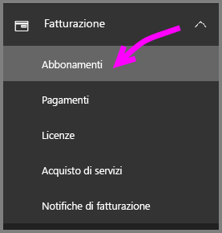
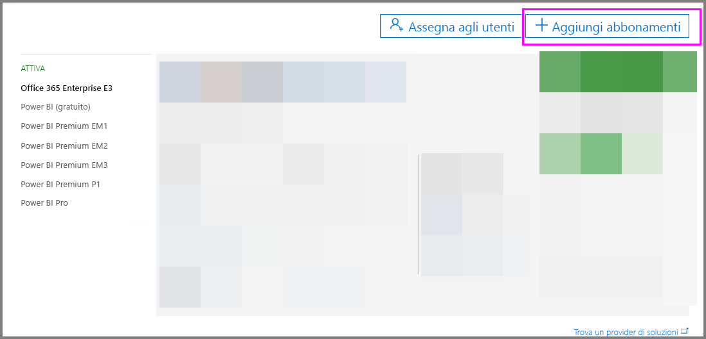
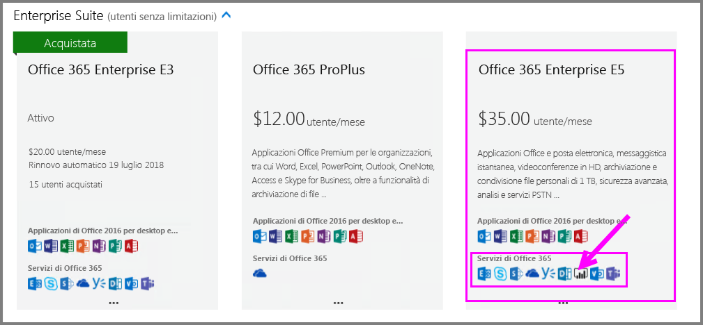
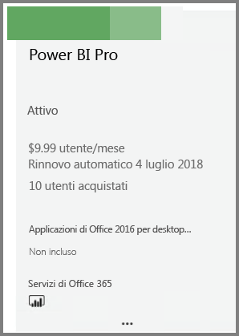
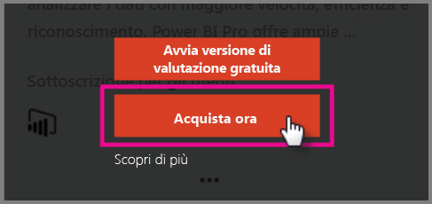
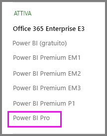

# Guida introduttiva: Acquistare licenze di Power BI Pro

Power BI Pro è una licenza singola che consente di accedere a tutto il contenuto e a tutte le funzionalità del servizio Power BI, inclusa la possibilità di condividere contenuto e collaborare con altri utenti Pro. Solo gli utenti della versione Pro possono pubblicare e usare contenuti nelle aree di lavoro delle app, condividere i dashboard e sottoscrivere dashboard e report. Questo articolo illustra come acquistare licenze di Power BI Pro in Office 365.

## Prerequisiti

È necessario essere membro del ruolo [**Amministratore globale** o **Amministratore fatturazione**](https://support.office.com/article/about-office-365-admin-roles-da585eea-f576-4f55-a1e0-87090b6aaa9d?ui=en-US&rs=en-US&ad=US) in Office 365. 

## Acquistare licenze di Power BI Pro tramite Office 365

Seguire questi passaggi per acquistare licenze di Power BI Pro:

1. Aprire l'[interfaccia di amministrazione di Office 365](https://portal.office.com/adminportal/home#/homepage).

2. Nel riquadro di spostamento a sinistra selezionare **Fatturazione** > **Abbonamenti**.

    

3. Nell'angolo superiore destro della pagina **Sottoscrizioni** selezionare **Aggiungi abbonamenti**.

    

4. Individuare l'offerta di sottoscrizione desiderata:

    In **Enterprise Suite** selezionare **Office 365 Enterprise E5**.

    

    In **Altri piani** selezionare **Power BI Pro**.

    

5. Passare il mouse sui puntini di sospensione (...) per la sottoscrizione desiderata e selezionare **Acquista ora**.

    

6. Scegliere **Pagamento mensile** o **Pagamento per un intero anno** in base alle proprie preferenze di fatturazione.

7. In **How many users do you want?** (Numero di utenti) specificare il numero di licenze desiderato e quindi selezionare **Procedi al pagamento** per completare la transazione.

8. Verificare che la sottoscrizione acquisita sia ora indicata nella pagina **Sottoscrizioni**.

   

9. Per aggiungere altre licenze dopo l'acquisto iniziale, selezionare **Power BI Pro** nella pagina **Sottoscrizioni** e fare clic su **Aggiungi/rimuovi licenze**.

## Passaggi successivi

Ora che si sono acquistate le licenze, assegnarle agli utenti nel tenant.

[Assegnare licenze agli utenti in Office 365](service-admin-assigning-power-bi-pro-licenses.md)

[Assegnare licenze agli utenti in Azure](service-admin-assigning-power-bi-pro-licenses-azure.md)

[Prezzi di Power BI](https://powerbi.microsoft.com/en-us/pricing/)
