# Acquistare e assegnare licenze Power BI Pro

Power BI Pro è una licenza singola che consente di accedere a tutto il contenuto e a tutte le funzionalità del servizio Power BI, inclusa la possibilità di condividere contenuto e collaborare con altri utenti Pro. Solo gli utenti della versione Pro possono pubblicare e usare contenuti nelle aree di lavoro delle app, condividere i dashboard e sottoscrivere dashboard e report. Per altre informazioni, vedere [Funzionalità di Power BI in base al tipo di licenza](service-features-license-type.md).

Nella prima parte di questo articolo viene illustrato come acquistare licenze Power BI Pro in Office 365. In seguito vengono descritte le due opzioni disponibili per assegnare le licenze per singoli utenti: Office 365 e Azure (scegliere un'opzione).

## Prerequisiti

È necessario essere membro del ruolo [**Amministratore globale** o **Amministratore fatturazione**](https://support.office.com/article/about-office-365-admin-roles-da585eea-f576-4f55-a1e0-87090b6aaa9d) in Office 365.

Per assegnare le licenze in Azure, è necessario essere proprietario della sottoscrizione di Azure usata da Power BI per le ricerche di Active Directory.

## Acquistare licenze in Office 365

Seguire questi passaggi per acquistare licenze di Power BI Pro:

1. Aprire l'[interfaccia di amministrazione di Office 365](https://portal.office.com/adminportal/home#/homepage).

2. Nel riquadro di spostamento a sinistra selezionare **Fatturazione** > **Abbonamenti**.

    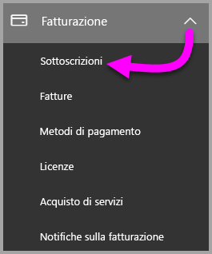

3. Nell'angolo superiore destro della pagina **Sottoscrizioni** selezionare **Aggiungi abbonamenti**.

    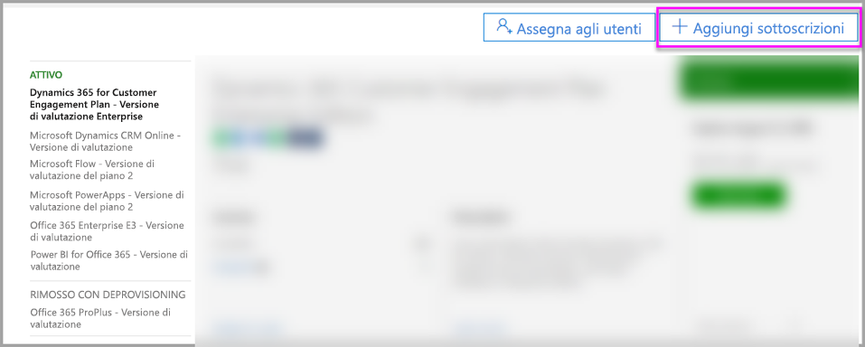

4. Individuare l'offerta di sottoscrizione desiderata:

    In **Enterprise Suite** selezionare **Office 365 Enterprise E5**.

    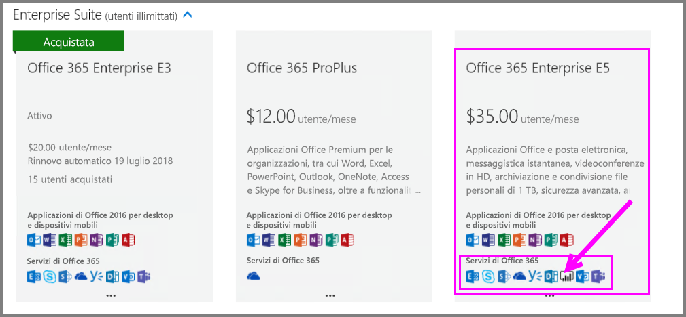

    In **Altri piani** selezionare **Power BI Pro**.

    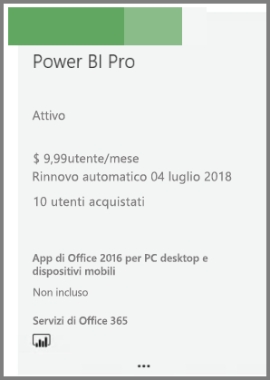

5. Passare il mouse sui puntini di sospensione (**...**) per la sottoscrizione richiesta e selezionare **Acquista ora**.

    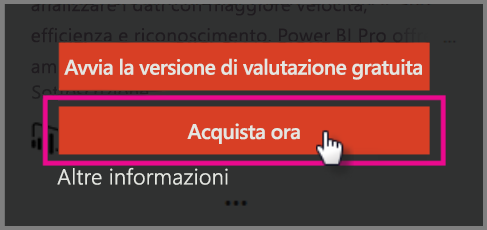

6. Scegliere **Pagamento mensile** o **Pagamento per un intero anno** in base alle proprie preferenze di fatturazione.

7. In **How many users do you want?** (Numero di utenti) specificare il numero di licenze desiderato e quindi selezionare **Procedi al pagamento** per completare la transazione.

8. Verificare che la sottoscrizione acquisita sia ora indicata nella pagina **Sottoscrizioni**.

   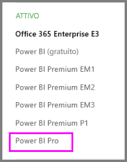

9. Per aggiungere altre licenze dopo l'acquisto iniziale, selezionare **Power BI Pro** nella pagina **Sottoscrizioni** e fare clic su **Aggiungi/rimuovi licenze**.

## Assegnare licenze in Office 365

Seguire questi passaggi per assegnare licenze di Power BI Pro a singoli account utente:

1. Aprire l'[interfaccia di amministrazione di Office 365](https://portal.office.com/adminportal/home#/homepage).

2. Nel riquadro di spostamento a sinistra espandere **Utenti** e quindi selezionare **Utenti attivi**.

    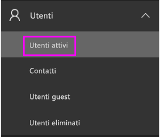

3. Selezionare un utente, quindi in **Licenze di prodotto** selezionare **Modifica**.

    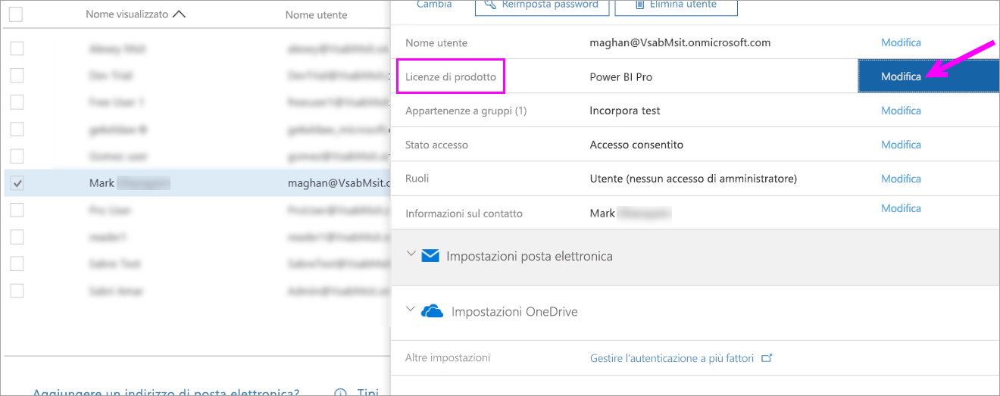

4. In **Power BI Pro** attivare l'impostazione **Sul** quindi fare clic su **Salva**.

    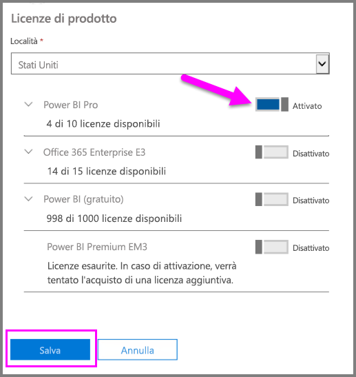

5. Nello **Stato** dell'account selezionato verificare che la licenza di Power BI Pro sia stata assegnata correttamente.

    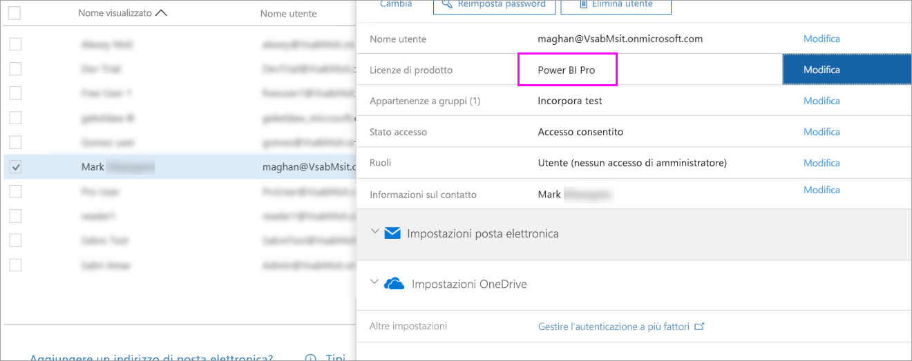

## Assegnare licenze in Azure

Seguire questi passaggi per assegnare licenze di Power BI Pro a singoli account utente:

1. Aprire il [portale di Azure](https://ms.portal.azure.com/#@microsoft.onmicrosoft.com/dashboard/private/39bc3cf7-31a4-43f6-954c-f2d69ca2f0).

2. Nella barra di spostamento a sinistra selezionare **Azure Active Directory**.

    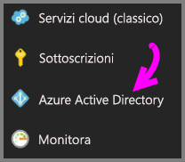

3. In **Azure Active Directory** selezionare **Licenze**.

    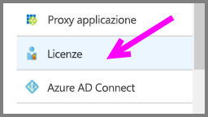

4. In **Licenze** selezionare **Tutti i prodotti** e quindi selezionare **Power BI Pro** per visualizzare l'elenco degli utenti con licenza.

    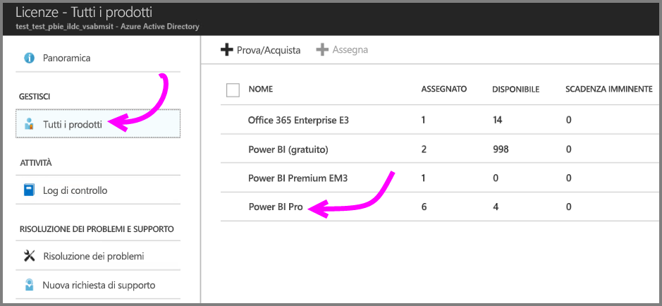

5. Selezionare **Assegna** per aggiungere una licenza di Power BI Pro a un altro account utente.

    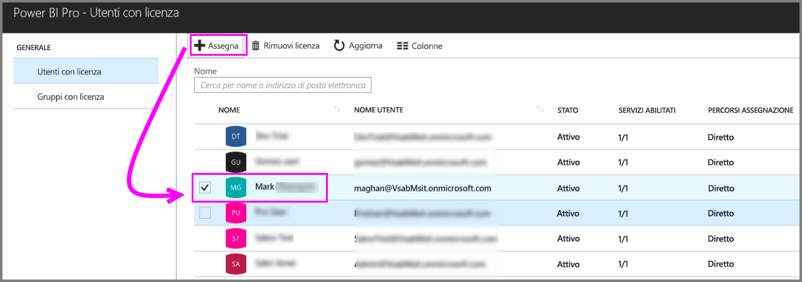

## Passaggi successivi

Ora che le licenze sono state assegnate, seguire i collegamenti per altre informazioni su Power BI Pro.

[Gestione delle licenze di Power BI nell'organizzazione](service-admin-licensing-organization.md)

[Ricerca di utenti Power BI che hanno eseguito l'accesso](service-admin-access-usage.md)

Altre domande? [Provare a rivolgersi alla community di Power BI](https://community.powerbi.com/)
