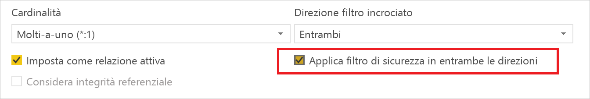
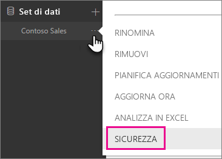
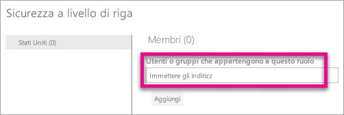
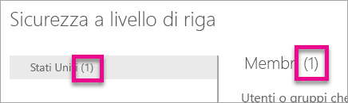
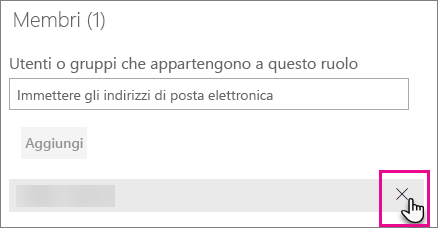
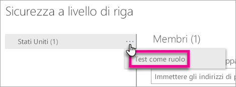
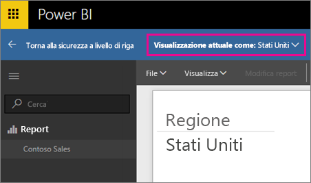
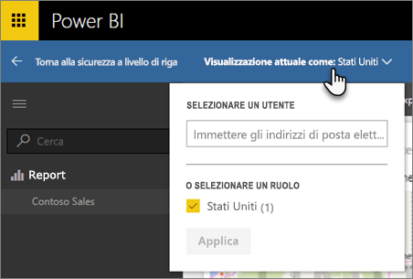
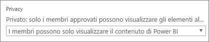

# Sicurezza a livello di riga con Power BI

La sicurezza a livello di riga con Power BI può essere usata per limitare l'accesso ai dati per determinati utenti. I filtri limitano l'accesso ai dati a livello di riga ed è possibile definirli all'interno dei ruoli. Tenere presente che nel servizio Power BI i membri di un'area di lavoro hanno accesso ai set di dati presenti nell'area di lavoro. La sicurezza a livello di riga non limita l'accesso a questi dati.

È possibile configurare la sicurezza a livello di riga per i modelli di dati importati in Power BI con Power BI Desktop. È anche possibile configurare la sicurezza a livello di riga nei set di dati che usano DirectQuery, ad esempio SQL Server. In precedenza, era possibile implementare la sicurezza a livello di riga solo nei modelli di Analysis Services all'esterno di Power BI. Per le connessioni dinamiche ad Analysis Services è possibile configurare la sicurezza a livello di riga nel modello locale. L'opzione di sicurezza non verrà visualizzata per i set di dati di connessione dinamica.

[!INCLUDE [include-short-name](./includes/rls-desktop-define-roles.md)]

Per impostazione predefinita, i filtri per la sicurezza a livello di riga usano i filtri unidirezionali, indipendentemente dal fatto che le relazioni siano impostate su unidirezionali o bidirezionali. È possibile abilitare manualmente il filtro incrociato bidirezionale con la sicurezza a livello di riga selezionando la selezione e selezionando la casella di controllo **Applica filtro di sicurezza in entrambe le direzioni**. È necessario selezionare questa casella quando si implementa la [sicurezza dinamica a livello di riga](https://docs.microsoft.com/sql/analysis-services/supplemental-lesson-implement-dynamic-security-by-using-row-filters), che consente di fornire la sicurezza a livello di riga in base a un nome utente o un ID di accesso.

Per altre informazioni, vedere [Filtro incrociato bidirezionale con DirectQuery in Power BI Desktop](desktop-bidirectional-filtering.md) e l'articolo tecnico [Securing the Tabular BI Semantic Model](http://download.microsoft.com/download/D/2/0/D20E1C5F-72EA-4505-9F26-FEF9550EFD44/Securing%20the%20Tabular%20BI%20Semantic%20Model.docx) (Protezione del modello semantico tabulare di BI).

[!INCLUDE [include-short-name](./includes/rls-desktop-view-as-roles.md)]

## Gestire la sicurezza nel modello

Per gestire la sicurezza nel modello di dati, si dovranno eseguire le operazioni seguenti.

1. Selezionare i **puntini di sospensione (…)** accanto a un set di dati.
2. Selezionare **Sicurezza**.
   
   

Verrà visualizzata la pagina della sicurezza a livello di riga per aggiungere membri a un ruolo che è stato creato in Power BI Desktop. Solo i proprietari del set di dati potranno visualizzare l'opzione Sicurezza. Se il set di dati è in un gruppo, l'opzione di sicurezza sarà visibile solo per gli amministratori del gruppo. 

È possibile creare o modificare i ruoli solo all'interno di Power BI Desktop.

## Utilizzo dei membri

### Aggiungere membri

È possibile aggiungere un membro al ruolo digitando l'indirizzo di posta elettronica, o il nome, dell'utente, del gruppo di sicurezza o della lista di distribuzione da aggiungere. Il membro deve essere interno all'organizzazione. Non è possibile aggiungere gruppi creati all'interno di Power BI.

È anche possibile stabilire il numero di membri che fanno parte del ruolo in base al numero indicato tra parentesi accanto al nome del ruolo o accanto a Membri.

### Rimuovere i membri

È possibile rimuovere i membri selezionando l'icona X accanto al nome. 

## Convalida del ruolo all'interno del servizio Power BI

È possibile convalidare il corretto funzionamento del ruolo definito testandolo. 

1. Selezionare i **puntini di sospensione (…)** accanto al ruolo.
2. Selezionare **Test dei dati come ruolo**

Verranno visualizzati i report disponibili per questo ruolo. I dashboard non vengono presentati in questa visualizzazione. La barra blu sopra indica cosa viene applicato.

È possibile testare altri ruoli, o combinazioni di ruoli, selezionando **Visualizzazione attuale come**.

È possibile scegliere di visualizzare i dati come un utente specifico oppure è possibile selezionare una combinazione dei ruoli disponibili per convalidarne il funzionamento. 

Per tornare alla visualizzazione normale, selezionare **Torna alla sicurezza a livello di riga**.

[!INCLUDE [include-short-name](./includes/rls-usernames.md)]

## Usare la sicurezza a livello di riga con le aree di lavoro per le app in Power BI

Se si pubblica il report di Power BI Desktop in un'area di lavoro per le app all'interno del servizio Power BI, i ruoli verranno applicati ai membri di sola lettura. È necessario indicare che i membri possono visualizzare il contenuto di Power BI solo entro le impostazioni dell'area di lavoro per le app.

> [!WARNING]
> Se è stata configurata l'area di lavoro per le app in modo da assegnare le autorizzazioni di modifica ai membri, i ruoli di sicurezza a livello di riga non verranno applicati. Gli utenti riusciranno a visualizzare tutti i dati.

[!INCLUDE [include-short-name](./includes/rls-limitations.md)]

[!INCLUDE [include-short-name](./includes/rls-faq.md)]

## Passaggi successivi
[Sicurezza a livello di riga con Power BI Desktop](desktop-rls.md)  

Altre domande? [Provare a rivolgersi alla community di Power BI](http://community.powerbi.com/)