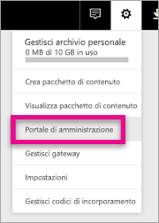

# <a name="understanding-the-power-bi-admin-role"></a>Informazioni sul ruolo di amministratore di Power BI
Informazioni su come usare il ruolo di amministratore di Power BI all'interno dell'organizzazione.

<iframe width="640" height="360" src="https://www.youtube.com/embed/PQRbdJgEm3k?showinfo=0" frameborder="0" allowfullscreen></iframe>

Il ruolo di amministratore del servizio Power BI può essere assegnato agli utenti che devono avere accesso al portale di amministrazione di Power BI, senza concedere loro l'accesso amministrativo per Office 365. Un esempio è il ruolo di amministratore globale. È pensato per gli incaricati dell'amministrazione di Power BI per la propria organizzazione.

Gli amministratori degli utenti di Office 365 possono assegnare agli utenti il ruolo di amministratore di Power BI usando l'interfaccia di amministrazione di Office 365 o uno script di PowerShell. Gli utenti a cui viene assegnato questo ruolo potranno accedere al [portale di amministrazione di Power BI](service-admin-portal.md). Lì avranno accesso alle metriche di utilizzo a livello di tenant e potranno controllare l'utilizzo delle funzionalità di Power BI a livello di tenant.



## <a name="using-the-office-365-admin-center-to-assign-a-role"></a>Uso dell'interfaccia di amministrazione di Office 365 per assegnare un ruolo
Per assegnare utenti al ruolo di amministratore di Power BI all'interno dell'interfaccia di amministrazione di Office 365, è possibile eseguire le operazioni seguenti.

1. Passare all'interfaccia di amministrazione di Office 365 e selezionare **Utenti** > **Utenti attivi**.
   
    
2. Selezionare l'utente a cui si vuole assegnare il ruolo.
3. Selezionare **Modifica** per i ruoli.
   
    
4. Selezionare **Amministratore personalizzato** > **Amministratore del servizio Power BI**
   
    
5. Selezionare **Salva**.

Per il ruolo di quell'utente dovrebbe risultare **Amministratore del servizio Power BI**. L'utente non avrà accesso al [portale di amministrazione di Power BI](service-admin-portal.md).


## <a name="using-powershell-to-assign-a-role"></a>Uso di PowerShell per assegnare un ruolo
Per eseguire il comando di PowerShell, è necessario che sia installato il modulo PowerShell di Azure Active Directory.

### <a name="download-azure-ad-powershell-module"></a>Scaricare il modulo PowerShell di Azure AD
[Scaricare Azure Active Directory PowerShell versione 2](https://github.com/Azure/azure-docs-powershell-azuread/blob/master/Azure%20AD%20Cmdlets/AzureAD/index.md)

[Scaricare Azure Active Directory PowerShell versione 1.1.166.0 GA](http://connect.microsoft.com/site1164/Downloads/DownloadDetails.aspx?DownloadID=59185)

### <a name="command-to-add-role-to-member"></a>Comando per aggiungere un ruolo a un membro
**Comando di Azure AD PowerShell versione 2**

Sarà necessario ottenere il valore **ObjectId** per il ruolo **Amministratore del servizio Power BI**. È possibile eseguire [Get-AzureADDirectoryRole](https://docs.microsoft.com/powershell/azuread/v2/get-azureaddirectoryrole) per ottenere il valore **ObjectId**.

```
PS C:\Windows\system32> Get-AzureADDirectoryRole

ObjectId                             DisplayName                        Description
--------                             -----------                        -----------
00f79122-c45d-436d-8d4a-2c0c6ca246bf Power BI Service Administrator     Full access in the Power BI Service.
250d1222-4bc0-4b4b-8466-5d5765d14af9 Helpdesk Administrator             Helpdesk Administrator has access to perform..
3ddec257-efdc-423d-9d24-b7cf29e0c86b Directory Synchronization Accounts Directory Synchronization Accounts
50daa576-896c-4bf3-a84e-1d9d1875c7a7 Company Administrator              Company Administrator role has full access t..
6a452384-6eb9-4793-8782-f4e7313b4dfd Device Administrators              Device Administrators
9900b7db-35d9-4e56-a8e3-c5026cac3a11 AdHoc License Administrator        Allows access manage AdHoc license.
a3631cce-16ce-47a3-bbe1-79b9774a0570 Directory Readers                  Allows access to various read only tasks in ..
f727e2f3-0829-41a7-8c5c-5af83c37f57b Email Verified User Creator        Allows creation of new email verified users.
```

In questo caso, il valore objectid del ruolo è 00f79122-c45d-436d-8d4a-2c0c6ca246bf.

Occorrerà anche conoscere il valore **ObjectID** degli utenti. Per trovarlo, eseguire [Get-AzureADUser](https://docs.microsoft.com/powershell/azuread/v2/get-azureaduser).

```
PS C:\Windows\system32> Get-AzureADUser -SearchString 'tim@contoso.com'

ObjectId                             DisplayName UserPrincipalName      UserType
--------                             ----------- -----------------      --------
6a2bfca2-98ba-413a-be61-6e4bbb8b8a4c Tim         tim@contoso.com        Member
```

Per aggiungere il membro al ruolo, eseguire [Add-AzureADDirectoryRoleMember](https://docs.microsoft.com/powershell/azuread/v2/add-azureaddirectoryrolemember).

| Parametro | Descrizione |
| --- | --- |
| ObjectId |ID oggetto del ruolo. |
| RefObjectId |ID oggetto dei membri. |

```
Add-AzureADDirectoryRoleMember -ObjectId 00f79122-c45d-436d-8d4a-2c0c6ca246bf -RefObjectId 6a2bfca2-98ba-413a-be61-6e4bbb8b8a4c
```

**Comando di Azure AD PowerShell versione 1**

Per aggiungere un membro a un ruolo usando i cmdlet di Azure AD versione 1, è necessario eseguire il comando [Add-MsolRoleMember](https://docs.microsoft.com/powershell/msonline/v1/add-msolrolemember).

```
Add-MsolRoleMember -RoleMemberEmailAddress "tim@contoso.com" -RoleName "Power BI Service Administrator"
```

## <a name="limitations-and-considerations"></a>Limitazioni e considerazioni
Il ruolo di amministratore del servizio Power BI non fornisce l'accesso a quanto segue.

* Possibilità di modificare gli utenti e le licenze nell'Interfaccia di amministrazione di Office 365
* Accesso ai log di controllo. Per altre informazioni, usare [Uso del controllo nell'organizzazione](service-admin-auditing.md).

## <a name="next-steps"></a>Passaggi successivi
[Portale di amministrazione di Power BI](service-admin-portal.md)  
[Add-AzureADDirectoryRoleMember](https://docs.microsoft.com/powershell/azuread/v2/add-azureaddirectoryrolemember)  
[Add-MsolRoleMember](https://docs.microsoft.com/powershell/msonline/v1/add-msolrolemember)  
[Controllo di Power BI nell'organizzazione](service-admin-auditing.md)  
[Amministrazione di Power BI nell'organizzazione](service-admin-administering-power-bi-in-your-organization.md)  

Altre domande? [Provare a rivolgersi alla community di Power BI](http://community.powerbi.com/)

