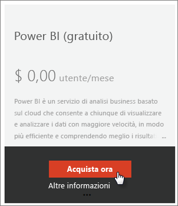
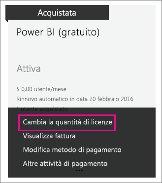
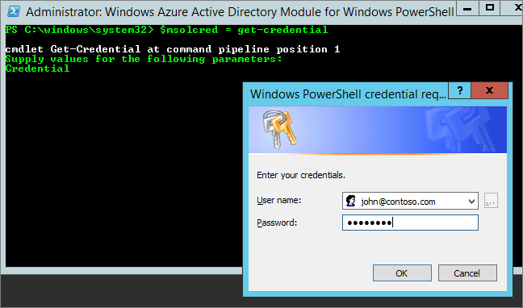

# Power BI (gratuito) nell'organizzazione
Questo articolo illustra come usar Power BI (gratuito) all'interno dell'organizzazione. Il concetto di organizzazione implica che si dispone di un tenant e che si possono gestire utenti e servizi all'interno di tale tenant. Come amministratore, è possibile controllare l'assegnazione delle licenze oppure consentire agli utenti di effettuare l'iscrizione come singoli. Verrà illustrata la licenza di Power BI (gratuito) e la modalità di controllo delle iscrizioni come utente singolo.

## Iscrizione come utente singolo e assegnazione della licenza
Gli utenti all'interno dell'organizzazione possono accedere a Power BI in due modi diversi. Possono iscriversi a Power BI come utenti singoli oppure l'amministratore può assegnare loro una licenza di Power BI dall'interfaccia di amministrazione di Office 365.

Consentire l'iscrizione come utenti singoli riduce il carico di lavoro per gli amministratori dell'organizzazione, dal momento che in questo modo gli utenti interessati a Power BI possono iscriversi gratuitamente.

Ma per un maggior controllo, è possibile bloccare le iscrizioni come utente singolo e assegnare personalmente le licenze di Power BI tramite l'interfaccia di amministrazione di Office 365. Ciò consente di specificare di chi può accedere a quali servizi all'interno dell'organizzazione. Questa è anche un'ottima alternativa se è necessario gestire il controllo e sapere esattamente chi può usare cosa.

## Procedura: ottenere il blocco di un numero illimitato di licenze
Dall'interfaccia di amministrazione di Office 365, in **Fatturazione** > **Licenze**, è possibile che Power BI (gratuito) venga visualizzato con un numero illimitato di licenze oppure no.

Il blocco delle licenze viene visualizzato la prima volta in cui qualcuno tenta di iscriversi a Power Bi come utente singolo. Durante questo processo, il blocco delle licenze viene associato all'organizzazione e viene assegnata una licenza all'utente che sta eseguendo l'iscrizione.

Se l'organizzazione sta bloccando gli utenti singoli e nessuno ha effettuato l'accesso, il blocco licenze non viene visualizzato. È possibile consentire l'accesso agli utenti singoli e consentire a un utente di iscriversi, oppure ottenere delle licenze gratuite tramite l'aggiunta di sottoscrizioni in Office 365 di cui si parlerà più avanti.

Una volta che il blocco delle licenze di Power BI (gratuito) è disponibile, è possibile assegnare le licenze agli utenti. Per altre informazioni su come assegnare le licenze, vedere [Assegnare licenze agli utenti in Office 365 ](https://support.office.com/article/Assign-or-unassign-licenses-for-Office-365-for-business-997596b5-4173-4627-b915-36abac6786dc).

## Ottenere licenze gratuite tramite l'aggiunta di sottoscrizioni in Office 365
1. Accedere all'[interfaccia di amministrazione di Office 365](https://portal.office.com/admin/default.aspx).
2. Nel riquadro di spostamento a sinistra selezionare **Fatturazione** > **Abbonamenti**.
3. Selezionare **+ Aggiungi abbonamenti** sul lato destro.
4. In Altri piani passare il puntatore del mouse sui **puntini di sospensione (...)** per Power BI (gratuito) e selezionare **Acquista ora**.
   
    
5. Immettere il numero di licenze da aggiungere e selezionare **Cassa** oppure **Aggiungi al carrello**.
   
   > [!NOTE]
   > Se necessario, è possibile aggiungere altre licenze in un secondo momento.
   > 
   > 
6. Immettere le informazioni necessarie alla procedura di controllo.

Non si esegue alcun acquisto quando si utilizza questo approccio, anche se è necessario immettere i dati della carta di credito per la fatturazione o scegliere di ricevere una fattura.

Se in seguito si decide di aggiungere altre licenze, è possibile tornare ad **Aggiungi abbonamenti** e selezionare **Cambia la quantità di licenze** per Power BI (gratuito).

A questo punto è possibile assegnare le licenze ai propri utenti. Per altre informazioni su come assegnare le licenze, vedere [Assegnare licenze agli utenti in Office 365 ](https://support.office.com/article/Assign-or-unassign-licenses-for-Office-365-for-business-997596b5-4173-4627-b915-36abac6786dc).

## Abilitare o disabilitare l'accesso di utenti singoli a Azure Active Directory
Come amministratore, è possibile abilitare o disabilitare l'accesso come utente singolo in Azure Active Directory (AAD). Se si ha una buona padronanza dei comandi di PowerShell per ADD, è possibile abilitare o disabilitare le sottoscrizioni ad hoc. [Altre informazioni](https://technet.microsoft.com/library/jj151815.aspx)

L'impostazione di AAD che controlla questa operazione è **AllowAdHocSubscriptions**. La maggior parte dei tenant avrà questa opzione impostata su true, il che significa che è abilitata. Se Power Bi è stato acquistato tramite un partner, è possibile che questa opzione sia impostata su false, il che significa che è disabilitata.

1. È prima di tutto necessario accedere ad Azure Active Directory usando le credenziali di Office 365. La prima riga richiederà le credenziali. La seconda riga si connette ad Azure Active Directory.
   
     $msolcred = get-credential   connect-msolservice -credential $msolcred
   
   
2. Una volta effettuato l'accesso, è possibile eseguire il comando seguente per vedere come è configurato il tenant.
   
     Get-MsolCompanyInformation | fl AllowAdHocSubscriptions
3. È possibile impostare questo comando per abilitare ($true) o disabilitare ($false) AllowAdHocSubscriptions.
   
     Set-MsolCompanySettings -AllowAdHocSubscriptions $true

> [!NOTE]
> Questo blocco impedisce ai nuovi utenti dell'organizzazione di iscriversi a Power BI. Gli utenti che si iscrivono a Power BI prima della disabilitazione delle nuove iscrizioni per l'organizzazione manterranno le proprie licenze.
> 
> 

## Passaggi successivi
[Iscrizione a Power BI in modalità self-service](service-self-service-signup-for-power-bi.md)  
[Acquisto di Power BI Pro](service-admin-purchasing-power-bi-pro.md)  
[Iscriversi a Power BI (gratuito) con un tenant Azure Active Directory personalizzato](developer/create-an-azure-active-directory-tenant.md)  
[Power BI Premium: di cosa si tratta?](service-premium.md)  
[White paper su Power BI Premium](https://aka.ms/pbipremiumwhitepaper)  

Altre domande? [Provare a rivolgersi alla community di Power BI](http://community.powerbi.com/)

