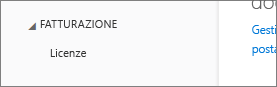
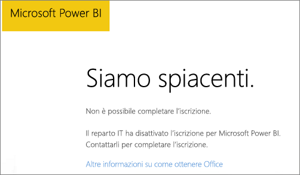
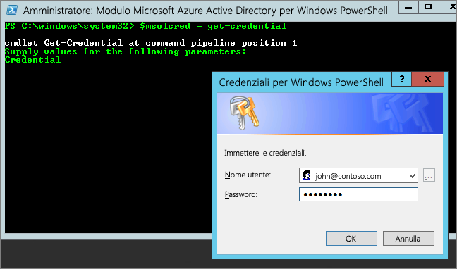

# Impossibile aggiungere Power BI a una sottoscrizione partner di Office 365
Office 365 consente alle aziende di rivendere Office 365 in bundle e integrato con le proprie soluzioni, fornendo ai clienti finali un singolo punto di contatto per l'acquisto, la fatturazione e il supporto.

Se si è interessati a ottenere Power BI, insieme alla sottoscrizione di Office 365, è consigliabile contattare il proprio partner. Se il partner non offre Power BI, è possibile valutare diverse opzioni.

1. È possibile acquistare il servizio da un altro canale, direttamente da Microsoft o da un altro partner. Questa opzione non è disponibile a tutti i clienti, in base alla rispettiva relazione con il proprio partner. Per verificare la disponibilità, passare a **Portale di amministrazione di Office 365** > **Fatturazione** > **Abbonamenti**. Se viene visualizzata l'opzione **Sottoscrizioni**, è possibile ottenere il servizio direttamente da Microsoft oppure contattare un partner che offre Power BI.
   
    
2. Se l'opzione **Sottoscrizioni** non è disponibile in **Fatturazione**, non è possibile effettuare l'acquisto direttamente da Microsoft o da un altro partner. 
   
   

Se non è possibile acquistare Power BI direttamente e in base al tipo di sottoscrizione di Power BI a cui si è interessati, sono comunque disponibili alcune opzioni.

[Power BI (gratuito)](#power-bi-free)

[Power BI Pro e Premium](#power-bi-pro)

## Power BI (gratuito)
Se si è soddisfatti dell’offerta gratuita di Power BI, è possibile effettuare l'iscrizione per il servizio gratuito. Per impostazione predefinita, le iscrizioni di persone fisiche, note anche come sottoscrizioni ad hoc, sono disabilitate. Quando si tenta di effettuare l'iscrizione a Power BI, viene visualizzato un messaggio che indica che il reparto IT ha disattivato l’iscrizione per Microsoft Power BI.

    Your IT department has turned off signup for Microsoft Power BI.

Per abilitare le sottoscrizioni ad hoc, è possibile contattare il proprio partner e richiederne l'attivazione. Se si è l'amministratore del proprio tenant e si è in grado di usare i comandi PowerShell per Azure Active Directory, è possibile abilitare personalmente le sottoscrizioni ad hoc. [Altre informazioni](https://technet.microsoft.com/library/jj151815.aspx)

1. È prima di tutto necessario accedere ad Azure Active Directory usando le credenziali di Office 365. La prima riga richiederà le credenziali. La seconda riga si connette ad Azure Active Directory.
   
        $msolcred = get-credential
        connect-msolservice -credential $msolcred
   
    
2. Dopo l'accesso, è possibile eseguire il comando seguente per abilitare le registrazioni gratuite.
   
        Set-MsolCompanySettings -AllowAdHocSubscriptions $true

## Power BI Pro e Premium
Se si vuole acquistare una sottoscrizione di Power BI Pro o Power BI Premium, sarà necessario collaborare con il proprio partner per verificare le opzioni disponibili.

* Il partner accetta di aggiungere Power BI al proprio portfolio ed è quindi possibile acquistarlo dal partner.
* Il partner è in grado di passare a un modello che consente di acquistare Power BI direttamente da Microsoft o da un altro partner che offre Power BI.

In questo video si esamina la diffusione di Office 365 e l’acquisto di Power BI:

<iframe width="560" height="315" src="https://www.youtube.com/embed/C357phT94A8" frameborder="0" allowfullscreen></iframe>

## Passaggi successivi
[Gestire Azure AD con Windows PowerShell](https://technet.microsoft.com/library/jj151815.aspx)  
[Power BI Premium: di cosa si tratta?](service-premium.md)

Altre domande? [Provare a rivolgersi alla community di Power BI](http://community.powerbi.com/)

