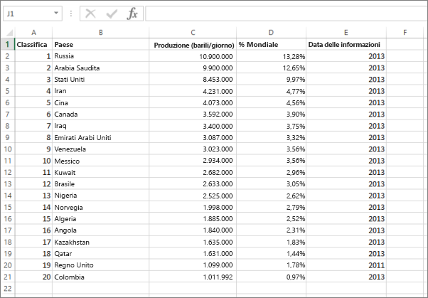
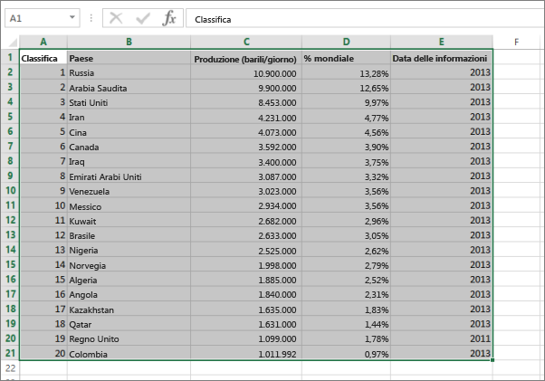
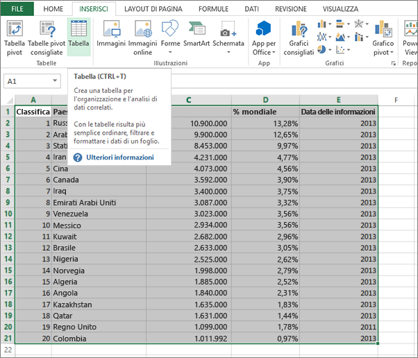
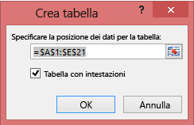
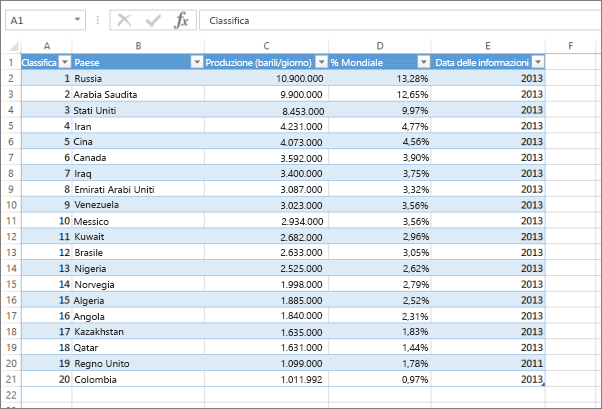

# Errore: Non sono stati trovati dati nella cartella di lavoro di Excel

>[!NOTE]
>Le informazioni di questo articolo si applicano a Excel 2007 e versioni successive.

Quando si importa una cartella di lavoro di Excel in Power BI, è possibile che venga visualizzato l'errore seguente:

*Errore: Non sono stati trovati dati nella cartella di lavoro di Excel. I dati potrebbero non essere formattati correttamente. Sarà necessario modificare la cartella di lavoro in Excel e quindi importarla di nuovo.*

## Soluzione rapida
1. Modificare la cartella di lavoro in Excel.
2. Selezionare l'intervallo di celle che contengono i dati. La prima riga deve contenere le intestazioni di colonna, ovvero i nomi di colonna.
3. Premere **CTRL+T** per creare una tabella.
4. Salvare la cartella di lavoro.
5. Tornare a Power BI e importare di nuovo la cartella di lavoro o, se si lavora in Excel 2016 e la cartella di lavoro è stata salvata in OneDrive for Business, fare clic su File > Pubblica.

## Dettagli
### Causa
In Excel, è possibile creare una **tabella** da un intervallo di celle che rende più semplice l'ordinamento, il filtro e la formattazione dei dati.

Quando si importa una cartella di lavoro di Excel, Power BI cerca queste tabelle e le importa in un set di dati. Se non vengono trovate tabelle, appare questo messaggio di errore.

### Soluzione
1. Aprire la cartella di lavoro in Excel. 
    >[!NOTE]
    >Le immagini si riferiscono a Excel 2013. Se si usa una versione differente, le opzioni potrebbero essere leggermente diverse, ma la procedura è identica.
    
    
2. Selezionare l'intervallo di celle che contengono i dati. La prima riga deve contenere le intestazioni di colonna, ovvero i nomi di colonna:
   
    
3. Nella barra multifunzione fare clic su **Tabella** nella scheda **INSERISCI**. oppure premere **CTRL+T**.
   
    
4. Verrà visualizzata la finestra di dialogo seguente. Assicurarsi che l'opzione **Tabella con intestazioni** sia selezionata e fare clic su **OK**:
   
    
5. I dati risultano ora formattati in una tabella:
   
    
6. Salvare la cartella di lavoro.
7. Tornare a Power BI. Selezionare Recupera dati nella parte inferiore del riquadro di spostamento sinistro.
   
    
8. Nella casella **File** selezionare **Recupera**.
   
    
9. Importare di nuovo la cartella di lavoro di Excel. Questa volta la tabella verrà trovata e l'importazione riuscirà.
   
    Se l'importazione non riesce, segnalare il problema facendo clic su **Community** nel menu della Guida:
   
    
