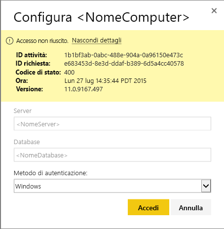
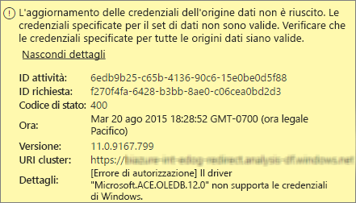
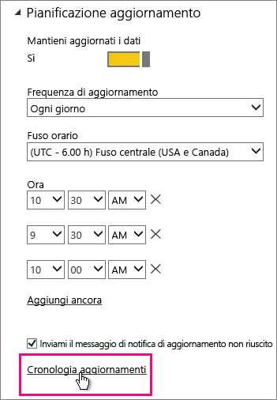
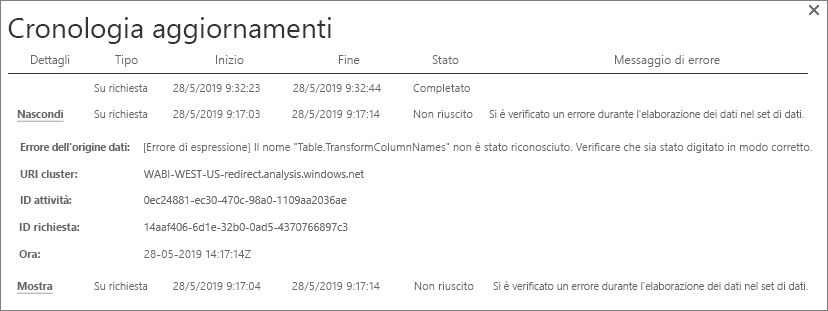
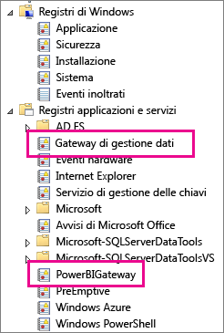
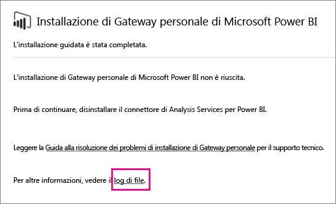
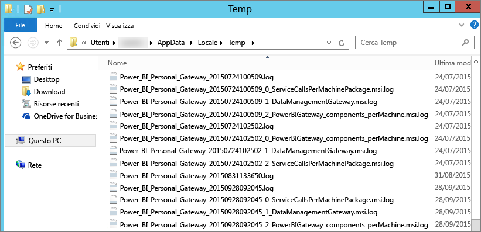

# Risoluzione dei problemi relativi a Power BI Gateway - Personal
Le sezioni seguenti passano attraverso alcuni problemi comuni che possono riscontrare quando si usa il Power BI Gateway-Personal.

> [!NOTE]
> La versione corrente del gateway per uso personale è **Gateway dati locale (personale)**. Aggiornare l'installazione in modo da usare tale versione.
> 
> 

## Aggiornare alla versione più recente
Quando la versione del gateway non è aggiornata, possono emergere numerosi problemi.  È buona norma generale verificare che tu la versione più recente. Se il gateway è stato aggiornato per un mese o più, è consigliabile installare la versione più recente del gateway. Vedere quindi, se è possibile riprodurre il problema.

## Installazione
**Gateway personale è a 64 bit** -se nel computer è a 32 bit, è possibile installare il gateway personale. Il sistema operativo deve essere la versione a 64 bit. Installare una versione a 64 bit di Windows o il gateway personale in un computer a 64 bit.

**Personal gateway non viene installato come servizio anche se si è un amministratore locale per il computer** -installazione può non riuscire se l'utente è nel gruppo Administrators locale del computer, ma i criteri di gruppo non permettono al nome utente accedere come un servizio. Al momento, assicurarsi che i criteri di gruppo consente agli utenti di accedere come un servizio. Microsoft sta lavorando a una soluzione del problema. [Altre informazioni](https://technet.microsoft.com/library/cc739424.aspx)

**Timeout dell'operazione** -questo messaggio è frequente se il computer (computer fisico o macchina virtuale) in cui si sta installando il gateway personale ha un processore a core singolo. Chiudere tutte le applicazioni e disattivare tutti i processi non essenziali, quindi ripetere l'installazione.

**Gateway di gestione dati o Analysis Services Connector non può essere installato nello stesso computer come gateway personale** : se è già installato Analysis Services Connector o Gateway di gestione dati, è necessario disinstallare il connettore o il gateway. Quindi, riprovare a installare il gateway personale.

> [!NOTE]
> Se si verifica un problema durante l'installazione, i log di installazione possono fornire informazioni utili per risolvere il problema. Per altre informazioni, vedere [log di installazione](#SetupLogs).
> 
> 

 **Configurazione del proxy** potrebbero verificarsi problemi con la configurazione del gateway personale se l'ambiente richiede l'uso di un proxy. Per altre informazioni su come configurare le informazioni sul proxy, vedere [Configurazione delle impostazioni proxy per Power BI Gateway](service-gateway-proxy.md)

## Pianifica aggiornamenti
**Errore: Le credenziali archiviate nel cloud mancano.**

Questo errore potrebbe verificarsi nelle impostazioni per \<set di dati\> se si dispone di un aggiornamento pianificato e quindi disinstallato e reinstallato il gateway personale. Quando si disinstalla un gateway personale, le credenziali dell'origine dati per un set di dati che è stato configurato per l'aggiornamento vengono rimosse dal servizio Power BI.

**Soluzione:** In Power BI, passare alle impostazioni di aggiornamento per un set di dati. In Gestisci origini dati, per qualsiasi origine dati con un errore, selezionare **Modifica credenziali** e accedere nuovamente all'origine dati.

**Errore: Le credenziali fornite per il set di dati non sono valide. Aggiornare le credenziali tramite un aggiornamento o nella finestra di dialogo Impostazioni origine dati per continuare.**

**Soluzione**: se viene visualizzato un messaggio relativo alle credenziali:

* Verificare che i nomi utente e password per l'accesso a origini dati siano aggiornate. In Power BI andare nelle impostazioni di aggiornamento del set di dati. In Gestisci origini dati, selezionare **Modifica credenziali** per aggiornare le credenziali per l'origine dati.
* I mashup tra un'origine cloud e un'origine in locale, in una singola query, errori di aggiornamento di personal gateway se una delle origini utilizza OAuth per l'autenticazione. Un esempio di questo problema è un mashup tra CRM Online e un Server SQL locale. Il mashup avrà esito negativo poiché CRM Online richiede OAuth.
  
  Questo errore è un problema noto e che viene viene esaminato. Per risolvere il problema, eseguire una query separata per l'origine cloud e l'origine in locale. Quindi, utilizzare un'unione o accodare query per combinarle.

**Errore: Origine dati non supportata.**

**Soluzione:** Un messaggio relativo a un'origine dati non supportata nelle impostazioni Pianifica aggiornamento può indicare: 

* L'origine dati non è attualmente supportato per l'aggiornamento in Power BI. 
* La cartella di lavoro di Excel non contiene un modello di data, solo i dati del foglio di lavoro. Power BI attualmente supporta l'aggiornamento solo se la cartella di lavoro di Excel caricata contiene un modello di dati. Quando si importano i dati con Power Query in Excel, verificare che sia selezionata l'opzione di caricamento dati nel modello di dati. Questa opzione assicura i dati vengono importati in un modello di dati. 

**Errore: [Non è possibile combinare i dati] &lt;parte della query&gt;/&lt;... &gt; / &lt;... &gt; accede a origini dati che hanno livelli di privacy, non possono essere usati contemporaneamente. Ricompilare la combinazione di dati.**

**Soluzione**: Questo errore è a causa di restrizioni a livello di privacy e sui tipi di origini dati in uso.

**Errore: Errore dell'origine dati: Non è possibile convertire il valore "\[Table\]" nel tipo Table.**

**Soluzione**: Questo errore è a causa di restrizioni a livello di privacy e sui tipi di origini dati in uso.

**Errore: Non è disponibile spazio sufficiente per questa riga.**

Questo errore si verifica se si dispone di una singola riga superano 4 MB di dimensioni. Individuare la riga dell'origine dati e provare a filtrarla o ridurre le dimensioni per la riga.

## Origini dati
**Provider di dati mancante** : il gateway personale è solo versione a 64 bit. Richiede una versione a 64 bit dei provider di dati installata nello stesso computer del gateway personale. Ad esempio, se l'origine dati nel set di dati è Microsoft Access, è necessario installare un provider ACE a 64 bit nello stesso computer in cui è stato installato il gateway personale.  

>[!NOTE]
>Se hai Excel versione a 32 bit, è possibile installare un provider ACE a 64 bit nello stesso computer.

**L'autenticazione di Windows non è supportata per il database Access**: attualmente Power BI supporta solo l'autenticazione anonima per il database di Access. Stiamo lavorando sull'abilitazione dell'autenticazione di Windows per il database Access.

**Errore di accesso quando si immettono le credenziali per un'origine dati** -se si verifica un errore come questo quando si immettono le credenziali di Windows per un'origine dati, è possibile che sia in una versione precedente del gateway personale. [Installare la versione più recente di Power BI Gateway - Personal](https://powerbi.microsoft.com/gateway/).

  

**Errore: Errore di accesso quando si seleziona l'autenticazione di Windows per un'origine dati usando ACE OLEDB** : se viene visualizzato l'errore seguente quando si immettono le credenziali per un'origine dati usando un provider ACE OLEDB:

Power BI non supporta attualmente l'autenticazione di Windows per un'origine dati usando ACE OLEDB provider.

**Soluzione:** Per risolvere questo errore, è possibile selezionare **l'autenticazione anonima**. Per il provider ACE OLEDB legacy, le credenziali anonime sono uguali alle credenziali di Windows.

## Aggiornamento del riquadro
Se hai ricevuto un errore con l'aggiornamento dei riquadri del dashboard, vedere l'articolo seguente.

[Risoluzione degli errori del riquadro](refresh-troubleshooting-tile-errors.md)

## Strumenti per la risoluzione dei problemi
### Cronologia aggiornamenti
**La cronologia dell'aggiornamento** consente di visualizzare gli errori che si sono verificati e fornisce dati utili se è necessario creare una richiesta di supporto. È possibile visualizzare sia pianificati che su richiesta, gli aggiornamenti. Ecco come Ottiene per il **cronologia aggiornamenti**.

1. In **Set di dati** nel riquadro di spostamento di Power BI selezionare un set di dati &gt; Apri menu &gt;**Pianifica aggiornamento**.
   
1. In **le impostazioni per...** , selezionare **cronologia aggiornamento**.  
   
   
   

### Registri eventi
Molti registri eventi possono fornire informazioni. I primi due **Gateway di gestione dati** e **PowerBIGateway**, sono presenti se sei un amministratore nel computer.  Se non sei un amministratore e si usa il Gateway personale, si noterà le voci di log all'interno di **applicazione** log.

I registri **Gateway di gestione dati** e **PowerBIGateway** sono presenti in **Registri applicazioni e servizi**.

### Traccia di Fiddler
[Fiddler](http://www.telerik.com/fiddler) è uno strumento gratuito di Telerik che monitora il traffico HTTP. È possibile visualizzare la comunicazione con il servizio Power BI dal computer client. Questa comunicazione può visualizzare gli errori e altre informazioni correlate.

### Log del programma di installazione
Se il **Personal Gateway**, non viene installato, verrà visualizzato un collegamento al log del programma di installazione. Il log di installazione consente di visualizzare i dettagli sull'errore. Questi log sono Windows nei log di installazione, noto anche come log di MSI. Possono essere piuttosto complessi e difficili da leggere. In genere, l'errore risulta è nella parte inferiore, ma non determinare la causa dell'errore è irrilevante. Potrebbe essere il risultato di errori in un altro log o di un errore in un punto precedente del log.

Alternativa, è possibile visitare il **nella cartella Temp** (% temp %) e cercare i file che iniziano con **potenza\_Business Intelligence\_**.

> [!NOTE]
> quando si passa a %temp%, si potrebbe accedere a una sottocartella della cartella temporanea. Il **potenza\_Business Intelligence\_**  file si trovano nella radice della directory temporanea.  Potrebbe essere necessario andare su di uno o due livelli.
> 
> 

## Passaggi successivi
[Configurazione delle impostazioni del proxy per Power BI Gateway](service-gateway-proxy.md)  
[Aggiornamento dei dati](refresh-data.md)  
[Power BI Gateway - Personale](service-gateway-personal-mode.md)  
[Risoluzione degli errori del riquadro](refresh-troubleshooting-tile-errors.md)  
[Risoluzione dei problemi del gateway dati locale](service-gateway-onprem-tshoot.md)  
Altre domande? [Provare la community di Power BI](http://community.powerbi.com/)

