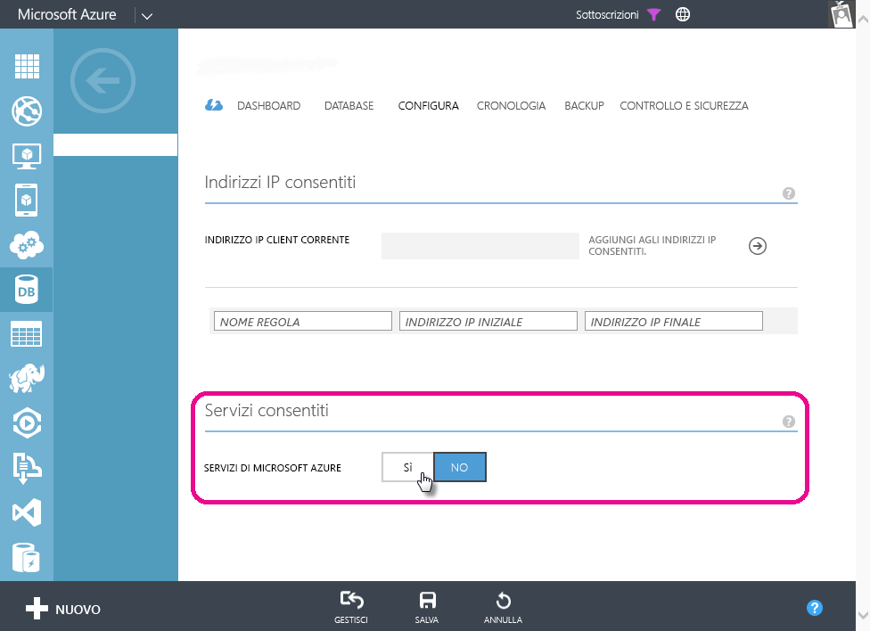

# Risoluzione dei problemi relativi all'aggiornamento pianificato per i database SQL di Azure in Power BI

Per informazioni dettagliate sull'aggiornamento, vedere [Aggiornare i dati in Power BI](refresh-data.md) e [Configurare l'aggiornamento pianificato](refresh-scheduled-refresh.md).

Se quando si configura l'aggiornamento pianificato per il database SQL di Azure viene visualizzato il codice di errore 400 durante la modifica delle credenziali, eseguire le operazioni seguenti per configurare la regola del firewall appropriata:

1. Accedere al [portale di Azure](https://portal.azure.com).

1. Passare al database SQL di Azure per cui si sta configurando l'aggiornamento.

1. Nella parte superiore del pannello **Panoramica** selezionare **Imposta firewall server**.

1. Nel pannello **Impostazioni del firewall** assicurarsi che l'impostazione **Consenti l'accesso a servizi di Azure** sia impostata su **Sì**.

      

Altre domande? [Provare la community di Power BI](https://community.powerbi.com/)
