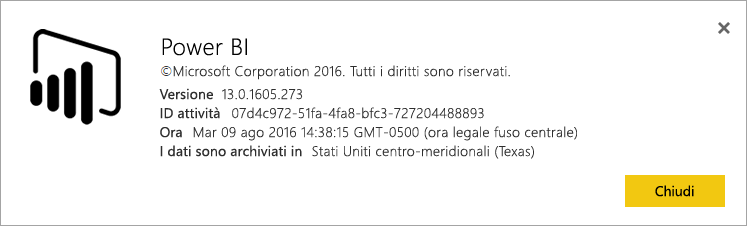
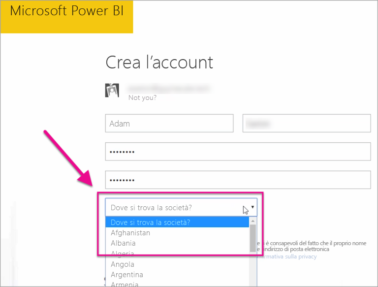

# Dove si trova il tenant di Power BI?

<iframe width="560" height="315" src="https://www.youtube.com/embed/0fOxaHJPvdM?showinfo=0" frameborder="0" allowfullscreen></iframe>

Informazioni sulla posizione del tenant di Power BI e come viene selezionata la località. Il rilevamento della posizione è importante, perché può influire sulle interazioni con il servizio.

## Come determinare la posizione del tenant di Power BI

Per trovare l'area del tenant, seguire questa procedura.

1. Nel servizio Power BI selezionare la guida ( **?** ) nel menu in alto, quindi **Informazioni su Power BI**.

1. Cercare il valore accanto a **I dati sono archiviati in**. Questa è l'area in cui si trova il tenant. Il valore indica anche l'area in cui sono memorizzati i dati, a meno che non si usino capacità dedicate in aree diverse per le proprie aree di lavoro.

    

## Modalità di selezione dell'area dati

L'area dati si basa sul paese che si seleziona quando si crea il tenant. La selezione vale sia per l'accesso a Office 365 che a Power BI, perché queste informazioni sono condivise. Se si tratta di un nuovo tenant, selezionare il paese appropriato dall'elenco quando si effettua l'iscrizione.

Power BI seleziona l'area dati più vicina alla selezione, determinando così dove vengono archiviati i dati per il tenant.

> [!IMPORTANT]
> Dopo aver creato il tenant non è possibile modificare la selezione.

Altre domande? [Provare la community di Power BI](https://community.powerbi.com/)

