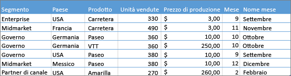
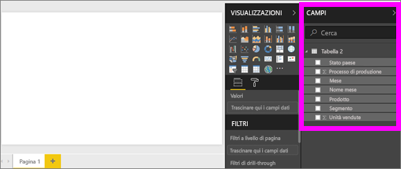
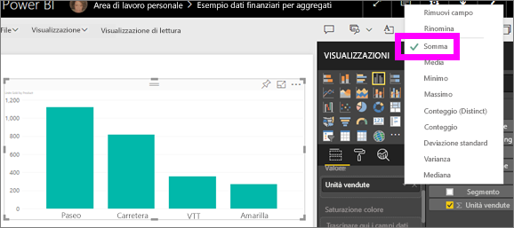
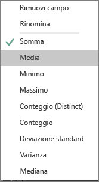
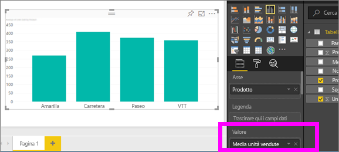
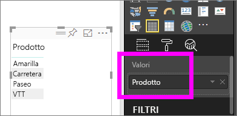
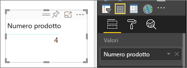
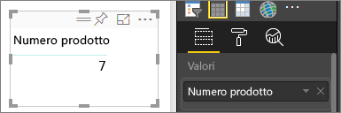
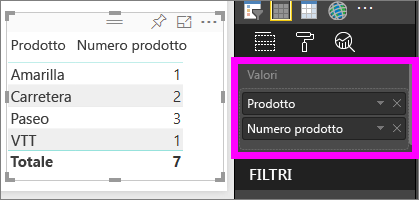

# Aggregazioni nelle visualizzazioni di Power BI
## Che cos'è un’aggregazione?
In alcuni casi è utile combinare matematicamente i valori dei dati. L'operazione matematica potrebbe essere Somma, Media, Massimo, Conteggio e così via. La combinazione dei valori dei dati viene definita *aggregazione*. Il risultato di tale operazione matematica è un'*aggregazione*. 

Quando il servizio Power BI e Power BI Desktop creano visualizzazioni, è possibile che eseguano aggregazioni dei dati. L'aggregazione risponde spesso alle esigenze dell'utente, ma in altri casi è possibile che si vogliano aggregare i valori in un modo diverso,  ad esempio per ottenere una somma invece di una media. È possibile gestire e modificare in molti modi diversi l'aggregazione usata in una visualizzazione.

Verranno esaminati prima di tutto i *tipi* di dati perché il tipo di dati determina come e se i dati possono essere aggregati.

## Tipi di dati
La maggior parte dei set di dati ha più di un tipo di dati. Al livello più basilare i dati sono numerici o non numerici. I dati numerici possono essere aggregati usando una somma, una media, un conteggio, un valore minimo, una varianza e altro ancora. Anche i dati testuali, spesso definiti *categorici*, possono essere aggregati. Se si prova a eseguire l'aggregazione di un campo categorico, inserendolo in un bucket solo numerico come **Valori** o **Descrizioni comando**, Power BI conterà le occorrenze di ogni categoria o le occorrenze distinte di ogni categoria. Alcuni tipi speciali di dati, come le date, hanno opzioni di aggregazione specifiche, ovvero più vecchio, più recente, primo e ultimo. 

Nell'esempio seguente:
- **Units Sold** e **Manufacturing Price** sono colonne che contengono i dati numerici
-  **Segment**, **Country**, **Product**, **Month** e **Month Name** contengono dati categorici

   

Quando si crea una visualizzazione in Power BI, i campi numerici verranno aggregati su un campo categorico. Il valore predefinito è *somma*.  Ad esempio, "Units Sold ***by Product***, "Units Sold ***by Month***" e "Manufacturing Price ***by Segment***". Alcuni campi numerici vengono definiti **misure**. È possibile identificare con facilità le misure nell'editor di report di Power BI: le misure vengono visualizzate con il simbolo ∑ nell'elenco Campi. Per altre informazioni, vedere [Presentazione dell'editor di report](service-the-report-editor-take-a-tour.md).

## Perché le aggregazioni non funzionano nel modo desiderato?
L'uso delle aggregazioni nel servizio Power BI può generare confusione. Può accadere che Power BI non consenta di modificare l'aggregazione per un campo numerico oppure può essere necessario non aggregare un campo, come un anno, ma semplicemente contare il numero di occorrenze.

L'origine del problema è nella maggior parte dei casi la modalità di definizione del campo nel set di dati. È possibile che il campo sia stato definito come testo e questo spiega perché non è possibile usarlo per somme o medie. Sfortunatamente, [solo il proprietario del set di dati può modificare il modo in cui un campo è stato categorizzato](desktop-measures.md). Se si hanno autorizzazioni di proprietario per il set di dati in Desktop o nel programma usato per creare il set di dati, ad esempio Excel, è possibile risolvere questo problema. In caso contrario, sarà necessario contattare il proprietario del set di dati per ottenere assistenza.  

Per evitare la confusione, alla fine di questo articolo è disponibile una sezione speciale intitolata **Considerazioni e risoluzione dei problemi**.  Se non si trova la risposta, inviare la domanda al [forum della community di Power BI](http://community.powerbi.com) per ottenere una risposta rapida direttamente dal team di Power BI.

## Modificare la modalità di aggregazione di un campo numerico
Si supponga di avere un grafico che somma le unità vendute per prodotti diversi, ma che si preferisca ottenere la media. 

1. Creare un grafico che usa una categoria e una misura. In questo esempio viene usato "Units Sold by Product".  Per impostazione predefinita, Power BI crea un grafico che somma le unità vendute (misura nel riquadro Valore) per ogni prodotto (categoria nel riquadro Asse).

   

2. Nel riquadro Visualizzazione fare clic con il pulsante destro del mouse sulla misura e selezionare il tipo di aggregazione necessario. In questo caso viene selezionato Media. Se non viene visualizzata l'aggregazione necessaria, vedere "Considerazioni e risoluzione dei problemi" più avanti.  
   
   
   
   > [!NOTE]
   > Le opzioni disponibili nell'elenco a discesa variano a seconda del campo selezionato e del modo in cui tale campo è stato classificato dal proprietario del set di dati.
   > 
3. La visualizzazione usa ora l'aggregazione in base alla media.

   

##    Modi per aggregare i dati

Alcune opzioni possono essere disponibili per l'aggregazione di un campo:

* **Non riepilogare**. Con questa opzione selezionata, ogni valore nel campo viene gestito separatamente e non viene riepilogato. Questa opzione viene usata spesso quando si ha una colonna di ID numerici che non deve essere sommata.
* **Somma**. Aggiunge tutti i valori nel campo specificato.
* **Media**. Acquisisce una media aritmetica dei valori.
* **Minimo**. Mostra il valore più basso.
* **Massimo**. Mostra il valore più alto.
* **Conteggio (non vuoto)**. Conta il numero di valori non vuoti nel campo.
* **Conteggio (Distinct)**. Conta il numero di valori diversi nel campo.
* **Deviazione Standard**.
* **Varianza**.
* **Mediana**.  Mostra il valore mediano (intermedio). Questo è il valore con lo stesso numero di elementi sopra e sotto.  Se sono presenti due mediane, Power BI ne calcola la media.

Ad esempio, questi dati:

| Paese | Quantità |
|:--- |:--- |
| USA |100 |
| Regno Unito |150 |
| Canada |100 |
| Germania |125 |
| Francia | |
| Giappone |125 |
| Australia |150 |

produrrebbero i risultati seguenti:

* **Non riepilogare**: ogni valore viene visualizzato separatamente
* **Somma**: 750
* **Media**: 125
* **Massimo**: 150
* **Minimo**: 100
* **Conteggio (non vuoto):** 6
* **Conteggio (Distinct):** 4
* **Deviazione Standard:** 20.4124145...
* **Varianza:** 416.666...
* **Mediana:** 125

## Creare un'aggregazione usando un campo categoria (testo)
È anche possibile aggregare un campo non numerico. Ad esempio, se si ha un campo relativo al nome del prodotto, è possibile aggiungerlo come valore e impostarlo su **Conteggio**, **Conteggio valori univoci**, **Primo** o **Ultimo**. 

1. In questo esempio il campo **Product** è stato trascinato nell'area Valori. L'area Valori viene in genere usata per i campi numerici. Power BI riconosce che si tratta di un campo di testo, imposta l'aggregazione su **Non riepilogare** e presenta una tabella con una singola colonna.
   
   
2. Se si cambia l'aggregazione dal valore predefinito **Non riepilogare** a **Conteggio (Distinct)**, Power BI conta il numero di prodotti diversi. In questo caso sono presenti 4 prodotti.
   
   
3. E se si imposta l'aggregazione su **Conteggio**, Power BI conta il numero totale. In questo caso sono presenti 7 voci per **Product**. 
   
   

4. Trascinando lo stesso campo, in questo caso **Product**, nell'area Valori e lasciando l'aggregazione predefinita **Non riepilogare**, Power BI suddivide il conteggio per prodotto.

   

## Considerazioni e risoluzione dei problemi
D: perché non è disponibile l'opzione **Non riepilogare**?

R: Il campo selezionato è probabilmente una misura calcolata o una misura avanzata creata in Excel o in [Power BI Desktop](desktop-measures.md). Ogni misura calcolata ha una propria formula hardcoded. Non è possibile modificare l'aggregazione usata.  Ad esempio, se si tratta di una somma, può essere solo una somma. Nell'elenco dei campi le *misure calcolate* vengono visualizzate con il simbolo di calcolatrice.

D: perché con un campo sicuramente **numerico** le uniche scelte disponibili sono **Conteggio** e **Conteggio valori univoci**?

R1: È probabile che il proprietario del set di dati, inavvertitamente o intenzionalmente, *non* abbia classificato il campo come numero. Ad esempio, se un set di dati ha un campo **anno**, il proprietario del set di dati può classificarlo come testo perché è più probabile che il campo **anno** venga conteggiato (ad esempio, il numero di persone nate nel 1974) e non che venga sommato o che ne venga calcolata la media. Se si è il proprietario, è possibile aprire il set di dati in Power BI Desktop e usare la scheda **Creazione di modelli** per modificare il tipo di dati.  

R2: Se al campo è associata l'icona a forma di calcolatrice, si tratta di una *misura calcolata* e ogni misura calcolata ha una formula hardcoded propria che può essere modificata solo da un proprietario di set di dati. Il calcolo in uso potrebbe essere un'aggregazione semplice come una media o una somma, ma potrebbe anche essere qualcosa di più complicato come la "percentuale del contributo alla categoria padre" o il "totale parziale dall'inizio dell'anno". Power BI non calcolerà la somma o la media dei risultati, ma eseguirà invece di nuovo il calcolo per ogni punto dati usando la formula hardcoded.

R3: Un'altra possibilità è che il campo sia stato inserito in un *bucket* che consente solo valori categorici.  In questo caso, le uniche opzioni disponibili saranno Conteggio e Conteggio valori univoci.

R4: La terza possibilità è che il campo venga usato per un asse. Su un asse di un grafico a barre, ad esempio, Power BI mostra una sola barra per ogni valore univoco e non applica alcuna aggregazione ai valori dei campi. 

>[!NOTE]
>L'eccezione a questa regola è rappresentata dai grafici a dispersione, che *richiedono* valori aggregati per gli assi X e Y.

D: perché non è possibile aggregare i campi di testo per le origini dati SSAS?

R: le connessioni dinamiche a SSAS MD non consentono aggregazioni sul lato client. Sono incluse first, last, avg, min, max e sum.

D: È disponibile un grafico a dispersione e si vuole che il campo *non* venga aggregato.  in un grafico a dispersione?

R: aggiungere il campo al bucket **Dettagli** e non ai bucket degli assi X o Y.

R: quando si aggiunge un campo numerico a una visualizzazione, per la maggior parte dei campi di questo tipo l'aggregazione predefinita è la somma, ma per alcuni vengono eseguiti il conteggio, la media o altre aggregazioni.  Perché l'aggregazione predefinita non è sempre la stessa?

R: i proprietari del set di dati hanno la possibilità di impostare l'esecuzione del riepilogo predefinita per ogni campo. Se si è il proprietario di un set di dati, modificare il riepilogo predefinito nella scheda **Creazione di modelli** di Power BI Desktop.

D: come può il proprietario di un set di dati assicurarsi che un campo non venga mai aggregato?

R: In Power BI Desktop, nella scheda **Creazione di modelli**, impostare **Tipo di dati** su **Testo**.

D: nell'elenco a discesa non è disponibile l'opzione **Non riepilogare**.

R: provare a rimuovere il campo e ad aggiungerlo di nuovo.

Altre domande? [Provare la community di Power BI](http://community.powerbi.com/)

