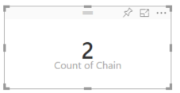

# Aggregazioni in Power BI
## Che cos'è un’aggregazione?
In alcuni casi è utile combinare matematicamente i valori delle righe in una colonna. L'operazione matematica potrebbe essere Somma, Media, Massimo, Conteggio e così via. La combinazione del valore dei dati delle righe in una colonna viene chiamata aggregazione. Il risultato di tale operazione matematica è un'*aggregazione*. 

Un campo numerico è un valore che verrà aggregato (ad esempio, verrà sommato o ne verrà calcolata la media) su un campo categorico.  Ad esempio, "importo delle vendite per prodotto" e "numero di prodotti difettosi per area geografica". I campi numerici vengono spesso denominati **misure**. Nell'elenco dei campi le misure vengono visualizzate con il simbolo ∑. Per altre informazioni, vedere [Presentazione dell'editor di report](service-the-report-editor-take-a-tour.md).

Talvolta una *misura* è in effetti una *misura calcolata*. Le misure calcolare in Power BI vengono importate con i dati (definiti nel modello di dati su cui si basa il report). Ogni misura calcolata ha una propria formula hardcoded. Non è possibile modificare l'aggregazione usata. Ad esempio, se è una somma, può essere solo una somma. Nell'elenco dei campi le *misure calcolate* vengono visualizzate con il simbolo di calcolatrice. Per altre informazioni su come vengono create le misure calcolate, vedere [Misure in Power BI Desktop](desktop-measures.md).

I campi categorici non sono numerici, ma possono comunque essere aggregati.  Quando i campi categorici vengono inseriti in un bucket *solo numerico* come **Valori** o **Descrizioni comando**, Power BI può contare le occorrenze di ogni categoria o le occorrenze distinte di ogni categoria.  Per le stringhe e le date, Power BI include alcune altre opzioni di aggregazione: più vecchia, più recente, prima e ultima.  

## Perché le aggregazioni non funzionano nel modo desiderato?
L'uso delle aggregazioni nel servizio Power BI può generare confusione. Può accadere che Power BI non consenta di modificare l'aggregazione per un campo numerico oppure può essere necessario non aggregare un campo, come un anno, ma semplicemente contare il numero di occorrenze.

L'origine del problema è nella maggior parte dei casi la modalità di categorizzazione del campo nel set di dati di Power BI. È possibile che il campo sia stato categorizzato come testo e questo spiega perché non è possibile usarlo per somme o medie. Sfortunatamente, [solo il proprietario del set di dati può modificare il modo in cui un campo è stato categorizzato](desktop-measures.md).  

Per evitare la confusione, alla fine di questo articolo è disponibile una sezione speciale intitolata **Suggerimenti e risoluzione dei problemi**.  Se non si trova la risposta, inviare la domanda al [forum della community di Power BI](http://community.powerbi.com) per ottenere una risposta rapida direttamente dal team di Power BI.

## Modificare la modalità di aggregazione di un campo numerico
Si supponga di avere un grafico che somma i dati di vendita di diverse aree geografiche ma che si preferisca ottenere la media. 

1. Nella Visualizzazione di modifica del report aggiungere la misura a una visualizzazione.
2. Individuare il campo nel riquadro Visualizzazione, fare clic con il pulsante destro del mouse e scegliere il tipo di aggregato necessario. Se non viene visualizzata l'aggregazione desiderata, contattare il proprietario del set di dati. Potrebbe trattarsi di un problema relativo al modo in cui tale campo è stato classificato dal proprietario del set di dati.  
   
   
   
   > [!NOTE]
   > Le opzioni disponibili nell'elenco a discesa variano a seconda del campo selezionato e del modo in cui tale campo è stato classificato dal proprietario del set di dati.
   > 
   > 

Alcune opzioni possono essere disponibili per l'aggregazione di un campo:

* **Non riepilogare**. Con questa opzione selezionata, ogni valore nel campo viene gestito separatamente e non viene riepilogato. Questa opzione viene usata spesso quando si ha una colonna di ID numerici che non deve essere sommata.
* **Somma**. Aggiunge tutti i valori nel campo specificato.
* **Media**. Acquisisce una media aritmetica dei valori.
* **Minimo**. Mostra il valore più basso.
* **Massimo**. Mostra il valore più alto.
* **Conteggio (non vuoto)**. Conta il numero di valori non vuoti nel campo.
* **Conteggio (Distinct)**. Conta il numero di valori diversi nel campo.
* **Deviazione Standard**.
* **Varianza**.
* **Mediana**.  Mostra il valore mediano (intermedio). Questo è il valore con lo stesso numero di elementi sopra e sotto.  Se sono presenti 2 mediane, Power BI ne calcola la media.

Ad esempio, questi dati:

| Paese | Quantità |
|:--- |:--- |
| USA |100 |
| Regno Unito |150 |
| Canada |100 |
| Germania |125 |
| Francia | |
| Giappone |125 |
| Australia |150 |

produrrebbero i risultati seguenti:

* **Non riepilogare**: ogni valore viene visualizzato separatamente
* **Somma**: 750
* **Media**: 125
* **Massimo**: 150
* **Minimo**: 100
* **Conteggio (non vuoto):** 6
* **Conteggio (Distinct):** 4
* **Deviazione Standard:** 20.4124145...
* **Varianza:** 416.666...
* **Mediana:** 125

## Usare un campo non aggregato come campo numerico
Si può anche usare un campo non aggregato come campo numerico. Ad esempio, se si ha un campo Product Name, è possibile aggiungerlo come valore e impostarlo su **Conteggio** o **Conteggio valori univoci**. 

1. Si supponga ad esempio di selezionare **Store > Chain**.
   
   
2. Se si cambia l'aggregazione dal valore predefinito **Non riepilogare** a **Conteggio (Distinct)**, Power BI conta il numero di catene diverse. In questo caso ce ne sono 2: Fashions Direct e Lindseys.
   
   
3. E se si imposta l'aggregazione su **Conteggio**, Power BI conta il numero totale. In questo caso sono presenti 104 voci per **Chain**. Aggiungendo **Chain** come filtro, si vedrà che ci sono 37 righe per Fashions Direct e 67 righe per Lindseys.  
   
   

## Suggerimenti e risoluzione dei problemi
D: perché non è disponibile l'opzione **Non riepilogare**?

R: il campo selezionato è probabilmente una misura calcolata. Ricordarsi che ogni misura calcolata ha una propria formula hardcoded e non è possibile modificare il calcolo.

D: perché con un campo sicuramente **numerico** le uniche scelte disponibili sono **Conteggio** e **Conteggio valori univoci**?

R: è probabile che il proprietario del set di dati, inavvertitamente o intenzionalmente, *non* abbia classificato il campo come numero. Ad esempio, se un set di dati ha un campo **anno**, il proprietario del set di dati può classificarlo come testo perché è più probabile che il campo **anno** venga conteggiato (cioè, il numero di persone nate nel 1974) e non che venga sommato o che ne venga calcolata la media. Se si è il proprietario, è possibile aprire il set di dati in Power BI Desktop e usare la scheda **Creazione di modelli** per modificare il tipo di dati.  

R: un'altra possibilità è che il campo sia stato inserito in un *bucket* che consente solo valori categorici.  In questo caso, le uniche opzioni disponibili saranno Conteggio e Conteggio valori univoci.

R: la terza possibilità è che il campo venga usato per un asse. Su un asse di un grafico a barre, ad esempio, Power BI mostra una sola barra per ogni valore univoco e non applica alcuna aggregazione ai valori dei campi. 

>[!NOTE]
>L'eccezione a questa regola è rappresentata dai grafici a dispersione, che *richiedono* valori aggregati per gli assi X e Y.

D: come si può *evitare* l'aggregazione di un campo  in un grafico a dispersione?

R: aggiungere il campo al bucket **Dettagli** e non ai bucket degli assi X o Y.

R: quando si aggiunge un campo numerico a una visualizzazione, per la maggior parte dei campi di questo tipo l'aggregazione predefinita è la somma, ma per alcuni vengono eseguiti il conteggio, la media o altre aggregazioni.  Perché l'aggregazione predefinita non è sempre la stessa?

R: i proprietari del set di dati hanno la possibilità di impostare l'esecuzione del riepilogo predefinita per ogni campo. Se si è il proprietario di un set di dati, modificare il riepilogo predefinito nella scheda **Creazione di modelli** di Power BI Desktop.

D: perché con un campo **numerico** non sono disponibili opzioni di aggregazione nell'elenco a discesa?

R: se al campo è associata l'icona a forma di calcolatrice, si tratta di una *misura calcolata* e ogni misura calcolata ha una formula hardcoded propria che non può essere modificata nel servizio Power BI. Il calcolo in uso potrebbe essere un'aggregazione semplice come una media o una somma, ma potrebbe anche essere qualcosa di più complicato come la "percentuale del contributo alla categoria padre" o il "totale parziale dall'inizio dell'anno". Power BI non calcolerà la somma o la media dei risultati, ma eseguirà invece di nuovo il calcolo per ogni punto dati usando la formula hardcoded.

D: come può il proprietario di un set di dati assicurarsi che un campo non venga mai aggregato?

R: In Power BI Desktop, nella scheda **Creazione di modelli**, impostare **Tipo di dati** su **Testo**.

D: nell'elenco a discesa non è disponibile l'opzione **Non riepilogare**.

R: provare a rimuovere il campo e ad aggiungerlo di nuovo.

Altre domande? [Provare la community di Power BI](http://community.powerbi.com/)

