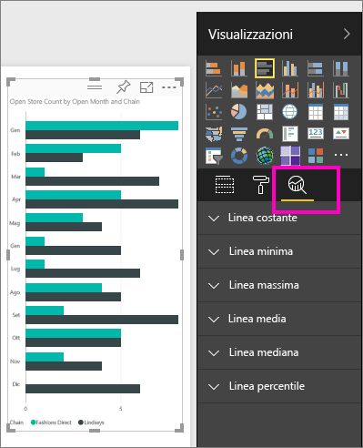
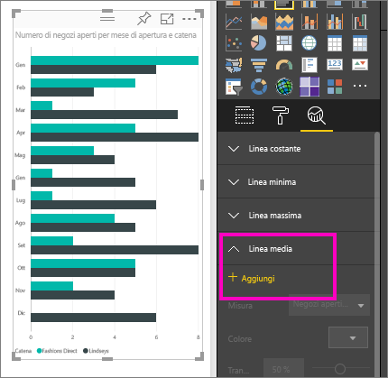
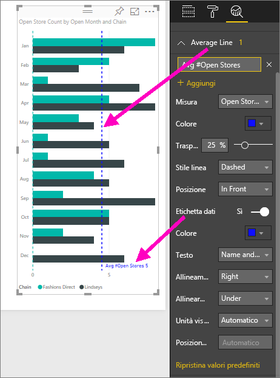
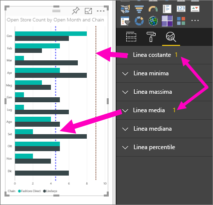
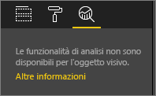

# Creare linee di riferimento dinamiche per gli oggetti visivi nel servizio Power BI

Il riquadro **Analisi** nel **servizio Power BI** consente di aggiungere *linee di riferimento* dinamiche alle visualizzazioni e di concentrare l'attenzione su tendenze o informazioni importanti.

> [!NOTE]
> Il riquadro **Analisi** viene visualizzato solo quando si seleziona un oggetto visivo nell'area di disegno report.
> 
> 

## Usare il riquadro Analisi
Con il riquadro **Analisi** è possibile creare i seguenti tipi di linee di riferimento dinamiche, anche se non tutte le linee sono disponibili per tutti i tipi di oggetti visivi:

* Linea costante asse X
* Linea costante asse Y
* Linea minima
* Linea massima
* Linea media
* Linea mediana
* Linea percentile

Per visualizzare le linee di riferimento dinamiche disponibili per un oggetto visivo, seguire questa procedura:

1. Selezionare o creare un oggetto visivo, quindi selezionare l'icona **Analisi**  dal riquadro **Visualizzazioni**.

2. Selezionare la freccia rivolta verso il basso per il tipo di linea che si desidera creare per espandere le opzioni. In questo caso, si selezionerà **Linea media**.
   
   

3. Per creare una nuova linea, selezionare **+ Aggiungi** e decidere la misura che verrà usata per creare la linea.  L'elenco a discesa **Misura** viene popolato automaticamente con i dati disponibili dalla visualizzazione selezionata. Usare **Open store count**.

5. Sono disponibili moltissime opzioni per la linea, ad esempio colore, trasparenza, stile e posizione rispetto agli elementi dati dell'oggetto visivo. Se si vuole assegnare un'etichetta alla linea, specificare un titolo e quindi spostare il dispositivo di scorrimento **Etichetta dati** su **Sì**.  In questo caso verrà assegnato il titolo *Avg # Open Stores* alla linea e verranno personalizzate altre opzioni, come mostrato di seguito.
   
   

1. Notare il numero visualizzato accanto all'elemento **Linea media** nel riquadro **Analisi**. Questo numero indica quante linee dinamiche sono attualmente presenti nell'oggetto visivo e di che tipo sono. Se si aggiunge un elemento **Linea costante** come obiettivo 9 per Store Count, è possibile notare che nel riquadro **Analisi** è ora presente anche una linea di riferimento **Linea costante** applicata a questo oggetto visivo.
   
   
   

Sono moltissime le informazioni interessanti da poter evidenziare creando linee di riferimento dinamiche con il riquadro **Analisi**.

## Considerazioni e risoluzione dei problemi

Se l'oggetto visivo selezionato non può contenere linee di riferimento dinamiche applicate, in questo caso un oggetto visivo **Mappa**, verrà visualizzato quanto segue nel momento in cui si seleziona il riquadro **Analisi**.
   

La possibilità di usare linee di riferimento dinamiche dipende dal tipo di oggetto visivo in uso. L'elenco seguente mostra le linee dinamiche attualmente disponibili per i vari oggetti visivi:

Gli oggetti visivi seguenti possono usufruire pienamente delle linee dinamiche:

* Grafico ad aree
* Grafico a linee
* Grafico a dispersione
* Istogramma a colonne raggruppate
* Grafico a barre raggruppate

Gli oggetti visivi seguenti possono usare solo una *linea costante* dal riquadro **Analisi**:

* Area in pila
* Barre in pila
* Istogramma in pila
* Barre in pila 100%
* Istogramma in pila 100%

Per gli oggetti visivi seguenti è attualmente disponibile solo la *linea di tendenza*:

* Linee non in pila
* Istogramma a colonne raggruppate

Infine, gli oggetti visivi non cartesiani attualmente non possono applicare linee dinamiche dal riquadro **Analisi**, ad esempio:

* Matrice
* Grafico a torta
* Grafico ad anello
* Tabella

## Passaggi successivi
[Riquadro Analisi in Power BI Desktop](desktop-analytics-pane.md)

Altre domande? [Provare la community di Power BI](http://community.powerbi.com/)

