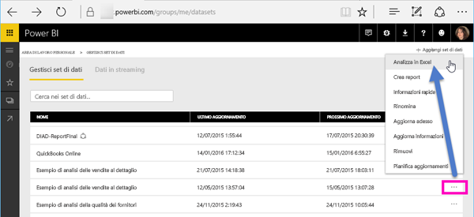
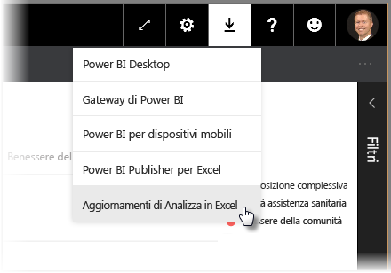
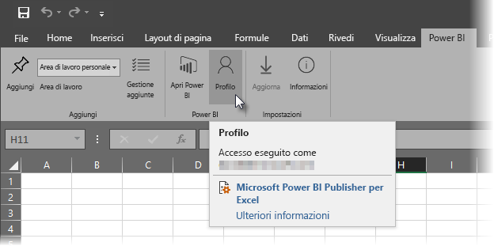
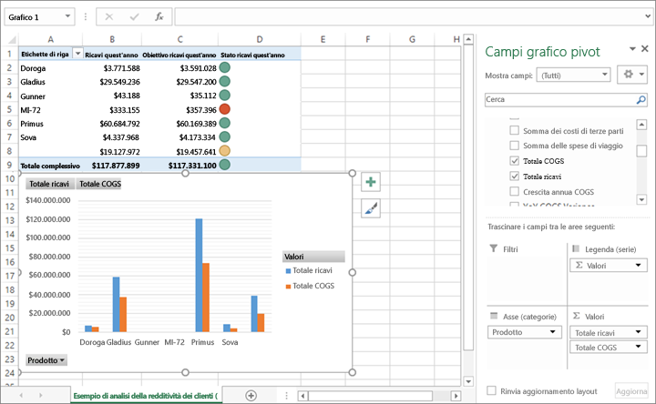

# Analizza in Excel
A volte si vuole usare Excel per visualizzare e interagire con un set di dati disponibile in Power BI. Con **Analizza in Excel**, è anche possibile accedere alle funzionalità della tabella pivot, del grafico e del filtro dei dati di Excel in base al set di dati presente in Power BI.

## Requisiti
Vi sono alcuni requisiti per l'utilizzo di**Analizza in Excel**:

* La funzionalità **Analizza in Excel** è supportata da Microsoft Excel 2010 SP1 e dalle versioni successive.
* Le tabelle pivot di Excel non supportano l'aggregazione di campi numerici mediante trascinamento della selezione. Il set di dati in Power BI *deve avere misure predefinite*.
* Alcune organizzazioni potrebbero disporre di norme per criteri di gruppo che impediscono l'installazione degli aggiornamenti **Analizza in Excel** necessari per Excel. Se non si riesce a installare gli aggiornamenti, rivolgersi all'amministratore.
* **Analizza in Excel** richiede che il set di dati sia disponibile in Power BI Premium o che l'utente abbia una licenza Power BI Pro. Per altre informazioni sulle differenze a livello di funzionalità tra i tipi di licenza, vedere [Funzionalità di Power BI in base al tipo di licenza](service-features-license-type.md). 
* Gli utenti possono connettersi ai set di dati tramite analizza in Excel se ha letto l'autorizzazione per il set di dati sottostante.  Un utente può ottenere questa autorizzazione in diversi modi, ad esempio perché è membro dell'area di lavoro che contiene il set di dati, perché condivide un report o un dashboard che usa il set di dati o perché dispone dell'autorizzazione per un'app che contiene il set di dati.

## Come funziona?
Quando si seleziona **Analizza in Excel** dal menu di puntini di sospensione (...) assieme a un set di dati o un report di **Power BI**, Power BI stesso crea un file con estensione odc e lo scarica dal browser del computer.

Quando si apre il file in Excel, viene mostrato un elenco vuoto per **Tabelle pivot** e **Campi** con tutte le tabelle, i campi e le misure del set di dati di Power BI. È possibile creare tabelle pivot, grafici e analizzare tale set di dati esattamente come per un set di dati locale in Excel.

Il file con estensione odc include una stringa di connessione MSOLAP per la connessione al set di dati in Power BI. Quando si analizzano o usano i dati, Excel esegue una query su quel set di dati in Power BI e restituisce i risultati in Excel. Se il set di dati si connette a un'origine dati in tempo reale tramite DirectQuery, Power BI esegue query sull'origine dati e restituisce il risultato in Excel.

**Analizza in Excel** è ideale per i set di dati e i report che si connettono a database *Analysis Services tabulari* o *multidimensionali* oppure da file di Power BI Desktop o cartelle di lavoro di Excel con modelli di dati che presentano misure del modello create con DAX (Data Analysis Expressions).

## Introduzione a Analizza in Excel
In Power BI, selezionare il menu di puntini di sospensione accanto a un report o un set di dati (... accanto al nome del report o set di dati) e dal menu visualizzato selezionare **Analizza in Excel**.

### Installare gli aggiornamenti di Excel
Quando si utilizza per la prima volta **Analizza in Excel**, è necessario installare gli aggiornamenti per le librerie di Excel. Verrà richiesto di scaricare ed eseguire gli aggiornamenti di Excel (si avvia l'installazione del pacchetto di Windows Installer *SQL_AS_OLEDDB.msi*). Questo pacchetto installa il **provider OLE DB Microsoft AS per SQL Server 2016 RC0** (anteprima).

> [!NOTE]
> Selezionare **Non visualizzare più** nella finestra di dialogo **Installa aggiornamenti di Excel**. È sufficiente installare l'aggiornamento una sola volta.
> 
> 

Se è necessario installare gli aggiornamenti di Excel per **Analizza in Excel** anche in questo caso, scaricare l'aggiornamento dall'icona di **download** di Power BI, come illustrato nella figura seguente.

### Accedere a Power BI
Anche se è già stato effettuato l'accesso a Power BI nel browser, la prima volta che si apre un nuovo file con estensione odc in Excel verrà richiesto di accedere a Power BI con il proprio account Power BI. In questo modo viene autenticata la connessione da Excel a Power BI.

### Utenti con più account di Power BI
Alcuni utenti che dispongono di più account di Power BI possono riscontrare situazioni in cui si è connessi a Power BI con un account, ma l'account che ha accesso al set di dati utilizzato in Analizza in Excel è diverso. In questi casi, è possibile ottenere un errore **Forbidden** (Non consentito) o di accesso al tentativo di accedere a un set di dati utilizzato in una cartella di lavoro di Analizza in Excel.

Sarà possibile eseguire nuovamente l'accesso, ovvero accedere con l'account Power BI che può visualizzare il set di dati rilevabile da Analizza in Excel. È inoltre possibile selezionare **Profilo** nella scheda della barra multifunzione di **Power BI** in Excel, che identifica l'account con cui si è attualmente connessi, nonché fornisce un collegamento che consente di eseguire la disconnessione, quindi di accedere con un account diverso.

### Abilitare le connessioni dati
Per analizzare i dati di Power BI in Excel, viene richiesto di verificare il nome del file e il percorso del file con estensione odc e quindi di selezionare **Abilita**.

> [!NOTE]
> Gli amministratori per i tenant di Power BI possono usare *il portale di amministrazione di Power BI* per disabilitare l'uso di **Analizza in Excel** con i set di dati locali contenuti in database di Analysis Services. Quando questa opzione è disabilitata, **Analizza in Excel** è disabilitato per i database di Analysis Services, ma rimane disponibile per l'uso con altri set di dati.
> 
> 

## Analizzare in qualsiasi luogo
Ora che Excel è aperto e si dispone di una tabella pivot vuota, è possibile eseguire qualsiasi tipo di analisi con il set di dati di Power BI. Come per altre cartelle di lavoro in locale, con Analizza in Excel è possibile creare tabelle pivot, grafici, aggiungere dati da altre origini e così via. E naturalmente è possibile creare diversi fogli di lavoro con qualsiasi tipo di visualizzazioni dei dati.

> [!NOTE]
> È importante sapere che l'uso di **Analizza in Excel** consente a ogni utente che dispone di un'autorizzazione per il set di dati di visualizzare i dati dettagliati.
> 
> 

## Salva
È possibile salvare questa cartella di lavoro collegata al set di dati Power BI esattamente come per qualsiasi altra cartella di lavoro. Tuttavia, non è possibile pubblicare o importare nuovamente la cartella di lavoro in Power BI poiché si tratta di un'operazione possibile solo con cartelle di lavoro che dispongono di dati nelle tabelle o di un modello di dati. Poiché la nuova cartella di lavoro dispone semplicemente di una connessione al set di dati in Power BI, pubblicarla o importarla in Power BI sarebbe un'operazione inutile.

## Condividere
Dopo avere salvato la cartella di lavoro, è possibile condividerla con altri utenti di Power BI nell'organizzazione.

Quando la cartella di lavoro viene aperta per la prima volta da un utente con cui è stata condivisa, le tabelle pivot e i dati visualizzati che risalgono all'ultimo salvataggio e che potrebbero non corrispondere alla versione più recente saranno visualizzati dall'utente. Per ottenere i dati più recenti, gli utenti devono utilizzare il pulsante**Aggiorna** sulla barra multifunzione**Dati**. E poiché la cartella di lavoro si connette a un set di dati in Power BI, gli utenti che tentano di aggiornarla devono accedere a Power BI e installare gli aggiornamenti di Excel con questo metodo al primo tentativo di aggiornamento.

Poiché gli utenti dovranno aggiornare il set di dati e l'operazione non è supportata per le connessioni esterne in Excel Online, è consigliabile che gli utenti aprano la cartella di lavoro con la versione desktop di Excel sul proprio computer.

## Risoluzione dei problemi
Quando si usa Analizza in Excel, a volte si ottiene un risultato imprevisto oppure la funzionalità non funziona correttamente. [Questa pagina offre soluzioni per problemi comuni relativi all'uso di Analizza in Excel.](desktop-troubleshooting-analyze-in-excel.md)
