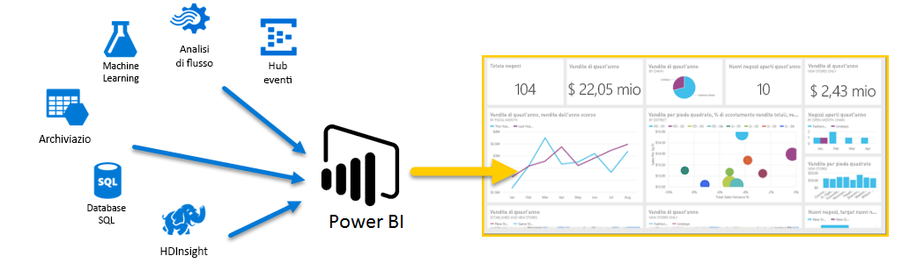
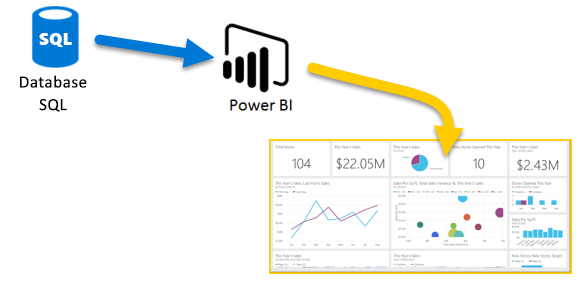
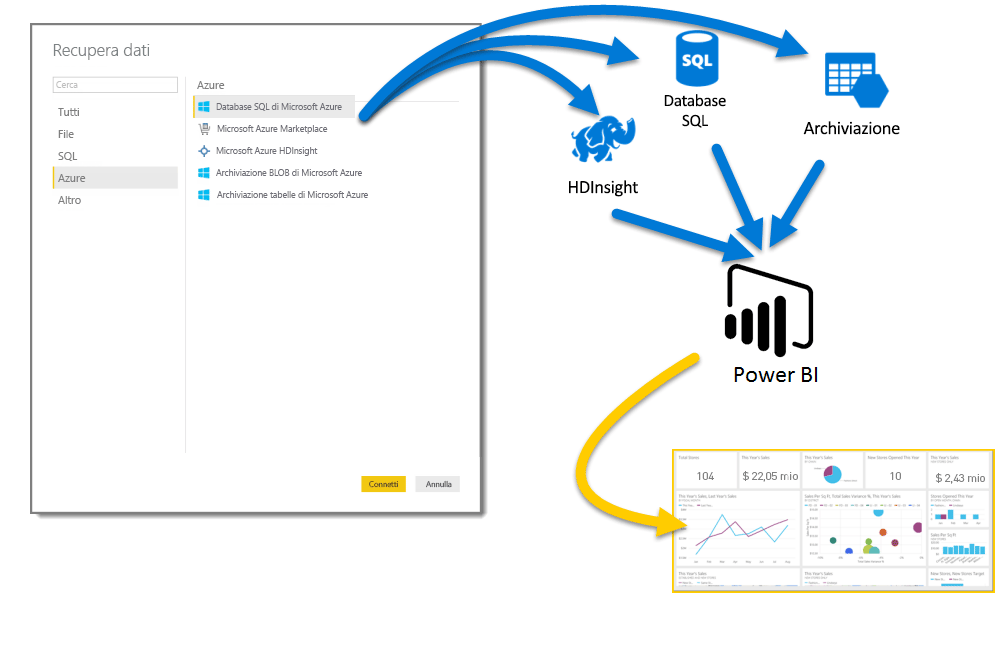
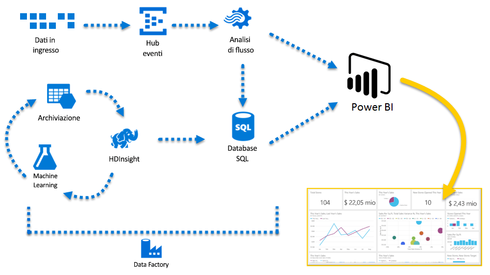

# Azure e Power BI
Con i servizi di **Azure** e **Power BI**, è possibile trasformare l'elaborazione dei dati in analisi e report che forniscono informazioni in tempo reale sull'azienda. Se l'elaborazione dei dati è basata su cloud o locale, è semplice o complessa, con una sola origine o con scalabilità elevata, con warehouse o in tempo reale, Azure e Power BI possono offrire la connettività e l'integrazione predefinite necessarie a concretizzare gli sforzi di business intelligence.

Power BI ha diverse connessioni di Azure disponibili e le soluzioni di business intelligence che è possibile creare con questi servizi sono uniche come la propria azienda. È possibile connettere una o più origini dati di Azure, quindi dare forma e rifinire i dati per creare report personalizzati.

### Database SQL di Azure e Power BI
È possibile iniziare con una connessione semplice a un database SQL di Azure, quindi creare report per monitorare i progressi dell'azienda. Con [Power BI Desktop](desktop-getting-started.md), è possibile creare report che identificano le tendenze e gli indicatori di prestazioni chiave che fanno progredire l'azienda.

C'è molto altro da scoprire sul [database SQL di Azure](http://azure.microsoft.com/services/sql-database/).

### Trasformare, modellare e unire i dati del cloud
Se si hanno dati molto complessi, provenienti da qualsiasi tipo di origine, ma si tratta di un problema facilmente risolvibile. Con **Power BI Desktop** e i servizi di Azure, basta un tocco nella finestra di dialogo **Recupera dati** per stabilire subito una connessione. All'interno della stessa query è possibile connettersi al **database SQL di Azure**, all'origine dati di **Azure HDInsight** e ad **Archiviazione BLOB di Azure** (o **Archiviazione tabelle di Azure**) e quindi selezionare solo i subset necessari e ottimizzare la query da questa posizione.

È anche possibile creare report distinti per i diversi destinatari usando le stesse connessioni dati e persino la stessa query. È sufficiente creare una nuova pagina del report, perfezionare le visualizzazioni per ogni gruppo di destinatari e osservare come recupera le informazioni aziendali.

Per altre informazioni, esaminare le risorse seguenti:

* [Database SQL di Azure](http://azure.microsoft.com/services/sql-database/)
* [Azure HDInsight](http://azure.microsoft.com/services/hdinsight/)
* [Archiviazione di Azure](http://azure.microsoft.com/services/storage/) (archiviazione BLOB e tabelle)

### Gestione di complessità ed espansione con i servizi di Azure e Power BI
L'integrazione di Azure e Power BI consente di espandere il sistema in base alle proprie esigenze. È possibile elaborare i dati da più origini, usare sistemi di grandi dimensioni in tempo reale, usare [Analisi di flusso](http://azure.microsoft.com/services/stream-analytics/) e [Hub eventi](http://azure.microsoft.com/services/event-hubs/), nonché unire diversi servizi SaaS in report di business intelligence che garantiscono all'azienda un vantaggio competitivo.

### Connettere i dati dell'app con le API Power BI
Power BI può essere usato anche per ottenere informazioni sulle app esistenti. Con l'API Power BI, gli sviluppatori di applicazioni possono inviare interi set di dati a Power BI a livello di codice. Se sono necessari aggiornamenti continui, con le API Power BI gli sviluppatori possono inviare gli aggiornamenti dei dati in tempo reale per essere subito operativi, quindi usare gradualmente Azure Stream Analytics quando emergono esigenze in termini di scalabilità.

Nel [portale per gli sviluppatori di Power BI](http://dev.powerbi.com) sono disponibili molte informazioni sulle API di Power BI. Nel [blog degli sviluppatori di Power BI](http://blogs.msdn.com/powerbidev) è possibile trovare informazioni sull'uso di Power BI a livello di codice. È disponibile anche una pagina dedicata all'[introduzione allo sviluppo con Power BI](https://msdn.microsoft.com/library/dn889824.aspx).

### Cosa si può fare con Azure e Power BI?
Le combinazioni di **Azure** e **Power BI** sono illimitate e possono aprire possibilità e opportunità esclusive e mirate alle esigenze dell'azienda. Per altre informazioni sui **servizi di Azure**, vedere questa [pagina di panoramica](http://go.microsoft.com/fwlink/?LinkId=535031&clcid=0x409) che descrive **scenari di analisi dei dati con Azure** e fornisce informazioni su come trasformare le origini dati in intelligence per far progredire l'azienda.

